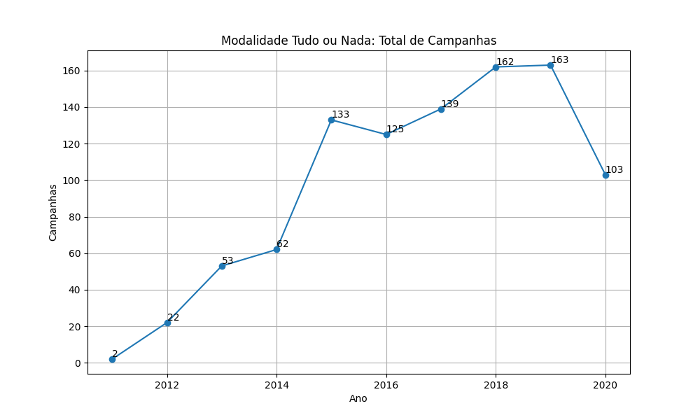
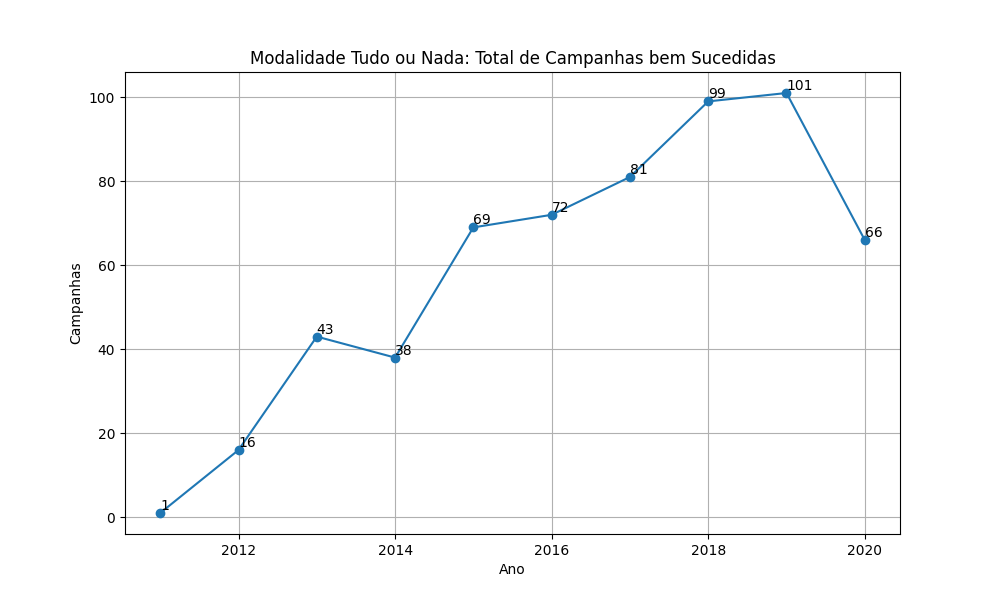
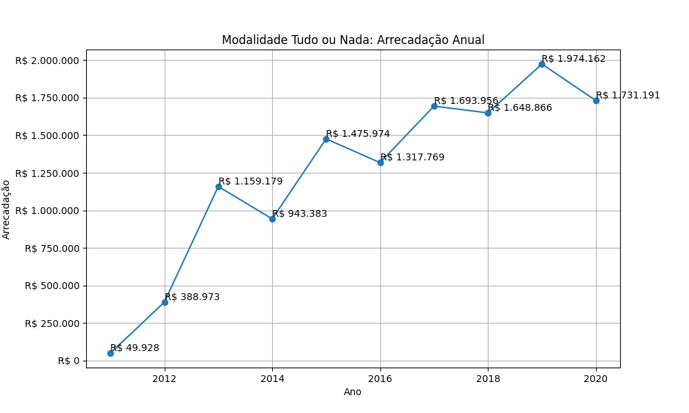
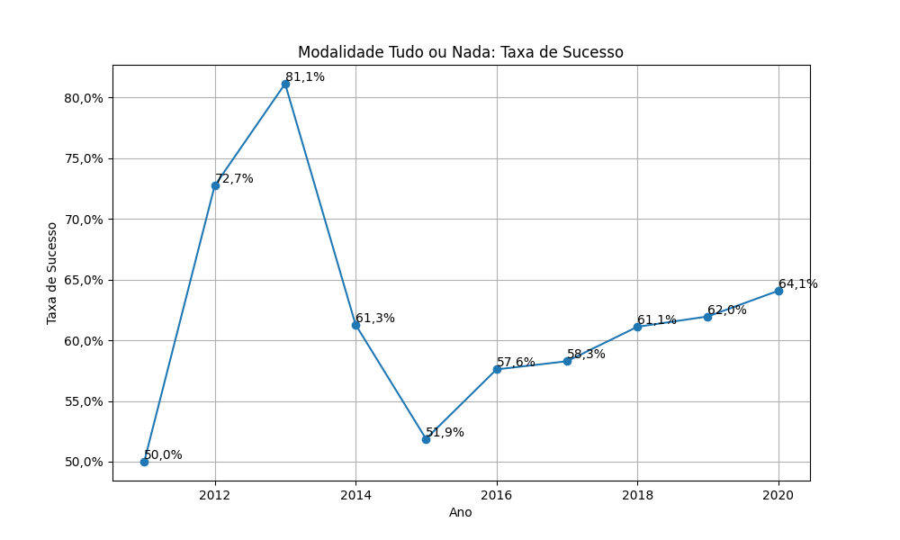
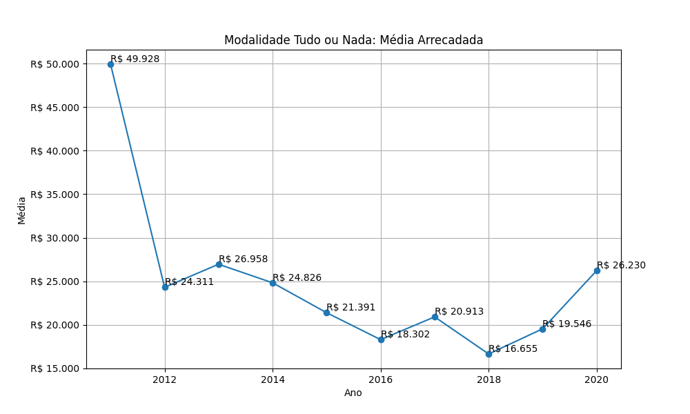

# Modalidade: Tudo ou Nada - Série Anual

A tabela a seguir representa a série anual das campanhas na modalidade
Tudo ou Nada.

|    ano |   total |   total_sucesso |   arrecadado_sucesso |   taxa_sucesso |   media_sucesso |
|-------:|--------:|----------------:|---------------------:|---------------:|----------------:|
|  2011  |       2 |               1 |             49.928,50 |           50,0 |        49.928,50 |
|  2012  |      22 |              16 |            388.973,45 |           72,7 |        24.310,84 |
|  2013  |      53 |              43 |           1.159.178,61 |           81,1 |        26.957,64 |
|  2014  |      62 |              38 |            943.383,32 |           61,3 |        24.825,88 |
|  2015  |     133 |              69 |           1.475.973,67 |           51,9 |        21.390,92 |
|  2016  |     125 |              72 |           1.317.769,21 |           57,6 |        18.302,35 |
|  2017  |     139 |              81 |           1.693.955,95 |           58,3 |        20.913,04 |
|  2018  |     162 |              99 |           1.648.865,67 |           61,1 |        16.655,21 |
|  2019  |     163 |             101 |           1.974.161,93 |           62,0 |        19.546,16 |
|  2020  |     103 |              66 |           1.731.191,20 |           64,1 |        26.230,17 |

## Gráficos

Série anual. Modalidade Tudo ou Nada: Total de Campanhas.

Série anual. Modalidade Tudo ou Nada: Total de Campanhas bem Sucedidas.

Série anual. Modalidade Tudo ou Nada: Arrecadação Anual.

Série anual. Modalidade Tudo ou Nada: Taxa de Sucesso.

Série anual. Modalidade Tudo ou Nada: Média Arrecadada.

