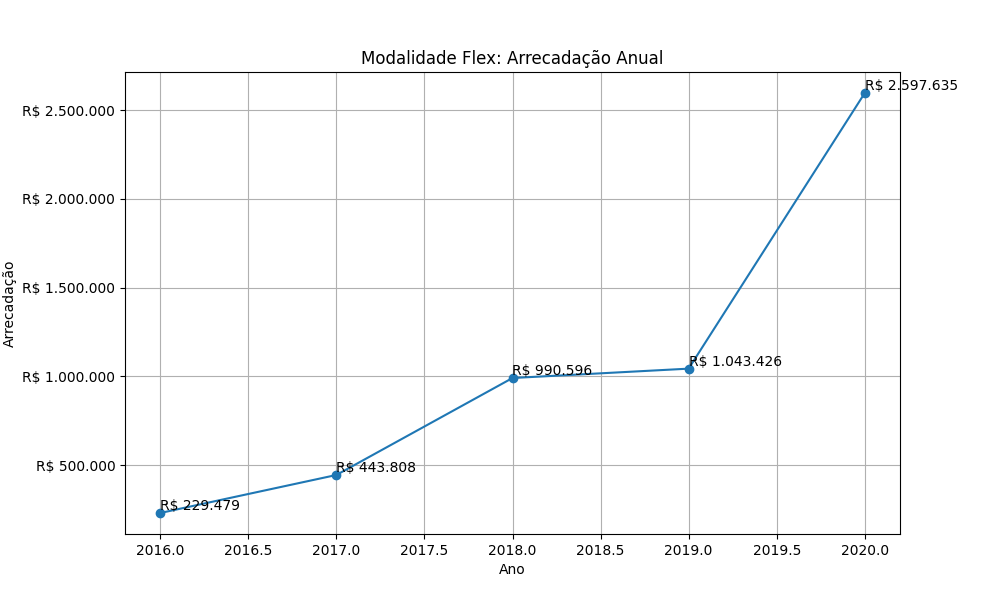

# Modalidade: Flex - Série Anual

A tabela a seguir representa a série anual das campanhas na modalidade
Flex.

|    ano |   total |   total_sucesso |   arrecadado_sucesso |   taxa_sucesso |   media_sucesso |
|-------:|--------:|----------------:|---------------------:|---------------:|----------------:|
|  2016  |      35 |              27 |            229.479,32 |           77,1 |         8.499,23 |
|  2017  |      85 |              61 |            443.808,44 |           71,8 |         7.275,55 |
|  2018  |     140 |             126 |            990.596,28 |           90,0 |         7.861,88 |
|  2019  |     159 |             148 |           1.043.426,06 |           93,1 |         7.050,18 |
|  2020  |     186 |             182 |           2.597.634,64 |           97,8 |        14.272,72 |

## Gráficos

Série anual. Modalidade Flex: Total de Campanhas.

Série anual. Modalidade Flex: Total de Campanhas bem Sucedidas.

Série anual. Modalidade Flex: Arrecadação Anual.

Série anual. Modalidade Flex: Taxa de Sucesso.

Série anual. Modalidade Flex: Média Arrecadada.

