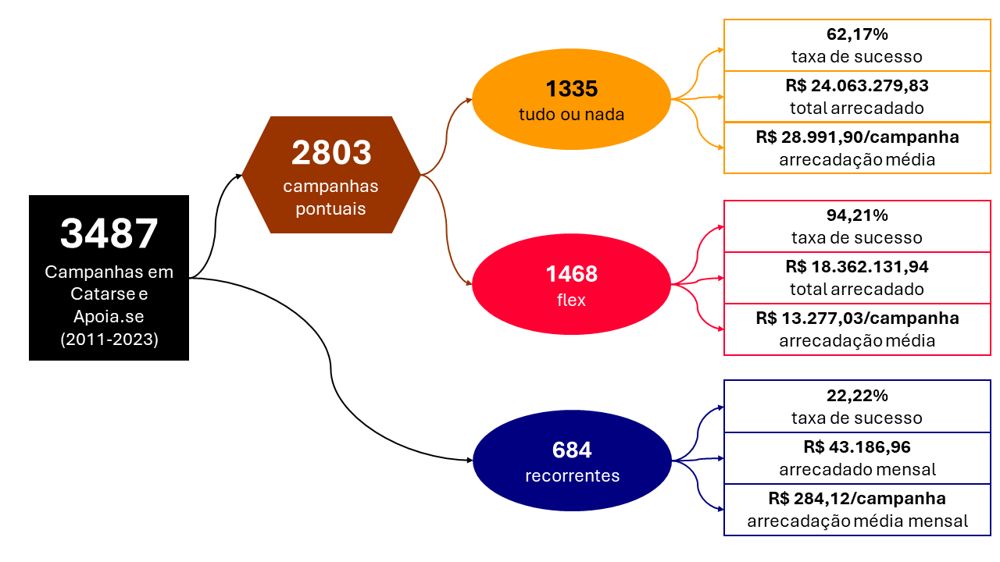
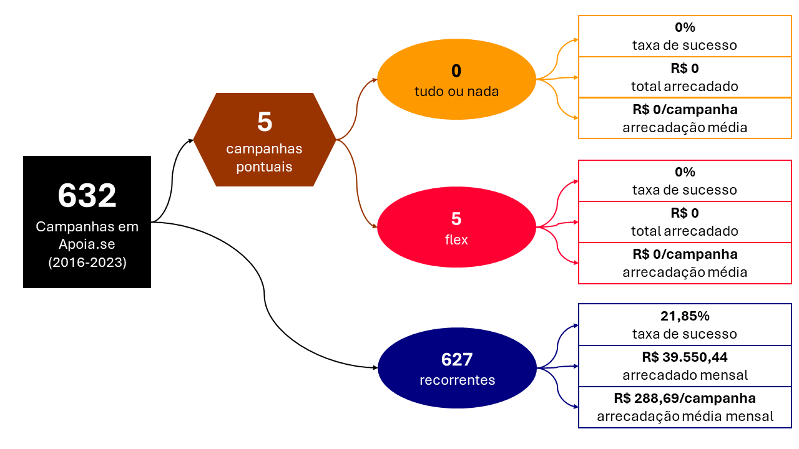

# profico-hq - Relatório Anual 2023

<mark style="background-color: lightyellow">**Atenção:** relatório em construção.
Sentindo falta de algo? Por via das dúvidas, só avisar. Talvez eu ainda não tenha
tido tempo de trabalhar - ou eu nem tinha considerado e vou ficar feliz se
o relatório puder ser melhorado.
</mark>

Organização anual do conhecimento obtido a partir dos dados produzidos
pela iniciativa [profico-hq](https://github.com/silva-erick/profico-hq),
referente aos dados entre 2011 e 2023.

# Introdução

As campanhas de financiamento coletivo classificadas como quadrinhos nas plataformas
[Catarse](https://www.catarse.me/) e [Apoia.se](https://apoia.se/) normalmente
se articulam para captar recursos para viabilizar a impressão de edições físicas (álbuns).

Este ecossistema, contudo, se diversifica em outras formas de produção de conteúdo.
Uma delas, ainda relacionada à produção de pessoas quadrinhistas, está relacionada
à publicação recorrente de webquadrinhos, normalmente distribuídos em redes sociais
ou newsletters. Em menor quantidade, mas ainda em número relevante, também se verifica
a existência de campanhas para financiar canais de youtube, blogs ou sites voltados
para a divulgação de obras e da cultura – às vezes especializados em quadrinhos,
às vezes genericamente denominados geek, abordando outras mídias, tal como livro e cinema.

# Análises 

## Infográficos
O infográfico a seguir dá uma ideia geral do conjunto de dados e considera mesmo as campanhas
que não foram bem sucedidas.

A seguir, uma visão similar, com foco no Catarse.

Outra visão, agora com foco no Apoia.se.

## Análise Descritiva

Para uma visão mais detalhada do conjunto de dados
Acesse a [Análise descritiva](./_apoio/analise_descritiva.md) para entender como os dados
se comportam em conjunto (total arrecadado, média por campanha, desvio padrão, etc):
- por modalidade;
- por modalidade e alguma dimensão de interesse (plataforma, unidade federativa, gênero
ou menção a algum tema de interesse para a iniciativa profico-hq).

## Pontos notáveis

<mark style="background-color: lightyellow">Pendente</mark>

## Análise temporal

<mark style="background-color: lightyellow">Pendente</mark>
