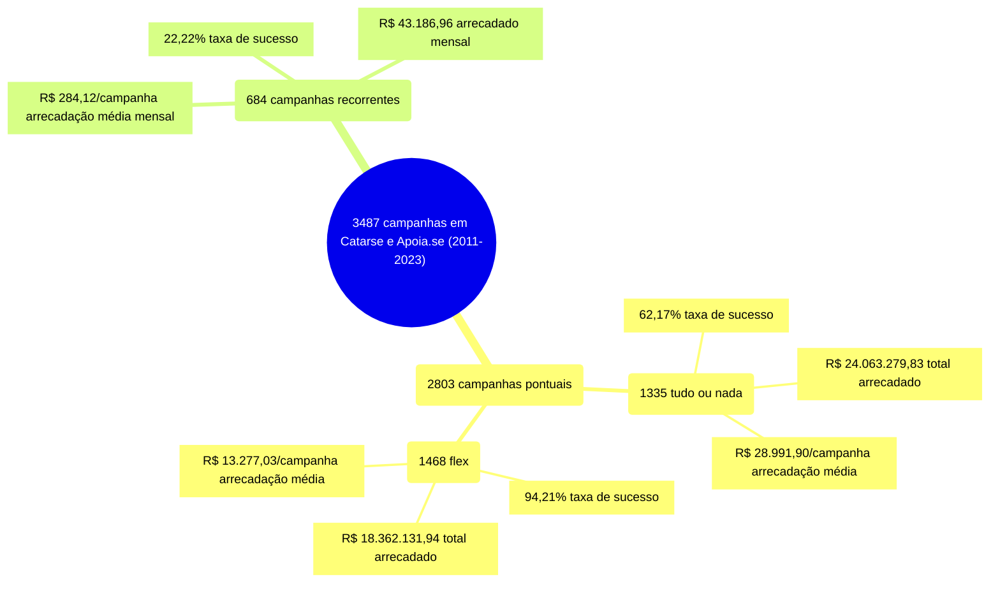
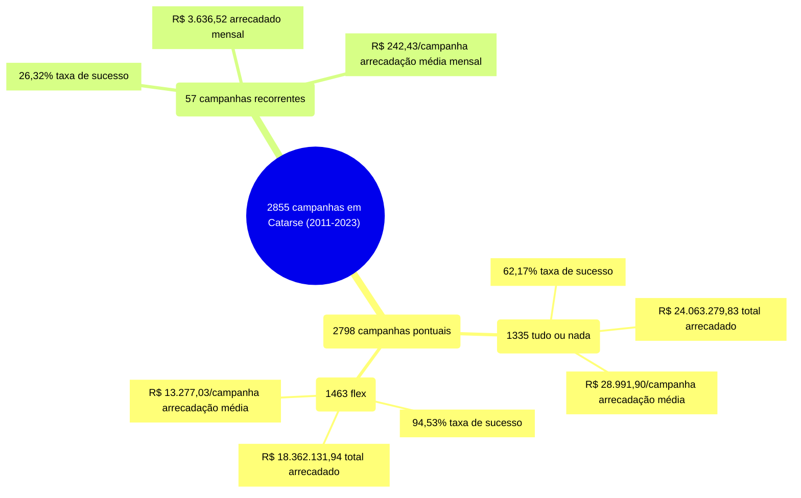
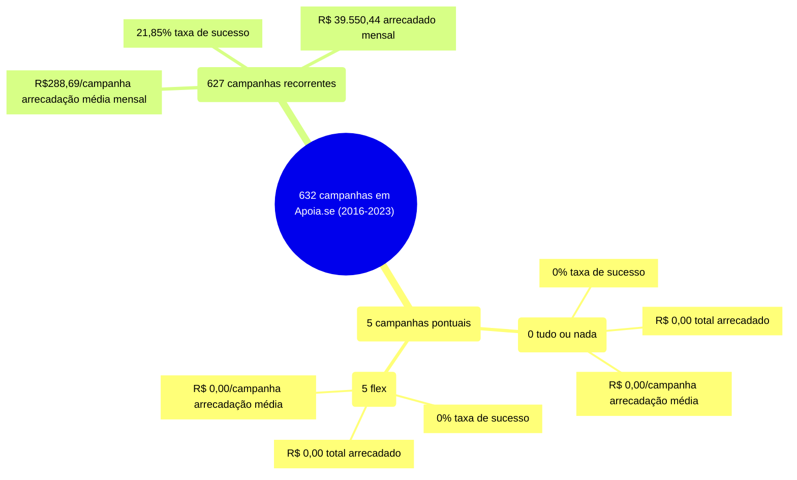

# profico-hq - Relatório Anual 2023

> [!WARNING] 
> **Atenção:** relatório em construção. Sentindo falta de algo? Só avisar.

# Introdução

A proposta do Relatório Anual profico-hq é a organização do conhecimento
obtido a partir dos dados produzidos pela iniciativa
[profico-hq](https://github.com/silva-erick/profico-hq). O relatório de 2023
analisa as campanhas desde 2011 até dezembro de 2023.

> [!WARNING] 
> Pendente.

# Conceitos

## Ecossistema de Quadrinhos

As campanhas de financiamento coletivo classificadas como quadrinhos nas plataformas
[Catarse](https://www.catarse.me/) e [Apoia.se](https://apoia.se/) normalmente
se articulam para a produção de quadrinhos. As **campanhas pontuais** (modalidades
_flex_ ou _tudo ou nada_), isto é, aquelas com data de encerramento definida, se organizam
para viabilizar a impressão de edições físicas (álbuns). As **campanhas recorrentes**,
por outro lado, se organizam para viabilizar a produção contínua em canais digitais
(_webformatos_), tal como redes sociais ou _newsletters_.

Em menor quantidade, mas ainda em número relevante, também se verifica a existência
de campanhas para financiar canais de _youtube_, _blogs_ ou _sites_ voltados
para a divulgação de obras e da cultura. Estes canais podem ser mais especializados
em quadrinhos ou cobrirem as mídias comumente associadas a conteúdo _geek_ - por exemplo,
quadrinhos, RPG, games, livro e cinema.

## Modalidades de Financiamento

Quando uma campanha de arrecadação é publicada numa plataforma, pessoas apoiadoras podem
contribuir utilizando as formas de pagamento disponíveis. A modalidade de financiamento
pode ser _recorrente_, _tudo ou nada_ ou _flex_.

> [!WARNING] 
> As modalidades de financiamento a seguir são categorias de análise. Por favor, antes de
> lançar uma campanha de financiamento coletivo, leia as regras, recomendações e termos de
> uso da plataforma.

A modalidade _tudo ou nada_ precisa atingir a meta definida na data de encerramento para ser
considerada _bem sucedida_. O valor arrecadado é liberado para as pessoas organizadoras
já descontando as taxas de administração definidas pela plataforma. Quando não for
bem sucedida, o dinheiro das pessoas apoiadoras é ressarcido. _Flex_ também é uma modalidade
pontual, mas as pessoas organizadoras recebem o valor arrecadado mesmo que a campanha
não tenha atingido a meta na data de encerramento. A campanha não é bem sucedida quando
não recebe apoios ou encerra antecipadamente.

A modalidade _recorrente_ se baseia na contribuição periódica das pessoas apoiadoras. Para
os propósitos deste relatório, a campanha recorrente será considerada bem sucedida
se receber ao menos um apoio de qualquer valor.

## Correção Monetária

O valor desejado (meta), o valor arrecado e os valores das recompensas serão ajustados,
de acordo com a [Tabela Prática para Cálculo de Atualização Monetária – IPCA-E](https://www.aasp.org.br/suporte-profissional/indices-economicos/indices-judiciais/tabela-pratica-para-calculo-de-atualizacao-monetaria-ipca-e/)
da AASP, para o valor em dezembro de 2023.

## Gênero

Na maior parte dos casos, foi possível identificar se quem organiza a campanha é uma
pessoa _individual_, que pode ter gênero determinado como _masculino_ ou _feminino_,
ou um _coletivo_, que pode ser classificado como _empresa_ ou como _coletivo_ de artistas.

Esta classificação acontece é realizada automaticamente por script, que segue algumas
regras.

### Empresas

A análise dos dados apontou uma série de nomes públicos relacionados a empresas,
organizações, institutos, associações e similares. Foi construída uma base de
conhecimento contendo as seguintes regras para o nome público:
- possui palavras fortes como LTDA, Eireli ou editora
- está numa lista conhecida de empresas

### Coletivo

A categoria coletivo segue regras parecidas às de empresas, mas no contexto
de coletivos de artistas. O nome público:
- possui palavras frotes como coletivo, equipe, estúdio, studio, selo ou grupo
- está numa lista conhecida de coletivos

### Individual

Quando o nome público de autoria associado à campanha não foi classificado
como _empresa_ ou _coletivo_, verifica-se se o nome público:
- está numa lista conhecida de nomes de artistas ou personas marcados como
_masculino_ ou _feminino_;
- tem como primeira palavra mais frequente (acima de 75%) como
_masculino_ ou _feminino_. Neste caso, utilizou-se o
[dataset de nomes do brasil.io](https://brasil.io/dataset/genero-nomes/nomes/),
construído a partir do Censo do IBGE.

### Outros

Nos casos onde não foi possível classificar a autoria, a categoria _outros_
foi utilizada.

# Análises 

## Infográficos

O infográfico a seguir indica um total de 3487 campanhas no Catarse e no Apoia.se,
entre 2011 e 2023. As campanhas pontuais totalizam 2803 campanhas, agrupadas
em 1335 tudo ou nada e 1468 flex. As campanhas recorrentes estão em 684.

Caso particular: Catarse. O infográfico a seguir indica um total de 2855 campanhas
no Catarse, entre 2011 e 2023. As campanhas pontuais totalizam 2798 campanhas,
agrupadas em 1335 tudo ou nada e 1463 flex. As campanhas recorrentes estão em 57.

Caso particular: Apoia.se. O infográfico a seguir indica um total de 632 campanhas
no Apoia.se, entre 2016 e 2023. As campanhas pontuais totalizam 632 campanhas,
agrupadas em nenhuma campanha tudo ou nada e 5 flex. As campanhas recorrentes estão em 627.

## Pontos notáveis

> [!WARNING] 
> Pendente

## Análise Descritiva

Para uma visão mais detalhada do conjunto de dados acesse
a [Análise Descritiva](./_apoio/analise_descritiva/README.md), que indica como
o conjunto de dados se comporta em relação às modalidades de financiamento e,
adicionalmente, em relação a algumas dimensões de interesse: plataforma de financiamento,
unidade federativa, gênero ou menção a algum tema de interesse para a
iniciativa [profico-hq](https://github.com/silva-erick/profico-hq).

 para entender como os dados
se comportam em conjunto (total arrecadado, média por campanha, desvio padrão, etc):
- por modalidade;
- por modalidade e alguma dimensão de interesse (plataforma, unidade federativa, gênero
ou menção a algum tema de interesse para a iniciativa profico-hq).

## Análise temporal

> [!WARNING] 
> Pendente

# Conclusões

> [!WARNING] 
> Pendente
