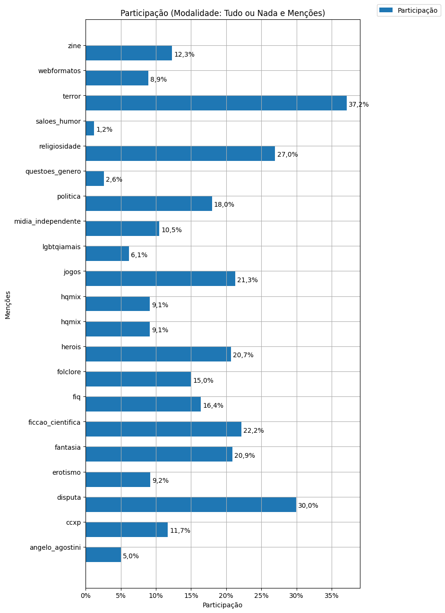
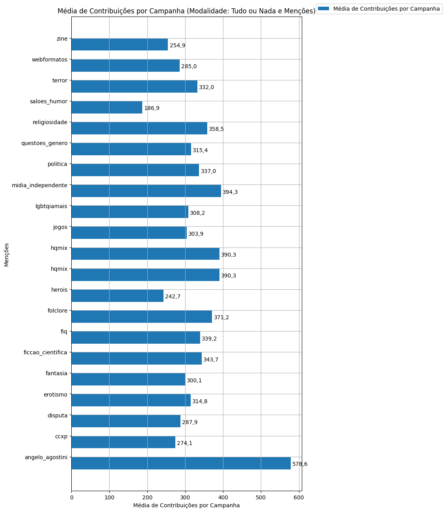

# Análise Descritiva - Recorte - Menções

A tabela abaixo foi usada nos gráficos a seguir.

| modalidade   | mencao             |   total |   total_sucesso |   particip (%) |   taxa_sucesso (%) |    meta (R$) |   meta_avg (R$) |   meta_std (R$) |   meta_min (R$) |   meta_max (R$) |   arrecadado_sucesso (R$) |   arrecadado_avg (R$) |   arrecadado_std (R$) |   arrecadado_min (R$) |   arrecadado_max (R$) |   apoio_medio (R$) |   apoio_std (R$) |   apoio_min (R$) |   apoio_max (R$) |   contribuicoes |   contribuicoes_med |   contribuicoes_std |   contribuicoes_min |   contribuicoes_max |
|:-------------|:-------------------|--------:|----------------:|---------------:|-------------------:|-------------:|----------------:|----------------:|----------------:|----------------:|--------------------------:|----------------------:|----------------------:|----------------------:|----------------------:|-------------------:|-----------------:|-----------------:|-----------------:|----------------:|--------------------:|--------------------:|--------------------:|--------------------:|
| aon          | angelo_agostini    |      67 |              61 |           5,0% |              91,0% |   977.628,17 |       16.026,69 |       15.355,17 |           42,24 |       80.687,35 |              3.045.252,81 |             49.922,18 |            101.183,47 |              2.944,09 |            679.297,66 |              78,58 |            23,64 |            32,27 |           151,13 |          35.293 |               578,6 |               930,0 |                55,0 |             6.494,0 |
| aon          | ccxp               |     156 |             126 |          11,7% |              80,8% | 1.813.305,60 |       14.391,31 |       11.119,73 |           42,24 |       55.735,34 |              2.860.818,44 |             22.704,91 |             20.582,18 |              1.720,66 |            154.365,98 |              87,11 |            35,08 |            33,80 |           257,79 |          34.535 |               274,1 |               239,5 |                36,0 |             1.815,0 |
| aon          | disputa            |     400 |             245 |          30,0% |              61,3% | 3.843.970,61 |       15.689,68 |       13.938,18 |           46,10 |       90.296,99 |              6.532.941,88 |             26.665,07 |             27.722,18 |                787,10 |            163.173,27 |              95,92 |            62,28 |            21,62 |           792,04 |          70.527 |               287,9 |               263,6 |                11,0 |             1.588,0 |
| aon          | erotismo           |     123 |              82 |           9,2% |              66,7% | 1.450.411,36 |       17.687,94 |       12.659,38 |          581,47 |       56.996,31 |              2.306.077,73 |             28.122,90 |             23.954,89 |              1.990,95 |            125.535,74 |              94,90 |            42,07 |            37,31 |           323,28 |          25.810 |               314,8 |               268,3 |                22,0 |             1.539,0 |
| aon          | fantasia           |     279 |             180 |          20,9% |              64,5% | 2.889.393,36 |       16.052,19 |       15.204,66 |           46,10 |      108.739,70 |              4.816.835,60 |             26.760,20 |             30.295,09 |                 94,90 |            264.585,91 |              88,02 |            33,80 |            23,15 |           213,97 |          54.018 |               300,1 |               283,8 |                 3,0 |             1.711,0 |
| aon          | ficcao_cientifica  |     296 |             179 |          22,2% |              60,5% | 2.913.046,55 |       16.274,00 |       15.989,71 |           36,54 |      161.766,74 |              5.401.646,15 |             30.176,79 |             46.623,44 |                 54,54 |            537.544,55 |              94,68 |            69,67 |            30,57 |           792,04 |          61.529 |               343,7 |               493,6 |                 1,0 |             5.879,0 |
| aon          | fiq                |     219 |             162 |          16,4% |              74,0% | 2.877.869,61 |       17.764,63 |       14.343,06 |          581,47 |       69.598,05 |              4.821.257,85 |             29.760,85 |             38.181,98 |              1.405,43 |            396.557,50 |              86,76 |            32,21 |            21,62 |           199,86 |          54.948 |               339,2 |               352,0 |                31,0 |             3.266,0 |
| aon          | folclore           |     200 |             140 |          15,0% |              70,0% | 2.437.211,50 |       17.408,65 |       15.775,78 |          581,47 |      108.739,70 |              4.507.319,89 |             32.195,14 |             45.455,39 |              1.081,47 |            396.557,50 |              90,35 |            67,63 |            32,27 |           792,04 |          51.967 |               371,2 |               416,5 |                17,0 |             3.266,0 |
| aon          | herois             |     276 |             157 |          20,7% |              56,9% | 2.151.113,51 |       13.701,36 |       11.910,51 |           37,28 |       75.629,89 |              3.474.485,41 |             22.130,48 |             25.554,86 |                989,68 |            161.153,63 |              96,01 |            67,13 |            21,62 |           792,04 |          38.102 |               242,7 |               251,5 |                11,0 |             1.588,0 |
| aon          | hqmix              |     122 |             108 |           9,1% |              88,5% | 1.767.446,74 |       16.365,25 |       15.020,38 |           48,64 |       80.687,35 |              3.759.007,87 |             34.805,63 |             76.815,19 |                787,10 |            679.297,66 |              81,02 |            26,64 |            21,62 |           172,16 |          42.155 |               390,3 |               706,1 |                12,0 |             6.494,0 |
| aon          | hqmix              |     122 |             108 |           9,1% |              88,5% | 1.767.446,74 |       16.365,25 |       15.020,38 |           48,64 |       80.687,35 |              3.759.007,87 |             34.805,63 |             76.815,19 |                787,10 |            679.297,66 |              81,02 |            26,64 |            21,62 |           172,16 |          42.155 |               390,3 |               706,1 |                12,0 |             6.494,0 |
| aon          | jogos              |     284 |             201 |          21,3% |              70,8% | 3.088.098,90 |       15.363,68 |       12.948,35 |           42,24 |       80.687,35 |              5.604.766,32 |             27.884,41 |             51.240,25 |              1.411,86 |            679.297,66 |              91,16 |            33,39 |            35,30 |           234,87 |          61.093 |               303,9 |               494,1 |                26,0 |             6.494,0 |
| aon          | lgbtqiamais        |      82 |              58 |           6,1% |              70,7% |   995.808,61 |       17.169,11 |       26.103,48 |          508,30 |      189.313,70 |              1.602.557,62 |             27.630,30 |             38.892,54 |                721,79 |            264.456,52 |              88,86 |            39,12 |            37,31 |           245,62 |          17.873 |               308,2 |               327,6 |                 8,0 |             1.539,0 |
| aon          | midia_independente |     140 |              97 |          10,5% |              69,3% | 2.360.339,14 |       24.333,39 |       29.842,69 |          581,47 |      189.313,70 |              4.218.883,10 |             43.493,64 |             57.897,48 |              1.405,43 |            264.585,91 |             103,68 |            51,99 |            36,81 |           323,28 |          38.250 |               394,3 |               391,1 |                29,0 |             1.711,0 |
| aon          | politica           |     240 |             154 |          18,0% |              64,2% | 3.015.810,05 |       19.583,18 |       18.411,28 |           33,26 |      124.473,30 |              4.982.733,19 |             32.355,41 |             34.162,57 |                 54,54 |            215.281,29 |              95,63 |            44,42 |            33,80 |           362,04 |          51.893 |               337,0 |               298,8 |                 1,0 |             1.588,0 |
| aon          | questoes_genero    |      35 |              24 |           2,6% |              68,6% |   395.699,92 |       16.487,50 |       17.640,91 |        2.154,33 |       80.883,37 |                622.913,46 |             25.954,73 |             26.184,68 |              3.366,14 |            123.112,70 |              88,51 |            44,08 |            46,84 |           245,62 |           7.569 |               315,4 |               313,5 |                51,0 |             1.489,0 |
| aon          | religiosidade      |     360 |             211 |          27,0% |              58,6% | 3.365.446,43 |       15.949,98 |       14.649,20 |           46,10 |      108.739,70 |              6.620.001,80 |             31.374,42 |             59.614,09 |                322,20 |            679.297,66 |              87,04 |            35,13 |            21,62 |           301,82 |          75.649 |               358,5 |               555,7 |                 4,0 |             6.494,0 |
| aon          | saloes_humor       |      16 |              12 |           1,2% |              75,0% |   111.483,85 |        9.290,32 |        7.713,65 |           36,54 |       23.191,06 |                162.569,93 |             13.547,49 |             10.287,95 |                459,39 |             29.349,35 |              75,01 |            43,45 |            32,27 |           185,96 |           2.243 |               186,9 |               124,1 |                11,0 |               411,0 |
| aon          | terror             |     496 |             327 |          37,2% |              65,9% | 5.282.409,17 |       16.154,16 |       14.142,86 |           46,10 |       80.687,35 |              9.479.119,39 |             28.988,13 |             51.783,65 |                787,10 |            679.297,66 |              91,19 |            57,42 |            21,62 |           792,04 |         108.579 |               332,0 |               527,9 |                16,0 |             6.494,0 |
| aon          | webformatos        |     119 |              89 |           8,9% |              74,8% | 1.277.366,27 |       14.352,43 |       10.939,95 |        2.533,17 |       54.418,20 |              2.104.894,58 |             23.650,50 |             22.257,37 |              3.458,60 |            136.747,60 |              83,09 |            29,94 |            21,62 |           194,22 |          25.369 |               285,0 |               251,2 |                38,0 |             1.547,0 |
| aon          | zine               |     164 |             112 |          12,3% |              68,3% | 1.498.276,05 |       13.377,46 |       10.427,40 |           46,10 |       58.146,76 |              2.315.707,64 |             20.675,96 |             20.218,38 |                 54,54 |            161.153,63 |              82,12 |            32,48 |            32,27 |           245,62 |          28.547 |               254,9 |               226,7 |                 1,0 |             1.588,0 |

Dados em [planilha eletrônica](./dados/aon-mencoes.xlsx).

## Totais

O gráfico a seguir relaciona a modalidade com o total de campanhas e o total de campanhas bem sucedidas.

## Participação

O gráfico a seguir relaciona a modalidade com a participação de cada uma no conjunto de campanhas.

## Taxa de Sucesso

O gráfico a seguir relaciona a modalidade com a taxa de sucesso das campanhas.

## Meta Total

O gráfico a seguir relaciona a modalidade com a meta de arrecadação das campanhas bem sucedidas.

## Meta Média

O gráfico a seguir relaciona a modalidade com a meta média de arrecadação das campanhas bem sucedidas.

## Total Arrecadado

O gráfico a seguir relaciona a modalidade com o total arrecadado pelas campanhas bem sucedidas.

## Média Arrecadada por Campanha

O gráfico a seguir relaciona a modalidade com a média arrecadada por campanha bem sucedida.

## Apoio Médio por Campanha

O gráfico a seguir relaciona a modalidade com o apoio médio por campanha bem sucedida.

## Total de Contribuições

O gráfico a seguir relaciona a modalidade com o total de contribuições das campanhas bem sucedidas.

## Média de Contribuições

O gráfico a seguir relaciona a modalidade com a média de contribuições de campanhas bem sucedidas.

