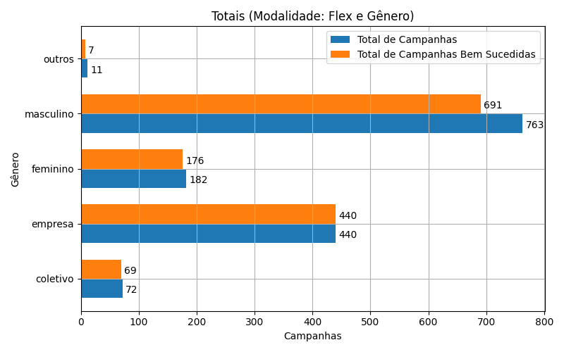
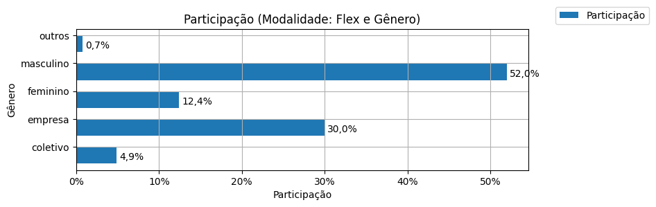
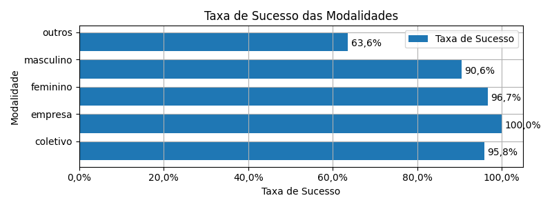
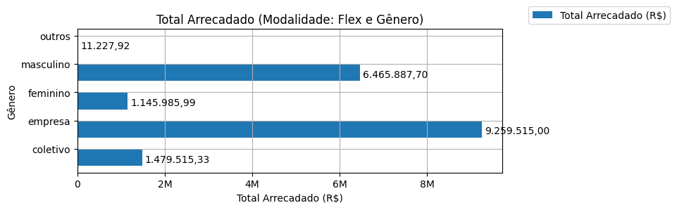
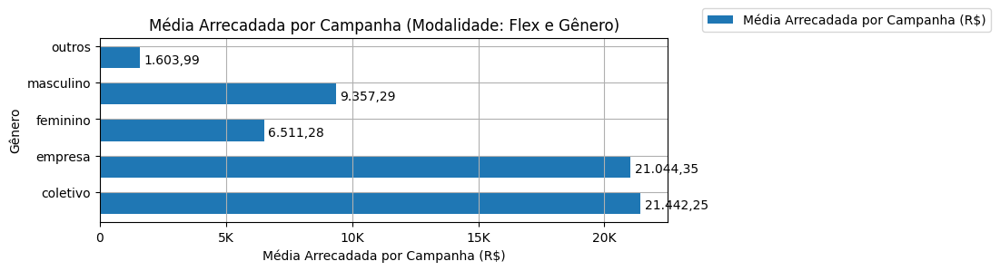
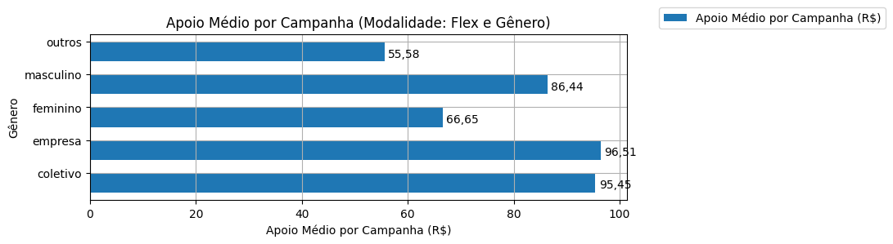
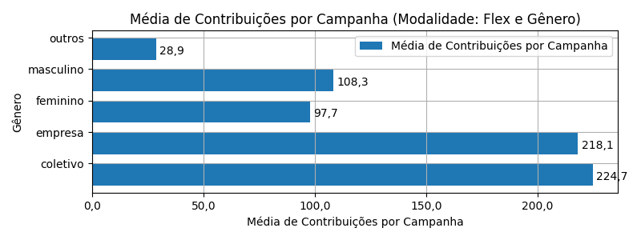

# Recorte - Gênero

| modalidade   | autoria_classificacao   |   total |   total_sucesso |   particip (%) |   taxa_sucesso (%) |   arrecadado_sucesso (R$) |   media_sucesso (R$) |   std_sucesso (R$) |   min_sucesso (R$) |   max_sucesso (R$) |   apoio_medio (R$) |   contribuicoes |   media_contribuicoes |
|:-------------|:------------------------|--------:|----------------:|---------------:|-------------------:|--------------------------:|---------------------:|-------------------:|-------------------:|-------------------:|-------------------:|----------------:|----------------------:|
| flex         | coletivo                |      72 |              69 |           4,9% |              95,8% |              1.479.515,33 |            21.442,25 |          34.235,40 |              29,81 |         169.836,91 |              95,45 |          15.501 |                 224,7 |
| flex         | empresa                 |     440 |             440 |          30,0% |             100,0% |              9.259.515,00 |            21.044,35 |          46.143,04 |              34,74 |         708.972,78 |              96,51 |          95.943 |                 218,1 |
| flex         | feminino                |     182 |             176 |          12,4% |              96,7% |              1.145.985,99 |             6.511,28 |           6.521,40 |              35,53 |          29.736,69 |              66,65 |          17.194 |                  97,7 |
| flex         | masculino               |     763 |             691 |          52,0% |              90,6% |              6.465.887,70 |             9.357,29 |          27.421,05 |              10,77 |         442.290,11 |              86,44 |          74.806 |                 108,3 |
| flex         | outros                  |      11 |               7 |           0,7% |              63,6% |                 11.227,92 |             1.603,99 |           2.112,50 |              42,36 |           5.515,84 |              55,58 |             202 |                  28,9 |

Dados em [planilha eletrônica](./dados/flex-genero.xlsx).

## Totais

O gráfico a seguir relaciona a modalidade com o total de campanhas e o total de campanhas bem sucedidas.

## Participação

O gráfico a seguir relaciona a modalidade com a participação de cada uma no conjunto de campanhas.

## Taxa de Sucesso

O gráfico a seguir relaciona a modalidade com a taxa de sucesso das campanhas.

## Total Arrecadado

O gráfico a seguir relaciona a modalidade com o total arrecadado pelas campanhas.

## Média Arrecadada por Campanha

O gráfico a seguir relaciona a modalidade com a média arrecadada por campanha.

## Apoio Médio por Campanha

O gráfico a seguir relaciona a modalidade com o apoio médio por campanha.

## Total de Contribuições

O gráfico a seguir relaciona a modalidade com o total de contribuições das campanhas.

## Média de Contribuições

O gráfico a seguir relaciona a modalidade com a média de contribuições de campanhas.

