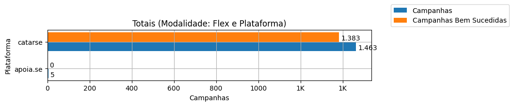
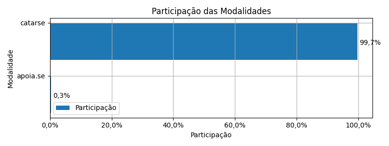
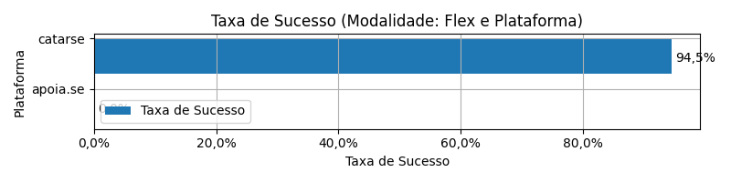
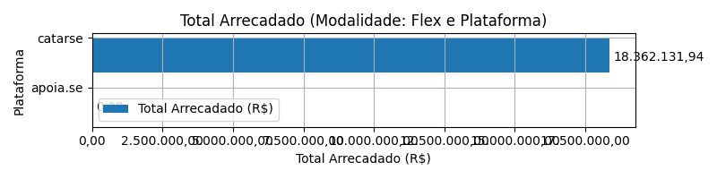
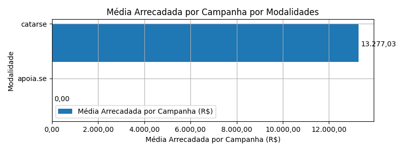
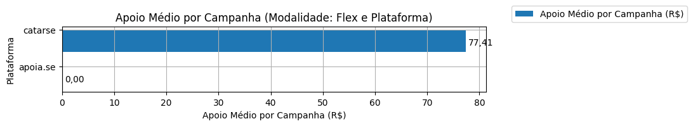
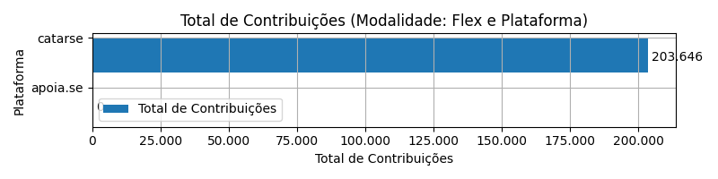
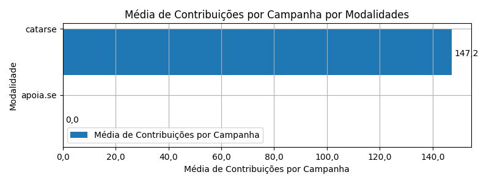

# Recorte - Plataforma

| modalidade   | origem   |   total |   total_sucesso |   particip (%) |   taxa_sucesso (%) |   arrecadado_sucesso (R$) |   media_sucesso (R$) |   std_sucesso (R$) |   min_sucesso (R$) |   max_sucesso (R$) |   apoio_medio (R$) |   contribuicoes |   media_contribuicoes |
|:-------------|:---------|--------:|----------------:|---------------:|-------------------:|--------------------------:|---------------------:|-------------------:|-------------------:|-------------------:|-------------------:|----------------:|----------------------:|
| flex         | apoia.se |       5 |               0 |           0,3% |               0,0% |                      0,00 |                 0,00 |               0,00 |               0,00 |               0,00 |               0,00 |               0 |                   0,0 |
| flex         | catarse  |   1.463 |           1.383 |          99,7% |              94,5% |             18.362.131,94 |            13.277,03 |          33.934,83 |              10,77 |         708.972,78 |              90,17 |         203.646 |                 147,2 |

Dados em [planilha eletrônica](./dados/flex-plataforma.xlsx).

## Totais

O gráfico a seguir relaciona a modalidade com o total de campanhas e o total de campanhas bem sucedidas.

## Participação

O gráfico a seguir relaciona a modalidade com a participação de cada uma no conjunto de campanhas.

## Taxa de Sucesso

O gráfico a seguir relaciona a modalidade com a taxa de sucesso das campanhas.

## Total Arrecadado

O gráfico a seguir relaciona a modalidade com o total arrecadado pelas campanhas.

## Média Arrecadada por Campanha

O gráfico a seguir relaciona a modalidade com a média arrecadada por campanha.

## Apoio Médio por Campanha

O gráfico a seguir relaciona a modalidade com o apoio médio por campanha.

## Total de Contribuições

O gráfico a seguir relaciona a modalidade com o total de contribuições das campanhas.

## Média de Contribuições

O gráfico a seguir relaciona a modalidade com a média de contribuições de campanhas.

