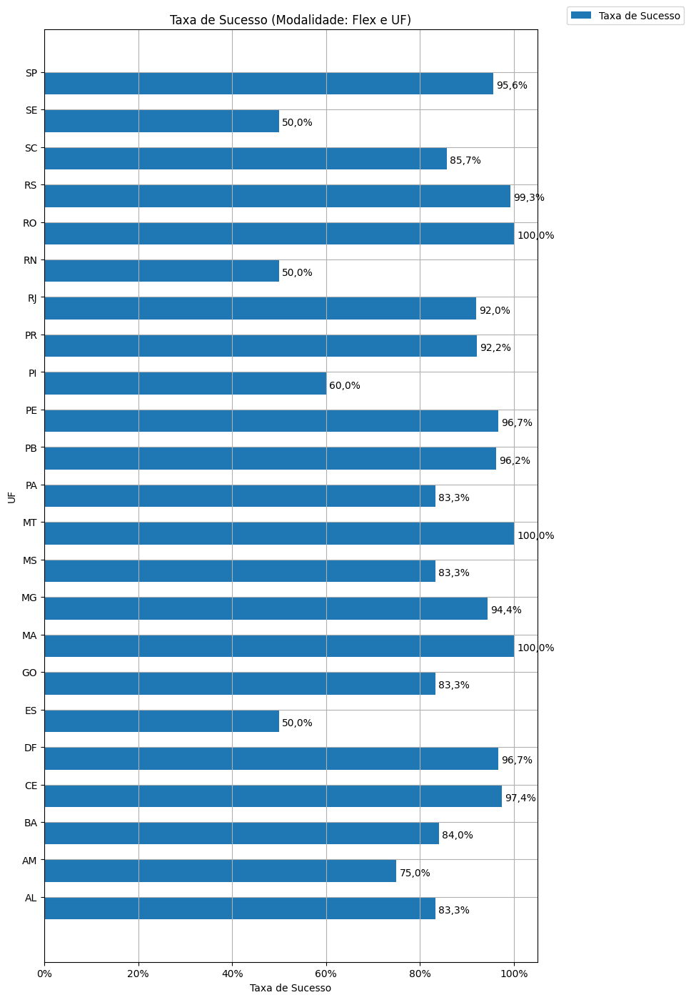

# Análise Descritiva - Recorte - UF

A tabela abaixo foi usada nos gráficos a seguir.

| modalidade   | geral_uf_br   |   total |   total_sucesso |   particip (%) |   taxa_sucesso (%) |    meta (R$) |   meta_avg (R$) |   meta_std (R$) |   meta_min (R$) |   meta_max (R$) |   arrecadado_sucesso (R$) |   arrecadado_avg (R$) |   arrecadado_std (R$) |   arrecadado_min (R$) |   arrecadado_max (R$) |   apoio_medio (R$) |   apoio_std (R$) |   apoio_min (R$) |   apoio_max (R$) |   contribuicoes |   contribuicoes_med |   contribuicoes_std |   contribuicoes_min |   contribuicoes_max |
|:-------------|:--------------|--------:|----------------:|---------------:|-------------------:|-------------:|----------------:|----------------:|----------------:|----------------:|--------------------------:|----------------------:|----------------------:|----------------------:|----------------------:|-------------------:|-----------------:|-----------------:|-----------------:|----------------:|--------------------:|--------------------:|--------------------:|--------------------:|
| flex         | AL            |       6 |               5 |           0,4% |              83,3% |    52.257,22 |       10.451,44 |       12.140,81 |        1.583,47 |       31.579,06 |                 20.618,50 |              4.123,70 |              3.042,21 |                 52,78 |              8.487,42 |              49,35 |             3,16 |            45,34 |            52,78 |             424 |                84,8 |                61,6 |                 1,0 |               171,0 |
| flex         | AM            |       4 |               3 |           0,3% |              75,0% |     8.812,64 |        2.937,55 |          432,18 |        2.439,32 |        3.211,42 |                  5.966,55 |              1.988,85 |              1.491,59 |                621,84 |              3.579,71 |              75,93 |            33,04 |            44,42 |           110,31 |              79 |                26,3 |                19,7 |                14,0 |                49,0 |
| flex         | BA            |      25 |              21 |           1,7% |              84,0% |   116.950,52 |        5.569,07 |        6.074,37 |           65,58 |       21.543,28 |                130.434,36 |              6.211,16 |              9.050,77 |                 28,49 |             39.043,46 |              67,79 |            31,71 |            23,84 |           139,51 |           1.544 |                73,5 |                83,8 |                 1,0 |               366,0 |
| flex         | CE            |      38 |              37 |           2,6% |              97,4% |   429.522,20 |       11.608,71 |       12.443,31 |          136,01 |       37.124,06 |                292.839,62 |              7.914,58 |             11.620,26 |                 60,22 |             42.352,39 |              69,41 |            29,61 |            27,45 |           157,44 |           3.519 |                95,1 |               134,4 |                 1,0 |               575,0 |
| flex         | DF            |      30 |              29 |           2,0% |              96,7% |   251.322,29 |        8.666,29 |       11.394,40 |          100,33 |       55.186,14 |                141.740,83 |              4.887,61 |              6.274,28 |                 11,93 |             19.696,84 |              70,99 |            26,11 |            11,93 |           119,48 |           1.958 |                67,5 |                87,9 |                 1,0 |               303,0 |
| flex         | ES            |       6 |               3 |           0,4% |              50,0% |    28.245,09 |        9.415,03 |        5.887,22 |        3.011,10 |       14.592,25 |                 19.243,05 |              6.414,35 |              3.637,51 |              3.221,88 |             10.374,39 |              57,05 |             9,22 |            48,68 |            66,93 |             329 |               109,7 |                48,8 |                58,0 |               155,0 |
| flex         | GO            |       6 |               5 |           0,4% |              83,3% |    74.503,30 |       14.900,66 |       20.139,32 |          377,97 |       50.446,28 |                 18.754,48 |              3.750,90 |              4.503,41 |                907,13 |             11.657,13 |              84,37 |            38,85 |            29,26 |           121,43 |             193 |                38,6 |                32,7 |                16,0 |                96,0 |
| flex         | MA            |       4 |               4 |           0,3% |             100,0% |    17.212,44 |        4.303,11 |        4.772,70 |          702,78 |       11.336,76 |                 10.257,69 |              2.564,42 |              1.204,75 |              1.415,31 |              3.759,17 |              48,85 |             6,20 |            43,31 |            56,35 |             204 |                51,0 |                19,3 |                32,0 |                73,0 |
| flex         | MG            |      71 |              67 |           4,8% |              94,4% |   739.083,21 |       11.031,09 |       16.426,89 |          121,97 |       98.509,01 |                482.605,55 |              7.203,07 |             10.740,03 |                 35,53 |             55.069,70 |              69,84 |            35,41 |            12,20 |           196,42 |           5.773 |                86,2 |               108,5 |                 1,0 |               571,0 |
| flex         | MS            |       6 |               5 |           0,4% |              83,3% |    34.725,70 |        6.945,14 |        6.107,54 |        1.186,23 |       15.855,61 |                 21.988,60 |              4.397,72 |              2.989,46 |                620,57 |              8.364,98 |              65,64 |            14,84 |            52,26 |            91,02 |             336 |                67,2 |                47,2 |                10,0 |               141,0 |
| flex         | MT            |       2 |               2 |           0,1% |             100,0% |    60.828,10 |       30.414,05 |       33.878,62 |        6.458,25 |       54.369,85 |                 19.225,07 |              9.612,53 |             10.123,51 |              2.454,14 |             16.770,93 |              77,84 |             5,60 |            73,88 |            81,80 |             257 |               128,5 |               139,3 |                30,0 |               227,0 |
| flex         | PA            |       6 |               5 |           0,4% |              83,3% |    62.643,19 |       12.528,64 |       12.382,30 |        1.937,48 |       26.500,70 |                 22.468,65 |              4.493,73 |              5.633,18 |                100,76 |             12.609,40 |              45,35 |            25,47 |            20,15 |            83,51 |             439 |                87,8 |               102,2 |                 5,0 |               236,0 |
| flex         | PB            |      26 |              25 |           1,8% |              96,2% |   108.226,62 |        4.329,06 |        6.433,54 |           19,07 |       20.235,01 |                 92.454,99 |              3.698,20 |              8.668,49 |                 81,93 |             37.589,60 |              51,46 |            23,25 |            13,06 |           111,37 |           1.364 |                54,6 |               117,6 |                 2,0 |               539,0 |
| flex         | PE            |      60 |              58 |           4,1% |              96,7% |   566.078,18 |        9.759,97 |       26.431,11 |           46,56 |      198.811,94 |                313.526,53 |              5.405,63 |              5.143,84 |                 62,13 |             26.068,83 |              61,56 |            23,34 |            16,18 |           138,02 |           4.928 |                85,0 |                68,5 |                 1,0 |               328,0 |
| flex         | PI            |      10 |               6 |           0,7% |              60,0% |   117.659,49 |       19.609,92 |       18.205,91 |        4.262,23 |       54.319,48 |                 29.669,49 |              4.944,92 |              4.672,47 |                821,54 |             13.165,19 |              59,77 |            14,08 |            45,91 |            82,15 |             555 |                92,5 |               100,1 |                10,0 |               284,0 |
| flex         | PR            |      64 |              59 |           4,4% |              92,2% |   654.890,59 |       11.099,84 |       11.296,15 |           12,33 |       47.328,43 |                688.481,13 |             11.669,17 |             13.175,20 |                 48,19 |             59.310,53 |              82,66 |            41,59 |            20,34 |           201,22 |           9.650 |               163,6 |               223,5 |                 1,0 |             1.318,0 |
| flex         | RJ            |     163 |             150 |          11,1% |              92,0% | 1.940.871,28 |       12.939,14 |       18.502,57 |           15,08 |      147.790,83 |              2.121.729,30 |             14.144,86 |             20.277,98 |                 10,77 |            142.477,57 |              78,51 |            35,09 |            10,77 |           233,40 |          24.870 |               165,8 |               239,9 |                 1,0 |             2.120,0 |
| flex         | RN            |       6 |               3 |           0,4% |              50,0% |    49.572,00 |       16.524,00 |        8.424,00 |        8.470,77 |       25.275,33 |                 25.188,92 |              8.396,31 |             11.215,07 |                148,24 |             21.166,43 |              82,28 |            10,16 |            74,12 |            93,66 |             277 |                92,3 |               118,1 |                 2,0 |               226,0 |
| flex         | RO            |       4 |               4 |           0,3% |             100,0% |    47.325,69 |       11.831,42 |        7.800,89 |        1.317,02 |       19.345,73 |                  5.636,43 |              1.409,11 |              1.366,75 |                131,70 |              3.310,96 |              41,02 |            18,87 |            21,99 |            65,85 |             157 |                39,2 |                29,9 |                 2,0 |                75,0 |
| flex         | RS            |     142 |             141 |           9,7% |              99,3% | 1.694.424,07 |       12.017,19 |       13.469,42 |           22,09 |       81.328,38 |              1.762.708,33 |             12.501,48 |             18.586,72 |                 57,99 |            118.699,04 |              81,79 |            45,73 |            18,89 |           306,28 |          18.138 |               128,6 |               153,2 |                 1,0 |             1.004,0 |
| flex         | SC            |      21 |              18 |           1,4% |              85,7% |   209.424,14 |       11.634,67 |        8.432,52 |          602,22 |       28.298,76 |                 88.617,57 |              4.923,20 |              7.139,53 |                 42,01 |             28.385,54 |              85,52 |            52,64 |            21,00 |           254,24 |           1.224 |                68,0 |                98,6 |                 1,0 |               344,0 |
| flex         | SE            |       2 |               1 |           0,1% |              50,0% |     5.044,63 |        5.044,63 |            0,00 |        5.044,63 |        5.044,63 |                  2.029,96 |              2.029,96 |                  0,00 |              2.029,96 |              2.029,96 |              36,91 |             0,00 |            36,91 |            36,91 |              55 |                55,0 |                 0,0 |                55,0 |                55,0 |
| flex         | SP            |     766 |             732 |          52,2% |              95,6% | 8.330.094,11 |       11.379,91 |       16.894,96 |           12,04 |      156.813,32 |             12.045.946,34 |             16.456,21 |             44.170,98 |                 23,05 |            708.972,78 |              80,56 |            41,26 |            11,53 |           461,52 |         127.373 |               174,0 |               419,7 |                 1,0 |             7.954,0 |

Dados em [planilha eletrônica](./dados/flex-uf.xlsx).

## Totais

O gráfico a seguir relaciona a modalidade com o total de campanhas e o total de campanhas bem sucedidas.

## Participação

O gráfico a seguir relaciona a modalidade com a participação de cada uma no conjunto de campanhas.

## Taxa de Sucesso

O gráfico a seguir relaciona a modalidade com a taxa de sucesso das campanhas.

## Meta Total

O gráfico a seguir relaciona a modalidade com a meta de arrecadação das campanhas bem sucedidas.

## Meta Média

O gráfico a seguir relaciona a modalidade com a meta média de arrecadação das campanhas bem sucedidas.

## Total Arrecadado

O gráfico a seguir relaciona a modalidade com o total arrecadado pelas campanhas bem sucedidas.

## Média Arrecadada por Campanha

O gráfico a seguir relaciona a modalidade com a média arrecadada por campanha bem sucedida.

## Apoio Médio por Campanha

O gráfico a seguir relaciona a modalidade com o apoio médio por campanha bem sucedida.

## Total de Contribuições

O gráfico a seguir relaciona a modalidade com o total de contribuições das campanhas bem sucedidas.

## Média de Contribuições

O gráfico a seguir relaciona a modalidade com a média de contribuições de campanhas bem sucedidas.

