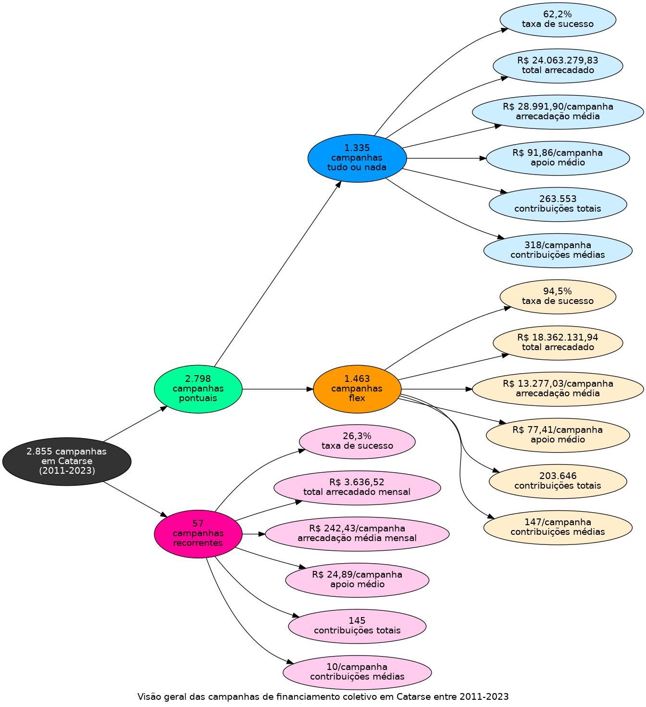

# Infográfico - Catarse

O infográfico a seguir indica um total de 2.855 campanhas em Catarse,
entre 2011 e 2023. As campanhas pontuais totalizam 2.798 campanhas, agrupadas
em 1.335 tudo ou nada e 1.463 flex. As campanhas recorrentes estão em 57.
A taxa de sucesso, o total arrecadado e a média de arrecadação por campanha
são apresentados para cada modalidade e compreendem uma visão alternativa
à tabela apresentada inicialmente.

