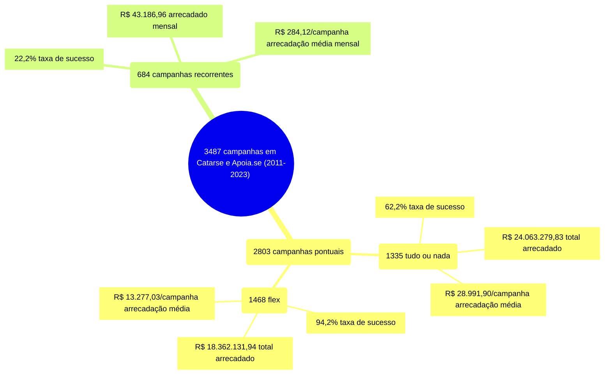

# Modalidade

A tabela a seguir considera apenas as campanhas bem sucedidas, apresentando as medidas
de estatística descritiva para cada modalidade de financiamento. Colunas:
- modalidade: tudo ou nada, flex ou recorrente;
- total: total de campanhas;
- arrecadado: valor total arrecadado pelas campanhas (bem sucedidas ou não);
- total_sucesso: total de campanhas bem sucedidas;
- arrecadado_sucesso: valor total arrecadado pelas campanhas bem sucedidas;
- taxa_sucesso: relação entre o total de campanhas bem sucedidas e o total de campanhas;
- media_sucesso: valor arrecadado médio pelas campanhas bem sucedidas;
- std_sucesso: desvio padrão médio (ref: valor arrecadado) pelas campanhas bem sucedidas;
- min_sucesso: menor valor arrecadado médio entre as campanhas bem sucedidas;
- max_sucesso: maior valor arrecadado médio entre as campanhas bem sucedidas.

| modalidade   |   total |   arrecadado |   total_sucesso |   arrecadado_sucesso |   taxa_sucesso |   media_sucesso |   std_sucesso |   min_sucesso |   max_sucesso |
|:-------------|--------:|-------------:|----------------:|---------------------:|---------------:|----------------:|--------------:|--------------:|--------------:|
| tudo ou nada |    1.335 |  25.609.919,37 |             830 |          24.063.279,83 |           62,2 |        28.991,90 |      44.961,94 |         41,82 |     679.297,66 |
| flex         |    1.468 |  18.362.275,04 |            1.383 |          18.362.131,94 |           94,2 |        13.277,03 |      33.934,83 |         10,77 |     708.972,78 |
| recorrente   |     684 |     43.186,96 |             152 |             43.186,96 |           22,2 |          284,12 |        650,58 |          1,09 |       5.087,08 |

## Infográfico - Visão Geral

O infográfico a seguir indica um total de 3487 campanhas em Catarse e Apoia.se,
entre 2011 e 2023. As campanhas pontuais totalizam 2803 campanhas, agrupadas
em 1335 tudo ou nada e 1468 flex. As campanhas recorrentes estão em 684.
A taxa de sucesso, o total arrecadado e a média de arrecadação por campanha
são apresentados para cada modalidade e compreendem uma visão alternativa
à tabela apresentada inicialmente.

