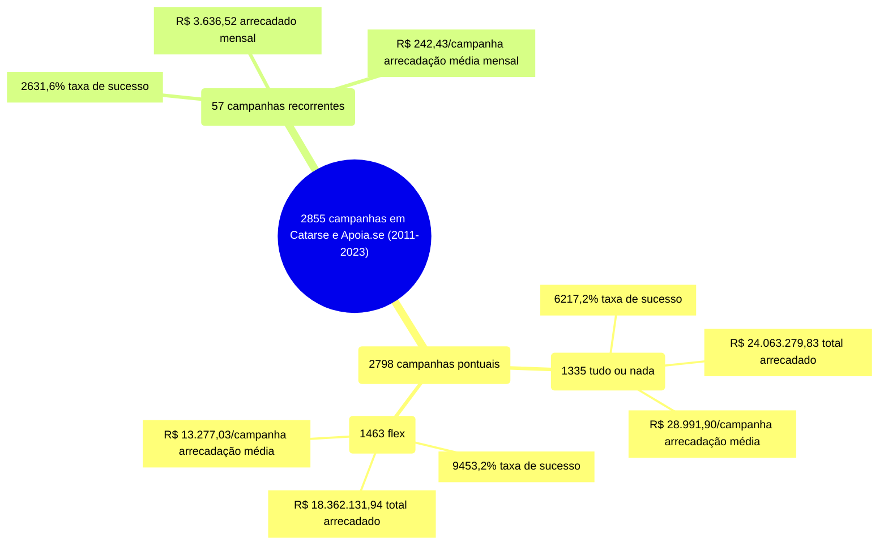
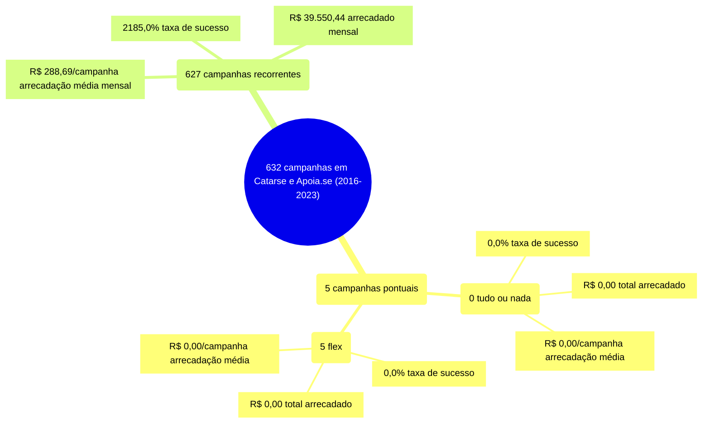

# Plataforma

A tabela a seguir considera apenas as campanhas bem sucedidas, apresentando as medidas
de estatística descritiva para cada modalidade de financiamento e dimensão em destaque
(Plataforma). Colunas:
- modalidade: tudo ou nada, flex ou recorrente;
- origem: catarse ou apoia.se;
- total: total de campanhas;
- total_sucesso: total de campanhas bem sucedidas;
- particip: participação em relação à modalidade;
- taxa_sucesso: relação entre o total de campanhas bem sucedidas e o total de campanhas;
- arrecadado_sucesso: valor total arrecadado pelas campanhas bem sucedidas;
- media_sucesso: valor arrecadado médio pelas campanhas bem sucedidas;
- std_sucesso: desvio padrão médio (ref: valor arrecadado) pelas campanhas bem sucedidas;
- min_sucesso: menor valor arrecadado médio entre as campanhas bem sucedidas;
- max_sucesso: maior valor arrecadado médio entre as campanhas bem sucedidas;
- apoio_medio: apoio médio entre as campanhas bem sucedidas;
- contribuicoes: total de contribuições entre as campanhas bem sucedidas;
- media_contribuicoes: média de contribuições entre as campanhas bem sucedidas.

| modalidade   | origem   |   total |   total_sucesso |   particip |   taxa_sucesso |   arrecadado_sucesso |   media_sucesso |   std_sucesso |   min_sucesso |   max_sucesso |   apoio_medio |   contribuicoes |   media_contribuicoes |
|:-------------|:---------|--------:|----------------:|-----------:|---------------:|---------------------:|----------------:|--------------:|--------------:|--------------:|--------------:|----------------:|----------------------:|
| tudo ou nada | catarse  |    1.335 |             830 |    10.000,0 |         6.217,2 |          24.063.279,83 |        28.991,90 |      44.961,94 |         41,82 |     679.297,66 |         91,30 |          263.553 |                317,53 |
| flex         | apoia.se |       5 |               0 |       34,1 |            0,0 |                 0,00 |            0,00 |          0,00 |          0,00 |          0,00 |          0,00 |               0 |                  0,00 |
| flex         | catarse  |    1.463 |            1.383 |     9.965,9 |         9.453,2 |          18.362.131,94 |        13.277,03 |      33.934,83 |         10,77 |     708.972,78 |         90,17 |          203.646 |                147,25 |
| recorrente   | apoia.se |     627 |             137 |     9.166,7 |         2.185,0 |             39.550,44 |          288,69 |        682,40 |          1,09 |       5.087,08 |         19,17 |            2.063 |                 15,06 |
| recorrente   | catarse  |      57 |              15 |      833,3 |         2.631,6 |              3.636,52 |          242,43 |        198,40 |         10,98 |        538,44 |         25,08 |             145 |                  9,67 |

## Infográfico - Visão Geral: Catarse

O infográfico a seguir indica um total de 2855 campanhas em Catarse,
entre 2011 e 2023. As campanhas pontuais totalizam 2798 campanhas, agrupadas
em 1335 tudo ou nada e 1463 flex. As campanhas recorrentes estão em 57.
A taxa de sucesso, o total arrecadado e a média de arrecadação por campanha
são apresentados para cada modalidade e compreendem uma visão alternativa
à tabela apresentada inicialmente.

## Infográfico - Visão Geral: Apoia.se

O infográfico a seguir indica um total de 632 campanhas em Apoia.se,
entre 2016 e 2023. As campanhas pontuais totalizam 5 campanhas, agrupadas
em 0 tudo ou nada e 5 flex. As campanhas recorrentes estão em 627.
A taxa de sucesso, o total arrecadado e a média de arrecadação por campanha
são apresentados para cada modalidade e compreendem uma visão alternativa
à tabela apresentada inicialmente.

