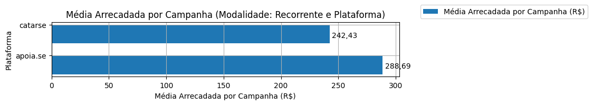
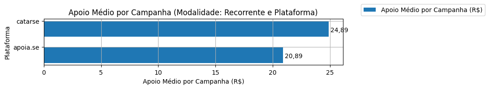

# Análise Descritiva - Recorte - Plataforma

A tabela abaixo foi usada nos gráficos a seguir.

| modalidade   | origem   |   total |   total_sucesso |   particip (%) |   taxa_sucesso (%) |   arrecadado_sucesso (R$) |   media_sucesso (R$) |   std_sucesso (R$) |   min_sucesso (R$) |   max_sucesso (R$) |   apoio_medio (R$) |   contribuicoes |   media_contribuicoes |
|:-------------|:---------|--------:|----------------:|---------------:|-------------------:|--------------------------:|---------------------:|-------------------:|-------------------:|-------------------:|-------------------:|----------------:|----------------------:|
| sub          | apoia.se |     627 |             137 |          91,7% |              21,9% |                 39.550,44 |               288,69 |             682,40 |               1,09 |           5.087,08 |              19,17 |           2.063 |                  15,1 |
| sub          | catarse  |      57 |              15 |           8,3% |              26,3% |                  3.636,52 |               242,43 |             198,40 |              10,98 |             538,44 |              25,08 |             145 |                   9,7 |

Dados em [planilha eletrônica](./dados/sub-plataforma.xlsx).

## Totais

O gráfico a seguir relaciona a modalidade com o total de campanhas e o total de campanhas bem sucedidas.

## Participação

O gráfico a seguir relaciona a modalidade com a participação de cada uma no conjunto de campanhas.

## Taxa de Sucesso

O gráfico a seguir relaciona a modalidade com a taxa de sucesso das campanhas.

## Total Arrecadado

O gráfico a seguir relaciona a modalidade com o total arrecadado pelas campanhas.

## Média Arrecadada por Campanha

O gráfico a seguir relaciona a modalidade com a média arrecadada por campanha.

## Apoio Médio por Campanha

O gráfico a seguir relaciona a modalidade com o apoio médio por campanha.

## Total de Contribuições

O gráfico a seguir relaciona a modalidade com o total de contribuições das campanhas.

## Média de Contribuições

O gráfico a seguir relaciona a modalidade com a média de contribuições de campanhas.

