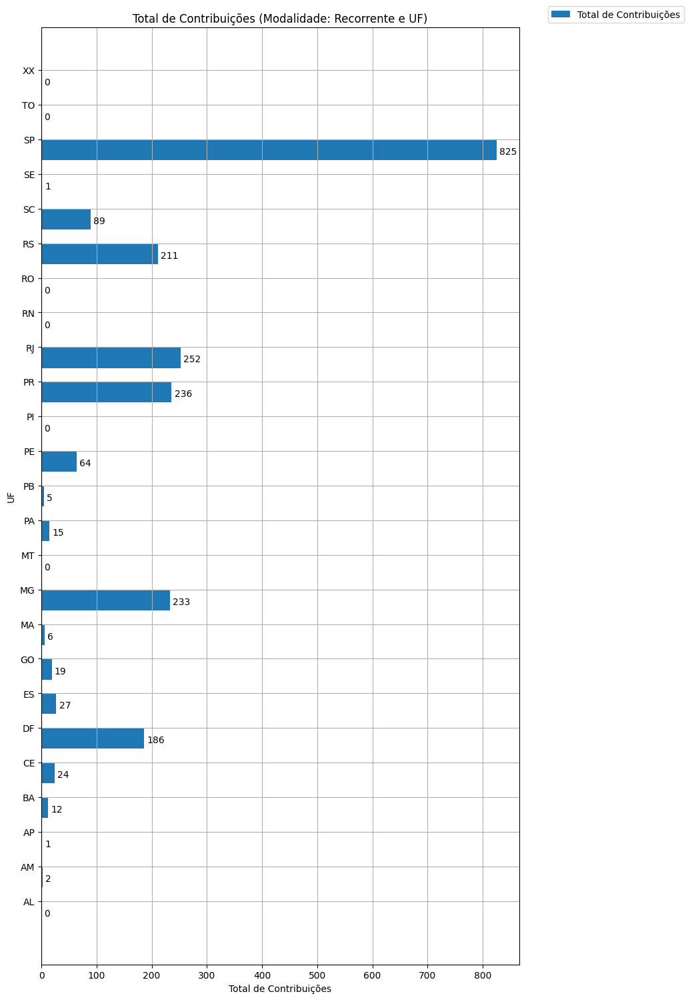

# Análise Descritiva - Recorte - UF

A tabela abaixo foi usada nos gráficos a seguir.

| modalidade   | geral_uf_br   |   total |   total_sucesso |   particip (%) |   taxa_sucesso (%) |   meta (R$) |   meta_avg (R$) |   meta_std (R$) |   meta_min (R$) |   meta_max (R$) |   arrecadado_sucesso (R$) |   arrecadado_avg (R$) |   arrecadado_std (R$) |   arrecadado_min (R$) |   arrecadado_max (R$) |   apoio_medio (R$) |   apoio_std (R$) |   apoio_min (R$) |   apoio_max (R$) |   contribuicoes |   contribuicoes_med |   contribuicoes_std |   contribuicoes_min |   contribuicoes_max |
|:-------------|:--------------|--------:|----------------:|---------------:|-------------------:|------------:|----------------:|----------------:|----------------:|----------------:|--------------------------:|----------------------:|----------------------:|----------------------:|----------------------:|-------------------:|-----------------:|-----------------:|-----------------:|----------------:|--------------------:|--------------------:|--------------------:|--------------------:|
| sub          | AL            |       5 |               0 |           0,7% |               0,0% |        0,00 |            0,00 |            0,00 |            0,00 |            0,00 |                      0,00 |                  0,00 |                  0,00 |                  0,00 |                  0,00 |               0,00 |             0,00 |             0,00 |             0,00 |               0 |                 0,0 |                 0,0 |                 0,0 |                 0,0 |
| sub          | AM            |      13 |               1 |           1,9% |               7,7% |    1.011,04 |        1.011,04 |            0,00 |        1.011,04 |        1.011,04 |                      2,02 |                  2,02 |                  0,00 |                  2,02 |                  2,02 |               1,01 |             0,00 |             1,01 |             1,01 |               2 |                 2,0 |                 0,0 |                 2,0 |                 2,0 |
| sub          | AP            |       2 |               1 |           0,3% |              50,0% |      700,16 |          700,16 |            0,00 |          700,16 |          700,16 |                     70,02 |                 70,02 |                  0,00 |                 70,02 |                 70,02 |              70,02 |             0,00 |            70,02 |            70,02 |               1 |                 1,0 |                 0,0 |                 1,0 |                 1,0 |
| sub          | BA            |      25 |               4 |           3,7% |              16,0% |    4.175,84 |        1.043,96 |          744,47 |          306,72 |        2.010,81 |                    392,12 |                 98,03 |                 24,95 |                 76,68 |                127,07 |              36,29 |            14,16 |            25,41 |            55,30 |              12 |                 3,0 |                 1,4 |                 2,0 |                 5,0 |
| sub          | CE            |      26 |               8 |           3,8% |              30,8% |    9.321,20 |        1.165,15 |        1.336,98 |            1,25 |        3.157,91 |                    615,96 |                 76,99 |                 87,20 |                  3,16 |                252,23 |              26,91 |            28,52 |             3,16 |            84,08 |              24 |                 3,0 |                 3,1 |                 1,0 |                10,0 |
| sub          | DF            |      10 |               5 |           1,5% |              50,0% |    3.756,33 |          751,27 |          779,46 |            5,06 |        1.888,86 |                  1.789,00 |                357,80 |                222,39 |                102,01 |                606,04 |              12,37 |             4,29 |             6,66 |            17,00 |             186 |                37,2 |                34,2 |                 6,0 |                91,0 |
| sub          | ES            |      12 |               5 |           1,8% |              41,7% |    7.721,72 |        1.544,34 |        1.642,97 |           52,15 |        3.770,07 |                    476,39 |                 95,28 |                141,24 |                 10,54 |                344,69 |              12,54 |             8,05 |             5,81 |            26,51 |              27 |                 5,4 |                 4,7 |                 1,0 |                13,0 |
| sub          | GO            |       6 |               1 |           0,9% |              16,7% |      642,28 |          642,28 |            0,00 |          642,28 |          642,28 |                    277,47 |                277,47 |                  0,00 |                277,47 |                277,47 |              14,60 |             0,00 |            14,60 |            14,60 |              19 |                19,0 |                 0,0 |                19,0 |                19,0 |
| sub          | MA            |      11 |               2 |           1,6% |              18,2% |      552,27 |          276,13 |          390,51 |            0,00 |          552,27 |                     55,76 |                 27,88 |                 30,06 |                  6,63 |                 49,14 |               8,23 |             2,26 |             6,63 |             9,83 |               6 |                 3,0 |                 2,8 |                 1,0 |                 5,0 |
| sub          | MG            |      62 |              10 |           9,1% |              16,1% |    5.789,29 |          578,93 |          712,29 |            0,00 |        1.997,92 |                  4.465,64 |                446,56 |              1.066,78 |                  7,15 |              3.475,05 |              21,28 |            11,77 |             7,15 |            46,28 |             233 |                23,3 |                55,3 |                 1,0 |               180,0 |
| sub          | MT            |       1 |               0 |           0,1% |               0,0% |        0,00 |            0,00 |            0,00 |            0,00 |            0,00 |                      0,00 |                  0,00 |                  0,00 |                  0,00 |                  0,00 |               0,00 |             0,00 |             0,00 |             0,00 |               0 |                 0,0 |                 0,0 |                 0,0 |                 0,0 |
| sub          | PA            |      16 |               4 |           2,3% |              25,0% |    4.806,72 |        1.201,68 |        1.013,25 |           63,34 |        2.103,49 |                    293,87 |                 73,47 |                 66,14 |                  5,28 |                157,76 |              18,29 |            10,22 |             5,28 |            30,10 |              15 |                 3,8 |                 3,6 |                 1,0 |                 9,0 |
| sub          | PB            |      11 |               1 |           1,6% |               9,1% |      210,79 |          210,79 |            0,00 |          210,79 |          210,79 |                    140,18 |                140,18 |                  0,00 |                140,18 |                140,18 |              28,04 |             0,00 |            28,04 |            28,04 |               5 |                 5,0 |                 0,0 |                 5,0 |                 5,0 |
| sub          | PE            |      23 |               6 |           3,4% |              26,1% |    2.243,59 |          373,93 |          342,45 |            0,00 |          706,13 |                  1.088,70 |                181,45 |                209,32 |                  5,26 |                538,07 |              20,57 |            10,01 |             5,26 |            31,62 |              64 |                10,7 |                16,8 |                 1,0 |                44,0 |
| sub          | PI            |       7 |               0 |           1,0% |               0,0% |        0,00 |            0,00 |            0,00 |            0,00 |            0,00 |                      0,00 |                  0,00 |                  0,00 |                  0,00 |                  0,00 |               0,00 |             0,00 |             0,00 |             0,00 |               0 |                 0,0 |                 0,0 |                 0,0 |                 0,0 |
| sub          | PR            |      42 |              12 |           6,1% |              28,6% |   15.200,54 |        1.266,71 |        1.414,63 |            0,00 |        3.611,18 |                  4.227,20 |                352,27 |                491,75 |                  6,33 |              1.809,10 |              19,41 |            11,79 |             4,17 |            48,73 |             236 |                19,7 |                29,6 |                 1,0 |               108,0 |
| sub          | RJ            |      86 |              22 |          12,6% |              25,6% |   26.646,06 |        1.211,18 |        1.225,70 |            0,00 |        3.923,90 |                  6.116,28 |                278,01 |                408,56 |                  3,80 |              1.594,03 |              21,70 |            15,04 |             3,80 |            57,66 |             252 |                11,5 |                14,5 |                 1,0 |                55,0 |
| sub          | RN            |       7 |               0 |           1,0% |               0,0% |        0,00 |            0,00 |            0,00 |            0,00 |            0,00 |                      0,00 |                  0,00 |                  0,00 |                  0,00 |                  0,00 |               0,00 |             0,00 |             0,00 |             0,00 |               0 |                 0,0 |                 0,0 |                 0,0 |                 0,0 |
| sub          | RO            |       2 |               0 |           0,3% |               0,0% |        0,00 |            0,00 |            0,00 |            0,00 |            0,00 |                      0,00 |                  0,00 |                  0,00 |                  0,00 |                  0,00 |               0,00 |             0,00 |             0,00 |             0,00 |               0 |                 0,0 |                 0,0 |                 0,0 |                 0,0 |
| sub          | RS            |      55 |              14 |           8,0% |              25,5% |   11.564,15 |          826,01 |          949,15 |            0,00 |        2.829,88 |                  4.193,00 |                299,50 |                239,17 |                  1,09 |                657,08 |              23,86 |            14,34 |             1,09 |            45,28 |             211 |                15,1 |                17,0 |                 1,0 |                57,0 |
| sub          | SC            |      14 |               2 |           2,0% |              14,3% |    3.429,90 |        1.714,95 |        2.425,31 |            0,00 |        3.429,90 |                  2.207,97 |              1.103,99 |                918,36 |                454,61 |              1.753,37 |              33,83 |            16,45 |            22,19 |            45,46 |              89 |                44,5 |                48,8 |                10,0 |                79,0 |
| sub          | SE            |      10 |               1 |           1,5% |              10,0% |    1.077,16 |        1.077,16 |            0,00 |        1.077,16 |        1.077,16 |                     53,86 |                 53,86 |                  0,00 |                 53,86 |                 53,86 |              53,86 |             0,00 |            53,86 |            53,86 |               1 |                 1,0 |                 0,0 |                 1,0 |                 1,0 |
| sub          | SP            |     229 |              53 |          33,5% |              23,1% |   66.349,99 |        1.251,89 |        3.208,98 |            0,00 |       21.176,92 |                 16.721,53 |                315,50 |                902,69 |                  3,80 |              5.087,08 |              19,71 |            13,38 |             3,80 |            66,60 |             825 |                15,6 |                41,6 |                 1,0 |               208,0 |
| sub          | TO            |       1 |               0 |           0,1% |               0,0% |        0,00 |            0,00 |            0,00 |            0,00 |            0,00 |                      0,00 |                  0,00 |                  0,00 |                  0,00 |                  0,00 |               0,00 |             0,00 |             0,00 |             0,00 |               0 |                 0,0 |                 0,0 |                 0,0 |                 0,0 |
| sub          | XX            |       8 |               0 |           1,2% |               0,0% |        0,00 |            0,00 |            0,00 |            0,00 |            0,00 |                      0,00 |                  0,00 |                  0,00 |                  0,00 |                  0,00 |               0,00 |             0,00 |             0,00 |             0,00 |               0 |                 0,0 |                 0,0 |                 0,0 |                 0,0 |

Dados em [planilha eletrônica](./dados/sub-uf.xlsx).

## Totais

O gráfico a seguir relaciona a modalidade com o total de campanhas e o total de campanhas bem sucedidas.

## Participação

O gráfico a seguir relaciona a modalidade com a participação de cada uma no conjunto de campanhas.

## Taxa de Sucesso

O gráfico a seguir relaciona a modalidade com a taxa de sucesso das campanhas.

## Meta Total

O gráfico a seguir relaciona a modalidade com a meta de arrecadação das campanhas bem sucedidas.

## Meta Média

O gráfico a seguir relaciona a modalidade com a meta média de arrecadação das campanhas bem sucedidas.

## Total Arrecadado

O gráfico a seguir relaciona a modalidade com o total arrecadado pelas campanhas bem sucedidas.

## Média Arrecadada por Campanha

O gráfico a seguir relaciona a modalidade com a média arrecadada por campanha bem sucedida.

## Apoio Médio por Campanha

O gráfico a seguir relaciona a modalidade com o apoio médio por campanha bem sucedida.

## Total de Contribuições

O gráfico a seguir relaciona a modalidade com o total de contribuições das campanhas bem sucedidas.

## Média de Contribuições

O gráfico a seguir relaciona a modalidade com a média de contribuições de campanhas bem sucedidas.

