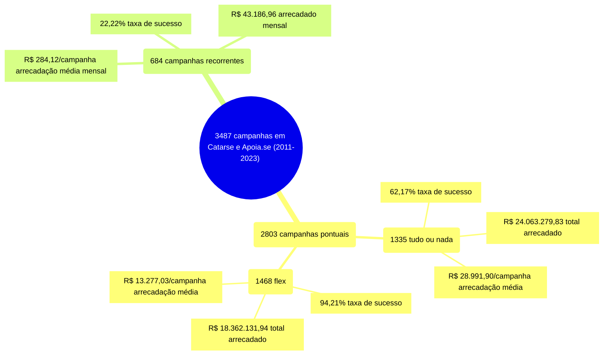

# Infográfico - Visão Geral

O infográfico a seguir indica um total de 3487 campanhas no Catarse e no Apoia.se,
entre 2011 e 2023. As campanhas pontuais totalizam 2803 campanhas, agrupadas
em 1335 tudo ou nada e 1468 flex. As campanhas recorrentes estão em 684.

