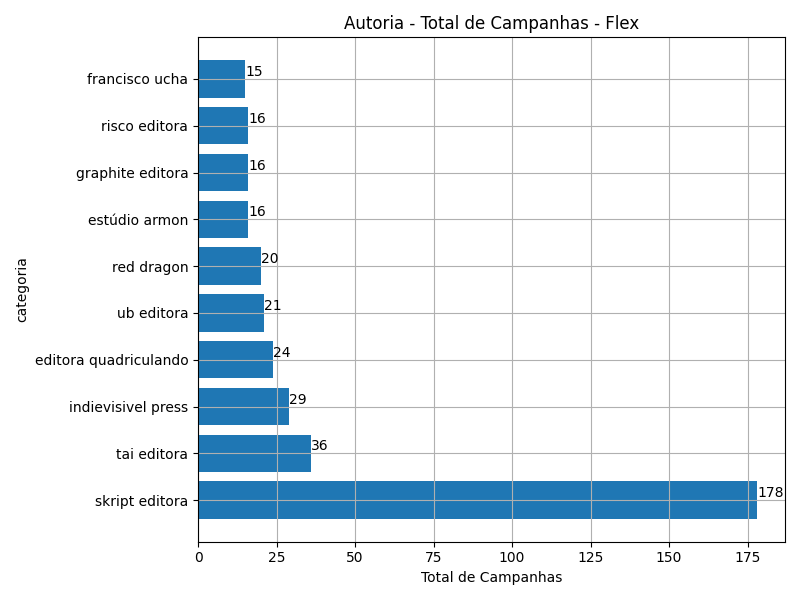

# Rankings: Autoria, Modalidade: Flex

Rankings por _total_ (quantidade de campanhas realizadas), _contribuicoes_
(total de contribuições), _taxa_sucesso_ (taxa de sucesso das campanhas),
_arrecadado_sucesso_ (valor total arrecadado com campanhas bem sucedidas),
_media_sucesso_ (valor arrecadado médio com campanhas bem sucedidas),
_apoio_medio_ (apoio médio das campanhas bem sucedidas)
e _media_contribuicoes_ (média de contribuições).

As análises serão realizadas por Modalidade e Autoria. Colunas:

- modalidade: tudo ou nada, flex ou recorrente;
- autoria_classificacao: dimensão de agrupamento;
- total: total de campanhas;
- arrecadado: valor total arrecadado pelas campanhas (bem sucedidas ou não);
- total_sucesso: total de campanhas bem sucedidas;
- arrecadado_sucesso: valor total arrecadado pelas campanhas bem sucedidas;
- taxa_sucesso: relação entre o total de campanhas bem sucedidas e o total de campanhas;
- media_sucesso: valor arrecadado médio pelas campanhas bem sucedidas;
- std_sucesso: desvio padrão médio (ref: valor arrecadado) pelas campanhas bem sucedidas;
- min_sucesso: menor valor arrecadado médio entre as campanhas bem sucedidas;
- max_sucesso: maior valor arrecadado médio entre as campanhas bem sucedidas;
- apoio_medio: apoio médio entre as campanhas bem sucedidas;
- contribuicoes: total de contribuições entre as campanhas bem sucedidas;
- media_contribuicoes: média de contribuições entre as campanhas bem sucedidas.

## Total de Campanhas

<!-- ### Modalidade: Flex -->

<!--Total de Campanhas-->
Top 10 _Autoria_, por _total_, em _Flex_.

| geral_modalidade   | autoria_nome_publico   |   total |   total_sucesso |   particip |   taxa_sucesso |   arrecadado_sucesso |   media_sucesso |   std_sucesso |   min_sucesso |   max_sucesso |   apoio_medio |   contribuicoes |   media_contribuicoes |
|:-------------------|:-----------------------|--------:|----------------:|-----------:|---------------:|---------------------:|----------------:|--------------:|--------------:|--------------:|--------------:|----------------:|----------------------:|
| flex               | skript editora         |     178 |             178 |      12,13 |         100,00 |           2.458.348,22 |        13.810,95 |      20.728,01 |        293,39 |     157.001,80 |         81,69 |           30.092 |                169,06 |
| flex               | tai editora            |      36 |              36 |       2,45 |         100,00 |            627.399,44 |        17.427,76 |      17.492,48 |       1.001,33 |      68.554,60 |         96,21 |            6.521 |                181,14 |
| flex               | indievisivel press     |      29 |              29 |       1,98 |         100,00 |            753.248,41 |        25.974,08 |      34.170,03 |       2.573,70 |     169.836,91 |         76,53 |            9.843 |                339,41 |
| flex               | editora quadriculando  |      24 |              24 |       1,63 |         100,00 |            142.660,19 |         5.944,17 |       4.758,73 |        210,35 |      16.381,03 |         65,26 |            2.186 |                 91,08 |
| flex               | ub editora             |      21 |              21 |       1,43 |         100,00 |            211.508,23 |        10.071,82 |       3.987,21 |       4.992,85 |      24.041,45 |         59,83 |            3.535 |                168,33 |
| flex               | red dragon             |      20 |              20 |       1,36 |         100,00 |            192.506,34 |         9.625,32 |      13.378,69 |        199,53 |      42.352,39 |         97,47 |            1.975 |                 98,75 |
| flex               | estúdio armon          |      16 |              16 |       1,09 |         100,00 |             56.156,42 |         3.509,78 |       1.466,56 |       1.264,75 |       6.823,54 |         62,89 |             893 |                 55,81 |
| flex               | graphite editora       |      16 |              16 |       1,09 |         100,00 |            697.265,75 |        43.579,11 |      20.217,72 |       4.900,51 |      73.946,65 |        122,65 |            5.685 |                355,31 |
| flex               | risco editora          |      16 |              16 |       1,09 |         100,00 |            268.088,71 |        16.755,54 |      14.636,58 |       1.315,59 |      46.407,93 |         84,60 |            3.169 |                198,06 |
| flex               | francisco ucha         |      15 |              15 |       1,02 |         100,00 |            135.618,94 |         9.041,26 |       7.416,97 |       1.862,01 |      28.611,48 |        100,09 |            1.355 |                 90,33 |

## Total de Contribuições

<!-- ### Modalidade: Flex -->

<!--Total de Contribuições-->
Top 10 _Autoria_, por _contribuicoes_, em _Flex_.

| geral_modalidade   | autoria_nome_publico   |   total |   total_sucesso |   particip |   taxa_sucesso |   arrecadado_sucesso |   media_sucesso |   std_sucesso |   min_sucesso |   max_sucesso |   apoio_medio |   contribuicoes |   media_contribuicoes |
|:-------------------|:-----------------------|--------:|----------------:|-----------:|---------------:|---------------------:|----------------:|--------------:|--------------:|--------------:|--------------:|----------------:|----------------------:|
| flex               | skript editora         |     178 |             178 |      12,13 |         100,00 |           2.458.348,22 |        13.810,95 |      20.728,01 |        293,39 |     157.001,80 |         81,69 |           30.092 |                169,06 |
| flex               | indievisivel press     |      29 |              29 |       1,98 |         100,00 |            753.248,41 |        25.974,08 |      34.170,03 |       2.573,70 |     169.836,91 |         76,53 |            9.843 |                339,41 |
| flex               | carlos ruas            |       5 |               5 |       0,34 |         100,00 |           1.263.897,95 |       252.779,59 |     146.954,56 |     106.425,79 |     442.290,11 |        153,57 |            8.230 |               1.646,00 |
| flex               | todavia livros         |       1 |               1 |       0,07 |         100,00 |            708.972,78 |       708.972,78 |          0,00 |     708.972,78 |     708.972,78 |         89,13 |            7.954 |               7.954,00 |
| flex               | tai editora            |      36 |              36 |       2,45 |         100,00 |            627.399,44 |        17.427,76 |      17.492,48 |       1.001,33 |      68.554,60 |         96,21 |            6.521 |                181,14 |
| flex               | graphite editora       |      16 |              16 |       1,09 |         100,00 |            697.265,75 |        43.579,11 |      20.217,72 |       4.900,51 |      73.946,65 |        122,65 |            5.685 |                355,31 |
| flex               | editora 85             |      11 |              11 |       0,75 |         100,00 |            640.993,99 |        58.272,18 |      28.422,41 |      13.480,30 |     103.442,87 |        138,18 |            4.639 |                421,73 |
| flex               | editora seguinte       |       1 |               1 |       0,07 |         100,00 |            475.290,95 |       475.290,95 |          0,00 |     475.290,95 |     475.290,95 |        103,68 |            4.584 |               4.584,00 |
| flex               | will leite             |       4 |               4 |       0,27 |         100,00 |            196.897,75 |        49.224,44 |      12.621,16 |      30.776,65 |      59.310,53 |         54,74 |            3.597 |                899,25 |
| flex               | ub editora             |      21 |              21 |       1,43 |         100,00 |            211.508,23 |        10.071,82 |       3.987,21 |       4.992,85 |      24.041,45 |         59,83 |            3.535 |                168,33 |

## Valor Total Arrecadado

<!-- ### Modalidade: Flex -->

<!--Valor Total Arrecadado-->
Top 10 _Autoria_, por _arrecadado_sucesso_, em _Flex_.

| geral_modalidade   | autoria_nome_publico   |   total |   total_sucesso |   particip |   taxa_sucesso |   arrecadado_sucesso |   media_sucesso |   std_sucesso |   min_sucesso |   max_sucesso |   apoio_medio |   contribuicoes |   media_contribuicoes |
|:-------------------|:-----------------------|--------:|----------------:|-----------:|---------------:|---------------------:|----------------:|--------------:|--------------:|--------------:|--------------:|----------------:|----------------------:|
| flex               | skript editora         |     178 |             178 |      12,13 |         100,00 |           2.458.348,22 |        13.810,95 |      20.728,01 |        293,39 |     157.001,80 |         81,69 |           30.092 |                169,06 |
| flex               | carlos ruas            |       5 |               5 |       0,34 |         100,00 |           1.263.897,95 |       252.779,59 |     146.954,56 |     106.425,79 |     442.290,11 |        153,57 |            8.230 |               1.646,00 |
| flex               | indievisivel press     |      29 |              29 |       1,98 |         100,00 |            753.248,41 |        25.974,08 |      34.170,03 |       2.573,70 |     169.836,91 |         76,53 |            9.843 |                339,41 |
| flex               | todavia livros         |       1 |               1 |       0,07 |         100,00 |            708.972,78 |       708.972,78 |          0,00 |     708.972,78 |     708.972,78 |         89,13 |            7.954 |               7.954,00 |
| flex               | graphite editora       |      16 |              16 |       1,09 |         100,00 |            697.265,75 |        43.579,11 |      20.217,72 |       4.900,51 |      73.946,65 |        122,65 |            5.685 |                355,31 |
| flex               | editora 85             |      11 |              11 |       0,75 |         100,00 |            640.993,99 |        58.272,18 |      28.422,41 |      13.480,30 |     103.442,87 |        138,18 |            4.639 |                421,73 |
| flex               | tai editora            |      36 |              36 |       2,45 |         100,00 |            627.399,44 |        17.427,76 |      17.492,48 |       1.001,33 |      68.554,60 |         96,21 |            6.521 |                181,14 |
| flex               | chiaroscuro studios    |       5 |               5 |       0,34 |         100,00 |            529.072,36 |       105.814,47 |      17.233,55 |      80.755,40 |     121.747,80 |        202,01 |            2.619 |                523,80 |
| flex               | editora saicã          |       9 |               9 |       0,61 |         100,00 |            500.749,57 |        55.638,84 |      26.225,32 |      30.099,58 |     118.699,04 |        152,11 |            3.292 |                365,78 |
| flex               | editora seguinte       |       1 |               1 |       0,07 |         100,00 |            475.290,95 |       475.290,95 |          0,00 |     475.290,95 |     475.290,95 |        103,68 |            4.584 |               4.584,00 |

## Valor Arrecadado Médio

<!-- ### Modalidade: Flex -->

<!--Valor Médio Arrecadado-->
Top 10 _Autoria_, por _media_sucesso_, em _Flex_.

| geral_modalidade   | autoria_nome_publico      |   total |   total_sucesso |   particip |   taxa_sucesso |   arrecadado_sucesso |   media_sucesso |   std_sucesso |   min_sucesso |   max_sucesso |   apoio_medio |   contribuicoes |   media_contribuicoes |
|:-------------------|:--------------------------|--------:|----------------:|-----------:|---------------:|---------------------:|----------------:|--------------:|--------------:|--------------:|--------------:|----------------:|----------------------:|
| flex               | todavia livros            |       1 |               1 |       0,07 |         100,00 |            708.972,78 |       708.972,78 |          0,00 |     708.972,78 |     708.972,78 |         89,13 |            7.954 |               7.954,00 |
| flex               | editora seguinte          |       1 |               1 |       0,07 |         100,00 |            475.290,95 |       475.290,95 |          0,00 |     475.290,95 |     475.290,95 |        103,68 |            4.584 |               4.584,00 |
| flex               | carlos ruas               |       5 |               5 |       0,34 |         100,00 |           1.263.897,95 |       252.779,59 |     146.954,56 |     106.425,79 |     442.290,11 |        153,57 |            8.230 |               1.646,00 |
| flex               | conrad editora            |       1 |               1 |       0,07 |         100,00 |            203.551,22 |       203.551,22 |          0,00 |     203.551,22 |     203.551,22 |         75,84 |            2.684 |               2.684,00 |
| flex               | harpercollins brasil      |       1 |               1 |       0,07 |         100,00 |            142.477,57 |       142.477,57 |          0,00 |     142.477,57 |     142.477,57 |         67,21 |            2.120 |               2.120,00 |
| flex               | hugo canuto               |       2 |               2 |       0,14 |         100,00 |            229.071,97 |       114.535,98 |     120.962,68 |      29.002,45 |     200.069,51 |        104,74 |            2.187 |               1.093,50 |
| flex               | chiaroscuro studios       |       5 |               5 |       0,34 |         100,00 |            529.072,36 |       105.814,47 |      17.233,55 |      80.755,40 |     121.747,80 |        202,01 |            2.619 |                523,80 |
| flex               | felipe folgosi            |       3 |               3 |       0,20 |         100,00 |            270.555,95 |        90.185,32 |      38.094,42 |      63.327,41 |     133.783,37 |        210,55 |            1.285 |                428,33 |
| flex               | editora estação liberdade |       1 |               1 |       0,07 |         100,00 |             71.067,92 |        71.067,92 |          0,00 |      71.067,92 |      71.067,92 |        145,93 |             487 |                487,00 |
| flex               | pedro mauro               |       3 |               3 |       0,20 |         100,00 |            188.559,91 |        62.853,30 |      50.087,95 |      28.195,53 |     120.281,21 |        145,72 |            1.294 |                431,33 |

## Valor Apoiado Médio

<!-- ### Modalidade: Flex -->

<!--Valor Médio Apoiado-->
Top 10 _Autoria_, por _apoio_medio_, em _Flex_.

| geral_modalidade   | autoria_nome_publico                  |   total |   total_sucesso |   particip |   taxa_sucesso |   arrecadado_sucesso |   media_sucesso |   std_sucesso |   min_sucesso |   max_sucesso |   apoio_medio |   contribuicoes |   media_contribuicoes |
|:-------------------|:--------------------------------------|--------:|----------------:|-----------:|---------------:|---------------------:|----------------:|--------------:|--------------:|--------------:|--------------:|----------------:|----------------------:|
| flex               | gabriel sá britto do nascimento       |       1 |               1 |       0,07 |         100,00 |              2.450,28 |         2.450,28 |          0,00 |       2.450,28 |       2.450,28 |        306,28 |               8 |                  8,00 |
| flex               | adriel e vinicius em mortos não falam |       1 |               1 |       0,07 |         100,00 |               254,24 |          254,24 |          0,00 |        254,24 |        254,24 |        254,24 |               1 |                  1,00 |
| flex               | fábrica faglianostra                  |       1 |               1 |       0,07 |         100,00 |             14.937,43 |        14.937,43 |          0,00 |      14.937,43 |      14.937,43 |        233,40 |              64 |                 64,00 |
| flex               | felipe folgosi                        |       3 |               3 |       0,20 |         100,00 |            270.555,95 |        90.185,32 |      38.094,42 |      63.327,41 |     133.783,37 |        210,55 |            1.285 |                428,33 |
| flex               | chiaroscuro studios                   |       5 |               5 |       0,34 |         100,00 |            529.072,36 |       105.814,47 |      17.233,55 |      80.755,40 |     121.747,80 |        202,01 |            2.619 |                523,80 |
| flex               | jr hellboy menezes                    |       1 |               1 |       0,07 |         100,00 |              1.609,78 |         1.609,78 |          0,00 |       1.609,78 |       1.609,78 |        201,22 |               8 |                  8,00 |
| flex               | gustavo ravaglio                      |       1 |               1 |       0,07 |         100,00 |              6.832,31 |         6.832,31 |          0,00 |       6.832,31 |       6.832,31 |        195,21 |              35 |                 35,00 |
| flex               | editora lorentz                       |       2 |               2 |       0,14 |         100,00 |            121.277,46 |        60.638,73 |        462,55 |      60.311,66 |      60.965,80 |        186,58 |             650 |                325,00 |
| flex               | michel d. c. galindo                  |       1 |               1 |       0,07 |         100,00 |              7.905,41 |         7.905,41 |          0,00 |       7.905,41 |       7.905,41 |        183,85 |              43 |                 43,00 |
| flex               | reginaldo carlota                     |       6 |               6 |       0,41 |         100,00 |             80.267,84 |        13.377,97 |      11.032,05 |       4.574,39 |      29.751,69 |        174,50 |             460 |                 76,67 |

## Média de Contribuições

<!-- ### Modalidade: Flex -->

<!--Média de Contribuições-->
Top 10 _Autoria_, por _media_contribuicoes_, em _Flex_.

| geral_modalidade   | autoria_nome_publico              |   total |   total_sucesso |   particip |   taxa_sucesso |   arrecadado_sucesso |   media_sucesso |   std_sucesso |   min_sucesso |   max_sucesso |   apoio_medio |   contribuicoes |   media_contribuicoes |
|:-------------------|:----------------------------------|--------:|----------------:|-----------:|---------------:|---------------------:|----------------:|--------------:|--------------:|--------------:|--------------:|----------------:|----------------------:|
| flex               | todavia livros                    |       1 |               1 |       0,07 |         100,00 |            708.972,78 |       708.972,78 |          0,00 |     708.972,78 |     708.972,78 |         89,13 |            7.954 |               7.954,00 |
| flex               | editora seguinte                  |       1 |               1 |       0,07 |         100,00 |            475.290,95 |       475.290,95 |          0,00 |     475.290,95 |     475.290,95 |        103,68 |            4.584 |               4.584,00 |
| flex               | conrad editora                    |       1 |               1 |       0,07 |         100,00 |            203.551,22 |       203.551,22 |          0,00 |     203.551,22 |     203.551,22 |         75,84 |            2.684 |               2.684,00 |
| flex               | harpercollins brasil              |       1 |               1 |       0,07 |         100,00 |            142.477,57 |       142.477,57 |          0,00 |     142.477,57 |     142.477,57 |         67,21 |            2.120 |               2.120,00 |
| flex               | carlos ruas                       |       5 |               5 |       0,34 |         100,00 |           1.263.897,95 |       252.779,59 |     146.954,56 |     106.425,79 |     442.290,11 |        153,57 |            8.230 |               1.646,00 |
| flex               | hugo canuto                       |       2 |               2 |       0,14 |         100,00 |            229.071,97 |       114.535,98 |     120.962,68 |      29.002,45 |     200.069,51 |        104,74 |            2.187 |               1.093,50 |
| flex               | rafael fritzen                    |       1 |               1 |       0,07 |         100,00 |             28.914,07 |        28.914,07 |          0,00 |      28.914,07 |      28.914,07 |         28,80 |            1.004 |               1.004,00 |
| flex               | will leite                        |       4 |               4 |       0,27 |         100,00 |            196.897,75 |        49.224,44 |      12.621,16 |      30.776,65 |      59.310,53 |         54,74 |            3.597 |                899,25 |
| flex               | grupo lendari / grupo estante     |       1 |               1 |       0,07 |         100,00 |             25.301,29 |        25.301,29 |          0,00 |      25.301,29 |      25.301,29 |         45,92 |             551 |                551,00 |
| flex               | diversidade nerd | chris gonzatti |       1 |               1 |       0,07 |         100,00 |             50.461,78 |        50.461,78 |          0,00 |      50.461,78 |      50.461,78 |         91,75 |             550 |                550,00 |

