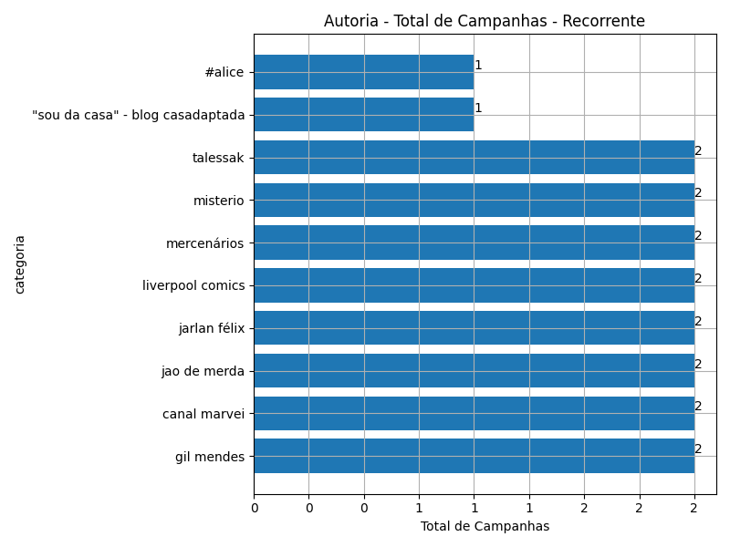
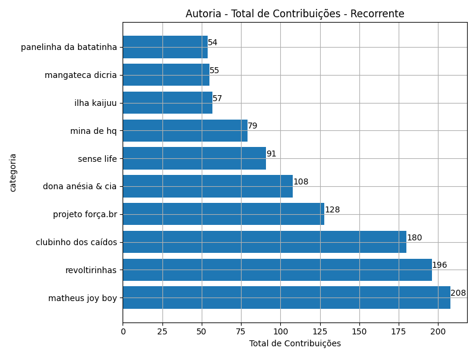
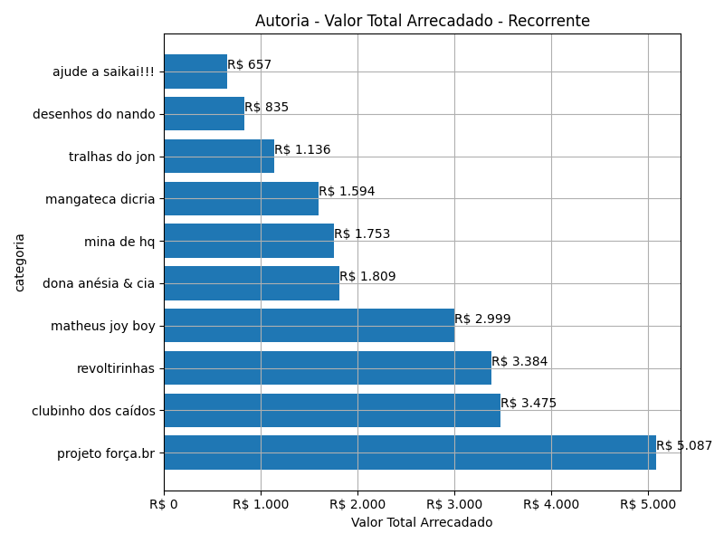
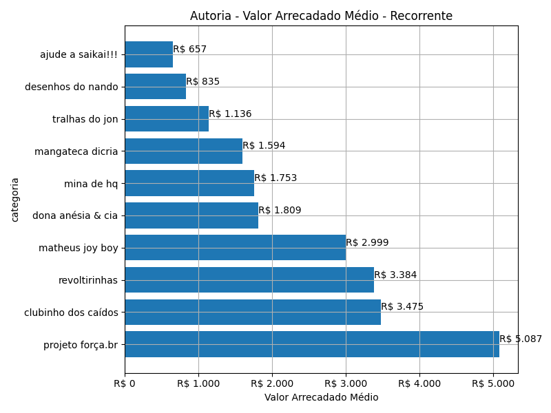
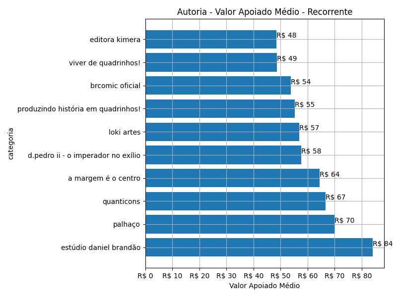
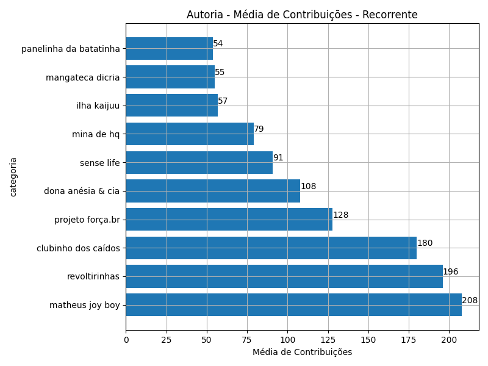

# Rankings: Autoria, Modalidade: Recorrente

Rankings por _total_ (quantidade de campanhas realizadas), _contribuicoes_
(total de contribuições), _taxa_sucesso_ (taxa de sucesso das campanhas),
_arrecadado_sucesso_ (valor total arrecadado com campanhas bem sucedidas),
_media_sucesso_ (valor arrecadado médio com campanhas bem sucedidas),
_apoio_medio_ (apoio médio das campanhas bem sucedidas)
e _media_contribuicoes_ (média de contribuições).

As análises serão realizadas por Modalidade e Autoria. Colunas:

- modalidade: tudo ou nada, flex ou recorrente;
- autoria_classificacao: dimensão de agrupamento;
- total: total de campanhas;
- arrecadado: valor total arrecadado pelas campanhas (bem sucedidas ou não);
- total_sucesso: total de campanhas bem sucedidas;
- arrecadado_sucesso: valor total arrecadado pelas campanhas bem sucedidas;
- taxa_sucesso: relação entre o total de campanhas bem sucedidas e o total de campanhas;
- media_sucesso: valor arrecadado médio pelas campanhas bem sucedidas;
- std_sucesso: desvio padrão médio (ref: valor arrecadado) pelas campanhas bem sucedidas;
- min_sucesso: menor valor arrecadado médio entre as campanhas bem sucedidas;
- max_sucesso: maior valor arrecadado médio entre as campanhas bem sucedidas;
- apoio_medio: apoio médio entre as campanhas bem sucedidas;
- contribuicoes: total de contribuições entre as campanhas bem sucedidas;
- media_contribuicoes: média de contribuições entre as campanhas bem sucedidas.

## Total de Campanhas

<!-- ### Modalidade: Recorrente -->

<!--Total de Campanhas-->
> [!WARNING] 
> Nesta modalidade de financiamento, os cálculos representam
> uma fotografia das campanhas em dezembro/2023.

Top 10 _Autoria_, por _total_, em _Recorrente_.

| geral_modalidade   | autoria_nome_publico             |   total |   total_sucesso |   particip |   taxa_sucesso |   arrecadado_sucesso |   media_sucesso |   std_sucesso |   min_sucesso |   max_sucesso |   apoio_medio |   contribuicoes |   media_contribuicoes |
|:-------------------|:---------------------------------|--------:|----------------:|-----------:|---------------:|---------------------:|----------------:|--------------:|--------------:|--------------:|--------------:|----------------:|----------------------:|
| sub                | gil mendes                       |       2 |               1 |       0,29 |          50,00 |               152,75 |          152,75 |          0,00 |        152,75 |        152,75 |         19,09 |               8 |                  8,00 |
| sub                | canal marvei                     |       2 |               0 |       0,29 |           0,00 |                 0,00 |            0,00 |          0,00 |          0,00 |          0,00 |          0,00 |               0 |                  0,00 |
| sub                | jao de merda                     |       2 |               0 |       0,29 |           0,00 |                 0,00 |            0,00 |          0,00 |          0,00 |          0,00 |          0,00 |               0 |                  0,00 |
| sub                | jarlan félix                     |       2 |               0 |       0,29 |           0,00 |                 0,00 |            0,00 |          0,00 |          0,00 |          0,00 |          0,00 |               0 |                  0,00 |
| sub                | liverpool comics                 |       2 |               0 |       0,29 |           0,00 |                 0,00 |            0,00 |          0,00 |          0,00 |          0,00 |          0,00 |               0 |                  0,00 |
| sub                | mercenários                      |       2 |               0 |       0,29 |           0,00 |                 0,00 |            0,00 |          0,00 |          0,00 |          0,00 |          0,00 |               0 |                  0,00 |
| sub                | misterio                         |       2 |               0 |       0,29 |           0,00 |                 0,00 |            0,00 |          0,00 |          0,00 |          0,00 |          0,00 |               0 |                  0,00 |
| sub                | talessak                         |       2 |               0 |       0,29 |           0,00 |                 0,00 |            0,00 |          0,00 |          0,00 |          0,00 |          0,00 |               0 |                  0,00 |
| sub                | "sou da casa" - blog casadaptada |       1 |               1 |       0,15 |         100,00 |                77,77 |           77,77 |          0,00 |         77,77 |         77,77 |         38,89 |               2 |                  2,00 |
| sub                | #alice                           |       1 |               1 |       0,15 |         100,00 |                46,93 |           46,93 |          0,00 |         46,93 |         46,93 |          9,39 |               5 |                  5,00 |

## Total de Contribuições

<!-- ### Modalidade: Recorrente -->

<!--Total de Contribuições-->
> [!WARNING] 
> Nesta modalidade de financiamento, os cálculos representam
> uma fotografia das campanhas em dezembro/2023.

Top 10 _Autoria_, por _contribuicoes_, em _Recorrente_.

| geral_modalidade   | autoria_nome_publico   |   total |   total_sucesso |   particip |   taxa_sucesso |   arrecadado_sucesso |   media_sucesso |   std_sucesso |   min_sucesso |   max_sucesso |   apoio_medio |   contribuicoes |   media_contribuicoes |
|:-------------------|:-----------------------|--------:|----------------:|-----------:|---------------:|---------------------:|----------------:|--------------:|--------------:|--------------:|--------------:|----------------:|----------------------:|
| sub                | matheus joy boy        |       1 |               1 |       0,15 |         100,00 |              2.998,54 |         2.998,54 |          0,00 |       2.998,54 |       2.998,54 |         14,42 |             208 |                208,00 |
| sub                | revoltirinhas          |       1 |               1 |       0,15 |         100,00 |              3.384,29 |         3.384,29 |          0,00 |       3.384,29 |       3.384,29 |         17,27 |             196 |                196,00 |
| sub                | clubinho dos caídos    |       1 |               1 |       0,15 |         100,00 |              3.475,05 |         3.475,05 |          0,00 |       3.475,05 |       3.475,05 |         19,31 |             180 |                180,00 |
| sub                | projeto força.br       |       1 |               1 |       0,15 |         100,00 |              5.087,08 |         5.087,08 |          0,00 |       5.087,08 |       5.087,08 |         39,74 |             128 |                128,00 |
| sub                | dona anésia & cia      |       1 |               1 |       0,15 |         100,00 |              1.809,10 |         1.809,10 |          0,00 |       1.809,10 |       1.809,10 |         16,75 |             108 |                108,00 |
| sub                | sense life             |       1 |               1 |       0,15 |         100,00 |               606,04 |          606,04 |          0,00 |        606,04 |        606,04 |          6,66 |              91 |                 91,00 |
| sub                | mina de hq             |       1 |               1 |       0,15 |         100,00 |              1.753,37 |         1.753,37 |          0,00 |       1.753,37 |       1.753,37 |         22,19 |              79 |                 79,00 |
| sub                | ilha kaijuu            |       1 |               1 |       0,15 |         100,00 |               613,03 |          613,03 |          0,00 |        613,03 |        613,03 |         10,75 |              57 |                 57,00 |
| sub                | mangateca dicria       |       1 |               1 |       0,15 |         100,00 |              1.594,03 |         1.594,03 |          0,00 |       1.594,03 |       1.594,03 |         28,98 |              55 |                 55,00 |
| sub                | panelinha da batatinha |       1 |               1 |       0,15 |         100,00 |               651,16 |          651,16 |          0,00 |        651,16 |        651,16 |         12,06 |              54 |                 54,00 |

## Valor Total Arrecadado

<!-- ### Modalidade: Recorrente -->

<!--Valor Total Arrecadado-->
> [!WARNING] 
> Nesta modalidade de financiamento, os cálculos representam
> uma fotografia das campanhas em dezembro/2023.

Top 10 _Autoria_, por _arrecadado_sucesso_, em _Recorrente_.

| geral_modalidade   | autoria_nome_publico   |   total |   total_sucesso |   particip |   taxa_sucesso |   arrecadado_sucesso |   media_sucesso |   std_sucesso |   min_sucesso |   max_sucesso |   apoio_medio |   contribuicoes |   media_contribuicoes |
|:-------------------|:-----------------------|--------:|----------------:|-----------:|---------------:|---------------------:|----------------:|--------------:|--------------:|--------------:|--------------:|----------------:|----------------------:|
| sub                | projeto força.br       |       1 |               1 |       0,15 |         100,00 |              5.087,08 |         5.087,08 |          0,00 |       5.087,08 |       5.087,08 |         39,74 |             128 |                128,00 |
| sub                | clubinho dos caídos    |       1 |               1 |       0,15 |         100,00 |              3.475,05 |         3.475,05 |          0,00 |       3.475,05 |       3.475,05 |         19,31 |             180 |                180,00 |
| sub                | revoltirinhas          |       1 |               1 |       0,15 |         100,00 |              3.384,29 |         3.384,29 |          0,00 |       3.384,29 |       3.384,29 |         17,27 |             196 |                196,00 |
| sub                | matheus joy boy        |       1 |               1 |       0,15 |         100,00 |              2.998,54 |         2.998,54 |          0,00 |       2.998,54 |       2.998,54 |         14,42 |             208 |                208,00 |
| sub                | dona anésia & cia      |       1 |               1 |       0,15 |         100,00 |              1.809,10 |         1.809,10 |          0,00 |       1.809,10 |       1.809,10 |         16,75 |             108 |                108,00 |
| sub                | mina de hq             |       1 |               1 |       0,15 |         100,00 |              1.753,37 |         1.753,37 |          0,00 |       1.753,37 |       1.753,37 |         22,19 |              79 |                 79,00 |
| sub                | mangateca dicria       |       1 |               1 |       0,15 |         100,00 |              1.594,03 |         1.594,03 |          0,00 |       1.594,03 |       1.594,03 |         28,98 |              55 |                 55,00 |
| sub                | tralhas do jon         |       1 |               1 |       0,15 |         100,00 |              1.135,98 |         1.135,98 |          0,00 |       1.135,98 |       1.135,98 |         39,17 |              29 |                 29,00 |
| sub                | desenhos do nando      |       1 |               1 |       0,15 |         100,00 |               834,85 |          834,85 |          0,00 |        834,85 |        834,85 |         18,15 |              46 |                 46,00 |
| sub                | ajude a saikai!!!      |       1 |               1 |       0,15 |         100,00 |               657,08 |          657,08 |          0,00 |        657,08 |        657,08 |         31,29 |              21 |                 21,00 |

## Valor Arrecadado Médio

<!-- ### Modalidade: Recorrente -->

<!--Valor Médio Arrecadado-->
> [!WARNING] 
> Nesta modalidade de financiamento, os cálculos representam
> uma fotografia das campanhas em dezembro/2023.

Top 10 _Autoria_, por _media_sucesso_, em _Recorrente_.

| geral_modalidade   | autoria_nome_publico   |   total |   total_sucesso |   particip |   taxa_sucesso |   arrecadado_sucesso |   media_sucesso |   std_sucesso |   min_sucesso |   max_sucesso |   apoio_medio |   contribuicoes |   media_contribuicoes |
|:-------------------|:-----------------------|--------:|----------------:|-----------:|---------------:|---------------------:|----------------:|--------------:|--------------:|--------------:|--------------:|----------------:|----------------------:|
| sub                | projeto força.br       |       1 |               1 |       0,15 |         100,00 |              5.087,08 |         5.087,08 |          0,00 |       5.087,08 |       5.087,08 |         39,74 |             128 |                128,00 |
| sub                | clubinho dos caídos    |       1 |               1 |       0,15 |         100,00 |              3.475,05 |         3.475,05 |          0,00 |       3.475,05 |       3.475,05 |         19,31 |             180 |                180,00 |
| sub                | revoltirinhas          |       1 |               1 |       0,15 |         100,00 |              3.384,29 |         3.384,29 |          0,00 |       3.384,29 |       3.384,29 |         17,27 |             196 |                196,00 |
| sub                | matheus joy boy        |       1 |               1 |       0,15 |         100,00 |              2.998,54 |         2.998,54 |          0,00 |       2.998,54 |       2.998,54 |         14,42 |             208 |                208,00 |
| sub                | dona anésia & cia      |       1 |               1 |       0,15 |         100,00 |              1.809,10 |         1.809,10 |          0,00 |       1.809,10 |       1.809,10 |         16,75 |             108 |                108,00 |
| sub                | mina de hq             |       1 |               1 |       0,15 |         100,00 |              1.753,37 |         1.753,37 |          0,00 |       1.753,37 |       1.753,37 |         22,19 |              79 |                 79,00 |
| sub                | mangateca dicria       |       1 |               1 |       0,15 |         100,00 |              1.594,03 |         1.594,03 |          0,00 |       1.594,03 |       1.594,03 |         28,98 |              55 |                 55,00 |
| sub                | tralhas do jon         |       1 |               1 |       0,15 |         100,00 |              1.135,98 |         1.135,98 |          0,00 |       1.135,98 |       1.135,98 |         39,17 |              29 |                 29,00 |
| sub                | desenhos do nando      |       1 |               1 |       0,15 |         100,00 |               834,85 |          834,85 |          0,00 |        834,85 |        834,85 |         18,15 |              46 |                 46,00 |
| sub                | ajude a saikai!!!      |       1 |               1 |       0,15 |         100,00 |               657,08 |          657,08 |          0,00 |        657,08 |        657,08 |         31,29 |              21 |                 21,00 |

## Valor Apoiado Médio

<!-- ### Modalidade: Recorrente -->

<!--Valor Médio Apoiado-->
> [!WARNING] 
> Nesta modalidade de financiamento, os cálculos representam
> uma fotografia das campanhas em dezembro/2023.

Top 10 _Autoria_, por _apoio_medio_, em _Recorrente_.

| geral_modalidade   | autoria_nome_publico               |   total |   total_sucesso |   particip |   taxa_sucesso |   arrecadado_sucesso |   media_sucesso |   std_sucesso |   min_sucesso |   max_sucesso |   apoio_medio |   contribuicoes |   media_contribuicoes |
|:-------------------|:-----------------------------------|--------:|----------------:|-----------:|---------------:|---------------------:|----------------:|--------------:|--------------:|--------------:|--------------:|----------------:|----------------------:|
| sub                | estúdio daniel brandão             |       1 |               1 |       0,15 |         100,00 |               252,23 |          252,23 |          0,00 |        252,23 |        252,23 |         84,08 |               3 |                  3,00 |
| sub                | palhaço                            |       1 |               1 |       0,15 |         100,00 |                70,02 |           70,02 |          0,00 |         70,02 |         70,02 |         70,02 |               1 |                  1,00 |
| sub                | quanticons                         |       1 |               1 |       0,15 |         100,00 |                66,60 |           66,60 |          0,00 |         66,60 |         66,60 |         66,60 |               1 |                  1,00 |
| sub                | a margem é o centro                |       1 |               1 |       0,15 |         100,00 |               386,05 |          386,05 |          0,00 |        386,05 |        386,05 |         64,34 |               6 |                  6,00 |
| sub                | d.pedro ii - o imperador no exílio |       1 |               1 |       0,15 |         100,00 |               115,32 |          115,32 |          0,00 |        115,32 |        115,32 |         57,66 |               2 |                  2,00 |
| sub                | loki artes                         |       1 |               1 |       0,15 |         100,00 |                56,98 |           56,98 |          0,00 |         56,98 |         56,98 |         56,98 |               1 |                  1,00 |
| sub                | produzindo história em quadrinhos! |       1 |               1 |       0,15 |         100,00 |               110,59 |          110,59 |          0,00 |        110,59 |        110,59 |         55,30 |               2 |                  2,00 |
| sub                | brcomic oficial                    |       1 |               1 |       0,15 |         100,00 |                53,86 |           53,86 |          0,00 |         53,86 |         53,86 |         53,86 |               1 |                  1,00 |
| sub                | viver de quadrinhos!               |       1 |               1 |       0,15 |         100,00 |               146,19 |          146,19 |          0,00 |        146,19 |        146,19 |         48,73 |               3 |                  3,00 |
| sub                | editora kimera                     |       1 |               1 |       0,15 |         100,00 |               483,84 |          483,84 |          0,00 |        483,84 |        483,84 |         48,38 |              10 |                 10,00 |

## Média de Contribuições

<!-- ### Modalidade: Recorrente -->

<!--Média de Contribuições-->
> [!WARNING] 
> Nesta modalidade de financiamento, os cálculos representam
> uma fotografia das campanhas em dezembro/2023.

Top 10 _Autoria_, por _media_contribuicoes_, em _Recorrente_.

| geral_modalidade   | autoria_nome_publico   |   total |   total_sucesso |   particip |   taxa_sucesso |   arrecadado_sucesso |   media_sucesso |   std_sucesso |   min_sucesso |   max_sucesso |   apoio_medio |   contribuicoes |   media_contribuicoes |
|:-------------------|:-----------------------|--------:|----------------:|-----------:|---------------:|---------------------:|----------------:|--------------:|--------------:|--------------:|--------------:|----------------:|----------------------:|
| sub                | matheus joy boy        |       1 |               1 |       0,15 |         100,00 |              2.998,54 |         2.998,54 |          0,00 |       2.998,54 |       2.998,54 |         14,42 |             208 |                208,00 |
| sub                | revoltirinhas          |       1 |               1 |       0,15 |         100,00 |              3.384,29 |         3.384,29 |          0,00 |       3.384,29 |       3.384,29 |         17,27 |             196 |                196,00 |
| sub                | clubinho dos caídos    |       1 |               1 |       0,15 |         100,00 |              3.475,05 |         3.475,05 |          0,00 |       3.475,05 |       3.475,05 |         19,31 |             180 |                180,00 |
| sub                | projeto força.br       |       1 |               1 |       0,15 |         100,00 |              5.087,08 |         5.087,08 |          0,00 |       5.087,08 |       5.087,08 |         39,74 |             128 |                128,00 |
| sub                | dona anésia & cia      |       1 |               1 |       0,15 |         100,00 |              1.809,10 |         1.809,10 |          0,00 |       1.809,10 |       1.809,10 |         16,75 |             108 |                108,00 |
| sub                | sense life             |       1 |               1 |       0,15 |         100,00 |               606,04 |          606,04 |          0,00 |        606,04 |        606,04 |          6,66 |              91 |                 91,00 |
| sub                | mina de hq             |       1 |               1 |       0,15 |         100,00 |              1.753,37 |         1.753,37 |          0,00 |       1.753,37 |       1.753,37 |         22,19 |              79 |                 79,00 |
| sub                | ilha kaijuu            |       1 |               1 |       0,15 |         100,00 |               613,03 |          613,03 |          0,00 |        613,03 |        613,03 |         10,75 |              57 |                 57,00 |
| sub                | mangateca dicria       |       1 |               1 |       0,15 |         100,00 |              1.594,03 |         1.594,03 |          0,00 |       1.594,03 |       1.594,03 |         28,98 |              55 |                 55,00 |
| sub                | panelinha da batatinha |       1 |               1 |       0,15 |         100,00 |               651,16 |          651,16 |          0,00 |        651,16 |        651,16 |         12,06 |              54 |                 54,00 |

