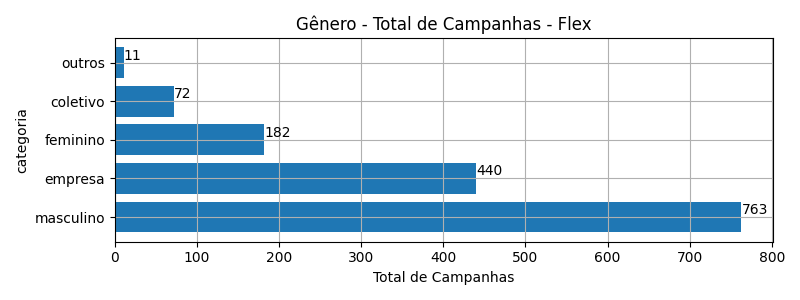
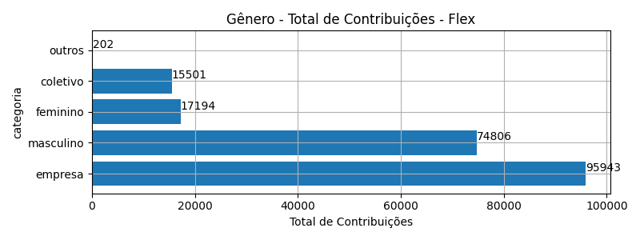
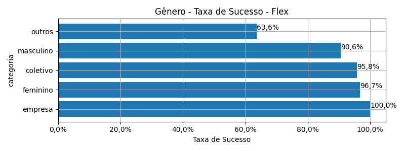
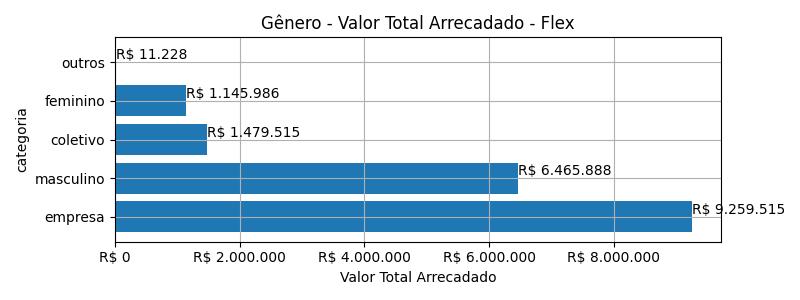
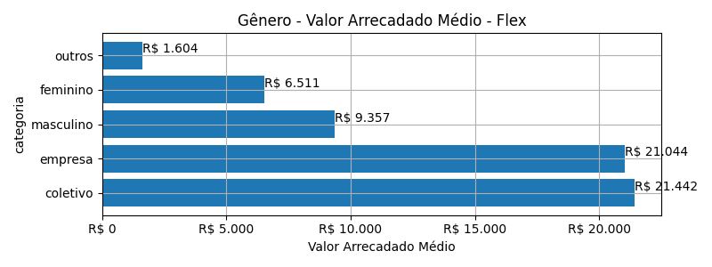
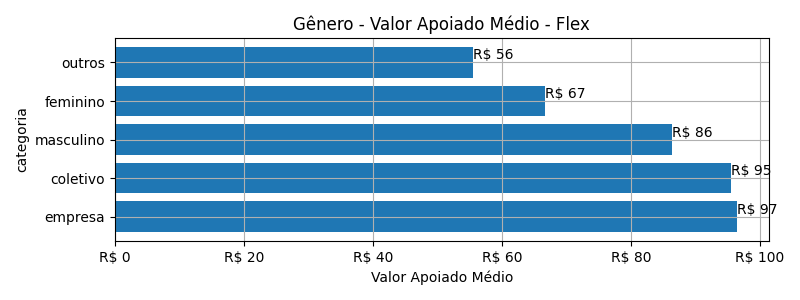
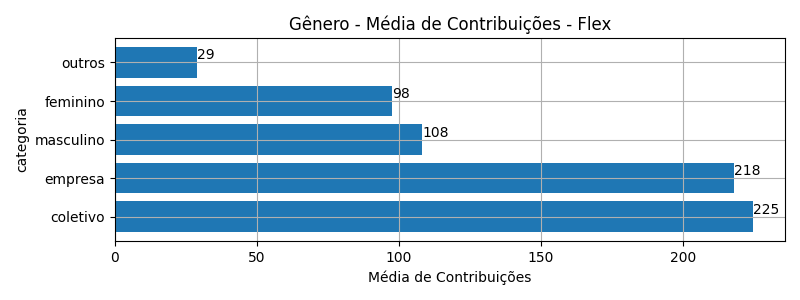

# Rankings: Gênero, Modalidade: Flex

Rankings por _total_ (quantidade de campanhas realizadas), _contribuicoes_
(total de contribuições), _taxa_sucesso_ (taxa de sucesso das campanhas),
_arrecadado_sucesso_ (valor total arrecadado com campanhas bem sucedidas),
_media_sucesso_ (valor arrecadado médio com campanhas bem sucedidas),
_apoio_medio_ (apoio médio das campanhas bem sucedidas)
e _media_contribuicoes_ (média de contribuições).

As análises serão realizadas por Modalidade e Gênero. Colunas:

- modalidade: tudo ou nada, flex ou recorrente;
- autoria_classificacao: dimensão de agrupamento;
- total: total de campanhas;
- arrecadado: valor total arrecadado pelas campanhas (bem sucedidas ou não);
- total_sucesso: total de campanhas bem sucedidas;
- arrecadado_sucesso: valor total arrecadado pelas campanhas bem sucedidas;
- taxa_sucesso: relação entre o total de campanhas bem sucedidas e o total de campanhas;
- media_sucesso: valor arrecadado médio pelas campanhas bem sucedidas;
- std_sucesso: desvio padrão médio (ref: valor arrecadado) pelas campanhas bem sucedidas;
- min_sucesso: menor valor arrecadado médio entre as campanhas bem sucedidas;
- max_sucesso: maior valor arrecadado médio entre as campanhas bem sucedidas;
- apoio_medio: apoio médio entre as campanhas bem sucedidas;
- contribuicoes: total de contribuições entre as campanhas bem sucedidas;
- media_contribuicoes: média de contribuições entre as campanhas bem sucedidas.

## Total de Campanhas

<!-- ### Modalidade: Flex -->

<!--Total de Campanhas-->
Top 5 _Gênero_, por _total_, em _Flex_.

| geral_modalidade   | autoria_classificacao   |   total |   total_sucesso |   particip |   taxa_sucesso |   arrecadado_sucesso |   media_sucesso |   std_sucesso |   min_sucesso |   max_sucesso |   apoio_medio |   contribuicoes |   media_contribuicoes |
|:-------------------|:------------------------|--------:|----------------:|-----------:|---------------:|---------------------:|----------------:|--------------:|--------------:|--------------:|--------------:|----------------:|----------------------:|
| flex               | masculino               |     763 |             691 |      51,98 |          90,56 |           6.465.887,70 |         9.357,29 |      27.421,05 |         10,77 |     442.290,11 |         86,44 |           74.806 |                108,26 |
| flex               | empresa                 |     440 |             440 |      29,97 |         100,00 |           9.259.515,00 |        21.044,35 |      46.143,04 |         34,74 |     708.972,78 |         96,51 |           95.943 |                218,05 |
| flex               | feminino                |     182 |             176 |      12,40 |          96,70 |           1.145.985,99 |         6.511,28 |       6.521,40 |         35,53 |      29.736,69 |         66,65 |           17.194 |                 97,69 |
| flex               | coletivo                |      72 |              69 |       4,90 |          95,83 |           1.479.515,33 |        21.442,25 |      34.235,40 |         29,81 |     169.836,91 |         95,45 |           15.501 |                224,65 |
| flex               | outros                  |      11 |               7 |       0,75 |          63,64 |             11.227,92 |         1.603,99 |       2.112,50 |         42,36 |       5.515,84 |         55,58 |             202 |                 28,86 |

## Total de Contribuições

<!-- ### Modalidade: Flex -->

<!--Total de Contribuições-->
Top 5 _Gênero_, por _contribuicoes_, em _Flex_.

| geral_modalidade   | autoria_classificacao   |   total |   total_sucesso |   particip |   taxa_sucesso |   arrecadado_sucesso |   media_sucesso |   std_sucesso |   min_sucesso |   max_sucesso |   apoio_medio |   contribuicoes |   media_contribuicoes |
|:-------------------|:------------------------|--------:|----------------:|-----------:|---------------:|---------------------:|----------------:|--------------:|--------------:|--------------:|--------------:|----------------:|----------------------:|
| flex               | empresa                 |     440 |             440 |      29,97 |         100,00 |           9.259.515,00 |        21.044,35 |      46.143,04 |         34,74 |     708.972,78 |         96,51 |           95.943 |                218,05 |
| flex               | masculino               |     763 |             691 |      51,98 |          90,56 |           6.465.887,70 |         9.357,29 |      27.421,05 |         10,77 |     442.290,11 |         86,44 |           74.806 |                108,26 |
| flex               | feminino                |     182 |             176 |      12,40 |          96,70 |           1.145.985,99 |         6.511,28 |       6.521,40 |         35,53 |      29.736,69 |         66,65 |           17.194 |                 97,69 |
| flex               | coletivo                |      72 |              69 |       4,90 |          95,83 |           1.479.515,33 |        21.442,25 |      34.235,40 |         29,81 |     169.836,91 |         95,45 |           15.501 |                224,65 |
| flex               | outros                  |      11 |               7 |       0,75 |          63,64 |             11.227,92 |         1.603,99 |       2.112,50 |         42,36 |       5.515,84 |         55,58 |             202 |                 28,86 |

## Taxa de Sucesso

<!-- ### Modalidade: Flex -->

<!--Taxa de Sucesso-->
Top 5 _Gênero_, por _taxa_sucesso_, em _Flex_.

| geral_modalidade   | autoria_classificacao   |   total |   total_sucesso |   particip |   taxa_sucesso |   arrecadado_sucesso |   media_sucesso |   std_sucesso |   min_sucesso |   max_sucesso |   apoio_medio |   contribuicoes |   media_contribuicoes |
|:-------------------|:------------------------|--------:|----------------:|-----------:|---------------:|---------------------:|----------------:|--------------:|--------------:|--------------:|--------------:|----------------:|----------------------:|
| flex               | empresa                 |     440 |             440 |      29,97 |         100,00 |           9.259.515,00 |        21.044,35 |      46.143,04 |         34,74 |     708.972,78 |         96,51 |           95.943 |                218,05 |
| flex               | feminino                |     182 |             176 |      12,40 |          96,70 |           1.145.985,99 |         6.511,28 |       6.521,40 |         35,53 |      29.736,69 |         66,65 |           17.194 |                 97,69 |
| flex               | coletivo                |      72 |              69 |       4,90 |          95,83 |           1.479.515,33 |        21.442,25 |      34.235,40 |         29,81 |     169.836,91 |         95,45 |           15.501 |                224,65 |
| flex               | masculino               |     763 |             691 |      51,98 |          90,56 |           6.465.887,70 |         9.357,29 |      27.421,05 |         10,77 |     442.290,11 |         86,44 |           74.806 |                108,26 |
| flex               | outros                  |      11 |               7 |       0,75 |          63,64 |             11.227,92 |         1.603,99 |       2.112,50 |         42,36 |       5.515,84 |         55,58 |             202 |                 28,86 |

## Valor Total Arrecadado

<!-- ### Modalidade: Flex -->

<!--Valor Total Arrecadado-->
Top 5 _Gênero_, por _arrecadado_sucesso_, em _Flex_.

| geral_modalidade   | autoria_classificacao   |   total |   total_sucesso |   particip |   taxa_sucesso |   arrecadado_sucesso |   media_sucesso |   std_sucesso |   min_sucesso |   max_sucesso |   apoio_medio |   contribuicoes |   media_contribuicoes |
|:-------------------|:------------------------|--------:|----------------:|-----------:|---------------:|---------------------:|----------------:|--------------:|--------------:|--------------:|--------------:|----------------:|----------------------:|
| flex               | empresa                 |     440 |             440 |      29,97 |         100,00 |           9.259.515,00 |        21.044,35 |      46.143,04 |         34,74 |     708.972,78 |         96,51 |           95.943 |                218,05 |
| flex               | masculino               |     763 |             691 |      51,98 |          90,56 |           6.465.887,70 |         9.357,29 |      27.421,05 |         10,77 |     442.290,11 |         86,44 |           74.806 |                108,26 |
| flex               | coletivo                |      72 |              69 |       4,90 |          95,83 |           1.479.515,33 |        21.442,25 |      34.235,40 |         29,81 |     169.836,91 |         95,45 |           15.501 |                224,65 |
| flex               | feminino                |     182 |             176 |      12,40 |          96,70 |           1.145.985,99 |         6.511,28 |       6.521,40 |         35,53 |      29.736,69 |         66,65 |           17.194 |                 97,69 |
| flex               | outros                  |      11 |               7 |       0,75 |          63,64 |             11.227,92 |         1.603,99 |       2.112,50 |         42,36 |       5.515,84 |         55,58 |             202 |                 28,86 |

## Valor Arrecadado Médio

<!-- ### Modalidade: Flex -->

<!--Valor Médio Arrecadado-->
Top 5 _Gênero_, por _media_sucesso_, em _Flex_.

| geral_modalidade   | autoria_classificacao   |   total |   total_sucesso |   particip |   taxa_sucesso |   arrecadado_sucesso |   media_sucesso |   std_sucesso |   min_sucesso |   max_sucesso |   apoio_medio |   contribuicoes |   media_contribuicoes |
|:-------------------|:------------------------|--------:|----------------:|-----------:|---------------:|---------------------:|----------------:|--------------:|--------------:|--------------:|--------------:|----------------:|----------------------:|
| flex               | coletivo                |      72 |              69 |       4,90 |          95,83 |           1.479.515,33 |        21.442,25 |      34.235,40 |         29,81 |     169.836,91 |         95,45 |           15.501 |                224,65 |
| flex               | empresa                 |     440 |             440 |      29,97 |         100,00 |           9.259.515,00 |        21.044,35 |      46.143,04 |         34,74 |     708.972,78 |         96,51 |           95.943 |                218,05 |
| flex               | masculino               |     763 |             691 |      51,98 |          90,56 |           6.465.887,70 |         9.357,29 |      27.421,05 |         10,77 |     442.290,11 |         86,44 |           74.806 |                108,26 |
| flex               | feminino                |     182 |             176 |      12,40 |          96,70 |           1.145.985,99 |         6.511,28 |       6.521,40 |         35,53 |      29.736,69 |         66,65 |           17.194 |                 97,69 |
| flex               | outros                  |      11 |               7 |       0,75 |          63,64 |             11.227,92 |         1.603,99 |       2.112,50 |         42,36 |       5.515,84 |         55,58 |             202 |                 28,86 |

## Valor Apoiado Médio

<!-- ### Modalidade: Flex -->

<!--Valor Médio Apoiado-->
Top 5 _Gênero_, por _apoio_medio_, em _Flex_.

| geral_modalidade   | autoria_classificacao   |   total |   total_sucesso |   particip |   taxa_sucesso |   arrecadado_sucesso |   media_sucesso |   std_sucesso |   min_sucesso |   max_sucesso |   apoio_medio |   contribuicoes |   media_contribuicoes |
|:-------------------|:------------------------|--------:|----------------:|-----------:|---------------:|---------------------:|----------------:|--------------:|--------------:|--------------:|--------------:|----------------:|----------------------:|
| flex               | empresa                 |     440 |             440 |      29,97 |         100,00 |           9.259.515,00 |        21.044,35 |      46.143,04 |         34,74 |     708.972,78 |         96,51 |           95.943 |                218,05 |
| flex               | coletivo                |      72 |              69 |       4,90 |          95,83 |           1.479.515,33 |        21.442,25 |      34.235,40 |         29,81 |     169.836,91 |         95,45 |           15.501 |                224,65 |
| flex               | masculino               |     763 |             691 |      51,98 |          90,56 |           6.465.887,70 |         9.357,29 |      27.421,05 |         10,77 |     442.290,11 |         86,44 |           74.806 |                108,26 |
| flex               | feminino                |     182 |             176 |      12,40 |          96,70 |           1.145.985,99 |         6.511,28 |       6.521,40 |         35,53 |      29.736,69 |         66,65 |           17.194 |                 97,69 |
| flex               | outros                  |      11 |               7 |       0,75 |          63,64 |             11.227,92 |         1.603,99 |       2.112,50 |         42,36 |       5.515,84 |         55,58 |             202 |                 28,86 |

## Média de Contribuições

<!-- ### Modalidade: Flex -->

<!--Média de Contribuições-->
Top 5 _Gênero_, por _media_contribuicoes_, em _Flex_.

| geral_modalidade   | autoria_classificacao   |   total |   total_sucesso |   particip |   taxa_sucesso |   arrecadado_sucesso |   media_sucesso |   std_sucesso |   min_sucesso |   max_sucesso |   apoio_medio |   contribuicoes |   media_contribuicoes |
|:-------------------|:------------------------|--------:|----------------:|-----------:|---------------:|---------------------:|----------------:|--------------:|--------------:|--------------:|--------------:|----------------:|----------------------:|
| flex               | coletivo                |      72 |              69 |       4,90 |          95,83 |           1.479.515,33 |        21.442,25 |      34.235,40 |         29,81 |     169.836,91 |         95,45 |           15.501 |                224,65 |
| flex               | empresa                 |     440 |             440 |      29,97 |         100,00 |           9.259.515,00 |        21.044,35 |      46.143,04 |         34,74 |     708.972,78 |         96,51 |           95.943 |                218,05 |
| flex               | masculino               |     763 |             691 |      51,98 |          90,56 |           6.465.887,70 |         9.357,29 |      27.421,05 |         10,77 |     442.290,11 |         86,44 |           74.806 |                108,26 |
| flex               | feminino                |     182 |             176 |      12,40 |          96,70 |           1.145.985,99 |         6.511,28 |       6.521,40 |         35,53 |      29.736,69 |         66,65 |           17.194 |                 97,69 |
| flex               | outros                  |      11 |               7 |       0,75 |          63,64 |             11.227,92 |         1.603,99 |       2.112,50 |         42,36 |       5.515,84 |         55,58 |             202 |                 28,86 |

