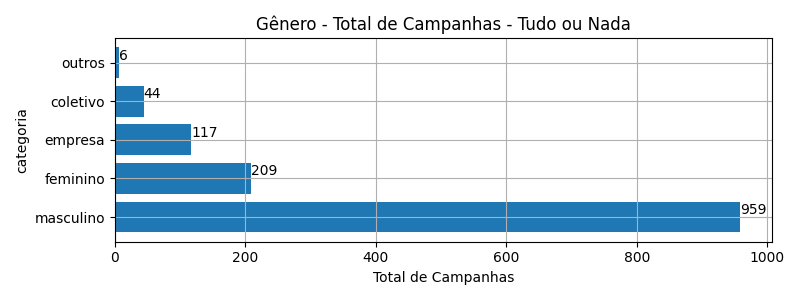
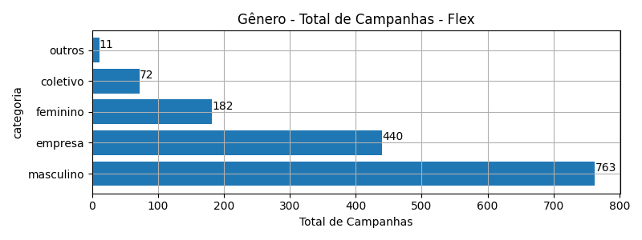
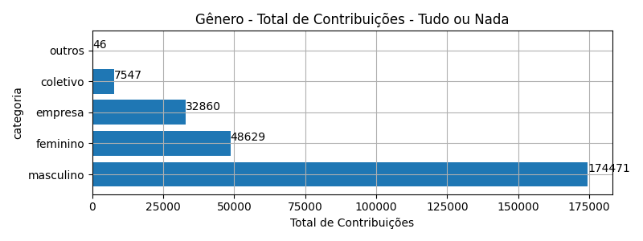
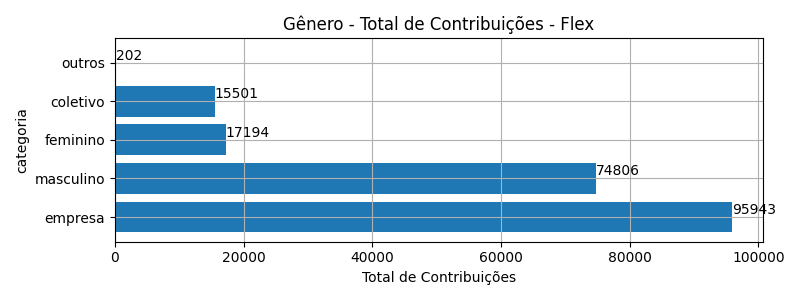
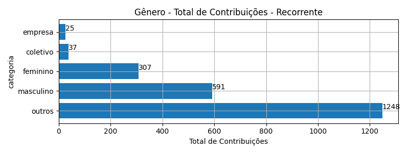
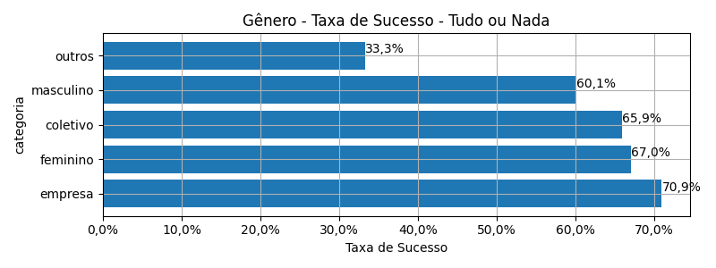
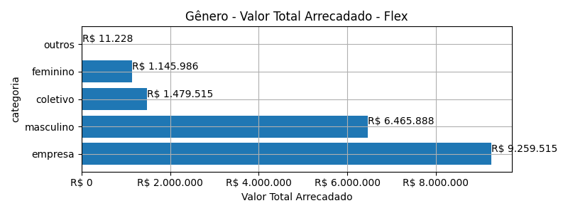
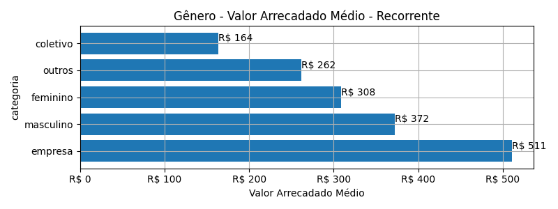
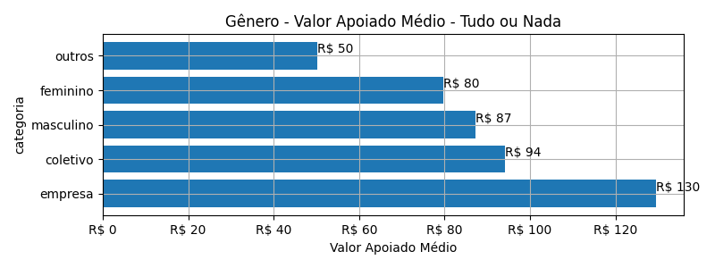
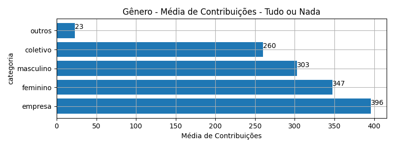

# Rankings: Gênero

Rankings por _total_ (quantidade de campanhas realizadas), _contribuicoes_
(total de contribuições), _taxa_sucesso_ (taxa de sucesso das campanhas),
_arrecadado_sucesso_ (valor total arrecadado com campanhas bem sucedidas),
_media_sucesso_ (valor arrecadado médio com campanhas bem sucedidas),
_apoio_medio_ (apoio médio das campanhas bem sucedidas) e .

As análises serão realizadas por Modalidade e Gênero. Colunas:

- modalidade: tudo ou nada, flex ou recorrente;
- autoria_classificacao: dimensão de agrupamento;
- total: total de campanhas;
- arrecadado: valor total arrecadado pelas campanhas (bem sucedidas ou não);
- total_sucesso: total de campanhas bem sucedidas;
- arrecadado_sucesso: valor total arrecadado pelas campanhas bem sucedidas;
- taxa_sucesso: relação entre o total de campanhas bem sucedidas e o total de campanhas;
- media_sucesso: valor arrecadado médio pelas campanhas bem sucedidas;
- std_sucesso: desvio padrão médio (ref: valor arrecadado) pelas campanhas bem sucedidas;
- min_sucesso: menor valor arrecadado médio entre as campanhas bem sucedidas;
- max_sucesso: maior valor arrecadado médio entre as campanhas bem sucedidas;
- apoio_medio: apoio médio entre as campanhas bem sucedidas;
- contribuicoes: total de contribuições entre as campanhas bem sucedidas;
- media_contribuicoes: média de contribuições entre as campanhas bem sucedidas.

## Total de Campanhas

### Modalidade: Tudo ou Nada

<!--Total de Campanhas-->
Top 5 _Gênero_, por _total_, em _Tudo ou Nada_.

| geral_modalidade   | autoria_classificacao   |   total |   total_sucesso |   particip |   taxa_sucesso |   arrecadado_sucesso |   media_sucesso |   std_sucesso |   min_sucesso |   max_sucesso |   apoio_medio |   contribuicoes |   media_contribuicoes |
|:-------------------|:------------------------|--------:|----------------:|-----------:|---------------:|---------------------:|----------------:|--------------:|--------------:|--------------:|--------------:|----------------:|----------------------:|
| aon                | masculino               |     959 |             576 |      71,84 |          60,06 |          15.212.724,00 |        26.410,98 |      40.119,88 |         94,90 |     679.297,66 |         87,19 |          174.471 |                302,90 |
| aon                | feminino                |     209 |             140 |      15,66 |          66,99 |           3.881.052,70 |        27.721,81 |      48.958,87 |         41,82 |     537.544,55 |         79,81 |           48.629 |                347,35 |
| aon                | empresa                 |     117 |              83 |       8,76 |          70,94 |           4.257.136,76 |        51.290,80 |      65.495,08 |         54,54 |     264.585,91 |        129,55 |           32.860 |                395,90 |
| aon                | coletivo                |      44 |              29 |       3,30 |          65,91 |            710.060,78 |        24.484,85 |      25.328,68 |       4.520,87 |     111.934,90 |         94,09 |            7.547 |                260,24 |
| aon                | outros                  |       6 |               2 |       0,45 |          33,33 |              2.305,58 |         1.152,79 |        803,09 |        584,92 |       1.720,66 |         50,12 |              46 |                 23,00 |

### Modalidade: Flex

<!--Total de Campanhas-->
Top 5 _Gênero_, por _total_, em _Flex_.

| geral_modalidade   | autoria_classificacao   |   total |   total_sucesso |   particip |   taxa_sucesso |   arrecadado_sucesso |   media_sucesso |   std_sucesso |   min_sucesso |   max_sucesso |   apoio_medio |   contribuicoes |   media_contribuicoes |
|:-------------------|:------------------------|--------:|----------------:|-----------:|---------------:|---------------------:|----------------:|--------------:|--------------:|--------------:|--------------:|----------------:|----------------------:|
| flex               | masculino               |     763 |             691 |      51,98 |          90,56 |           6.465.887,70 |         9.357,29 |      27.421,05 |         10,77 |     442.290,11 |         86,44 |           74.806 |                108,26 |
| flex               | empresa                 |     440 |             440 |      29,97 |         100,00 |           9.259.515,00 |        21.044,35 |      46.143,04 |         34,74 |     708.972,78 |         96,51 |           95.943 |                218,05 |
| flex               | feminino                |     182 |             176 |      12,40 |          96,70 |           1.145.985,99 |         6.511,28 |       6.521,40 |         35,53 |      29.736,69 |         66,65 |           17.194 |                 97,69 |
| flex               | coletivo                |      72 |              69 |       4,90 |          95,83 |           1.479.515,33 |        21.442,25 |      34.235,40 |         29,81 |     169.836,91 |         95,45 |           15.501 |                224,65 |
| flex               | outros                  |      11 |               7 |       0,75 |          63,64 |             11.227,92 |         1.603,99 |       2.112,50 |         42,36 |       5.515,84 |         55,58 |             202 |                 28,86 |

### Modalidade: Recorrente

<!--Total de Campanhas-->
> [!WARNING] 
> Nesta modalidade de financiamento, os cálculos representam
> uma fotografia das campanhas em dezembro/2023.

Top 5 _Gênero_, por _total_, em _Recorrente_.

| geral_modalidade   | autoria_classificacao   |   total |   total_sucesso |   particip |   taxa_sucesso |   arrecadado_sucesso |   media_sucesso |   std_sucesso |   min_sucesso |   max_sucesso |   apoio_medio |   contribuicoes |   media_contribuicoes |
|:-------------------|:------------------------|--------:|----------------:|-----------:|---------------:|---------------------:|----------------:|--------------:|--------------:|--------------:|--------------:|----------------:|----------------------:|
| sub                | outros                  |     477 |             100 |      69,74 |          20,96 |             26.161,60 |          261,62 |        711,52 |          1,09 |       5.087,08 |         20,96 |            1.248 |                 12,48 |
| sub                | masculino               |     101 |              25 |      14,77 |          24,75 |              9.304,80 |          372,19 |        661,58 |          6,10 |       2.998,54 |         15,74 |             591 |                 23,64 |
| sub                | feminino                |      69 |              18 |      10,09 |          26,09 |              5.551,37 |          308,41 |        399,36 |          7,15 |       1.753,37 |         18,08 |             307 |                 17,06 |
| sub                | coletivo                |      28 |               7 |       4,09 |          25,00 |              1.146,91 |          163,84 |        138,02 |         32,56 |        353,58 |         31,00 |              37 |                  5,29 |
| sub                | empresa                 |       9 |               2 |       1,32 |          22,22 |              1.022,28 |          511,14 |         38,60 |        483,84 |        538,44 |         40,89 |              25 |                 12,50 |

## Total de Contribuições

### Modalidade: Tudo ou Nada

<!--Total de Contribuições-->
Top 5 _Gênero_, por _contribuicoes_, em _Tudo ou Nada_.

| geral_modalidade   | autoria_classificacao   |   total |   total_sucesso |   particip |   taxa_sucesso |   arrecadado_sucesso |   media_sucesso |   std_sucesso |   min_sucesso |   max_sucesso |   apoio_medio |   contribuicoes |   media_contribuicoes |
|:-------------------|:------------------------|--------:|----------------:|-----------:|---------------:|---------------------:|----------------:|--------------:|--------------:|--------------:|--------------:|----------------:|----------------------:|
| aon                | masculino               |     959 |             576 |      71,84 |          60,06 |          15.212.724,00 |        26.410,98 |      40.119,88 |         94,90 |     679.297,66 |         87,19 |          174.471 |                302,90 |
| aon                | feminino                |     209 |             140 |      15,66 |          66,99 |           3.881.052,70 |        27.721,81 |      48.958,87 |         41,82 |     537.544,55 |         79,81 |           48.629 |                347,35 |
| aon                | empresa                 |     117 |              83 |       8,76 |          70,94 |           4.257.136,76 |        51.290,80 |      65.495,08 |         54,54 |     264.585,91 |        129,55 |           32.860 |                395,90 |
| aon                | coletivo                |      44 |              29 |       3,30 |          65,91 |            710.060,78 |        24.484,85 |      25.328,68 |       4.520,87 |     111.934,90 |         94,09 |            7.547 |                260,24 |
| aon                | outros                  |       6 |               2 |       0,45 |          33,33 |              2.305,58 |         1.152,79 |        803,09 |        584,92 |       1.720,66 |         50,12 |              46 |                 23,00 |

### Modalidade: Flex

<!--Total de Contribuições-->
Top 5 _Gênero_, por _contribuicoes_, em _Flex_.

| geral_modalidade   | autoria_classificacao   |   total |   total_sucesso |   particip |   taxa_sucesso |   arrecadado_sucesso |   media_sucesso |   std_sucesso |   min_sucesso |   max_sucesso |   apoio_medio |   contribuicoes |   media_contribuicoes |
|:-------------------|:------------------------|--------:|----------------:|-----------:|---------------:|---------------------:|----------------:|--------------:|--------------:|--------------:|--------------:|----------------:|----------------------:|
| flex               | empresa                 |     440 |             440 |      29,97 |         100,00 |           9.259.515,00 |        21.044,35 |      46.143,04 |         34,74 |     708.972,78 |         96,51 |           95.943 |                218,05 |
| flex               | masculino               |     763 |             691 |      51,98 |          90,56 |           6.465.887,70 |         9.357,29 |      27.421,05 |         10,77 |     442.290,11 |         86,44 |           74.806 |                108,26 |
| flex               | feminino                |     182 |             176 |      12,40 |          96,70 |           1.145.985,99 |         6.511,28 |       6.521,40 |         35,53 |      29.736,69 |         66,65 |           17.194 |                 97,69 |
| flex               | coletivo                |      72 |              69 |       4,90 |          95,83 |           1.479.515,33 |        21.442,25 |      34.235,40 |         29,81 |     169.836,91 |         95,45 |           15.501 |                224,65 |
| flex               | outros                  |      11 |               7 |       0,75 |          63,64 |             11.227,92 |         1.603,99 |       2.112,50 |         42,36 |       5.515,84 |         55,58 |             202 |                 28,86 |

### Modalidade: Recorrente

<!--Total de Contribuições-->
> [!WARNING] 
> Nesta modalidade de financiamento, os cálculos representam
> uma fotografia das campanhas em dezembro/2023.

Top 5 _Gênero_, por _contribuicoes_, em _Recorrente_.

| geral_modalidade   | autoria_classificacao   |   total |   total_sucesso |   particip |   taxa_sucesso |   arrecadado_sucesso |   media_sucesso |   std_sucesso |   min_sucesso |   max_sucesso |   apoio_medio |   contribuicoes |   media_contribuicoes |
|:-------------------|:------------------------|--------:|----------------:|-----------:|---------------:|---------------------:|----------------:|--------------:|--------------:|--------------:|--------------:|----------------:|----------------------:|
| sub                | outros                  |     477 |             100 |      69,74 |          20,96 |             26.161,60 |          261,62 |        711,52 |          1,09 |       5.087,08 |         20,96 |            1.248 |                 12,48 |
| sub                | masculino               |     101 |              25 |      14,77 |          24,75 |              9.304,80 |          372,19 |        661,58 |          6,10 |       2.998,54 |         15,74 |             591 |                 23,64 |
| sub                | feminino                |      69 |              18 |      10,09 |          26,09 |              5.551,37 |          308,41 |        399,36 |          7,15 |       1.753,37 |         18,08 |             307 |                 17,06 |
| sub                | coletivo                |      28 |               7 |       4,09 |          25,00 |              1.146,91 |          163,84 |        138,02 |         32,56 |        353,58 |         31,00 |              37 |                  5,29 |
| sub                | empresa                 |       9 |               2 |       1,32 |          22,22 |              1.022,28 |          511,14 |         38,60 |        483,84 |        538,44 |         40,89 |              25 |                 12,50 |

## Taxa de Sucesso

### Modalidade: Tudo ou Nada

<!--Taxa de Sucesso-->
Top 5 _Gênero_, por _taxa_sucesso_, em _Tudo ou Nada_.

| geral_modalidade   | autoria_classificacao   |   total |   total_sucesso |   particip |   taxa_sucesso |   arrecadado_sucesso |   media_sucesso |   std_sucesso |   min_sucesso |   max_sucesso |   apoio_medio |   contribuicoes |   media_contribuicoes |
|:-------------------|:------------------------|--------:|----------------:|-----------:|---------------:|---------------------:|----------------:|--------------:|--------------:|--------------:|--------------:|----------------:|----------------------:|
| aon                | empresa                 |     117 |              83 |       8,76 |          70,94 |           4.257.136,76 |        51.290,80 |      65.495,08 |         54,54 |     264.585,91 |        129,55 |           32.860 |                395,90 |
| aon                | feminino                |     209 |             140 |      15,66 |          66,99 |           3.881.052,70 |        27.721,81 |      48.958,87 |         41,82 |     537.544,55 |         79,81 |           48.629 |                347,35 |
| aon                | coletivo                |      44 |              29 |       3,30 |          65,91 |            710.060,78 |        24.484,85 |      25.328,68 |       4.520,87 |     111.934,90 |         94,09 |            7.547 |                260,24 |
| aon                | masculino               |     959 |             576 |      71,84 |          60,06 |          15.212.724,00 |        26.410,98 |      40.119,88 |         94,90 |     679.297,66 |         87,19 |          174.471 |                302,90 |
| aon                | outros                  |       6 |               2 |       0,45 |          33,33 |              2.305,58 |         1.152,79 |        803,09 |        584,92 |       1.720,66 |         50,12 |              46 |                 23,00 |

### Modalidade: Flex

<!--Taxa de Sucesso-->
Top 5 _Gênero_, por _taxa_sucesso_, em _Flex_.

| geral_modalidade   | autoria_classificacao   |   total |   total_sucesso |   particip |   taxa_sucesso |   arrecadado_sucesso |   media_sucesso |   std_sucesso |   min_sucesso |   max_sucesso |   apoio_medio |   contribuicoes |   media_contribuicoes |
|:-------------------|:------------------------|--------:|----------------:|-----------:|---------------:|---------------------:|----------------:|--------------:|--------------:|--------------:|--------------:|----------------:|----------------------:|
| flex               | empresa                 |     440 |             440 |      29,97 |         100,00 |           9.259.515,00 |        21.044,35 |      46.143,04 |         34,74 |     708.972,78 |         96,51 |           95.943 |                218,05 |
| flex               | feminino                |     182 |             176 |      12,40 |          96,70 |           1.145.985,99 |         6.511,28 |       6.521,40 |         35,53 |      29.736,69 |         66,65 |           17.194 |                 97,69 |
| flex               | coletivo                |      72 |              69 |       4,90 |          95,83 |           1.479.515,33 |        21.442,25 |      34.235,40 |         29,81 |     169.836,91 |         95,45 |           15.501 |                224,65 |
| flex               | masculino               |     763 |             691 |      51,98 |          90,56 |           6.465.887,70 |         9.357,29 |      27.421,05 |         10,77 |     442.290,11 |         86,44 |           74.806 |                108,26 |
| flex               | outros                  |      11 |               7 |       0,75 |          63,64 |             11.227,92 |         1.603,99 |       2.112,50 |         42,36 |       5.515,84 |         55,58 |             202 |                 28,86 |

### Modalidade: Recorrente

<!--Taxa de Sucesso-->
> [!WARNING] 
> Nesta modalidade de financiamento, os cálculos representam
> uma fotografia das campanhas em dezembro/2023.

Top 5 _Gênero_, por _taxa_sucesso_, em _Recorrente_.

| geral_modalidade   | autoria_classificacao   |   total |   total_sucesso |   particip |   taxa_sucesso |   arrecadado_sucesso |   media_sucesso |   std_sucesso |   min_sucesso |   max_sucesso |   apoio_medio |   contribuicoes |   media_contribuicoes |
|:-------------------|:------------------------|--------:|----------------:|-----------:|---------------:|---------------------:|----------------:|--------------:|--------------:|--------------:|--------------:|----------------:|----------------------:|
| sub                | feminino                |      69 |              18 |      10,09 |          26,09 |              5.551,37 |          308,41 |        399,36 |          7,15 |       1.753,37 |         18,08 |             307 |                 17,06 |
| sub                | coletivo                |      28 |               7 |       4,09 |          25,00 |              1.146,91 |          163,84 |        138,02 |         32,56 |        353,58 |         31,00 |              37 |                  5,29 |
| sub                | masculino               |     101 |              25 |      14,77 |          24,75 |              9.304,80 |          372,19 |        661,58 |          6,10 |       2.998,54 |         15,74 |             591 |                 23,64 |
| sub                | empresa                 |       9 |               2 |       1,32 |          22,22 |              1.022,28 |          511,14 |         38,60 |        483,84 |        538,44 |         40,89 |              25 |                 12,50 |
| sub                | outros                  |     477 |             100 |      69,74 |          20,96 |             26.161,60 |          261,62 |        711,52 |          1,09 |       5.087,08 |         20,96 |            1.248 |                 12,48 |

## Valor Total Arrecadado

### Modalidade: Tudo ou Nada

<!--Valor Total Arrecadado-->
Top 5 _Gênero_, por _arrecadado_sucesso_, em _Tudo ou Nada_.

| geral_modalidade   | autoria_classificacao   |   total |   total_sucesso |   particip |   taxa_sucesso |   arrecadado_sucesso |   media_sucesso |   std_sucesso |   min_sucesso |   max_sucesso |   apoio_medio |   contribuicoes |   media_contribuicoes |
|:-------------------|:------------------------|--------:|----------------:|-----------:|---------------:|---------------------:|----------------:|--------------:|--------------:|--------------:|--------------:|----------------:|----------------------:|
| aon                | masculino               |     959 |             576 |      71,84 |          60,06 |          15.212.724,00 |        26.410,98 |      40.119,88 |         94,90 |     679.297,66 |         87,19 |          174.471 |                302,90 |
| aon                | empresa                 |     117 |              83 |       8,76 |          70,94 |           4.257.136,76 |        51.290,80 |      65.495,08 |         54,54 |     264.585,91 |        129,55 |           32.860 |                395,90 |
| aon                | feminino                |     209 |             140 |      15,66 |          66,99 |           3.881.052,70 |        27.721,81 |      48.958,87 |         41,82 |     537.544,55 |         79,81 |           48.629 |                347,35 |
| aon                | coletivo                |      44 |              29 |       3,30 |          65,91 |            710.060,78 |        24.484,85 |      25.328,68 |       4.520,87 |     111.934,90 |         94,09 |            7.547 |                260,24 |
| aon                | outros                  |       6 |               2 |       0,45 |          33,33 |              2.305,58 |         1.152,79 |        803,09 |        584,92 |       1.720,66 |         50,12 |              46 |                 23,00 |

### Modalidade: Flex

<!--Valor Total Arrecadado-->
Top 5 _Gênero_, por _arrecadado_sucesso_, em _Flex_.

| geral_modalidade   | autoria_classificacao   |   total |   total_sucesso |   particip |   taxa_sucesso |   arrecadado_sucesso |   media_sucesso |   std_sucesso |   min_sucesso |   max_sucesso |   apoio_medio |   contribuicoes |   media_contribuicoes |
|:-------------------|:------------------------|--------:|----------------:|-----------:|---------------:|---------------------:|----------------:|--------------:|--------------:|--------------:|--------------:|----------------:|----------------------:|
| flex               | empresa                 |     440 |             440 |      29,97 |         100,00 |           9.259.515,00 |        21.044,35 |      46.143,04 |         34,74 |     708.972,78 |         96,51 |           95.943 |                218,05 |
| flex               | masculino               |     763 |             691 |      51,98 |          90,56 |           6.465.887,70 |         9.357,29 |      27.421,05 |         10,77 |     442.290,11 |         86,44 |           74.806 |                108,26 |
| flex               | coletivo                |      72 |              69 |       4,90 |          95,83 |           1.479.515,33 |        21.442,25 |      34.235,40 |         29,81 |     169.836,91 |         95,45 |           15.501 |                224,65 |
| flex               | feminino                |     182 |             176 |      12,40 |          96,70 |           1.145.985,99 |         6.511,28 |       6.521,40 |         35,53 |      29.736,69 |         66,65 |           17.194 |                 97,69 |
| flex               | outros                  |      11 |               7 |       0,75 |          63,64 |             11.227,92 |         1.603,99 |       2.112,50 |         42,36 |       5.515,84 |         55,58 |             202 |                 28,86 |

### Modalidade: Recorrente

<!--Valor Total Arrecadado-->
> [!WARNING] 
> Nesta modalidade de financiamento, os cálculos representam
> uma fotografia das campanhas em dezembro/2023.

Top 5 _Gênero_, por _arrecadado_sucesso_, em _Recorrente_.

| geral_modalidade   | autoria_classificacao   |   total |   total_sucesso |   particip |   taxa_sucesso |   arrecadado_sucesso |   media_sucesso |   std_sucesso |   min_sucesso |   max_sucesso |   apoio_medio |   contribuicoes |   media_contribuicoes |
|:-------------------|:------------------------|--------:|----------------:|-----------:|---------------:|---------------------:|----------------:|--------------:|--------------:|--------------:|--------------:|----------------:|----------------------:|
| sub                | outros                  |     477 |             100 |      69,74 |          20,96 |             26.161,60 |          261,62 |        711,52 |          1,09 |       5.087,08 |         20,96 |            1.248 |                 12,48 |
| sub                | masculino               |     101 |              25 |      14,77 |          24,75 |              9.304,80 |          372,19 |        661,58 |          6,10 |       2.998,54 |         15,74 |             591 |                 23,64 |
| sub                | feminino                |      69 |              18 |      10,09 |          26,09 |              5.551,37 |          308,41 |        399,36 |          7,15 |       1.753,37 |         18,08 |             307 |                 17,06 |
| sub                | coletivo                |      28 |               7 |       4,09 |          25,00 |              1.146,91 |          163,84 |        138,02 |         32,56 |        353,58 |         31,00 |              37 |                  5,29 |
| sub                | empresa                 |       9 |               2 |       1,32 |          22,22 |              1.022,28 |          511,14 |         38,60 |        483,84 |        538,44 |         40,89 |              25 |                 12,50 |

## Valor Arrecadado Médio

### Modalidade: Tudo ou Nada

<!--Valor Médio Arrecadado-->
Top 5 _Gênero_, por _media_sucesso_, em _Tudo ou Nada_.

| geral_modalidade   | autoria_classificacao   |   total |   total_sucesso |   particip |   taxa_sucesso |   arrecadado_sucesso |   media_sucesso |   std_sucesso |   min_sucesso |   max_sucesso |   apoio_medio |   contribuicoes |   media_contribuicoes |
|:-------------------|:------------------------|--------:|----------------:|-----------:|---------------:|---------------------:|----------------:|--------------:|--------------:|--------------:|--------------:|----------------:|----------------------:|
| aon                | empresa                 |     117 |              83 |       8,76 |          70,94 |           4.257.136,76 |        51.290,80 |      65.495,08 |         54,54 |     264.585,91 |        129,55 |           32.860 |                395,90 |
| aon                | feminino                |     209 |             140 |      15,66 |          66,99 |           3.881.052,70 |        27.721,81 |      48.958,87 |         41,82 |     537.544,55 |         79,81 |           48.629 |                347,35 |
| aon                | masculino               |     959 |             576 |      71,84 |          60,06 |          15.212.724,00 |        26.410,98 |      40.119,88 |         94,90 |     679.297,66 |         87,19 |          174.471 |                302,90 |
| aon                | coletivo                |      44 |              29 |       3,30 |          65,91 |            710.060,78 |        24.484,85 |      25.328,68 |       4.520,87 |     111.934,90 |         94,09 |            7.547 |                260,24 |
| aon                | outros                  |       6 |               2 |       0,45 |          33,33 |              2.305,58 |         1.152,79 |        803,09 |        584,92 |       1.720,66 |         50,12 |              46 |                 23,00 |

### Modalidade: Flex

<!--Valor Médio Arrecadado-->
Top 5 _Gênero_, por _media_sucesso_, em _Flex_.

| geral_modalidade   | autoria_classificacao   |   total |   total_sucesso |   particip |   taxa_sucesso |   arrecadado_sucesso |   media_sucesso |   std_sucesso |   min_sucesso |   max_sucesso |   apoio_medio |   contribuicoes |   media_contribuicoes |
|:-------------------|:------------------------|--------:|----------------:|-----------:|---------------:|---------------------:|----------------:|--------------:|--------------:|--------------:|--------------:|----------------:|----------------------:|
| flex               | coletivo                |      72 |              69 |       4,90 |          95,83 |           1.479.515,33 |        21.442,25 |      34.235,40 |         29,81 |     169.836,91 |         95,45 |           15.501 |                224,65 |
| flex               | empresa                 |     440 |             440 |      29,97 |         100,00 |           9.259.515,00 |        21.044,35 |      46.143,04 |         34,74 |     708.972,78 |         96,51 |           95.943 |                218,05 |
| flex               | masculino               |     763 |             691 |      51,98 |          90,56 |           6.465.887,70 |         9.357,29 |      27.421,05 |         10,77 |     442.290,11 |         86,44 |           74.806 |                108,26 |
| flex               | feminino                |     182 |             176 |      12,40 |          96,70 |           1.145.985,99 |         6.511,28 |       6.521,40 |         35,53 |      29.736,69 |         66,65 |           17.194 |                 97,69 |
| flex               | outros                  |      11 |               7 |       0,75 |          63,64 |             11.227,92 |         1.603,99 |       2.112,50 |         42,36 |       5.515,84 |         55,58 |             202 |                 28,86 |

### Modalidade: Recorrente

<!--Valor Médio Arrecadado-->
> [!WARNING] 
> Nesta modalidade de financiamento, os cálculos representam
> uma fotografia das campanhas em dezembro/2023.

Top 5 _Gênero_, por _media_sucesso_, em _Recorrente_.

| geral_modalidade   | autoria_classificacao   |   total |   total_sucesso |   particip |   taxa_sucesso |   arrecadado_sucesso |   media_sucesso |   std_sucesso |   min_sucesso |   max_sucesso |   apoio_medio |   contribuicoes |   media_contribuicoes |
|:-------------------|:------------------------|--------:|----------------:|-----------:|---------------:|---------------------:|----------------:|--------------:|--------------:|--------------:|--------------:|----------------:|----------------------:|
| sub                | empresa                 |       9 |               2 |       1,32 |          22,22 |              1.022,28 |          511,14 |         38,60 |        483,84 |        538,44 |         40,89 |              25 |                 12,50 |
| sub                | masculino               |     101 |              25 |      14,77 |          24,75 |              9.304,80 |          372,19 |        661,58 |          6,10 |       2.998,54 |         15,74 |             591 |                 23,64 |
| sub                | feminino                |      69 |              18 |      10,09 |          26,09 |              5.551,37 |          308,41 |        399,36 |          7,15 |       1.753,37 |         18,08 |             307 |                 17,06 |
| sub                | outros                  |     477 |             100 |      69,74 |          20,96 |             26.161,60 |          261,62 |        711,52 |          1,09 |       5.087,08 |         20,96 |            1.248 |                 12,48 |
| sub                | coletivo                |      28 |               7 |       4,09 |          25,00 |              1.146,91 |          163,84 |        138,02 |         32,56 |        353,58 |         31,00 |              37 |                  5,29 |

## Valor Apoiado Médio

### Modalidade: Tudo ou Nada

<!--Valor Médio Apoiado-->
Top 5 _Gênero_, por _apoio_medio_, em _Tudo ou Nada_.

| geral_modalidade   | autoria_classificacao   |   total |   total_sucesso |   particip |   taxa_sucesso |   arrecadado_sucesso |   media_sucesso |   std_sucesso |   min_sucesso |   max_sucesso |   apoio_medio |   contribuicoes |   media_contribuicoes |
|:-------------------|:------------------------|--------:|----------------:|-----------:|---------------:|---------------------:|----------------:|--------------:|--------------:|--------------:|--------------:|----------------:|----------------------:|
| aon                | empresa                 |     117 |              83 |       8,76 |          70,94 |           4.257.136,76 |        51.290,80 |      65.495,08 |         54,54 |     264.585,91 |        129,55 |           32.860 |                395,90 |
| aon                | coletivo                |      44 |              29 |       3,30 |          65,91 |            710.060,78 |        24.484,85 |      25.328,68 |       4.520,87 |     111.934,90 |         94,09 |            7.547 |                260,24 |
| aon                | masculino               |     959 |             576 |      71,84 |          60,06 |          15.212.724,00 |        26.410,98 |      40.119,88 |         94,90 |     679.297,66 |         87,19 |          174.471 |                302,90 |
| aon                | feminino                |     209 |             140 |      15,66 |          66,99 |           3.881.052,70 |        27.721,81 |      48.958,87 |         41,82 |     537.544,55 |         79,81 |           48.629 |                347,35 |
| aon                | outros                  |       6 |               2 |       0,45 |          33,33 |              2.305,58 |         1.152,79 |        803,09 |        584,92 |       1.720,66 |         50,12 |              46 |                 23,00 |

### Modalidade: Flex

<!--Valor Médio Apoiado-->
Top 5 _Gênero_, por _apoio_medio_, em _Flex_.

| geral_modalidade   | autoria_classificacao   |   total |   total_sucesso |   particip |   taxa_sucesso |   arrecadado_sucesso |   media_sucesso |   std_sucesso |   min_sucesso |   max_sucesso |   apoio_medio |   contribuicoes |   media_contribuicoes |
|:-------------------|:------------------------|--------:|----------------:|-----------:|---------------:|---------------------:|----------------:|--------------:|--------------:|--------------:|--------------:|----------------:|----------------------:|
| flex               | empresa                 |     440 |             440 |      29,97 |         100,00 |           9.259.515,00 |        21.044,35 |      46.143,04 |         34,74 |     708.972,78 |         96,51 |           95.943 |                218,05 |
| flex               | coletivo                |      72 |              69 |       4,90 |          95,83 |           1.479.515,33 |        21.442,25 |      34.235,40 |         29,81 |     169.836,91 |         95,45 |           15.501 |                224,65 |
| flex               | masculino               |     763 |             691 |      51,98 |          90,56 |           6.465.887,70 |         9.357,29 |      27.421,05 |         10,77 |     442.290,11 |         86,44 |           74.806 |                108,26 |
| flex               | feminino                |     182 |             176 |      12,40 |          96,70 |           1.145.985,99 |         6.511,28 |       6.521,40 |         35,53 |      29.736,69 |         66,65 |           17.194 |                 97,69 |
| flex               | outros                  |      11 |               7 |       0,75 |          63,64 |             11.227,92 |         1.603,99 |       2.112,50 |         42,36 |       5.515,84 |         55,58 |             202 |                 28,86 |

### Modalidade: Recorrente

<!--Valor Médio Apoiado-->
> [!WARNING] 
> Nesta modalidade de financiamento, os cálculos representam
> uma fotografia das campanhas em dezembro/2023.

Top 5 _Gênero_, por _apoio_medio_, em _Recorrente_.

| geral_modalidade   | autoria_classificacao   |   total |   total_sucesso |   particip |   taxa_sucesso |   arrecadado_sucesso |   media_sucesso |   std_sucesso |   min_sucesso |   max_sucesso |   apoio_medio |   contribuicoes |   media_contribuicoes |
|:-------------------|:------------------------|--------:|----------------:|-----------:|---------------:|---------------------:|----------------:|--------------:|--------------:|--------------:|--------------:|----------------:|----------------------:|
| sub                | empresa                 |       9 |               2 |       1,32 |          22,22 |              1.022,28 |          511,14 |         38,60 |        483,84 |        538,44 |         40,89 |              25 |                 12,50 |
| sub                | coletivo                |      28 |               7 |       4,09 |          25,00 |              1.146,91 |          163,84 |        138,02 |         32,56 |        353,58 |         31,00 |              37 |                  5,29 |
| sub                | outros                  |     477 |             100 |      69,74 |          20,96 |             26.161,60 |          261,62 |        711,52 |          1,09 |       5.087,08 |         20,96 |            1.248 |                 12,48 |
| sub                | feminino                |      69 |              18 |      10,09 |          26,09 |              5.551,37 |          308,41 |        399,36 |          7,15 |       1.753,37 |         18,08 |             307 |                 17,06 |
| sub                | masculino               |     101 |              25 |      14,77 |          24,75 |              9.304,80 |          372,19 |        661,58 |          6,10 |       2.998,54 |         15,74 |             591 |                 23,64 |

## Média de Contribuições

### Modalidade: Tudo ou Nada

<!--Média de Contribuições-->
Top 5 _Gênero_, por _media_contribuicoes_, em _Tudo ou Nada_.

| geral_modalidade   | autoria_classificacao   |   total |   total_sucesso |   particip |   taxa_sucesso |   arrecadado_sucesso |   media_sucesso |   std_sucesso |   min_sucesso |   max_sucesso |   apoio_medio |   contribuicoes |   media_contribuicoes |
|:-------------------|:------------------------|--------:|----------------:|-----------:|---------------:|---------------------:|----------------:|--------------:|--------------:|--------------:|--------------:|----------------:|----------------------:|
| aon                | empresa                 |     117 |              83 |       8,76 |          70,94 |           4.257.136,76 |        51.290,80 |      65.495,08 |         54,54 |     264.585,91 |        129,55 |           32.860 |                395,90 |
| aon                | feminino                |     209 |             140 |      15,66 |          66,99 |           3.881.052,70 |        27.721,81 |      48.958,87 |         41,82 |     537.544,55 |         79,81 |           48.629 |                347,35 |
| aon                | masculino               |     959 |             576 |      71,84 |          60,06 |          15.212.724,00 |        26.410,98 |      40.119,88 |         94,90 |     679.297,66 |         87,19 |          174.471 |                302,90 |
| aon                | coletivo                |      44 |              29 |       3,30 |          65,91 |            710.060,78 |        24.484,85 |      25.328,68 |       4.520,87 |     111.934,90 |         94,09 |            7.547 |                260,24 |
| aon                | outros                  |       6 |               2 |       0,45 |          33,33 |              2.305,58 |         1.152,79 |        803,09 |        584,92 |       1.720,66 |         50,12 |              46 |                 23,00 |

### Modalidade: Flex

<!--Média de Contribuições-->
Top 5 _Gênero_, por _media_contribuicoes_, em _Flex_.

| geral_modalidade   | autoria_classificacao   |   total |   total_sucesso |   particip |   taxa_sucesso |   arrecadado_sucesso |   media_sucesso |   std_sucesso |   min_sucesso |   max_sucesso |   apoio_medio |   contribuicoes |   media_contribuicoes |
|:-------------------|:------------------------|--------:|----------------:|-----------:|---------------:|---------------------:|----------------:|--------------:|--------------:|--------------:|--------------:|----------------:|----------------------:|
| flex               | coletivo                |      72 |              69 |       4,90 |          95,83 |           1.479.515,33 |        21.442,25 |      34.235,40 |         29,81 |     169.836,91 |         95,45 |           15.501 |                224,65 |
| flex               | empresa                 |     440 |             440 |      29,97 |         100,00 |           9.259.515,00 |        21.044,35 |      46.143,04 |         34,74 |     708.972,78 |         96,51 |           95.943 |                218,05 |
| flex               | masculino               |     763 |             691 |      51,98 |          90,56 |           6.465.887,70 |         9.357,29 |      27.421,05 |         10,77 |     442.290,11 |         86,44 |           74.806 |                108,26 |
| flex               | feminino                |     182 |             176 |      12,40 |          96,70 |           1.145.985,99 |         6.511,28 |       6.521,40 |         35,53 |      29.736,69 |         66,65 |           17.194 |                 97,69 |
| flex               | outros                  |      11 |               7 |       0,75 |          63,64 |             11.227,92 |         1.603,99 |       2.112,50 |         42,36 |       5.515,84 |         55,58 |             202 |                 28,86 |

### Modalidade: Recorrente

<!--Média de Contribuições-->
> [!WARNING] 
> Nesta modalidade de financiamento, os cálculos representam
> uma fotografia das campanhas em dezembro/2023.

Top 5 _Gênero_, por _media_contribuicoes_, em _Recorrente_.

| geral_modalidade   | autoria_classificacao   |   total |   total_sucesso |   particip |   taxa_sucesso |   arrecadado_sucesso |   media_sucesso |   std_sucesso |   min_sucesso |   max_sucesso |   apoio_medio |   contribuicoes |   media_contribuicoes |
|:-------------------|:------------------------|--------:|----------------:|-----------:|---------------:|---------------------:|----------------:|--------------:|--------------:|--------------:|--------------:|----------------:|----------------------:|
| sub                | masculino               |     101 |              25 |      14,77 |          24,75 |              9.304,80 |          372,19 |        661,58 |          6,10 |       2.998,54 |         15,74 |             591 |                 23,64 |
| sub                | feminino                |      69 |              18 |      10,09 |          26,09 |              5.551,37 |          308,41 |        399,36 |          7,15 |       1.753,37 |         18,08 |             307 |                 17,06 |
| sub                | empresa                 |       9 |               2 |       1,32 |          22,22 |              1.022,28 |          511,14 |         38,60 |        483,84 |        538,44 |         40,89 |              25 |                 12,50 |
| sub                | outros                  |     477 |             100 |      69,74 |          20,96 |             26.161,60 |          261,62 |        711,52 |          1,09 |       5.087,08 |         20,96 |            1.248 |                 12,48 |
| sub                | coletivo                |      28 |               7 |       4,09 |          25,00 |              1.146,91 |          163,84 |        138,02 |         32,56 |        353,58 |         31,00 |              37 |                  5,29 |

