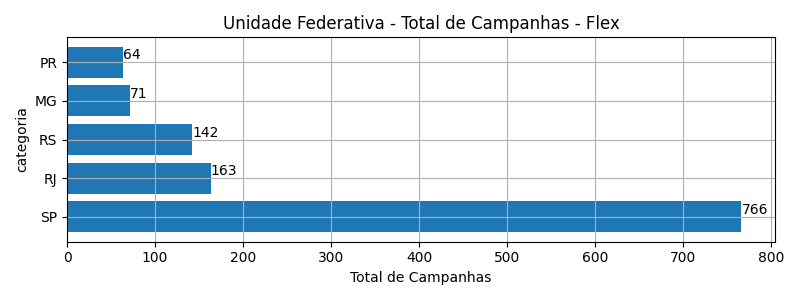
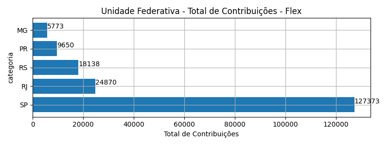
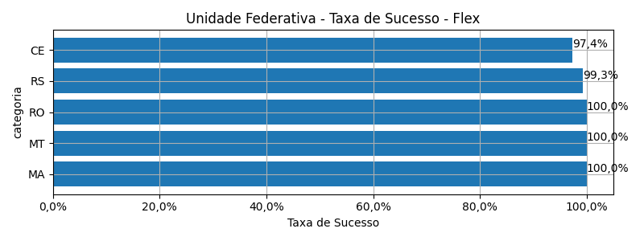
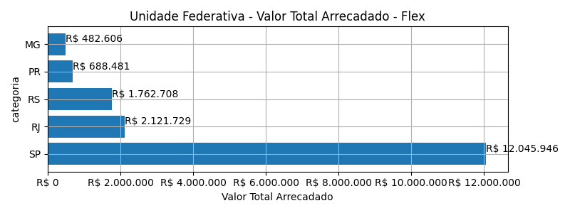
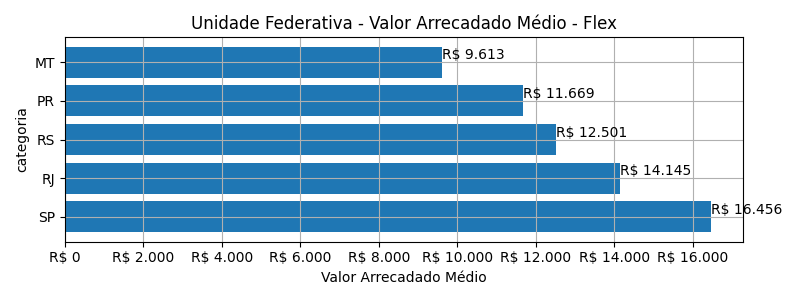
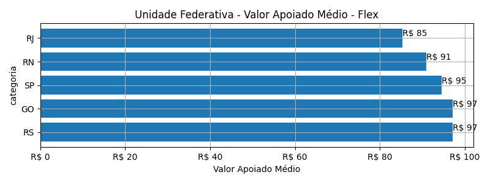
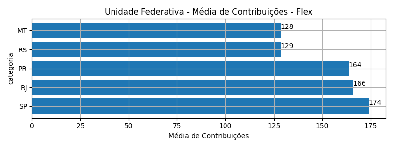

# Rankings: Unidade Federativa, Modalidade: Flex

Rankings por _total_ (quantidade de campanhas realizadas), _contribuicoes_
(total de contribuições), _taxa_sucesso_ (taxa de sucesso das campanhas),
_arrecadado_sucesso_ (valor total arrecadado com campanhas bem sucedidas),
_media_sucesso_ (valor arrecadado médio com campanhas bem sucedidas),
_apoio_medio_ (apoio médio das campanhas bem sucedidas)
e _media_contribuicoes_ (média de contribuições).

As análises serão realizadas por Modalidade e Unidade Federativa. Colunas:

- modalidade: tudo ou nada, flex ou recorrente;
- autoria_classificacao: dimensão de agrupamento;
- total: total de campanhas;
- arrecadado: valor total arrecadado pelas campanhas (bem sucedidas ou não);
- total_sucesso: total de campanhas bem sucedidas;
- arrecadado_sucesso: valor total arrecadado pelas campanhas bem sucedidas;
- taxa_sucesso: relação entre o total de campanhas bem sucedidas e o total de campanhas;
- media_sucesso: valor arrecadado médio pelas campanhas bem sucedidas;
- std_sucesso: desvio padrão médio (ref: valor arrecadado) pelas campanhas bem sucedidas;
- min_sucesso: menor valor arrecadado médio entre as campanhas bem sucedidas;
- max_sucesso: maior valor arrecadado médio entre as campanhas bem sucedidas;
- apoio_medio: apoio médio entre as campanhas bem sucedidas;
- contribuicoes: total de contribuições entre as campanhas bem sucedidas;
- media_contribuicoes: média de contribuições entre as campanhas bem sucedidas.

## Total de Campanhas

<!-- ### Modalidade: Flex -->

<!--Total de Campanhas-->
Top 5 _Unidade Federativa_, por _total_, em _Flex_.

| geral_modalidade   | geral_uf_br   |   total |   total_sucesso |   particip |   taxa_sucesso |   arrecadado_sucesso |   media_sucesso |   std_sucesso |   min_sucesso |   max_sucesso |   apoio_medio |   contribuicoes |   media_contribuicoes |
|:-------------------|:--------------|--------:|----------------:|-----------:|---------------:|---------------------:|----------------:|--------------:|--------------:|--------------:|--------------:|----------------:|----------------------:|
| flex               | SP            |     766 |             732 |      52,18 |          95,56 |          12.045.946,34 |        16.456,21 |      44.170,98 |         23,05 |     708.972,78 |         94,57 |          127.373 |                174,01 |
| flex               | RJ            |     163 |             150 |      11,10 |          92,02 |           2.121.729,30 |        14.144,86 |      20.277,98 |         10,77 |     142.477,57 |         85,31 |           24.870 |                165,80 |
| flex               | RS            |     142 |             141 |       9,67 |          99,30 |           1.762.708,33 |        12.501,48 |      18.586,72 |         57,99 |     118.699,04 |         97,18 |           18.138 |                128,64 |
| flex               | MG            |      71 |              67 |       4,84 |          94,37 |            482.605,55 |         7.203,07 |      10.740,03 |         35,53 |      55.069,70 |         83,60 |            5.773 |                 86,16 |
| flex               | PR            |      64 |              59 |       4,36 |          92,19 |            688.481,13 |        11.669,17 |      13.175,20 |         48,19 |      59.310,53 |         71,35 |            9.650 |                163,56 |

## Total de Contribuições

<!-- ### Modalidade: Flex -->

<!--Total de Contribuições-->
Top 5 _Unidade Federativa_, por _contribuicoes_, em _Flex_.

| geral_modalidade   | geral_uf_br   |   total |   total_sucesso |   particip |   taxa_sucesso |   arrecadado_sucesso |   media_sucesso |   std_sucesso |   min_sucesso |   max_sucesso |   apoio_medio |   contribuicoes |   media_contribuicoes |
|:-------------------|:--------------|--------:|----------------:|-----------:|---------------:|---------------------:|----------------:|--------------:|--------------:|--------------:|--------------:|----------------:|----------------------:|
| flex               | SP            |     766 |             732 |      52,18 |          95,56 |          12.045.946,34 |        16.456,21 |      44.170,98 |         23,05 |     708.972,78 |         94,57 |          127.373 |                174,01 |
| flex               | RJ            |     163 |             150 |      11,10 |          92,02 |           2.121.729,30 |        14.144,86 |      20.277,98 |         10,77 |     142.477,57 |         85,31 |           24.870 |                165,80 |
| flex               | RS            |     142 |             141 |       9,67 |          99,30 |           1.762.708,33 |        12.501,48 |      18.586,72 |         57,99 |     118.699,04 |         97,18 |           18.138 |                128,64 |
| flex               | PR            |      64 |              59 |       4,36 |          92,19 |            688.481,13 |        11.669,17 |      13.175,20 |         48,19 |      59.310,53 |         71,35 |            9.650 |                163,56 |
| flex               | MG            |      71 |              67 |       4,84 |          94,37 |            482.605,55 |         7.203,07 |      10.740,03 |         35,53 |      55.069,70 |         83,60 |            5.773 |                 86,16 |

## Taxa de Sucesso

<!-- ### Modalidade: Flex -->

<!--Taxa de Sucesso-->
Top 5 _Unidade Federativa_, por _taxa_sucesso_, em _Flex_.

| geral_modalidade   | geral_uf_br   |   total |   total_sucesso |   particip |   taxa_sucesso |   arrecadado_sucesso |   media_sucesso |   std_sucesso |   min_sucesso |   max_sucesso |   apoio_medio |   contribuicoes |   media_contribuicoes |
|:-------------------|:--------------|--------:|----------------:|-----------:|---------------:|---------------------:|----------------:|--------------:|--------------:|--------------:|--------------:|----------------:|----------------------:|
| flex               | MA            |       4 |               4 |       0,27 |         100,00 |             10.257,69 |         2.564,42 |       1.204,75 |       1.415,31 |       3.759,17 |         50,28 |             204 |                 51,00 |
| flex               | MT            |       2 |               2 |       0,14 |         100,00 |             19.225,07 |         9.612,53 |      10.123,51 |       2.454,14 |      16.770,93 |         74,81 |             257 |                128,50 |
| flex               | RO            |       4 |               4 |       0,27 |         100,00 |              5.636,43 |         1.409,11 |       1.366,75 |        131,70 |       3.310,96 |         35,90 |             157 |                 39,25 |
| flex               | RS            |     142 |             141 |       9,67 |          99,30 |           1.762.708,33 |        12.501,48 |      18.586,72 |         57,99 |     118.699,04 |         97,18 |           18.138 |                128,64 |
| flex               | CE            |      38 |              37 |       2,59 |          97,37 |            292.839,62 |         7.914,58 |      11.620,26 |         60,22 |      42.352,39 |         83,22 |            3.519 |                 95,11 |

## Valor Total Arrecadado

<!-- ### Modalidade: Flex -->

<!--Valor Total Arrecadado-->
Top 5 _Unidade Federativa_, por _arrecadado_sucesso_, em _Flex_.

| geral_modalidade   | geral_uf_br   |   total |   total_sucesso |   particip |   taxa_sucesso |   arrecadado_sucesso |   media_sucesso |   std_sucesso |   min_sucesso |   max_sucesso |   apoio_medio |   contribuicoes |   media_contribuicoes |
|:-------------------|:--------------|--------:|----------------:|-----------:|---------------:|---------------------:|----------------:|--------------:|--------------:|--------------:|--------------:|----------------:|----------------------:|
| flex               | SP            |     766 |             732 |      52,18 |          95,56 |          12.045.946,34 |        16.456,21 |      44.170,98 |         23,05 |     708.972,78 |         94,57 |          127.373 |                174,01 |
| flex               | RJ            |     163 |             150 |      11,10 |          92,02 |           2.121.729,30 |        14.144,86 |      20.277,98 |         10,77 |     142.477,57 |         85,31 |           24.870 |                165,80 |
| flex               | RS            |     142 |             141 |       9,67 |          99,30 |           1.762.708,33 |        12.501,48 |      18.586,72 |         57,99 |     118.699,04 |         97,18 |           18.138 |                128,64 |
| flex               | PR            |      64 |              59 |       4,36 |          92,19 |            688.481,13 |        11.669,17 |      13.175,20 |         48,19 |      59.310,53 |         71,35 |            9.650 |                163,56 |
| flex               | MG            |      71 |              67 |       4,84 |          94,37 |            482.605,55 |         7.203,07 |      10.740,03 |         35,53 |      55.069,70 |         83,60 |            5.773 |                 86,16 |

## Valor Arrecadado Médio

<!-- ### Modalidade: Flex -->

<!--Valor Médio Arrecadado-->
Top 5 _Unidade Federativa_, por _media_sucesso_, em _Flex_.

| geral_modalidade   | geral_uf_br   |   total |   total_sucesso |   particip |   taxa_sucesso |   arrecadado_sucesso |   media_sucesso |   std_sucesso |   min_sucesso |   max_sucesso |   apoio_medio |   contribuicoes |   media_contribuicoes |
|:-------------------|:--------------|--------:|----------------:|-----------:|---------------:|---------------------:|----------------:|--------------:|--------------:|--------------:|--------------:|----------------:|----------------------:|
| flex               | SP            |     766 |             732 |      52,18 |          95,56 |          12.045.946,34 |        16.456,21 |      44.170,98 |         23,05 |     708.972,78 |         94,57 |          127.373 |                174,01 |
| flex               | RJ            |     163 |             150 |      11,10 |          92,02 |           2.121.729,30 |        14.144,86 |      20.277,98 |         10,77 |     142.477,57 |         85,31 |           24.870 |                165,80 |
| flex               | RS            |     142 |             141 |       9,67 |          99,30 |           1.762.708,33 |        12.501,48 |      18.586,72 |         57,99 |     118.699,04 |         97,18 |           18.138 |                128,64 |
| flex               | PR            |      64 |              59 |       4,36 |          92,19 |            688.481,13 |        11.669,17 |      13.175,20 |         48,19 |      59.310,53 |         71,35 |            9.650 |                163,56 |
| flex               | MT            |       2 |               2 |       0,14 |         100,00 |             19.225,07 |         9.612,53 |      10.123,51 |       2.454,14 |      16.770,93 |         74,81 |             257 |                128,50 |

## Valor Apoiado Médio

<!-- ### Modalidade: Flex -->

<!--Valor Médio Apoiado-->
Top 5 _Unidade Federativa_, por _apoio_medio_, em _Flex_.

| geral_modalidade   | geral_uf_br   |   total |   total_sucesso |   particip |   taxa_sucesso |   arrecadado_sucesso |   media_sucesso |   std_sucesso |   min_sucesso |   max_sucesso |   apoio_medio |   contribuicoes |   media_contribuicoes |
|:-------------------|:--------------|--------:|----------------:|-----------:|---------------:|---------------------:|----------------:|--------------:|--------------:|--------------:|--------------:|----------------:|----------------------:|
| flex               | RS            |     142 |             141 |       9,67 |          99,30 |           1.762.708,33 |        12.501,48 |      18.586,72 |         57,99 |     118.699,04 |         97,18 |           18.138 |                128,64 |
| flex               | GO            |       6 |               5 |       0,41 |          83,33 |             18.754,48 |         3.750,90 |       4.503,41 |        907,13 |      11.657,13 |         97,17 |             193 |                 38,60 |
| flex               | SP            |     766 |             732 |      52,18 |          95,56 |          12.045.946,34 |        16.456,21 |      44.170,98 |         23,05 |     708.972,78 |         94,57 |          127.373 |                174,01 |
| flex               | RN            |       6 |               3 |       0,41 |          50,00 |             25.188,92 |         8.396,31 |      11.215,07 |        148,24 |      21.166,43 |         90,93 |             277 |                 92,33 |
| flex               | RJ            |     163 |             150 |      11,10 |          92,02 |           2.121.729,30 |        14.144,86 |      20.277,98 |         10,77 |     142.477,57 |         85,31 |           24.870 |                165,80 |

## Média de Contribuições

<!-- ### Modalidade: Flex -->

<!--Média de Contribuições-->
Top 5 _Unidade Federativa_, por _media_contribuicoes_, em _Flex_.

| geral_modalidade   | geral_uf_br   |   total |   total_sucesso |   particip |   taxa_sucesso |   arrecadado_sucesso |   media_sucesso |   std_sucesso |   min_sucesso |   max_sucesso |   apoio_medio |   contribuicoes |   media_contribuicoes |
|:-------------------|:--------------|--------:|----------------:|-----------:|---------------:|---------------------:|----------------:|--------------:|--------------:|--------------:|--------------:|----------------:|----------------------:|
| flex               | SP            |     766 |             732 |      52,18 |          95,56 |          12.045.946,34 |        16.456,21 |      44.170,98 |         23,05 |     708.972,78 |         94,57 |          127.373 |                174,01 |
| flex               | RJ            |     163 |             150 |      11,10 |          92,02 |           2.121.729,30 |        14.144,86 |      20.277,98 |         10,77 |     142.477,57 |         85,31 |           24.870 |                165,80 |
| flex               | PR            |      64 |              59 |       4,36 |          92,19 |            688.481,13 |        11.669,17 |      13.175,20 |         48,19 |      59.310,53 |         71,35 |            9.650 |                163,56 |
| flex               | RS            |     142 |             141 |       9,67 |          99,30 |           1.762.708,33 |        12.501,48 |      18.586,72 |         57,99 |     118.699,04 |         97,18 |           18.138 |                128,64 |
| flex               | MT            |       2 |               2 |       0,14 |         100,00 |             19.225,07 |         9.612,53 |      10.123,51 |       2.454,14 |      16.770,93 |         74,81 |             257 |                128,50 |

