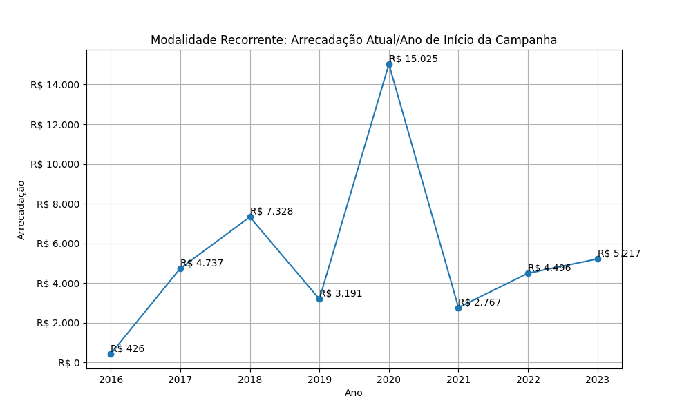

# Modalidade: Recorrente - Série Anual

> [!WARNING] 
> A iniciativa profico-hq não faz a coleta mensal dos dados e as plataformas
> de financiamento coletivo não publicam os dados históricos de arrecadação
> das campanhas recorrentes.
>
> A análise possível com os dados disponíveis é a fotografia do último dezembro,
> agrupando as campanhas pelo ano de início.

A tabela a seguir representa a série anual das campanhas na modalidade
Recorrente. Colunas:
- ano: ano de início da campanha;
- total: total de campanhas (em relação ao início da campanha);
- total_sucesso: total de campanhas bem sucedidas (em relação ao último dezembro);
- arrecadado_sucesso: valor total arrecadado pelas campanhas bem sucedidas (em relação ao último dezembro);
- taxa_sucesso: relação entre o total de campanhas bem sucedidas e o total de campanhas (em relação ao último dezembro);
- media_sucesso: valor arrecadado médio pelas campanhas bem sucedidas (em relação ao último dezembro).

|    ano |   total |   total_sucesso |   particip |   taxa_sucesso |   arrecadado_sucesso |   media_sucesso |   std_sucesso |   min_sucesso |   max_sucesso |   apoio_medio |   contribuicoes |   media_contribuicoes |
|-------:|--------:|----------------:|-----------:|---------------:|---------------------:|----------------:|--------------:|--------------:|--------------:|--------------:|----------------:|----------------------:|
|  2016  |      33 |               5 |     100,00 |         1.515,2 |               426,46 |           85,29 |         85,51 |          7,15 |        226,39 |         18,54 |              23 |                  4,60 |
|  2017  |     141 |              14 |     100,00 |          992,9 |              4.736,52 |          338,32 |        458,68 |         27,62 |       1.809,10 |         16,92 |             280 |                 20,00 |
|  2018  |      75 |              11 |     100,00 |         1.466,7 |              7.327,99 |          666,18 |       1.084,78 |         26,58 |       3.475,05 |         21,00 |             349 |                 31,73 |
|  2019  |      85 |              16 |     100,00 |         1.882,4 |              3.191,26 |          199,45 |        234,10 |         10,32 |        834,85 |         17,07 |             187 |                 11,69 |
|  2020  |     107 |              33 |     100,00 |         3.084,1 |             15.024,86 |          455,30 |       1.127,00 |          3,80 |       5.087,08 |         20,44 |             735 |                 22,27 |
|  2021  |      98 |              21 |     100,00 |         2.142,9 |              2.767,44 |          131,78 |        138,15 |          5,76 |        538,44 |         24,71 |             112 |                  5,33 |
|  2022  |      69 |              22 |     100,00 |         3.188,4 |              4.495,63 |          204,35 |        345,06 |          1,09 |       1.594,03 |         23,66 |             190 |                  8,64 |
|  2023  |      76 |              30 |     100,00 |         3.947,4 |              5.216,80 |          173,89 |        195,97 |          2,02 |        657,08 |         15,71 |             332 |                 11,07 |

## Gráficos

Série anual. Modalidade Recorrente: Total de Campanhas.

Série anual. Modalidade Recorrente: Total de Campanhas bem Sucedidas.

Série anual. Modalidade Recorrente: Arrecadação Anual.

Série anual. Modalidade Recorrente: Taxa de Sucesso.

Série anual. Modalidade Recorrente: Média Arrecadada.

