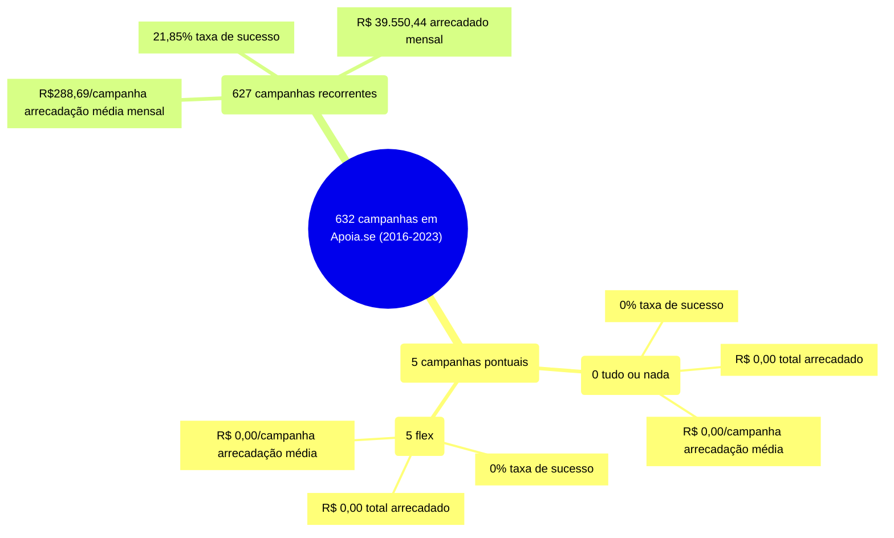

# Infográfico - Apoia.se

Caso particular: Apoia.se. O infográfico a seguir indica um total de 632 campanhas
no Apoia.se, entre 2016 e 2023. As campanhas pontuais totalizam 632 campanhas,
agrupadas em nenhuma campanha tudo ou nada e 5 flex. As campanhas recorrentes estão em 627.

