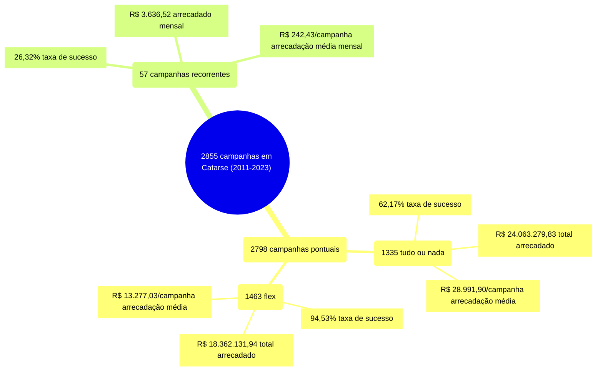

# Infográfico - Catarse

Caso particular: Catarse. O infográfico a seguir indica um total de 2855 campanhas
no Catarse, entre 2011 e 2023. As campanhas pontuais totalizam 2798 campanhas,
agrupadas em 1335 tudo ou nada e 1463 flex. As campanhas recorrentes estão em 57.

