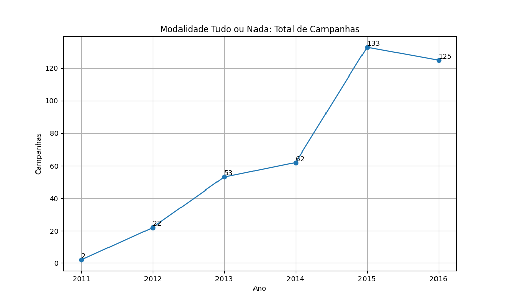
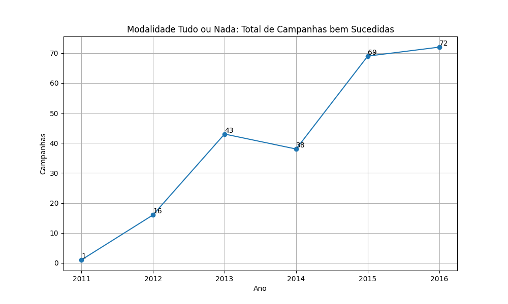
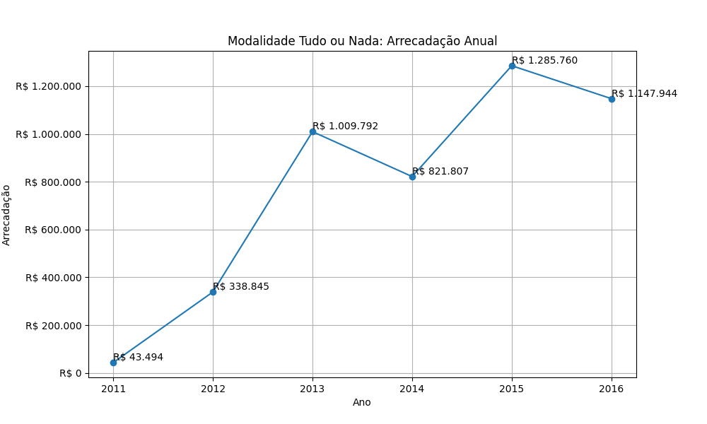
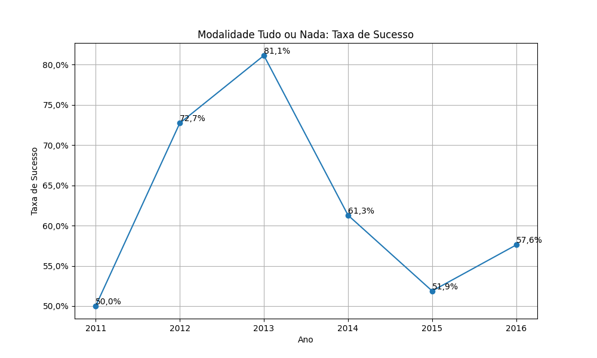
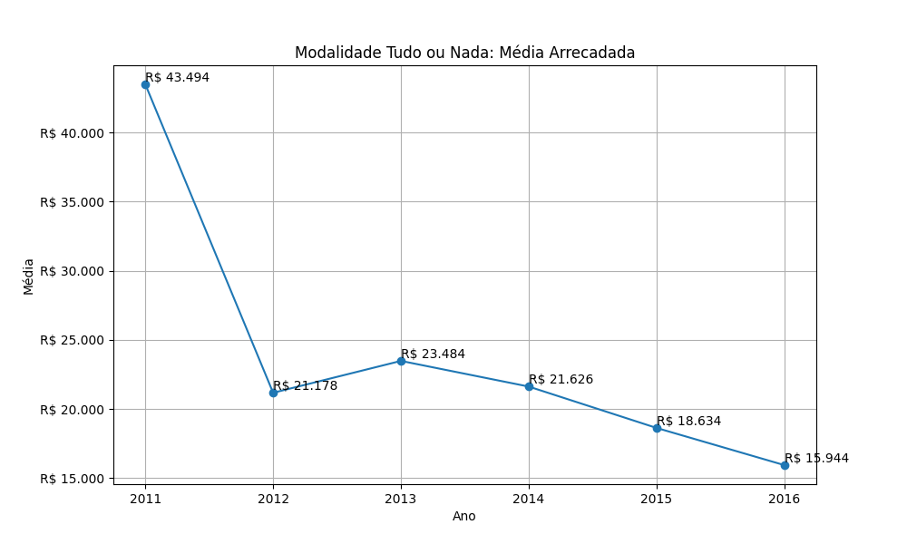

# Modalidade: Tudo ou Nada - Série Anual

A tabela a seguir representa a série anual das campanhas na modalidade
Tudo ou Nada.

|    ano |   total |   total_sucesso |   arrecadado_sucesso |   taxa_sucesso |   media_sucesso |
|-------:|--------:|----------------:|---------------------:|---------------:|----------------:|
|  2011  |       2 |               1 |             43.494,06 |           50,0 |        43.494,06 |
|  2012  |      22 |              16 |            338.845,26 |           72,7 |        21.177,83 |
|  2013  |      53 |              43 |           1.009.791,74 |           81,1 |        23.483,53 |
|  2014  |      62 |              38 |            821.806,65 |           61,3 |        21.626,49 |
|  2015  |     133 |              69 |           1.285.760,46 |           51,9 |        18.634,21 |
|  2016  |     125 |              72 |           1.147.944,29 |           57,6 |        15.943,67 |

## Gráficos

Série anual. Modalidade Tudo ou Nada: Total de Campanhas.

Série anual. Modalidade Tudo ou Nada: Total de Campanhas bem Sucedidas.

Série anual. Modalidade Tudo ou Nada: Arrecadação Anual.

Série anual. Modalidade Tudo ou Nada: Taxa de Sucesso.

Série anual. Modalidade Tudo ou Nada: Média Arrecadada.

