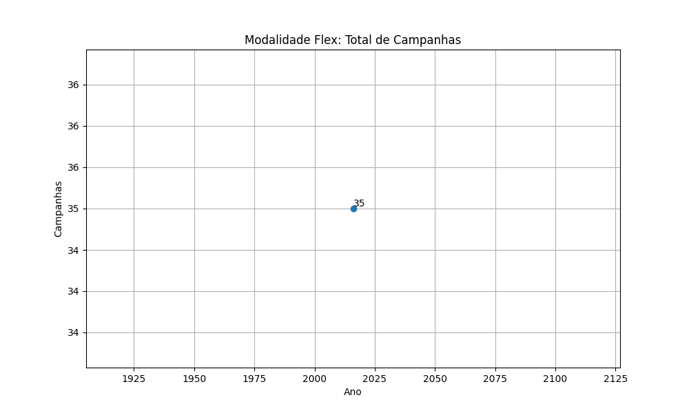
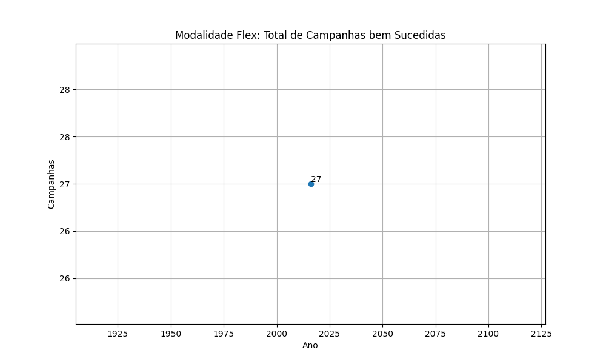
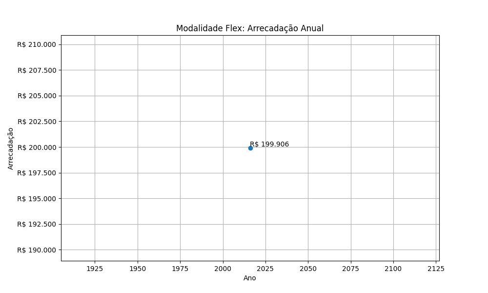
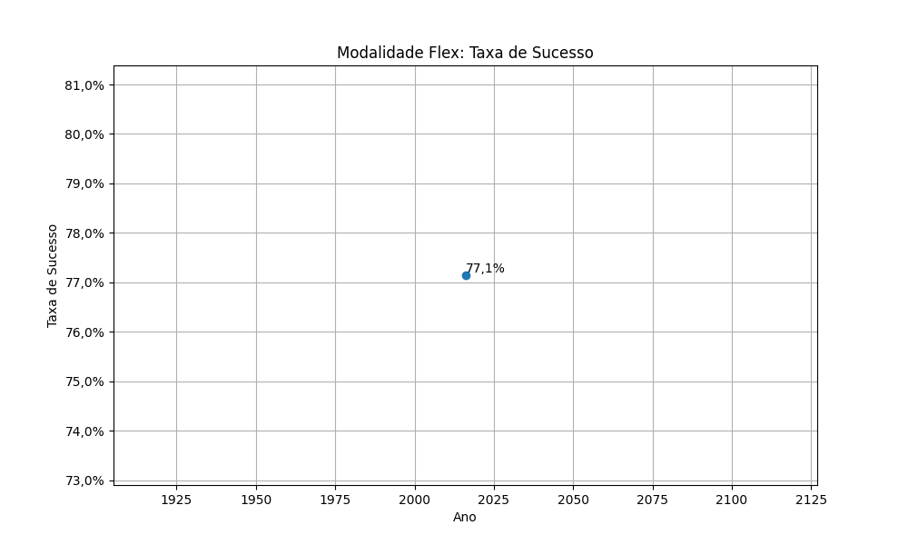
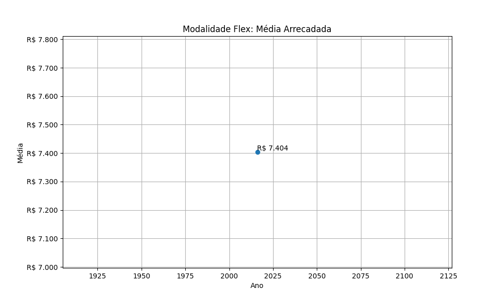

# Modalidade: Flex - Série Anual

A tabela a seguir representa a série anual das campanhas na modalidade
Flex.

|    ano |   total |   total_sucesso |   arrecadado_sucesso |   taxa_sucesso |   media_sucesso |
|-------:|--------:|----------------:|---------------------:|---------------:|----------------:|
|  2016  |      35 |              27 |            199.905,62 |           77,1 |         7.403,91 |

## Gráficos

Série anual. Modalidade Flex: Total de Campanhas.

Série anual. Modalidade Flex: Total de Campanhas bem Sucedidas.

Série anual. Modalidade Flex: Arrecadação Anual.

Série anual. Modalidade Flex: Taxa de Sucesso.

Série anual. Modalidade Flex: Média Arrecadada.

