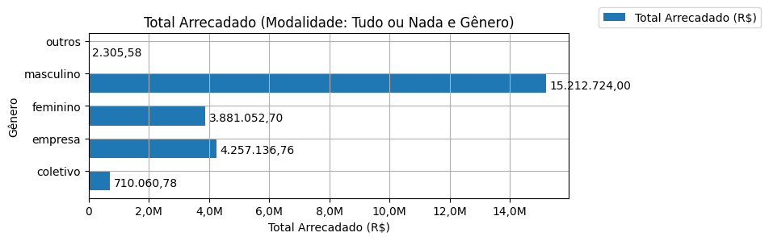
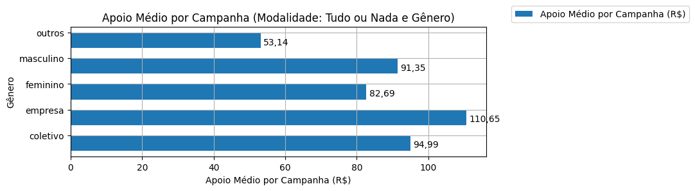
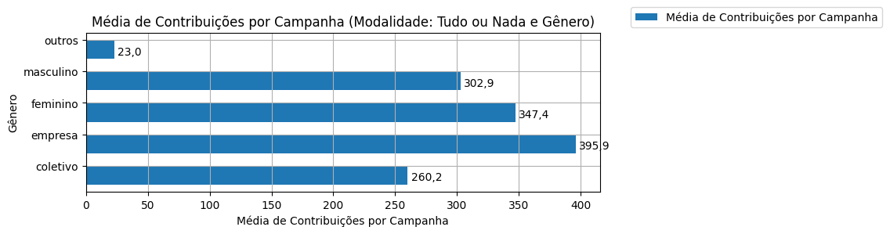

# Análise Descritiva - Recorte - Gênero

A tabela abaixo foi usada nos gráficos a seguir.

| modalidade   | autoria_classificacao   |   total |   total_sucesso |   particip (%) |   taxa_sucesso (%) |    meta (R$) |   meta_avg (R$) |   meta_std (R$) |   meta_min (R$) |   meta_max (R$) |   arrecadado_sucesso (R$) |   arrecadado_avg (R$) |   arrecadado_std (R$) |   arrecadado_min (R$) |   arrecadado_max (R$) |   apoio_medio (R$) |   apoio_std (R$) |   apoio_min (R$) |   apoio_max (R$) |   contribuicoes |   contribuicoes_med |   contribuicoes_std |   contribuicoes_min |   contribuicoes_max |
|:-------------|:------------------------|--------:|----------------:|---------------:|-------------------:|-------------:|----------------:|----------------:|----------------:|----------------:|--------------------------:|----------------------:|----------------------:|----------------------:|----------------------:|-------------------:|-----------------:|-----------------:|-----------------:|----------------:|--------------------:|--------------------:|--------------------:|--------------------:|
| aon          | coletivo                |      44 |              29 |           3,3% |              65,9% |   495.803,68 |       17.096,68 |       15.952,80 |        3.351,18 |       61.717,13 |                710.060,78 |             24.484,85 |             25.328,68 |              4.520,87 |            111.934,90 |              94,99 |            47,69 |            47,35 |           305,25 |           7.547 |               260,2 |               212,3 |                35,0 |               808,0 |
| aon          | empresa                 |     117 |              83 |           8,8% |              70,9% | 2.301.598,73 |       27.730,11 |       34.657,63 |           46,56 |      189.313,70 |              4.257.136,76 |             51.290,80 |             65.495,08 |                 54,54 |            264.585,91 |             110,65 |            45,13 |            39,23 |           257,79 |          32.860 |               395,9 |               378,2 |                 1,0 |             1.711,0 |
| aon          | feminino                |     209 |             140 |          15,7% |              67,0% | 2.221.303,50 |       15.866,45 |       11.237,68 |           31,90 |       80.883,37 |              3.881.052,70 |             27.721,81 |             48.958,87 |                 41,82 |            537.544,55 |              82,69 |            30,90 |            13,94 |           194,22 |          48.629 |               347,4 |               547,5 |                 3,0 |             5.879,0 |
| aon          | masculino               |     959 |             576 |          71,8% |              60,1% | 8.952.422,29 |       15.542,40 |       13.538,80 |           33,26 |       80.687,35 |             15.212.724,00 |             26.410,98 |             40.119,88 |                 94,90 |            679.297,66 |              91,35 |            52,58 |            21,62 |           792,04 |         174.471 |               302,9 |               401,4 |                 1,0 |             6.494,0 |
| aon          | outros                  |       6 |               2 |           0,4% |              33,3% |     1.914,40 |          957,20 |          774,64 |          409,45 |        1.504,95 |                  2.305,58 |              1.152,79 |                803,09 |                584,92 |              1.720,66 |              53,14 |             7,56 |            47,80 |            58,49 |              46 |                23,0 |                18,4 |                10,0 |                36,0 |

Dados em [planilha eletrônica](./dados/aon-genero.xlsx).

## Totais

O gráfico a seguir relaciona a modalidade com o total de campanhas e o total de campanhas bem sucedidas.

## Participação

O gráfico a seguir relaciona a modalidade com a participação de cada uma no conjunto de campanhas.

## Taxa de Sucesso

O gráfico a seguir relaciona a modalidade com a taxa de sucesso das campanhas.

## Meta Total

O gráfico a seguir relaciona a modalidade com a meta de arrecadação das campanhas bem sucedidas.

## Meta Média

O gráfico a seguir relaciona a modalidade com a meta média de arrecadação das campanhas bem sucedidas.

## Total Arrecadado

O gráfico a seguir relaciona a modalidade com o total arrecadado pelas campanhas bem sucedidas.

## Média Arrecadada por Campanha

O gráfico a seguir relaciona a modalidade com a média arrecadada por campanha bem sucedida.

## Apoio Médio por Campanha

O gráfico a seguir relaciona a modalidade com o apoio médio por campanha bem sucedida.

## Total de Contribuições

O gráfico a seguir relaciona a modalidade com o total de contribuições das campanhas bem sucedidas.

## Média de Contribuições

O gráfico a seguir relaciona a modalidade com a média de contribuições de campanhas bem sucedidas.

