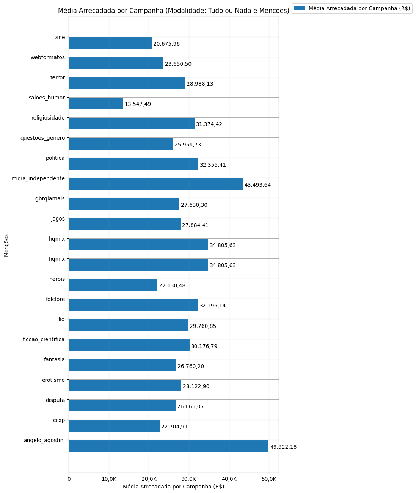

# Recorte - Menções

| modalidade   | mencao             |   total |   total_sucesso |   particip (%) |   taxa_sucesso (%) |   arrecadado_sucesso (R$) |   media_sucesso (R$) |   std_sucesso (R$) |   min_sucesso (R$) |   max_sucesso (R$) |   apoio_medio (R$) |   contribuicoes |   media_contribuicoes |
|:-------------|:-------------------|--------:|----------------:|---------------:|-------------------:|--------------------------:|---------------------:|-------------------:|-------------------:|-------------------:|-------------------:|----------------:|----------------------:|
| aon          | angelo_agostini    |      67 |              61 |           5,0% |              91,0% |              3.045.252,81 |            49.922,18 |         101.183,47 |           2.944,09 |         679.297,66 |              86,28 |          35.293 |                 578,6 |
| aon          | ccxp               |     156 |             126 |          11,7% |              80,8% |              2.860.818,44 |            22.704,91 |          20.582,18 |           1.720,66 |         154.365,98 |              82,84 |          34.535 |                 274,1 |
| aon          | disputa            |     400 |             245 |          30,0% |              61,3% |              6.532.941,88 |            26.665,07 |          27.722,18 |             787,10 |         163.173,27 |              92,63 |          70.527 |                 287,9 |
| aon          | erotismo           |     123 |              82 |           9,2% |              66,7% |              2.306.077,73 |            28.122,90 |          23.954,89 |           1.990,95 |         125.535,74 |              89,35 |          25.810 |                 314,8 |
| aon          | fantasia           |     279 |             180 |          20,9% |              64,5% |              4.816.835,60 |            26.760,20 |          30.295,09 |              94,90 |         264.585,91 |              89,17 |          54.018 |                 300,1 |
| aon          | ficcao_cientifica  |     296 |             179 |          22,2% |              60,5% |              5.401.646,15 |            30.176,79 |          46.623,44 |              54,54 |         537.544,55 |              87,79 |          61.529 |                 343,7 |
| aon          | fiq                |     219 |             162 |          16,4% |              74,0% |              4.821.257,85 |            29.760,85 |          38.181,98 |           1.405,43 |         396.557,50 |              87,74 |          54.948 |                 339,2 |
| aon          | folclore           |     200 |             140 |          15,0% |              70,0% |              4.507.319,89 |            32.195,14 |          45.455,39 |           1.081,47 |         396.557,50 |              86,73 |          51.967 |                 371,2 |
| aon          | herois             |     276 |             157 |          20,7% |              56,9% |              3.474.485,41 |            22.130,48 |          25.554,86 |             989,68 |         161.153,63 |              91,19 |          38.102 |                 242,7 |
| aon          | hqmix              |     122 |             108 |           9,1% |              88,5% |              3.759.007,87 |            34.805,63 |          76.815,19 |             787,10 |         679.297,66 |              89,17 |          42.155 |                 390,3 |
| aon          | hqmix              |     122 |             108 |           9,1% |              88,5% |              3.759.007,87 |            34.805,63 |          76.815,19 |             787,10 |         679.297,66 |              89,17 |          42.155 |                 390,3 |
| aon          | jogos              |     284 |             201 |          21,3% |              70,8% |              5.604.766,32 |            27.884,41 |          51.240,25 |           1.411,86 |         679.297,66 |              91,74 |          61.093 |                 303,9 |
| aon          | lgbtqiamais        |      82 |              58 |           6,1% |              70,7% |              1.602.557,62 |            27.630,30 |          38.892,54 |             721,79 |         264.456,52 |              89,66 |          17.873 |                 308,2 |
| aon          | midia_independente |     140 |              97 |          10,5% |              69,3% |              4.218.883,10 |            43.493,64 |          57.897,48 |           1.405,43 |         264.585,91 |             110,30 |          38.250 |                 394,3 |
| aon          | politica           |     240 |             154 |          18,0% |              64,2% |              4.982.733,19 |            32.355,41 |          34.162,57 |              54,54 |         215.281,29 |              96,02 |          51.893 |                 337,0 |
| aon          | questoes_genero    |      35 |              24 |           2,6% |              68,6% |                622.913,46 |            25.954,73 |          26.184,68 |           3.366,14 |         123.112,70 |              82,30 |           7.569 |                 315,4 |
| aon          | religiosidade      |     360 |             211 |          27,0% |              58,6% |              6.620.001,80 |            31.374,42 |          59.614,09 |             322,20 |         679.297,66 |              87,51 |          75.649 |                 358,5 |
| aon          | saloes_humor       |      16 |              12 |           1,2% |              75,0% |                162.569,93 |            13.547,49 |          10.287,95 |             459,39 |          29.349,35 |              72,48 |           2.243 |                 186,9 |
| aon          | terror             |     496 |             327 |          37,2% |              65,9% |              9.479.119,39 |            28.988,13 |          51.783,65 |             787,10 |         679.297,66 |              87,30 |         108.579 |                 332,0 |
| aon          | webformatos        |     119 |              89 |           8,9% |              74,8% |              2.104.894,58 |            23.650,50 |          22.257,37 |           3.458,60 |         136.747,60 |              82,97 |          25.369 |                 285,0 |
| aon          | zine               |     164 |             112 |          12,3% |              68,3% |              2.315.707,64 |            20.675,96 |          20.218,38 |              54,54 |         161.153,63 |              81,12 |          28.547 |                 254,9 |

Dados em [planilha eletrônica](./dados/aon-mencoes.xlsx).

## Totais

O gráfico a seguir relaciona a modalidade com o total de campanhas e o total de campanhas bem sucedidas.

## Participação

O gráfico a seguir relaciona a modalidade com a participação de cada uma no conjunto de campanhas.

## Taxa de Sucesso

O gráfico a seguir relaciona a modalidade com a taxa de sucesso das campanhas.

## Total Arrecadado

O gráfico a seguir relaciona a modalidade com o total arrecadado pelas campanhas.

## Média Arrecadada por Campanha

O gráfico a seguir relaciona a modalidade com a média arrecadada por campanha.

## Apoio Médio por Campanha

O gráfico a seguir relaciona a modalidade com o apoio médio por campanha.

## Total de Contribuições

O gráfico a seguir relaciona a modalidade com o total de contribuições das campanhas.

## Média de Contribuições

O gráfico a seguir relaciona a modalidade com a média de contribuições de campanhas.

