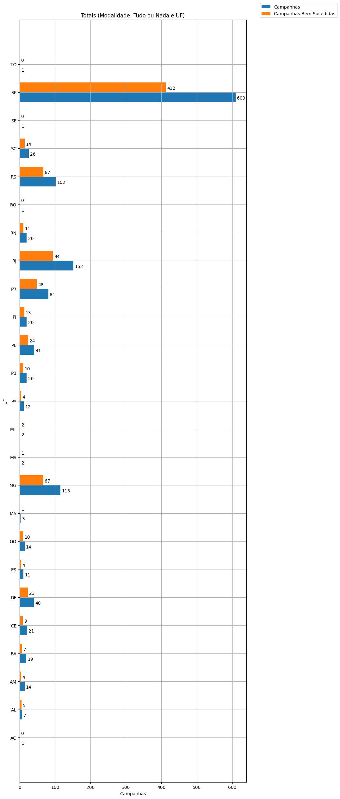
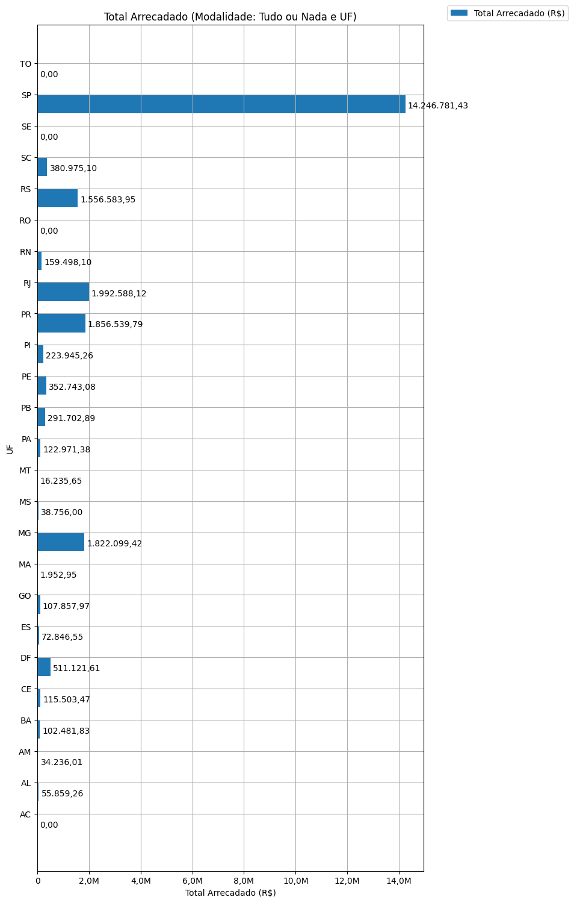
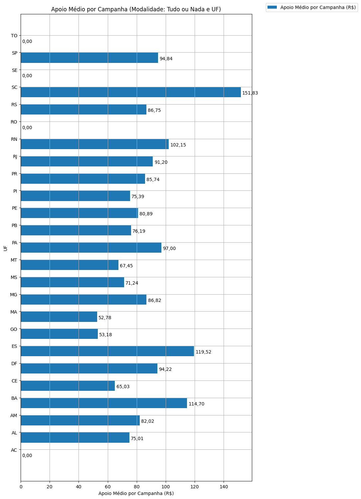
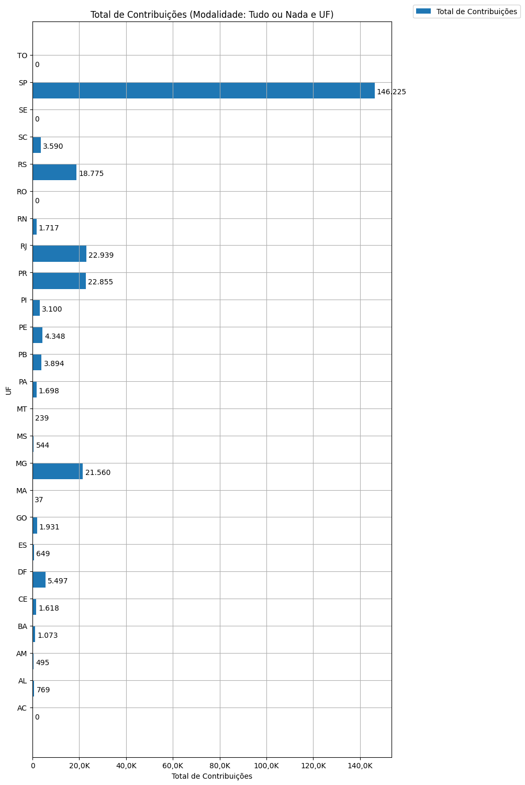

# Análise Descritiva - Recorte - UF

A tabela abaixo foi usada nos gráficos a seguir.

| modalidade   | geral_uf_br   |   total |   total_sucesso |   particip (%) |   taxa_sucesso (%) |    meta (R$) |   meta_avg (R$) |   meta_std (R$) |   meta_min (R$) |   meta_max (R$) |   arrecadado_sucesso (R$) |   arrecadado_avg (R$) |   arrecadado_std (R$) |   arrecadado_min (R$) |   arrecadado_max (R$) |   apoio_medio (R$) |   apoio_std (R$) |   apoio_min (R$) |   apoio_max (R$) |   contribuicoes |   contribuicoes_med |   contribuicoes_std |   contribuicoes_min |   contribuicoes_max |
|:-------------|:--------------|--------:|----------------:|---------------:|-------------------:|-------------:|----------------:|----------------:|----------------:|----------------:|--------------------------:|----------------------:|----------------------:|----------------------:|----------------------:|-------------------:|-----------------:|-----------------:|-----------------:|----------------:|--------------------:|--------------------:|--------------------:|--------------------:|
| aon          | AC            |       1 |               0 |           0,1% |               0,0% |         0,00 |            0,00 |            0,00 |            0,00 |            0,00 |                      0,00 |                  0,00 |                  0,00 |                  0,00 |                  0,00 |               0,00 |             0,00 |             0,00 |             0,00 |               0 |                 0,0 |                 0,0 |                 0,0 |                 0,0 |
| aon          | AL            |       7 |               5 |           0,5% |              71,4% |    48.574,16 |        9.714,83 |        3.182,29 |        5.799,08 |       14.175,53 |                 55.859,26 |             11.171,85 |              3.760,92 |              6.855,80 |             15.562,69 |              75,01 |            20,85 |            51,16 |            98,19 |             769 |               153,8 |                48,5 |                80,0 |               197,0 |
| aon          | AM            |      14 |               4 |           1,0% |              28,6% |    27.588,90 |        6.897,23 |        4.267,71 |        3.231,49 |       11.569,17 |                 34.236,01 |              8.559,00 |              4.714,56 |              3.774,42 |             12.904,88 |              82,02 |            38,64 |            42,74 |           130,15 |             495 |               123,8 |                75,2 |                29,0 |               213,0 |
| aon          | BA            |      19 |               7 |           1,4% |              36,8% |    84.457,51 |       12.065,36 |        7.645,53 |        3.558,12 |       26.201,51 |                102.481,83 |             14.640,26 |              8.108,09 |              4.203,66 |             28.456,51 |             114,70 |            55,15 |            41,37 |           191,08 |           1.073 |               153,3 |                92,8 |                22,0 |               322,0 |
| aon          | CE            |      21 |               9 |           1,6% |              42,9% |    71.775,24 |        7.975,03 |        9.559,93 |          601,98 |       31.271,52 |                115.503,47 |             12.833,72 |             13.733,43 |              1.334,39 |             41.422,60 |              65,03 |            24,04 |            35,12 |           101,69 |           1.618 |               179,8 |               153,1 |                28,0 |               444,0 |
| aon          | DF            |      40 |              23 |           3,0% |              57,5% |   379.739,66 |       16.510,42 |       10.943,80 |           31,90 |       41.808,07 |                511.121,61 |             22.222,68 |             16.473,47 |                 41,82 |             75.796,33 |              94,22 |            33,77 |            13,94 |           172,17 |           5.497 |               239,0 |               182,7 |                 3,0 |               748,0 |
| aon          | ES            |      11 |               4 |           0,8% |              36,4% |    56.472,01 |       14.118,00 |       11.499,51 |        1.331,95 |       25.588,54 |                 72.846,55 |             18.211,64 |             17.231,56 |              1.411,86 |             39.851,60 |             119,52 |            92,06 |            35,30 |           250,62 |             649 |               162,2 |               184,6 |                40,0 |               437,0 |
| aon          | GO            |      14 |              10 |           1,0% |              71,4% |    73.391,82 |        7.339,18 |        4.193,85 |          125,94 |       14.518,07 |                107.857,97 |             10.785,80 |              7.069,02 |                787,10 |             25.867,99 |              53,18 |            13,76 |            23,15 |            74,36 |           1.931 |               193,1 |               114,4 |                34,0 |               413,0 |
| aon          | MA            |       3 |               1 |           0,2% |              33,3% |     1.583,47 |        1.583,47 |            0,00 |        1.583,47 |        1.583,47 |                  1.952,95 |              1.952,95 |                  0,00 |              1.952,95 |              1.952,95 |              52,78 |             0,00 |            52,78 |            52,78 |              37 |                37,0 |                 0,0 |                37,0 |                37,0 |
| aon          | MG            |     115 |              67 |           8,6% |              58,3% | 1.127.892,61 |       16.834,22 |       12.969,00 |           46,54 |       65.717,74 |              1.822.099,42 |             27.195,51 |             26.573,25 |              1.204,08 |            136.747,60 |              86,82 |            37,51 |            36,81 |           258,40 |          21.560 |               321,8 |               276,8 |                21,0 |             1.361,0 |
| aon          | MS            |       2 |               1 |           0,1% |              50,0% |    11.084,45 |       11.084,45 |            0,00 |       11.084,45 |       11.084,45 |                 38.756,00 |             38.756,00 |                  0,00 |             38.756,00 |             38.756,00 |              71,24 |             0,00 |            71,24 |            71,24 |             544 |               544,0 |                 0,0 |               544,0 |               544,0 |
| aon          | MT            |       2 |               2 |           0,1% |             100,0% |    11.230,87 |        5.615,43 |        1.722,12 |        4.397,71 |        6.833,16 |                 16.235,65 |              8.117,82 |              3.144,46 |              5.894,35 |             10.341,30 |              67,45 |             2,77 |            65,49 |            69,40 |             239 |               119,5 |                41,7 |                90,0 |               149,0 |
| aon          | PA            |      12 |               4 |           0,9% |              33,3% |    62.726,67 |       15.681,67 |       10.103,75 |        4.685,23 |       25.410,31 |                122.971,38 |             30.742,85 |              3.871,10 |             25.693,41 |             34.218,60 |              97,00 |            65,26 |            47,75 |           192,11 |           1.698 |               424,5 |               242,7 |               155,0 |               697,0 |
| aon          | PB            |      20 |              10 |           1,5% |              50,0% |   226.667,44 |       22.666,74 |       11.772,74 |        8.447,34 |       39.165,09 |                291.702,89 |             29.170,29 |             16.041,93 |              9.446,95 |             56.551,80 |              76,19 |            20,84 |            50,22 |           129,61 |           3.894 |               389,4 |               213,7 |               136,0 |               781,0 |
| aon          | PE            |      41 |              24 |           3,1% |              58,5% |   259.175,16 |       10.798,96 |        8.499,32 |           46,56 |       33.931,19 |                352.743,08 |             14.697,63 |             11.661,97 |                 54,54 |             42.305,25 |              80,89 |            25,31 |            50,76 |           178,87 |           4.348 |               181,2 |               136,9 |                 1,0 |               470,0 |
| aon          | PI            |      20 |              13 |           1,5% |              65,0% |   135.622,12 |       10.432,47 |        6.592,18 |        2.158,08 |       24.435,30 |                223.945,26 |             17.226,56 |              9.924,30 |              5.066,02 |             39.440,42 |              75,39 |            19,71 |            49,17 |           106,38 |           3.100 |               238,5 |               132,2 |                48,0 |               425,0 |
| aon          | PR            |      81 |              48 |           6,1% |              59,3% |   840.102,50 |       17.502,14 |       11.911,07 |           33,26 |       45.587,37 |              1.856.539,79 |             38.677,91 |             78.534,96 |                792,14 |            537.544,55 |              85,74 |            43,07 |            43,65 |           305,25 |          22.855 |               476,1 |               890,1 |                11,0 |             5.879,0 |
| aon          | RJ            |     152 |              94 |          11,4% |              61,8% | 1.266.827,04 |       13.476,88 |       11.543,02 |           36,54 |       63.433,81 |              1.992.588,12 |             21.197,75 |             24.242,49 |                143,20 |            154.365,98 |              91,20 |            52,20 |            28,94 |           362,04 |          22.939 |               244,0 |               265,7 |                 3,0 |             1.815,0 |
| aon          | RN            |      20 |              11 |           1,5% |              55,0% |   125.865,39 |       11.442,31 |        5.126,92 |        3.356,28 |       19.376,71 |                159.498,10 |             14.499,83 |              5.851,10 |              3.938,46 |             23.993,89 |             102,15 |            45,12 |            51,82 |           194,22 |           1.717 |               156,1 |                83,6 |                75,0 |               323,0 |
| aon          | RO            |       1 |               0 |           0,1% |               0,0% |         0,00 |            0,00 |            0,00 |            0,00 |            0,00 |                      0,00 |                  0,00 |                  0,00 |                  0,00 |                  0,00 |               0,00 |             0,00 |             0,00 |             0,00 |               0 |                 0,0 |                 0,0 |                 0,0 |                 0,0 |
| aon          | RS            |     102 |              67 |           7,6% |              65,7% |   945.832,07 |       14.116,90 |       10.949,19 |          125,94 |       50.030,56 |              1.556.583,95 |             23.232,60 |             18.896,23 |              1.496,11 |             85.108,68 |              86,75 |            36,02 |            30,35 |           185,96 |          18.775 |               280,2 |               236,5 |                13,0 |             1.463,0 |
| aon          | SC            |      26 |              14 |           1,9% |              53,8% |   278.860,90 |       19.918,64 |       16.261,01 |        5.055,21 |       62.551,60 |                380.975,10 |             27.212,51 |             24.288,71 |              5.156,31 |             82.775,70 |             151,83 |           186,34 |            56,71 |           792,04 |           3.590 |               256,4 |               286,6 |                55,0 |             1.113,0 |
| aon          | SE            |       1 |               0 |           0,1% |               0,0% |         0,00 |            0,00 |            0,00 |            0,00 |            0,00 |                      0,00 |                  0,00 |                  0,00 |                  0,00 |                  0,00 |               0,00 |             0,00 |             0,00 |             0,00 |               0 |                 0,0 |                 0,0 |                 0,0 |                 0,0 |
| aon          | SP            |     609 |             412 |          45,6% |              67,7% | 7.937.572,62 |       19.265,95 |       20.983,25 |           37,28 |      189.313,70 |             14.246.781,43 |             34.579,57 |             53.785,60 |                 94,90 |            679.297,66 |              94,84 |            43,75 |            21,62 |           355,42 |         146.225 |               354,9 |               461,7 |                 1,0 |             6.494,0 |
| aon          | TO            |       1 |               0 |           0,1% |               0,0% |         0,00 |            0,00 |            0,00 |            0,00 |            0,00 |                      0,00 |                  0,00 |                  0,00 |                  0,00 |                  0,00 |               0,00 |             0,00 |             0,00 |             0,00 |               0 |                 0,0 |                 0,0 |                 0,0 |                 0,0 |

Dados em [planilha eletrônica](./dados/aon-uf.xlsx).

## Totais

O gráfico a seguir relaciona a modalidade com o total de campanhas e o total de campanhas bem sucedidas.

## Participação

O gráfico a seguir relaciona a modalidade com a participação de cada uma no conjunto de campanhas.

## Taxa de Sucesso

O gráfico a seguir relaciona a modalidade com a taxa de sucesso das campanhas.

## Meta Total

O gráfico a seguir relaciona a modalidade com a meta de arrecadação das campanhas bem sucedidas.

## Meta Média

O gráfico a seguir relaciona a modalidade com a meta média de arrecadação das campanhas bem sucedidas.

## Total Arrecadado

O gráfico a seguir relaciona a modalidade com o total arrecadado pelas campanhas bem sucedidas.

## Média Arrecadada por Campanha

O gráfico a seguir relaciona a modalidade com a média arrecadada por campanha bem sucedida.

## Apoio Médio por Campanha

O gráfico a seguir relaciona a modalidade com o apoio médio por campanha bem sucedida.

## Total de Contribuições

O gráfico a seguir relaciona a modalidade com o total de contribuições das campanhas bem sucedidas.

## Média de Contribuições

O gráfico a seguir relaciona a modalidade com a média de contribuições de campanhas bem sucedidas.

