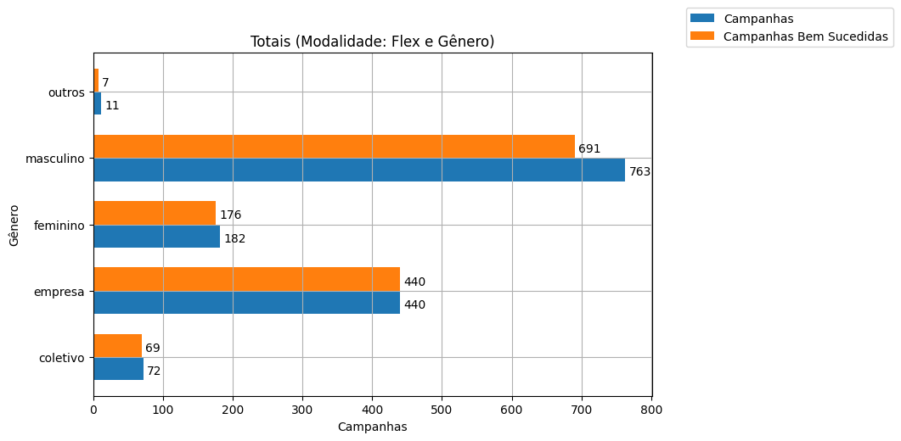
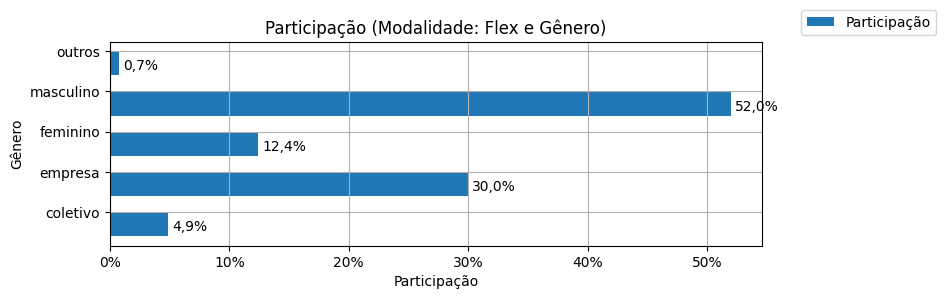
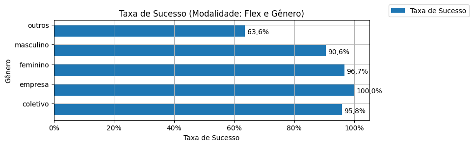
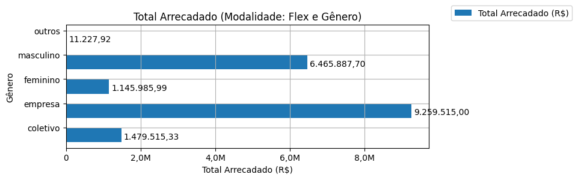
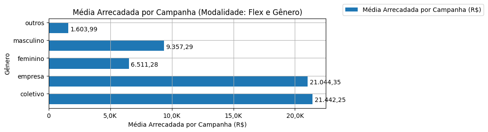
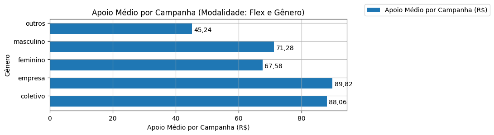
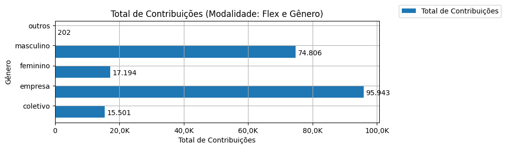
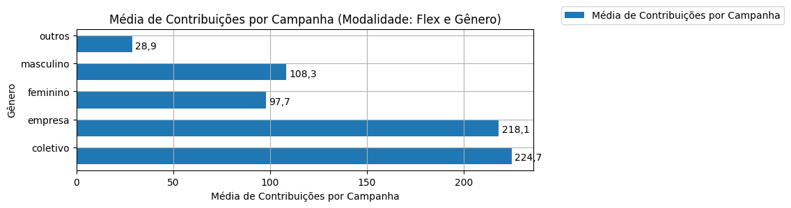

# Análise Descritiva - Recorte - Gênero

A tabela abaixo foi usada nos gráficos a seguir.

| modalidade   | autoria_classificacao   |   total |   total_sucesso |   particip (%) |   taxa_sucesso (%) |   arrecadado_sucesso (R$) |   arrecadado_avg (R$) |   arrecadado_std (R$) |   arrecadado_min (R$) |   arrecadado_max (R$) |   apoio_medio (R$) |   apoio_std (R$) |   apoio_min (R$) |   apoio_max (R$) |   contribuicoes |   contribuicoes_med |   contribuicoes_std |   contribuicoes_min |   contribuicoes_max |
|:-------------|:------------------------|--------:|----------------:|---------------:|-------------------:|--------------------------:|----------------------:|----------------------:|----------------------:|----------------------:|-------------------:|-----------------:|-----------------:|-----------------:|----------------:|--------------------:|--------------------:|--------------------:|--------------------:|
| flex         | coletivo                |      72 |              69 |           4,9% |              95,8% |              1.479.515,33 |             21.442,25 |             34.235,40 |                 29,81 |            169.836,91 |              88,06 |            47,97 |            14,91 |           254,24 |          15.501 |               224,7 |               325,0 |                 1,0 |             2.015,0 |
| flex         | empresa                 |     440 |             440 |          30,0% |             100,0% |              9.259.515,00 |             21.044,35 |             46.143,04 |                 34,74 |            708.972,78 |              89,82 |            37,90 |            16,18 |           233,40 |          95.943 |               218,1 |               486,2 |                 1,0 |             7.954,0 |
| flex         | feminino                |     182 |             176 |          12,4% |              96,7% |              1.145.985,99 |              6.511,28 |              6.521,40 |                 35,53 |             29.736,69 |              67,58 |            23,29 |            18,48 |           154,85 |          17.194 |                97,7 |                95,8 |                 1,0 |               453,0 |
| flex         | masculino               |     763 |             691 |          52,0% |              90,6% |              6.465.887,70 |              9.357,29 |             27.421,05 |                 10,77 |            442.290,11 |              71,28 |            40,79 |            10,77 |           461,52 |          74.806 |               108,3 |               214,1 |                 1,0 |             3.474,0 |
| flex         | outros                  |      11 |               7 |           0,7% |              63,6% |                 11.227,92 |              1.603,99 |              2.112,50 |                 42,36 |              5.515,84 |              45,24 |            14,93 |            21,18 |            63,40 |             202 |                28,9 |                34,7 |                 2,0 |                87,0 |

Dados em [planilha eletrônica](./dados/flex-genero.xlsx).

## Totais

O gráfico a seguir relaciona a modalidade com o total de campanhas e o total de campanhas bem sucedidas.

## Participação

O gráfico a seguir relaciona a modalidade com a participação de cada uma no conjunto de campanhas.

## Taxa de Sucesso

O gráfico a seguir relaciona a modalidade com a taxa de sucesso das campanhas.

## Total Arrecadado

O gráfico a seguir relaciona a modalidade com o total arrecadado pelas campanhas.

## Média Arrecadada por Campanha

O gráfico a seguir relaciona a modalidade com a média arrecadada por campanha.

## Apoio Médio por Campanha

O gráfico a seguir relaciona a modalidade com o apoio médio por campanha.

## Total de Contribuições

O gráfico a seguir relaciona a modalidade com o total de contribuições das campanhas.

## Média de Contribuições

O gráfico a seguir relaciona a modalidade com a média de contribuições de campanhas.

