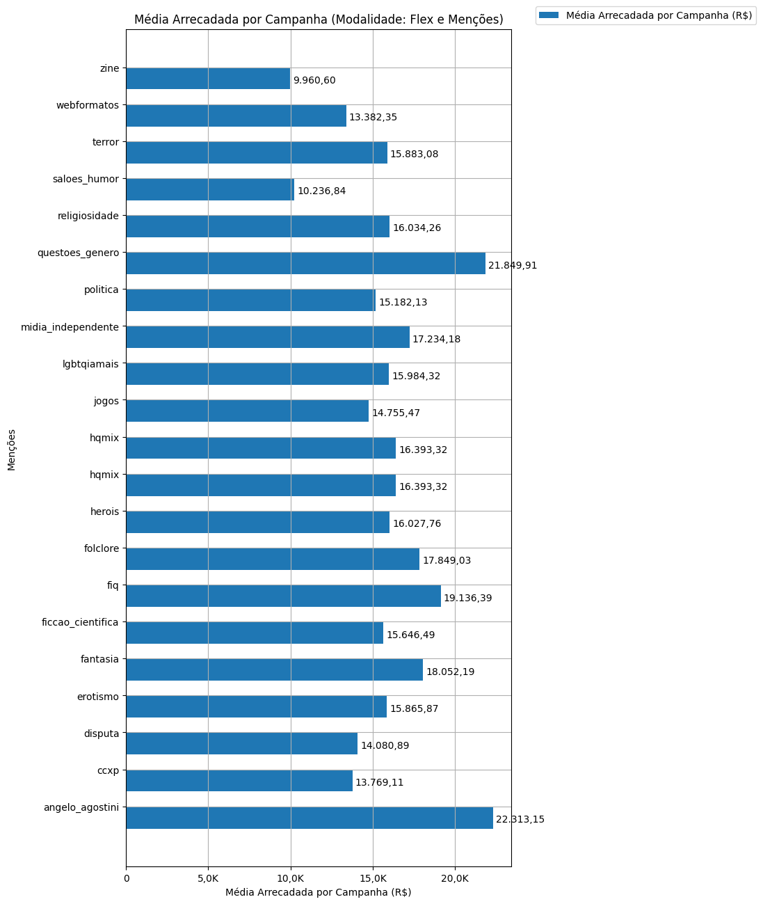
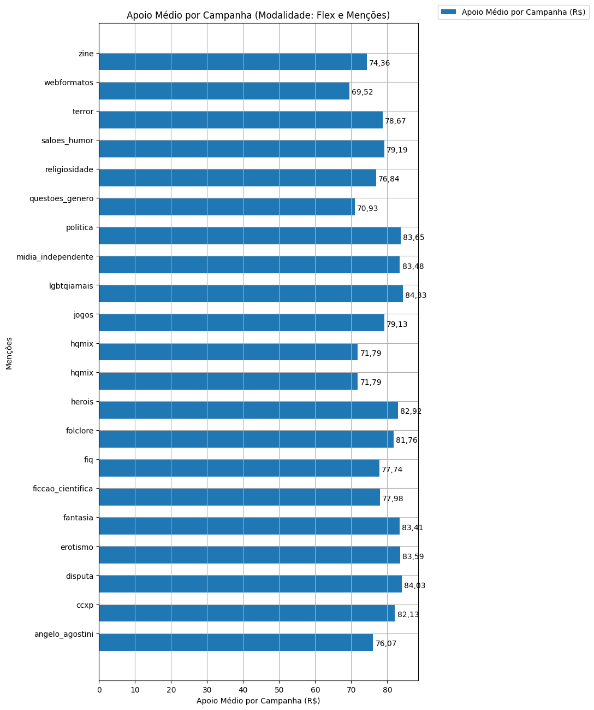
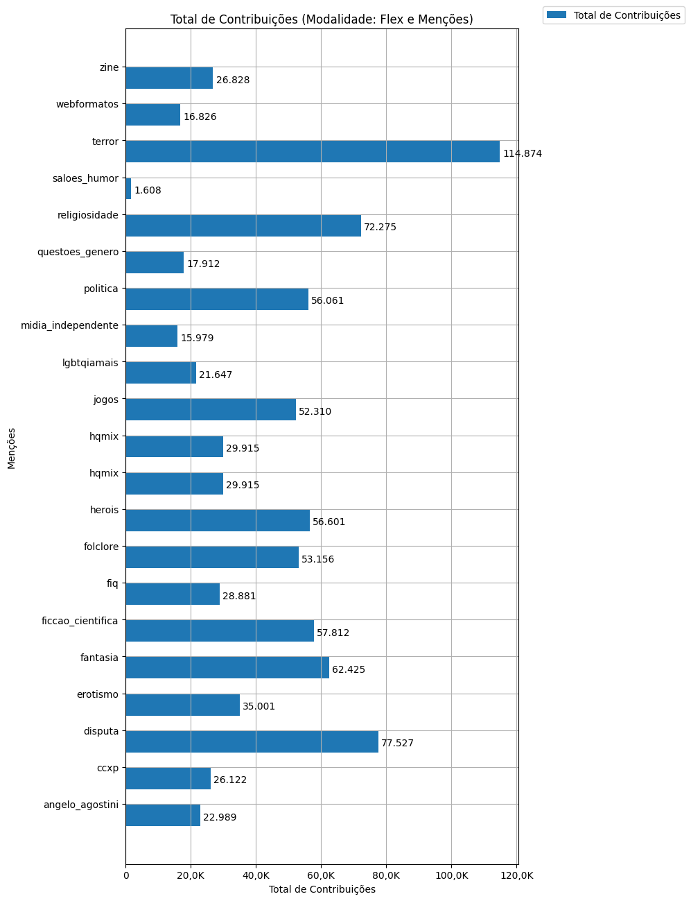
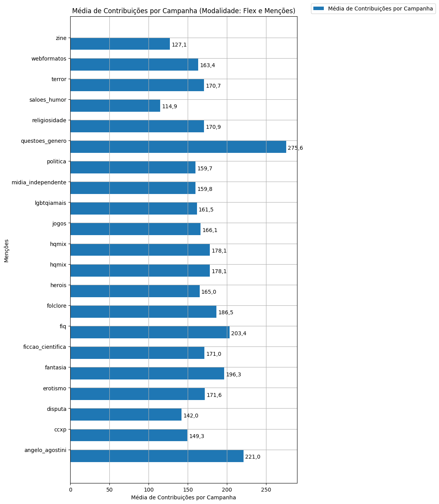

# Análise Descritiva - Recorte - Menções

A tabela abaixo foi usada nos gráficos a seguir.

| modalidade   | mencao             |   total |   total_sucesso |   particip (%) |   taxa_sucesso (%) |   arrecadado_sucesso (R$) |   media_sucesso (R$) |   std_sucesso (R$) |   min_sucesso (R$) |   max_sucesso (R$) |   apoio_medio (R$) |   contribuicoes |   media_contribuicoes |
|:-------------|:-------------------|--------:|----------------:|---------------:|-------------------:|--------------------------:|---------------------:|-------------------:|-------------------:|-------------------:|-------------------:|----------------:|----------------------:|
| flex         | angelo_agostini    |     104 |             104 |           7,1% |             100,0% |              2.320.567,95 |            22.313,15 |          59.701,59 |             458,93 |         442.290,11 |             100,94 |          22.989 |                 221,0 |
| flex         | ccxp               |     175 |             175 |          11,9% |             100,0% |              2.409.594,20 |            13.769,11 |          21.333,70 |             313,27 |         121.747,80 |              92,24 |          26.122 |                 149,3 |
| flex         | disputa            |     568 |             546 |          38,7% |              96,1% |              7.688.166,01 |            14.080,89 |          20.311,27 |              11,93 |         133.707,59 |              99,17 |          77.527 |                 142,0 |
| flex         | erotismo           |     207 |             204 |          14,1% |              98,6% |              3.236.637,62 |            15.865,87 |          25.100,56 |              45,24 |         200.069,51 |              92,47 |          35.001 |                 171,6 |
| flex         | fantasia           |     326 |             318 |          22,2% |              97,5% |              5.740.597,02 |            18.052,19 |          45.474,47 |              43,14 |         708.972,78 |              91,96 |          62.425 |                 196,3 |
| flex         | ficcao_cientifica  |     352 |             338 |          24,0% |              96,0% |              5.288.513,61 |            15.646,49 |          42.686,00 |              10,77 |         708.972,78 |              91,48 |          57.812 |                 171,0 |
| flex         | fiq                |     147 |             142 |          10,0% |              96,6% |              2.717.367,00 |            19.136,39 |          63.151,50 |              39,63 |         708.972,78 |              94,09 |          28.881 |                 203,4 |
| flex         | folclore           |     291 |             285 |          19,8% |              97,9% |              5.086.973,71 |            17.849,03 |          48.299,83 |              55,43 |         708.972,78 |              95,70 |          53.156 |                 186,5 |
| flex         | herois             |     354 |             343 |          24,1% |              96,9% |              5.497.521,58 |            16.027,76 |          26.716,10 |              11,93 |         203.551,22 |              97,13 |          56.601 |                 165,0 |
| flex         | hqmix              |     168 |             168 |          11,4% |             100,0% |              2.754.078,50 |            16.393,32 |          47.599,93 |             105,57 |         442.290,11 |              92,06 |          29.915 |                 178,1 |
| flex         | hqmix              |     168 |             168 |          11,4% |             100,0% |              2.754.078,50 |            16.393,32 |          47.599,93 |             105,57 |         442.290,11 |              92,06 |          29.915 |                 178,1 |
| flex         | jogos              |     321 |             315 |          21,9% |              98,1% |              4.647.973,18 |            14.755,47 |          32.882,80 |              40,22 |         475.290,95 |              88,85 |          52.310 |                 166,1 |
| flex         | lgbtqiamais        |     135 |             134 |           9,2% |              99,3% |              2.141.898,62 |            15.984,32 |          20.504,04 |              23,05 |         103.442,87 |              98,95 |          21.647 |                 161,5 |
| flex         | midia_independente |     105 |             100 |           7,2% |              95,2% |              1.723.418,10 |            17.234,18 |          24.079,23 |              42,01 |         133.783,37 |             107,86 |          15.979 |                 159,8 |
| flex         | politica           |     359 |             351 |          24,5% |              97,8% |              5.328.925,88 |            15.182,13 |          21.474,72 |              28,49 |         157.001,80 |              95,06 |          56.061 |                 159,7 |
| flex         | questoes_genero    |      66 |              65 |           4,5% |              98,5% |              1.420.244,30 |            21.849,91 |          87.169,62 |             100,54 |         708.972,78 |              79,29 |          17.912 |                 275,6 |
| flex         | religiosidade      |     436 |             423 |          29,7% |              97,0% |              6.782.493,26 |            16.034,26 |          48.218,37 |              42,01 |         708.972,78 |              93,84 |          72.275 |                 170,9 |
| flex         | saloes_humor       |      14 |              14 |           1,0% |             100,0% |                143.315,79 |            10.236,84 |          15.061,82 |              88,75 |          50.948,86 |              89,13 |           1.608 |                 114,9 |
| flex         | terror             |     684 |             673 |          46,6% |              98,4% |             10.689.312,43 |            15.883,08 |          41.769,03 |              29,81 |         708.972,78 |              93,05 |         114.874 |                 170,7 |
| flex         | webformatos        |     105 |             103 |           7,2% |              98,1% |              1.378.381,62 |            13.382,35 |          46.750,77 |             298,26 |         475.290,95 |              81,92 |          16.826 |                 163,4 |
| flex         | zine               |     212 |             211 |          14,4% |              99,5% |              2.101.687,07 |             9.960,60 |          16.847,68 |              35,53 |         200.069,51 |              78,34 |          26.828 |                 127,1 |

Dados em [planilha eletrônica](./dados/flex-mencoes.xlsx).

## Totais

O gráfico a seguir relaciona a modalidade com o total de campanhas e o total de campanhas bem sucedidas.

## Participação

O gráfico a seguir relaciona a modalidade com a participação de cada uma no conjunto de campanhas.

## Taxa de Sucesso

O gráfico a seguir relaciona a modalidade com a taxa de sucesso das campanhas.

## Total Arrecadado

O gráfico a seguir relaciona a modalidade com o total arrecadado pelas campanhas.

## Média Arrecadada por Campanha

O gráfico a seguir relaciona a modalidade com a média arrecadada por campanha.

## Apoio Médio por Campanha

O gráfico a seguir relaciona a modalidade com o apoio médio por campanha.

## Total de Contribuições

O gráfico a seguir relaciona a modalidade com o total de contribuições das campanhas.

## Média de Contribuições

O gráfico a seguir relaciona a modalidade com a média de contribuições de campanhas.

