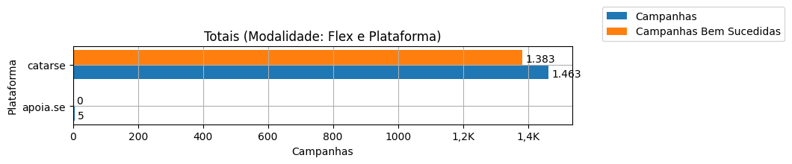

# Análise Descritiva - Recorte - Plataforma

A tabela abaixo foi usada nos gráficos a seguir.

| modalidade   | origem   |   total |   total_sucesso |   particip (%) |   taxa_sucesso (%) |     meta (R$) |   meta_avg (R$) |   meta_std (R$) |   meta_min (R$) |   meta_max (R$) |   arrecadado_sucesso (R$) |   arrecadado_avg (R$) |   arrecadado_std (R$) |   arrecadado_min (R$) |   arrecadado_max (R$) |   apoio_medio (R$) |   apoio_std (R$) |   apoio_min (R$) |   apoio_max (R$) |   contribuicoes |   contribuicoes_med |   contribuicoes_std |   contribuicoes_min |   contribuicoes_max |
|:-------------|:---------|--------:|----------------:|---------------:|-------------------:|--------------:|----------------:|----------------:|----------------:|----------------:|--------------------------:|----------------------:|----------------------:|----------------------:|----------------------:|-------------------:|-----------------:|-----------------:|-----------------:|----------------:|--------------------:|--------------------:|--------------------:|--------------------:|
| flex         | apoia.se |       5 |               0 |           0,3% |               0,0% |          0,00 |            0,00 |            0,00 |            0,00 |            0,00 |                      0,00 |                  0,00 |                  0,00 |                  0,00 |                  0,00 |               0,00 |             0,00 |             0,00 |             0,00 |               0 |                 0,0 |                 0,0 |                 0,0 |                 0,0 |
| flex         | catarse  |   1.463 |           1.383 |          99,7% |              94,5% | 15.599.716,70 |       11.279,62 |       16.430,31 |           12,04 |      198.811,94 |             18.362.131,94 |             13.277,03 |             33.934,83 |                 10,77 |            708.972,78 |              77,41 |            39,51 |            10,77 |           461,52 |         203.646 |               147,2 |               327,7 |                 1,0 |             7.954,0 |

Dados em [planilha eletrônica](./dados/flex-plataforma.xlsx).

## Totais

O gráfico a seguir relaciona a modalidade com o total de campanhas e o total de campanhas bem sucedidas.

## Participação

O gráfico a seguir relaciona a modalidade com a participação de cada uma no conjunto de campanhas.

## Taxa de Sucesso

O gráfico a seguir relaciona a modalidade com a taxa de sucesso das campanhas.

## Meta Total

O gráfico a seguir relaciona a modalidade com a meta de arrecadação das campanhas bem sucedidas.

## Meta Média

O gráfico a seguir relaciona a modalidade com a meta média de arrecadação das campanhas bem sucedidas.

## Total Arrecadado

O gráfico a seguir relaciona a modalidade com o total arrecadado pelas campanhas bem sucedidas.

## Média Arrecadada por Campanha

O gráfico a seguir relaciona a modalidade com a média arrecadada por campanha bem sucedida.

## Apoio Médio por Campanha

O gráfico a seguir relaciona a modalidade com o apoio médio por campanha bem sucedida.

## Total de Contribuições

O gráfico a seguir relaciona a modalidade com o total de contribuições das campanhas bem sucedidas.

## Média de Contribuições

O gráfico a seguir relaciona a modalidade com a média de contribuições de campanhas bem sucedidas.

