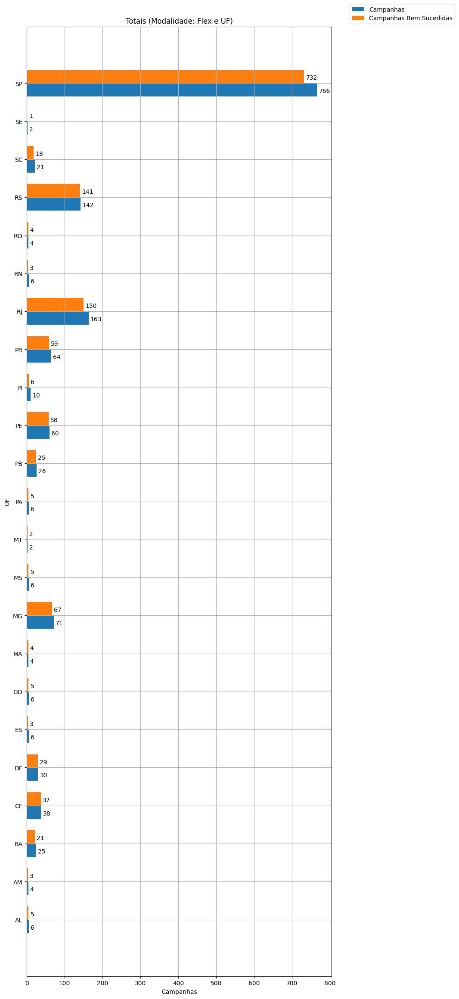
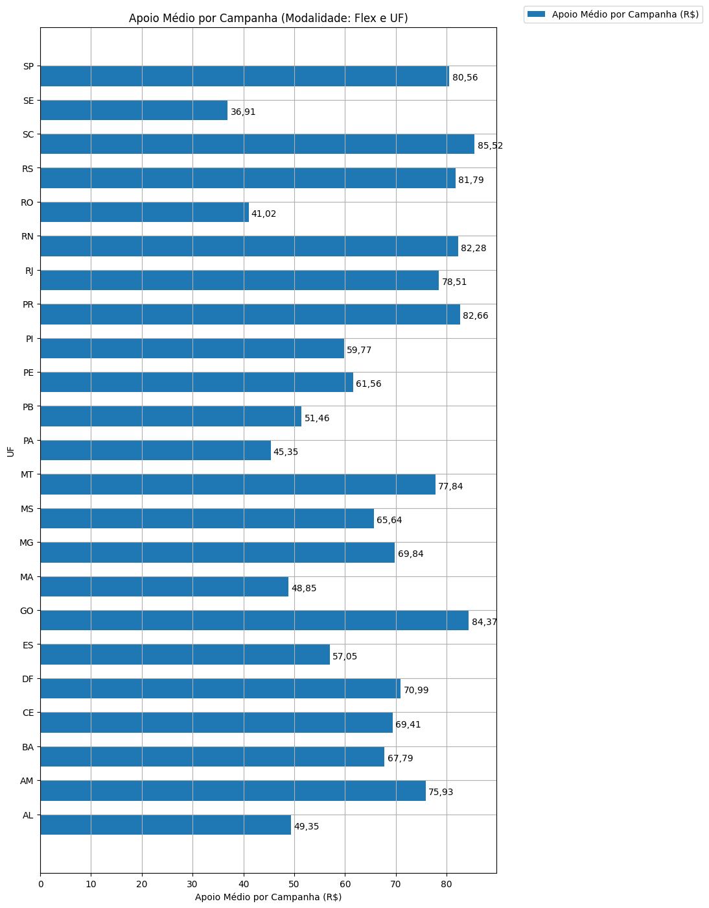
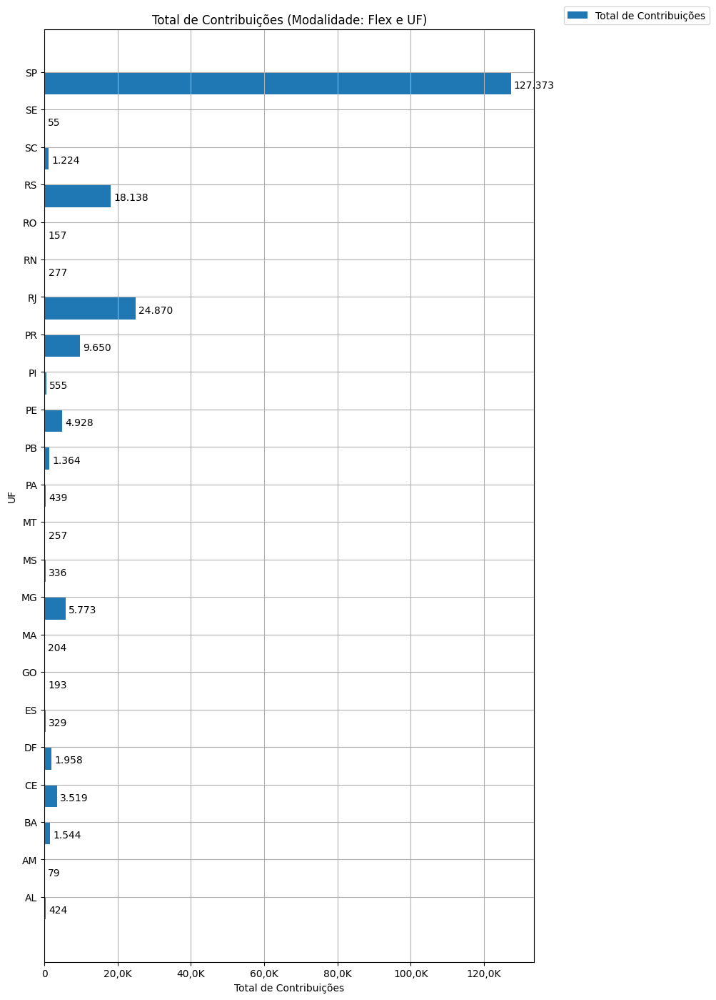

# Análise Descritiva - Recorte - UF

A tabela abaixo foi usada nos gráficos a seguir.

| modalidade   | geral_uf_br   |   total |   total_sucesso |   particip (%) |   taxa_sucesso (%) |   arrecadado_sucesso (R$) |   media_sucesso (R$) |   std_sucesso (R$) |   min_sucesso (R$) |   max_sucesso (R$) |   apoio_medio (R$) |   contribuicoes |   media_contribuicoes |
|:-------------|:--------------|--------:|----------------:|---------------:|-------------------:|--------------------------:|---------------------:|-------------------:|-------------------:|-------------------:|-------------------:|----------------:|----------------------:|
| flex         | AL            |       6 |               5 |           0,4% |              83,3% |                 20.618,50 |             4.123,70 |           3.042,21 |              52,78 |           8.487,42 |              48,63 |             424 |                  84,8 |
| flex         | AM            |       4 |               3 |           0,3% |              75,0% |                  5.966,55 |             1.988,85 |           1.491,59 |             621,84 |           3.579,71 |              75,53 |              79 |                  26,3 |
| flex         | BA            |      25 |              21 |           1,7% |              84,0% |                130.434,36 |             6.211,16 |           9.050,77 |              28,49 |          39.043,46 |              84,48 |           1.544 |                  73,5 |
| flex         | CE            |      38 |              37 |           2,6% |              97,4% |                292.839,62 |             7.914,58 |          11.620,26 |              60,22 |          42.352,39 |              83,22 |           3.519 |                  95,1 |
| flex         | DF            |      30 |              29 |           2,0% |              96,7% |                141.740,83 |             4.887,61 |           6.274,28 |              11,93 |          19.696,84 |              72,39 |           1.958 |                  67,5 |
| flex         | ES            |       6 |               3 |           0,4% |              50,0% |                 19.243,05 |             6.414,35 |           3.637,51 |           3.221,88 |          10.374,39 |              58,49 |             329 |                 109,7 |
| flex         | GO            |       6 |               5 |           0,4% |              83,3% |                 18.754,48 |             3.750,90 |           4.503,41 |             907,13 |          11.657,13 |              97,17 |             193 |                  38,6 |
| flex         | MA            |       4 |               4 |           0,3% |             100,0% |                 10.257,69 |             2.564,42 |           1.204,75 |           1.415,31 |           3.759,17 |              50,28 |             204 |                  51,0 |
| flex         | MG            |      71 |              67 |           4,8% |              94,4% |                482.605,55 |             7.203,07 |          10.740,03 |              35,53 |          55.069,70 |              83,60 |           5.773 |                  86,2 |
| flex         | MS            |       6 |               5 |           0,4% |              83,3% |                 21.988,60 |             4.397,72 |           2.989,46 |             620,57 |           8.364,98 |              65,44 |             336 |                  67,2 |
| flex         | MT            |       2 |               2 |           0,1% |             100,0% |                 19.225,07 |             9.612,53 |          10.123,51 |           2.454,14 |          16.770,93 |              74,81 |             257 |                 128,5 |
| flex         | PA            |       6 |               5 |           0,4% |              83,3% |                 22.468,65 |             4.493,73 |           5.633,18 |             100,76 |          12.609,40 |              51,18 |             439 |                  87,8 |
| flex         | PB            |      26 |              25 |           1,8% |              96,2% |                 92.454,99 |             3.698,20 |           8.668,49 |              81,93 |          37.589,60 |              67,78 |           1.364 |                  54,6 |
| flex         | PE            |      60 |              58 |           4,1% |              96,7% |                313.526,53 |             5.405,63 |           5.143,84 |              62,13 |          26.068,83 |              63,62 |           4.928 |                  85,0 |
| flex         | PI            |      10 |               6 |           0,7% |              60,0% |                 29.669,49 |             4.944,92 |           4.672,47 |             821,54 |          13.165,19 |              53,46 |             555 |                  92,5 |
| flex         | PR            |      64 |              59 |           4,4% |              92,2% |                688.481,13 |            11.669,17 |          13.175,20 |              48,19 |          59.310,53 |              71,35 |           9.650 |                 163,6 |
| flex         | RJ            |     163 |             150 |          11,1% |              92,0% |              2.121.729,30 |            14.144,86 |          20.277,98 |              10,77 |         142.477,57 |              85,31 |          24.870 |                 165,8 |
| flex         | RN            |       6 |               3 |           0,4% |              50,0% |                 25.188,92 |             8.396,31 |          11.215,07 |             148,24 |          21.166,43 |              90,93 |             277 |                  92,3 |
| flex         | RO            |       4 |               4 |           0,3% |             100,0% |                  5.636,43 |             1.409,11 |           1.366,75 |             131,70 |           3.310,96 |              35,90 |             157 |                  39,2 |
| flex         | RS            |     142 |             141 |           9,7% |              99,3% |              1.762.708,33 |            12.501,48 |          18.586,72 |              57,99 |         118.699,04 |              97,18 |          18.138 |                 128,6 |
| flex         | SC            |      21 |              18 |           1,4% |              85,7% |                 88.617,57 |             4.923,20 |           7.139,53 |              42,01 |          28.385,54 |              72,40 |           1.224 |                  68,0 |
| flex         | SE            |       2 |               1 |           0,1% |              50,0% |                  2.029,96 |             2.029,96 |               0,00 |           2.029,96 |           2.029,96 |              36,91 |              55 |                  55,0 |
| flex         | SP            |     766 |             732 |          52,2% |              95,6% |             12.045.946,34 |            16.456,21 |          44.170,98 |              23,05 |         708.972,78 |              94,57 |         127.373 |                 174,0 |

Dados em [planilha eletrônica](./dados/flex-uf.xlsx).

## Totais

O gráfico a seguir relaciona a modalidade com o total de campanhas e o total de campanhas bem sucedidas.

## Participação

O gráfico a seguir relaciona a modalidade com a participação de cada uma no conjunto de campanhas.

## Taxa de Sucesso

O gráfico a seguir relaciona a modalidade com a taxa de sucesso das campanhas.

## Total Arrecadado

O gráfico a seguir relaciona a modalidade com o total arrecadado pelas campanhas.

## Média Arrecadada por Campanha

O gráfico a seguir relaciona a modalidade com a média arrecadada por campanha.

## Apoio Médio por Campanha

O gráfico a seguir relaciona a modalidade com o apoio médio por campanha.

## Total de Contribuições

O gráfico a seguir relaciona a modalidade com o total de contribuições das campanhas.

## Média de Contribuições

O gráfico a seguir relaciona a modalidade com a média de contribuições de campanhas.

