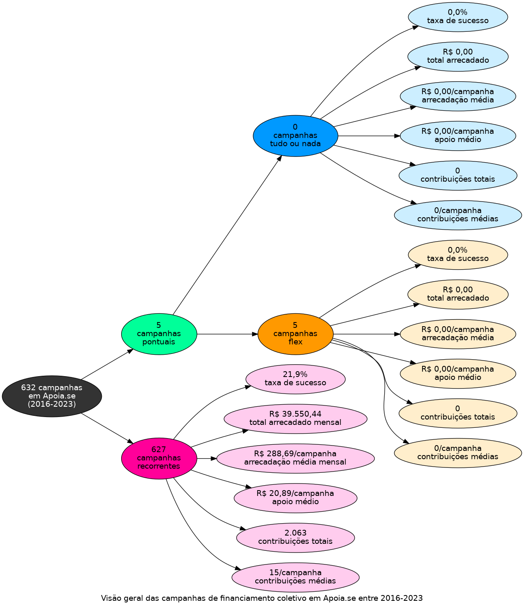

# Infográfico - Apoia.se

O infográfico a seguir indica um total de 632 campanhas em Apoia.se,
entre 2016 e 2023. As campanhas pontuais totalizam 5 campanhas, agrupadas
em 0 tudo ou nada e 5 flex. As campanhas recorrentes estão em 627.
A taxa de sucesso, o total arrecadado e a média de arrecadação por campanha
são apresentados para cada modalidade e compreendem uma visão alternativa
à tabela apresentada inicialmente.

