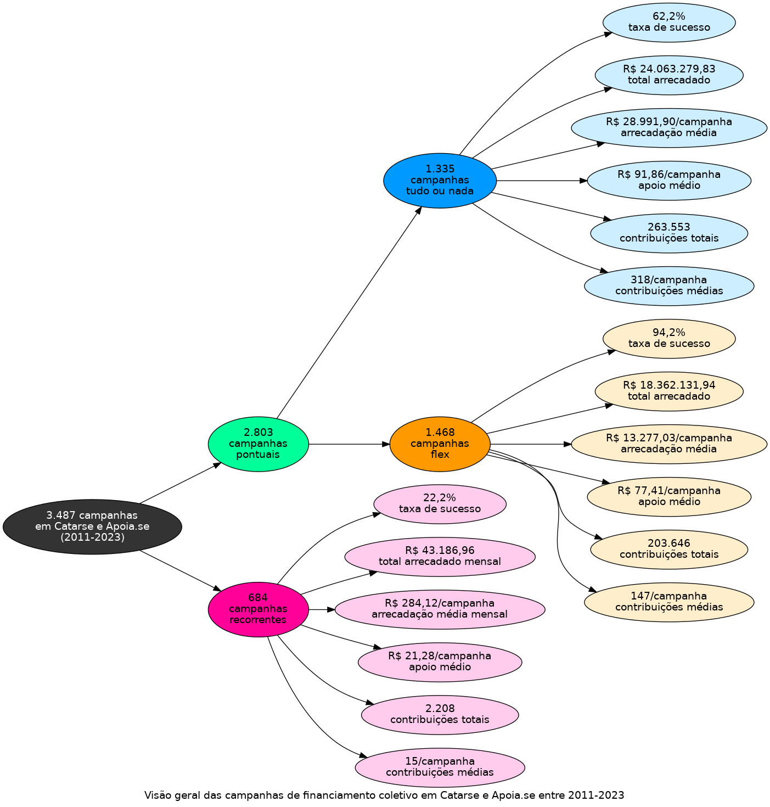

# Infográfico - Geral

O infográfico a seguir indica um total de 3.487 campanhas em Catarse e Apoia.se,
entre 2011 e 2023. As campanhas pontuais totalizam 2.803 campanhas, agrupadas
em 1.335 tudo ou nada e 1.468 flex. As campanhas recorrentes estão em 684.
A taxa de sucesso, o total arrecadado e a média de arrecadação por campanha
são apresentados para cada modalidade e compreendem uma visão alternativa
à tabela apresentada inicialmente.

