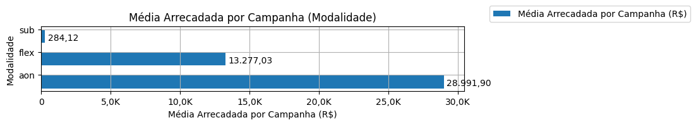

# Panorama

A tabela abaixo foi usada nos gráficos a seguir.

| modalidade   |   total |   total_sucesso |   particip (%) |   taxa_sucesso (%) |   arrecadado_sucesso (R$) |   arrecadado_avg (R$) |   arrecadado_std (R$) |   arrecadado_min (R$) |   arrecadado_max (R$) |   apoio_medio (R$) |   apoio_std (R$) |   apoio_min (R$) |   apoio_max (R$) |   contribuicoes |   contribuicoes_med |   contribuicoes_std |   contribuicoes_min |   contribuicoes_max |
|:-------------|--------:|----------------:|---------------:|-------------------:|--------------------------:|----------------------:|----------------------:|----------------------:|----------------------:|-------------------:|-----------------:|-----------------:|-----------------:|----------------:|--------------------:|--------------------:|--------------------:|--------------------:|
| aon          |   1.335 |             830 |          38,3% |              62,2% |             24.063.279,83 |             28.991,90 |             44.961,94 |                 41,82 |            679.297,66 |              91,86 |            49,09 |            13,94 |           792,04 |         263.553 |               317,5 |               423,0 |                 1,0 |             6.494,0 |
| flex         |   1.468 |           1.383 |          42,1% |              94,2% |             18.362.131,94 |             13.277,03 |             33.934,83 |                 10,77 |            708.972,78 |              77,41 |            39,51 |            10,77 |           461,52 |         203.646 |               147,2 |               327,7 |                 1,0 |             7.954,0 |
| sub          |     684 |             152 |          19,6% |              22,2% |                 43.186,96 |                284,12 |                650,58 |                  1,09 |              5.087,08 |              21,28 |            15,02 |             1,01 |            84,08 |           2.208 |                14,5 |                31,9 |                 1,0 |               208,0 |

Dados em [planilha eletrônica](./dados/panorama.xlsx).

## Totais

O gráfico a seguir relaciona a modalidade com o total de campanhas e o total de campanhas bem sucedidas.

## Participação

O gráfico a seguir relaciona a modalidade com a participação de cada uma no conjunto de campanhas.

## Taxa de Sucesso

O gráfico a seguir relaciona a modalidade com a taxa de sucesso das campanhas.

## Total Arrecadado

O gráfico a seguir relaciona a modalidade com o total arrecadado pelas campanhas.

## Média Arrecadada por Campanha

O gráfico a seguir relaciona a modalidade com a média arrecadada por campanha.

## Apoio Médio por Campanha

O gráfico a seguir relaciona a modalidade com o apoio médio por campanha.

## Total de Contribuições

O gráfico a seguir relaciona a modalidade com o total de contribuições das campanhas.

## Média de Contribuições

O gráfico a seguir relaciona a modalidade com a média de contribuições de campanhas.

