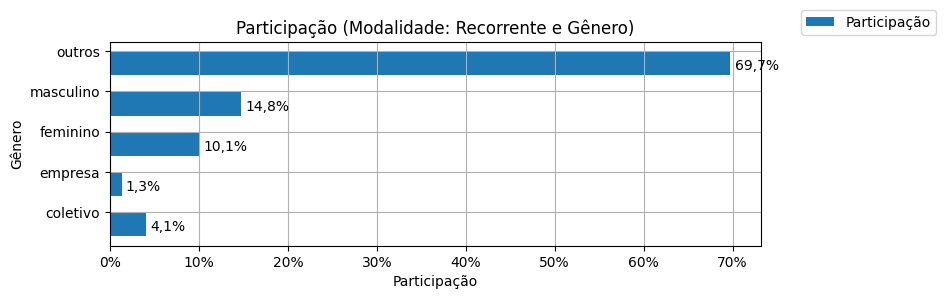
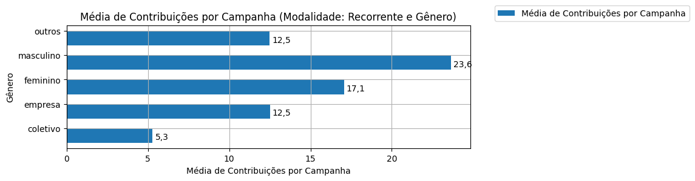

# Análise Descritiva - Recorte - Gênero

A tabela abaixo foi usada nos gráficos a seguir.

| modalidade   | autoria_classificacao   |   total |   total_sucesso |   particip (%) |   taxa_sucesso (%) |   arrecadado_sucesso (R$) |   arrecadado_avg (R$) |   arrecadado_std (R$) |   arrecadado_min (R$) |   arrecadado_max (R$) |   apoio_medio (R$) |   apoio_std (R$) |   apoio_min (R$) |   apoio_max (R$) |   contribuicoes |   contribuicoes_med |   contribuicoes_std |   contribuicoes_min |   contribuicoes_max |
|:-------------|:------------------------|--------:|----------------:|---------------:|-------------------:|--------------------------:|----------------------:|----------------------:|----------------------:|----------------------:|-------------------:|-----------------:|-----------------:|-----------------:|----------------:|--------------------:|--------------------:|--------------------:|--------------------:|
| sub          | coletivo                |      28 |               7 |           4,1% |              25,0% |                  1.146,91 |                163,84 |                138,02 |                 32,56 |                353,58 |              31,17 |            26,95 |             8,14 |            84,08 |              37 |                 5,3 |                 2,5 |                 3,0 |                10,0 |
| sub          | empresa                 |       9 |               2 |           1,3% |              22,2% |                  1.022,28 |                511,14 |                 38,60 |                483,84 |                538,44 |              42,14 |             8,83 |            35,90 |            48,38 |              25 |                12,5 |                 3,5 |                10,0 |                15,0 |
| sub          | feminino                |      69 |              18 |          10,1% |              26,1% |                  5.551,37 |                308,41 |                399,36 |                  7,15 |              1.753,37 |              19,42 |             8,88 |             5,93 |            35,80 |             307 |                17,1 |                20,6 |                 1,0 |                79,0 |
| sub          | masculino               |     101 |              25 |          14,8% |              24,8% |                  9.304,80 |                372,19 |                661,58 |                  6,10 |              2.998,54 |              17,81 |             9,87 |             6,10 |            45,46 |             591 |                23,6 |                45,2 |                 1,0 |               208,0 |
| sub          | outros                  |     477 |             100 |          69,7% |              21,0% |                 26.161,60 |                261,62 |                711,52 |                  1,09 |              5.087,08 |              21,38 |            15,58 |             1,01 |            70,02 |           1.248 |                12,5 |                30,8 |                 1,0 |               196,0 |

Dados em [planilha eletrônica](./dados/sub-genero.xlsx).

## Totais

O gráfico a seguir relaciona a modalidade com o total de campanhas e o total de campanhas bem sucedidas.

## Participação

O gráfico a seguir relaciona a modalidade com a participação de cada uma no conjunto de campanhas.

## Taxa de Sucesso

O gráfico a seguir relaciona a modalidade com a taxa de sucesso das campanhas.

## Total Arrecadado

O gráfico a seguir relaciona a modalidade com o total arrecadado pelas campanhas.

## Média Arrecadada por Campanha

O gráfico a seguir relaciona a modalidade com a média arrecadada por campanha.

## Apoio Médio por Campanha

O gráfico a seguir relaciona a modalidade com o apoio médio por campanha.

## Total de Contribuições

O gráfico a seguir relaciona a modalidade com o total de contribuições das campanhas.

## Média de Contribuições

O gráfico a seguir relaciona a modalidade com a média de contribuições de campanhas.

