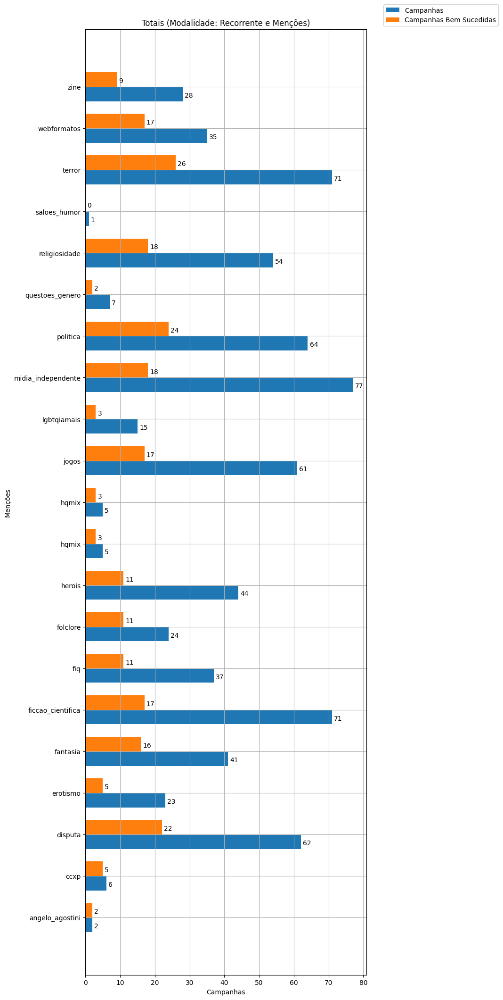
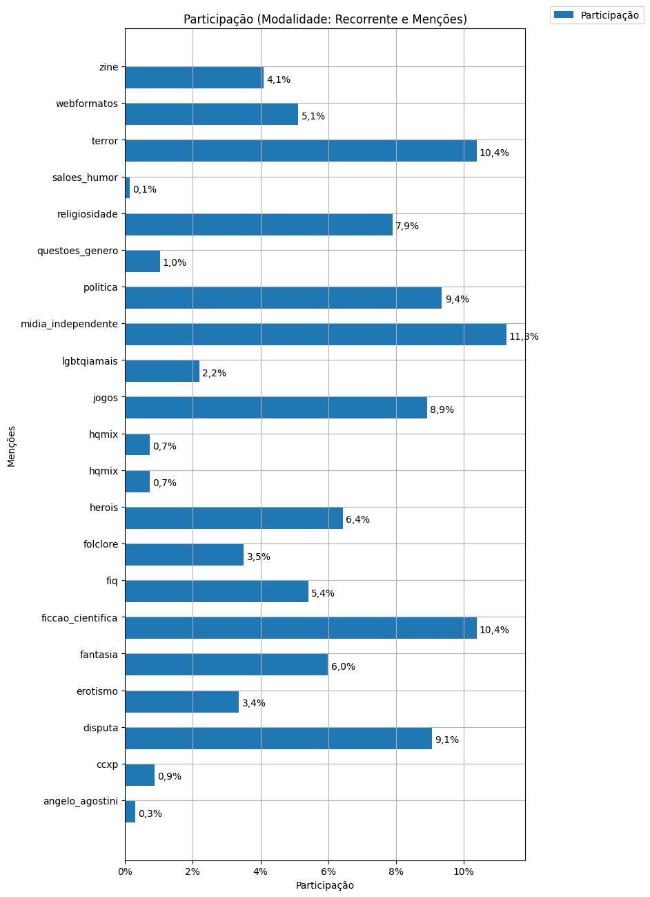
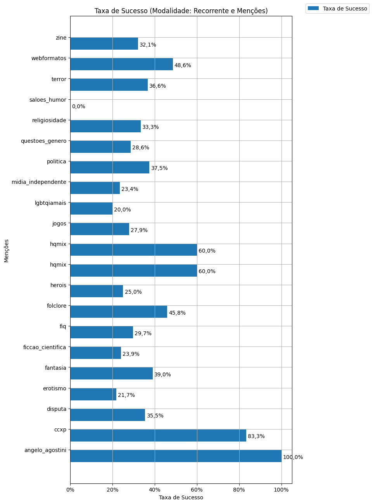
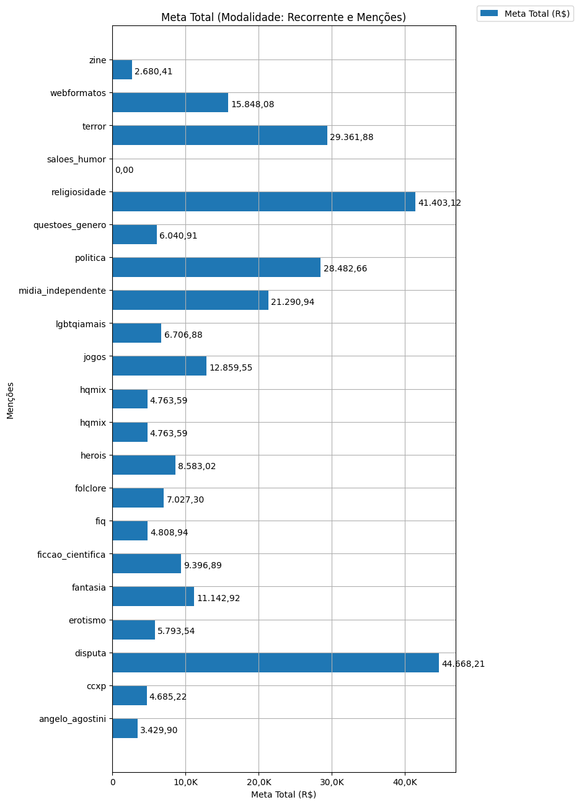
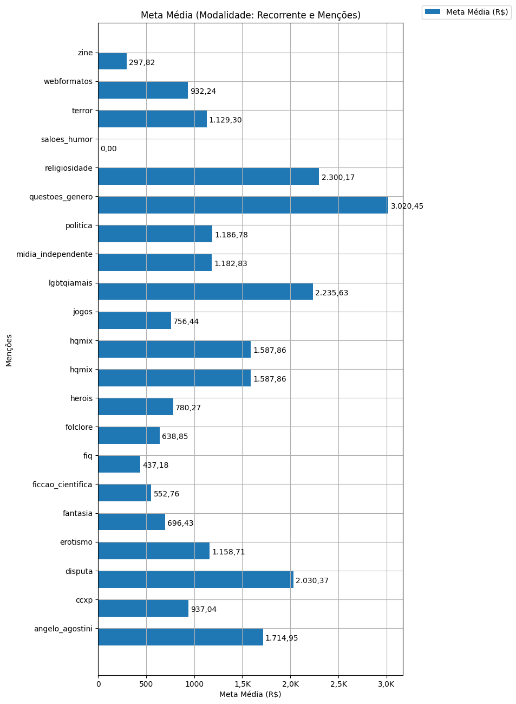
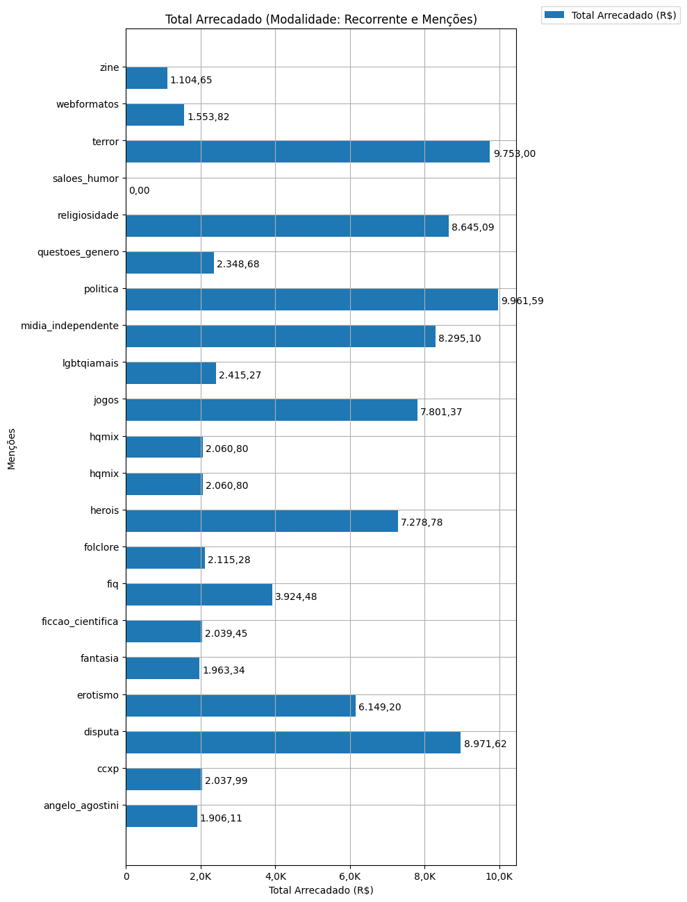
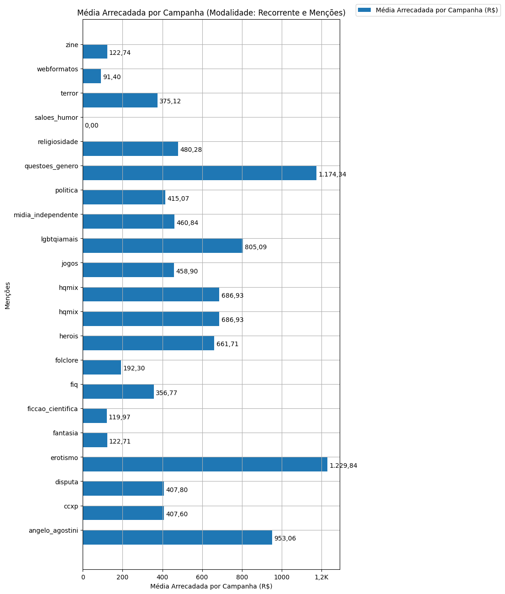
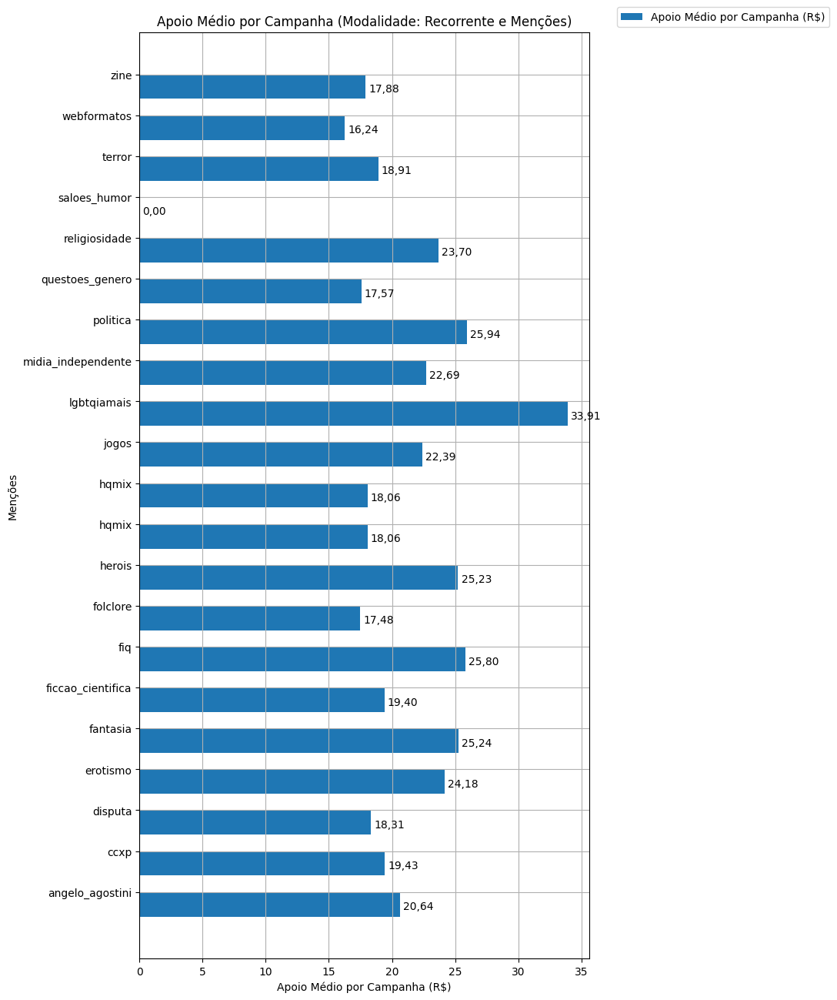
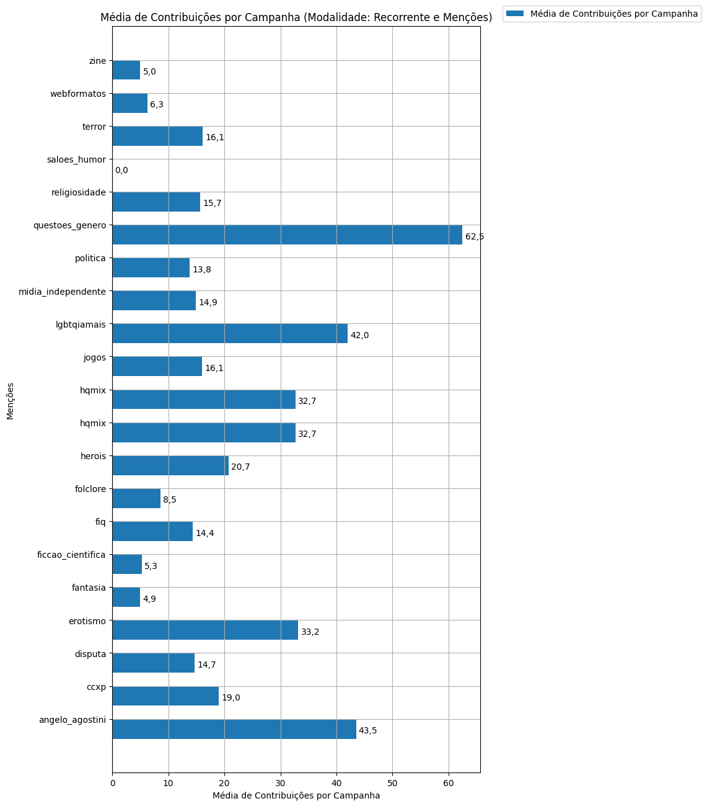

# Análise Descritiva - Recorte - Menções

A tabela abaixo foi usada nos gráficos a seguir.

| modalidade   | mencao             |   total |   total_sucesso |   particip (%) |   taxa_sucesso (%) |   meta (R$) |   meta_avg (R$) |   meta_std (R$) |   meta_min (R$) |   meta_max (R$) |   arrecadado_sucesso (R$) |   arrecadado_avg (R$) |   arrecadado_std (R$) |   arrecadado_min (R$) |   arrecadado_max (R$) |   apoio_medio (R$) |   apoio_std (R$) |   apoio_min (R$) |   apoio_max (R$) |   contribuicoes |   contribuicoes_med |   contribuicoes_std |   contribuicoes_min |   contribuicoes_max |
|:-------------|:-------------------|--------:|----------------:|---------------:|-------------------:|------------:|----------------:|----------------:|----------------:|----------------:|--------------------------:|----------------------:|----------------------:|----------------------:|----------------------:|-------------------:|-----------------:|-----------------:|-----------------:|----------------:|--------------------:|--------------------:|--------------------:|--------------------:|
| sub          | angelo_agostini    |       2 |               2 |           0,3% |             100,0% |    3.429,90 |        1.714,95 |        2.425,31 |            0,00 |        3.429,90 |                  1.906,11 |                953,06 |              1.131,81 |                152,75 |              1.753,37 |              20,64 |             2,19 |            19,09 |            22,19 |              87 |                43,5 |                50,2 |                 8,0 |                79,0 |
| sub          | ccxp               |       6 |               5 |           0,9% |              83,3% |    4.685,22 |          937,04 |        1.411,50 |            0,00 |        3.429,90 |                  2.037,99 |                407,60 |                752,99 |                 40,66 |              1.753,37 |              19,43 |             6,39 |            12,60 |            27,96 |              95 |                19,0 |                33,6 |                 2,0 |                79,0 |
| sub          | disputa            |      62 |              22 |           9,1% |              35,5% |   44.668,21 |        2.030,37 |        4.490,24 |            0,00 |       21.176,92 |                  8.971,62 |                407,80 |              1.065,40 |                  1,09 |              5.087,08 |              18,31 |            13,09 |             1,01 |            45,28 |             323 |                14,7 |                27,5 |                 1,0 |               128,0 |
| sub          | erotismo           |      23 |               5 |           3,4% |              21,7% |    5.793,54 |        1.158,71 |        2.180,27 |            0,00 |        5.037,96 |                  6.149,20 |              1.229,84 |              2.169,93 |                  6,63 |              5.087,08 |              24,18 |            14,15 |             6,63 |            39,74 |             166 |                33,2 |                53,5 |                 1,0 |               128,0 |
| sub          | fantasia           |      41 |              16 |           6,0% |              39,0% |   11.142,92 |          696,43 |          764,16 |            0,00 |        2.420,45 |                  1.963,34 |                122,71 |                134,98 |                  5,28 |                538,44 |              25,24 |            19,39 |             5,28 |            70,02 |              79 |                 4,9 |                 4,2 |                 1,0 |                15,0 |
| sub          | ficcao_cientifica  |      71 |              17 |          10,4% |              23,9% |    9.396,89 |          552,76 |          791,15 |            0,00 |        2.829,88 |                  2.039,45 |                119,97 |                157,26 |                  2,02 |                538,44 |              19,40 |            12,36 |             1,01 |            45,28 |              90 |                 5,3 |                 5,0 |                 1,0 |                19,0 |
| sub          | fiq                |      37 |              11 |           5,4% |              29,7% |    4.808,94 |          437,18 |        1.015,10 |            0,00 |        3.429,90 |                  3.924,48 |                356,77 |                489,37 |                 10,98 |              1.753,37 |              25,80 |            16,18 |             9,39 |            64,34 |             158 |                14,4 |                21,9 |                 1,0 |                79,0 |
| sub          | folclore           |      24 |              11 |           3,5% |              45,8% |    7.027,30 |          638,85 |        1.065,84 |            0,00 |        3.611,18 |                  2.115,28 |                192,30 |                337,60 |                  6,10 |              1.135,98 |              17,48 |             8,95 |             6,10 |            39,17 |              94 |                 8,5 |                10,7 |                 1,0 |                30,0 |
| sub          | herois             |      44 |              11 |           6,4% |              25,0% |    8.583,02 |          780,27 |        1.489,12 |            0,00 |        5.037,96 |                  7.278,78 |                661,71 |              1.479,40 |                 10,98 |              5.087,08 |              25,23 |            16,05 |            10,98 |            53,86 |             228 |                20,7 |                36,5 |                 1,0 |               128,0 |
| sub          | hqmix              |       5 |               3 |           0,7% |              60,0% |    4.763,59 |        1.587,86 |        1.595,68 |          629,74 |        3.429,90 |                  2.060,80 |                686,93 |                931,61 |                 31,49 |              1.753,37 |              18,06 |             3,59 |            15,74 |            22,19 |              98 |                32,7 |                40,8 |                 2,0 |                79,0 |
| sub          | hqmix              |       5 |               3 |           0,7% |              60,0% |    4.763,59 |        1.587,86 |        1.595,68 |          629,74 |        3.429,90 |                  2.060,80 |                686,93 |                931,61 |                 31,49 |              1.753,37 |              18,06 |             3,59 |            15,74 |            22,19 |              98 |                32,7 |                40,8 |                 2,0 |                79,0 |
| sub          | jogos              |      61 |              17 |           8,9% |              27,9% |   12.859,55 |          756,44 |        1.173,80 |            0,00 |        5.037,96 |                  7.801,37 |                458,90 |              1.200,33 |                  6,10 |              5.087,08 |              22,39 |            12,92 |             6,10 |            56,98 |             273 |                16,1 |                29,9 |                 1,0 |               128,0 |
| sub          | lgbtqiamais        |      15 |               3 |           2,2% |              20,0% |    6.706,88 |        2.235,63 |        1.419,69 |          665,97 |        3.429,90 |                  2.415,27 |                805,09 |                862,73 |                 66,60 |              1.753,37 |              33,91 |            28,68 |            12,94 |            66,60 |             126 |                42,0 |                39,2 |                 1,0 |                79,0 |
| sub          | midia_independente |      77 |              18 |          11,3% |              23,4% |   21.290,94 |        1.182,83 |        1.570,67 |            0,00 |        5.037,96 |                  8.295,10 |                460,84 |              1.164,13 |                  5,26 |              5.087,08 |              22,69 |            10,50 |             5,26 |            39,74 |             268 |                14,9 |                28,8 |                 1,0 |               128,0 |
| sub          | politica           |      64 |              24 |           9,4% |              37,5% |   28.482,66 |        1.186,78 |        1.442,80 |            0,00 |        5.037,96 |                  9.961,59 |                415,07 |              1.052,58 |                  1,09 |              5.087,08 |              25,94 |            21,12 |             1,09 |            84,08 |             331 |                13,8 |                27,7 |                 1,0 |               128,0 |
| sub          | questoes_genero    |       7 |               2 |           1,0% |              28,6% |    6.040,91 |        3.020,45 |          579,05 |        2.611,01 |        3.429,90 |                  2.348,68 |              1.174,34 |                818,87 |                595,31 |              1.753,37 |              17,57 |             6,54 |            12,94 |            22,19 |             125 |                62,5 |                23,3 |                46,0 |                79,0 |
| sub          | religiosidade      |      54 |              18 |           7,9% |              33,3% |   41.403,12 |        2.300,17 |        4.921,30 |            0,00 |       21.176,92 |                  8.645,09 |                480,28 |              1.163,40 |                  6,10 |              5.087,08 |              23,70 |            14,79 |             6,10 |            48,38 |             282 |                15,7 |                29,1 |                 1,0 |               128,0 |
| sub          | saloes_humor       |       1 |               0 |           0,1% |               0,0% |        0,00 |            0,00 |            0,00 |            0,00 |            0,00 |                      0,00 |                  0,00 |                  0,00 |                  0,00 |                  0,00 |               0,00 |             0,00 |             0,00 |             0,00 |               0 |                 0,0 |                 0,0 |                 0,0 |                 0,0 |
| sub          | terror             |      71 |              26 |          10,4% |              36,6% |   29.361,88 |        1.129,30 |        1.371,58 |            0,00 |        5.037,96 |                  9.753,00 |                375,12 |                980,44 |                  6,10 |              5.087,08 |              18,91 |            12,63 |             6,10 |            55,30 |             419 |                16,1 |                27,2 |                 1,0 |               128,0 |
| sub          | webformatos        |      35 |              17 |           5,1% |              48,6% |   15.848,08 |          932,24 |        1.121,46 |            0,00 |        3.800,51 |                  1.553,82 |                 91,40 |                144,49 |                  1,09 |                575,83 |              16,24 |            13,03 |             1,09 |            57,66 |             107 |                 6,3 |                12,1 |                 1,0 |                50,0 |
| sub          | zine               |      28 |               9 |           4,1% |              32,1% |    2.680,41 |          297,82 |          369,19 |            0,00 |        1.088,08 |                  1.104,65 |                122,74 |                166,63 |                  6,10 |                538,44 |              17,88 |            10,91 |             6,10 |            35,90 |              45 |                 5,0 |                 4,5 |                 1,0 |                15,0 |

Dados em [planilha eletrônica](./dados/sub-mencoes.xlsx).

## Totais

O gráfico a seguir relaciona a modalidade com o total de campanhas e o total de campanhas bem sucedidas.

## Participação

O gráfico a seguir relaciona a modalidade com a participação de cada uma no conjunto de campanhas.

## Taxa de Sucesso

O gráfico a seguir relaciona a modalidade com a taxa de sucesso das campanhas.

## Meta Total

O gráfico a seguir relaciona a modalidade com a meta de arrecadação das campanhas bem sucedidas.

## Meta Média

O gráfico a seguir relaciona a modalidade com a meta média de arrecadação das campanhas bem sucedidas.

## Total Arrecadado

O gráfico a seguir relaciona a modalidade com o total arrecadado pelas campanhas bem sucedidas.

## Média Arrecadada por Campanha

O gráfico a seguir relaciona a modalidade com a média arrecadada por campanha bem sucedida.

## Apoio Médio por Campanha

O gráfico a seguir relaciona a modalidade com o apoio médio por campanha bem sucedida.

## Total de Contribuições

O gráfico a seguir relaciona a modalidade com o total de contribuições das campanhas bem sucedidas.

## Média de Contribuições

O gráfico a seguir relaciona a modalidade com a média de contribuições de campanhas bem sucedidas.

