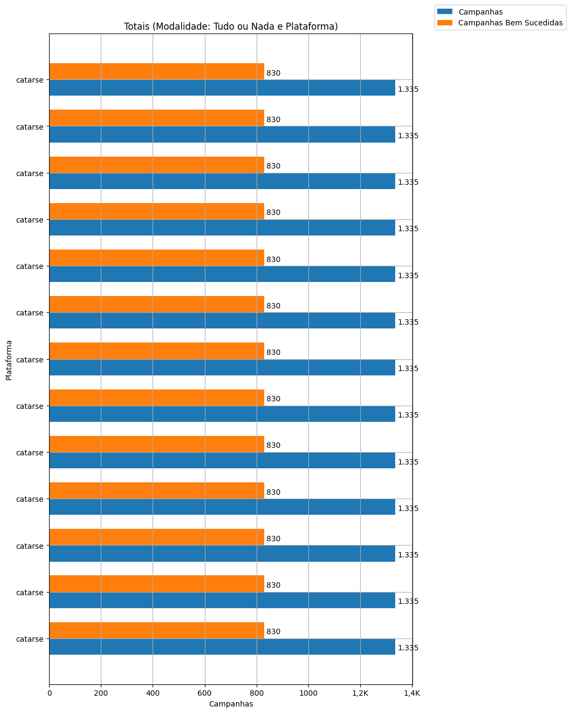
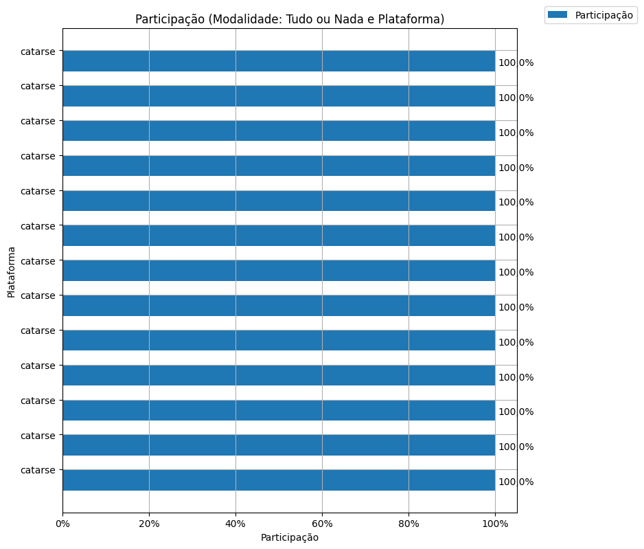
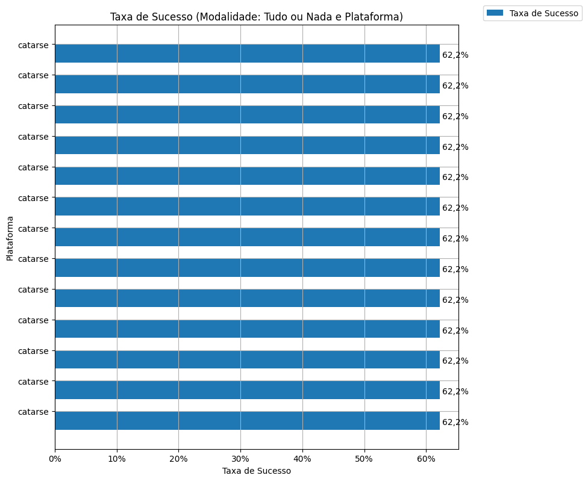
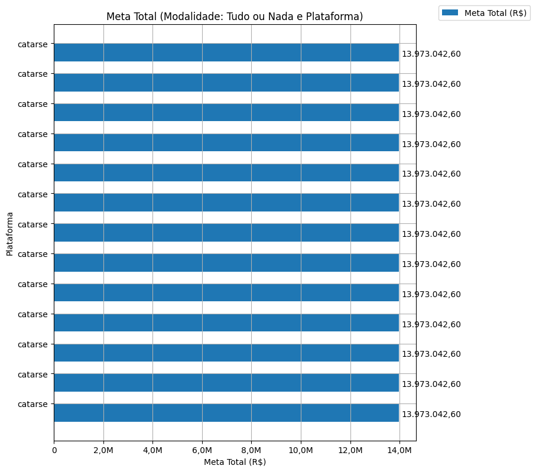
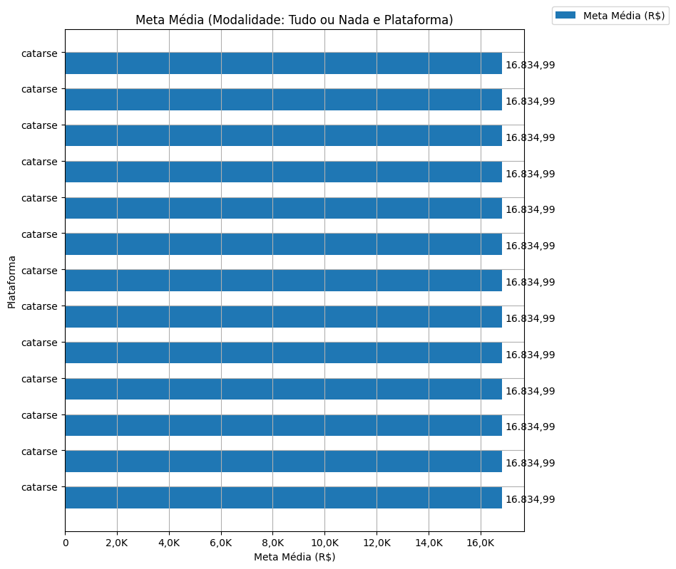
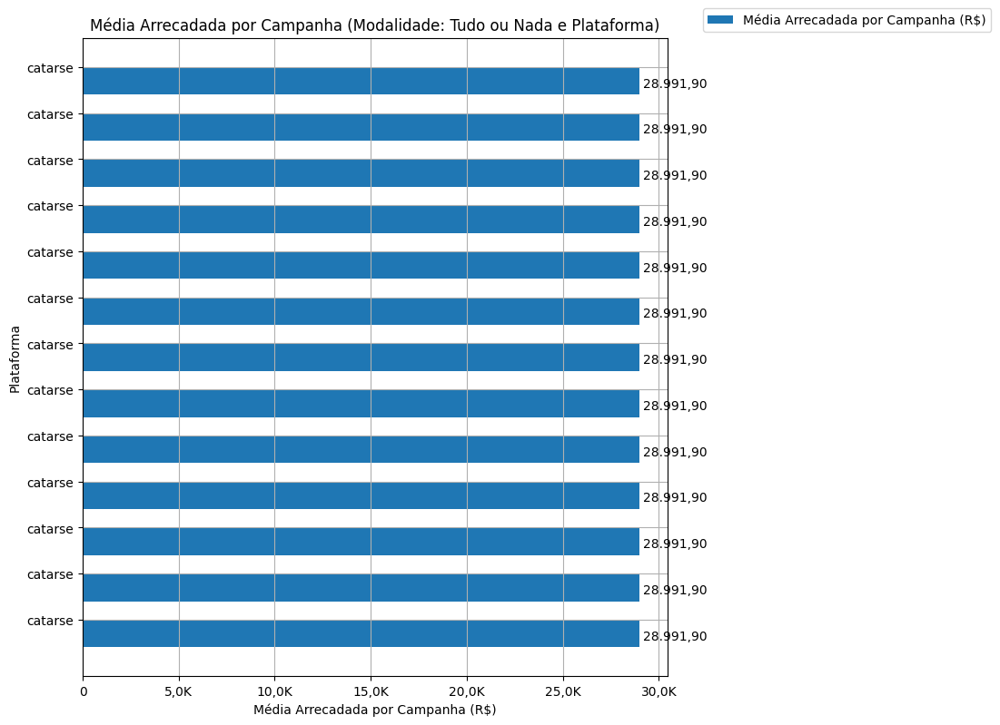
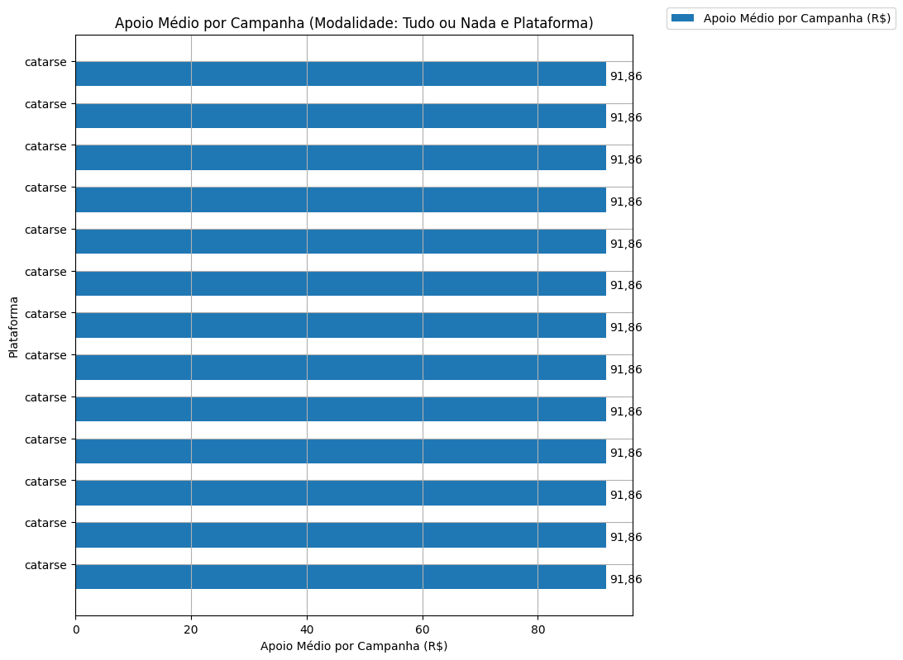
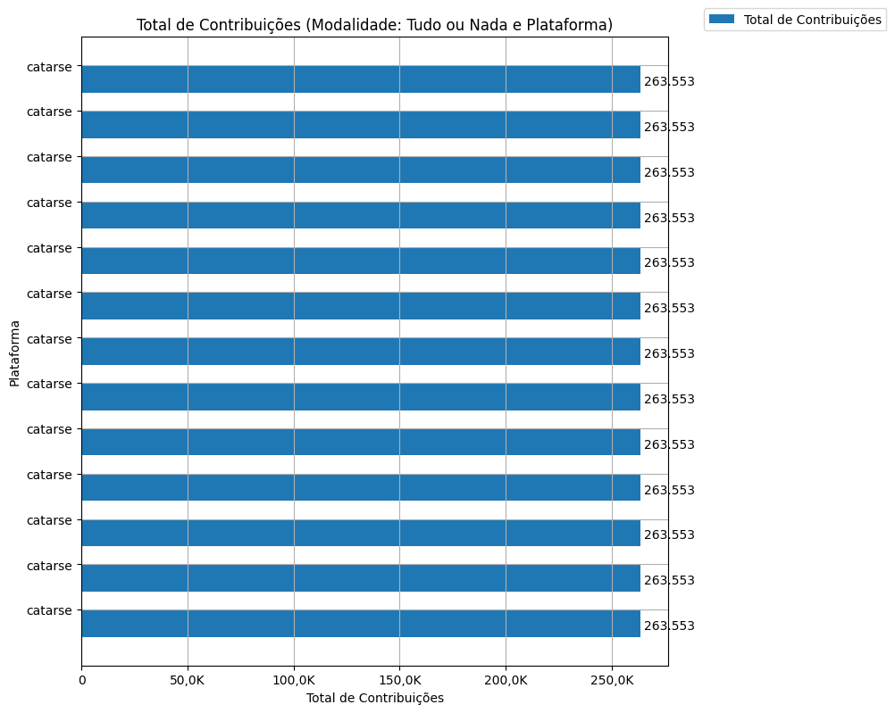
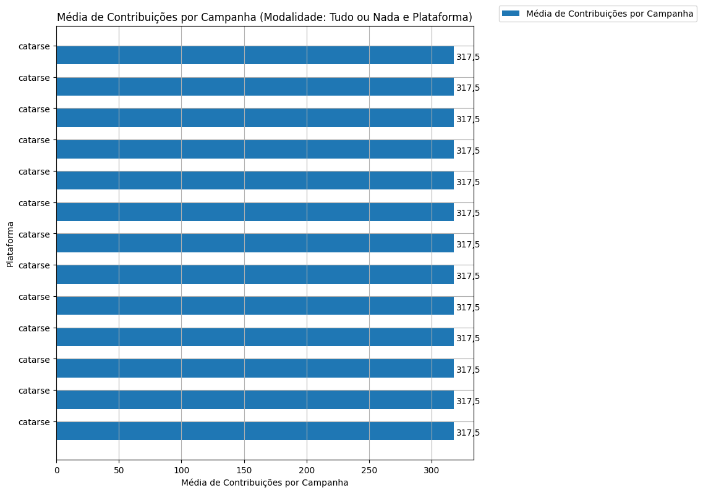

# Análise Descritiva - Recorte - Plataforma

A tabela abaixo foi usada nos gráficos a seguir.

| modalidade   |   ano | origem   |   total |   total_sucesso |   particip (%) |   taxa_sucesso (%) |     meta (R$) |   meta_avg (R$) |   meta_std (R$) |   meta_min (R$) |   meta_max (R$) |   arrecadado_sucesso (R$) |   arrecadado_avg (R$) |   arrecadado_std (R$) |   arrecadado_min (R$) |   arrecadado_max (R$) |   apoio_medio (R$) |   apoio_std (R$) |   apoio_min (R$) |   apoio_max (R$) |   contribuicoes |   contribuicoes_med |   contribuicoes_std |   contribuicoes_min |   contribuicoes_max |
|:-------------|------:|:---------|--------:|----------------:|---------------:|-------------------:|--------------:|----------------:|----------------:|----------------:|----------------:|--------------------------:|----------------------:|----------------------:|----------------------:|----------------------:|-------------------:|-----------------:|-----------------:|-----------------:|----------------:|--------------------:|--------------------:|--------------------:|--------------------:|
| aon          |  2011 | catarse  |   1.335 |             830 |         100,0% |              62,2% | 13.973.042,60 |       16.834,99 |       17.015,70 |           31,90 |      189.313,70 |             24.063.279,83 |             28.991,90 |             44.961,94 |                 41,82 |            679.297,66 |              91,86 |            49,09 |            13,94 |           792,04 |         263.553 |               317,5 |               423,0 |                 1,0 |             6.494,0 |
| aon          |  2012 | catarse  |   1.335 |             830 |         100,0% |              62,2% | 13.973.042,60 |       16.834,99 |       17.015,70 |           31,90 |      189.313,70 |             24.063.279,83 |             28.991,90 |             44.961,94 |                 41,82 |            679.297,66 |              91,86 |            49,09 |            13,94 |           792,04 |         263.553 |               317,5 |               423,0 |                 1,0 |             6.494,0 |
| aon          |  2013 | catarse  |   1.335 |             830 |         100,0% |              62,2% | 13.973.042,60 |       16.834,99 |       17.015,70 |           31,90 |      189.313,70 |             24.063.279,83 |             28.991,90 |             44.961,94 |                 41,82 |            679.297,66 |              91,86 |            49,09 |            13,94 |           792,04 |         263.553 |               317,5 |               423,0 |                 1,0 |             6.494,0 |
| aon          |  2014 | catarse  |   1.335 |             830 |         100,0% |              62,2% | 13.973.042,60 |       16.834,99 |       17.015,70 |           31,90 |      189.313,70 |             24.063.279,83 |             28.991,90 |             44.961,94 |                 41,82 |            679.297,66 |              91,86 |            49,09 |            13,94 |           792,04 |         263.553 |               317,5 |               423,0 |                 1,0 |             6.494,0 |
| aon          |  2015 | catarse  |   1.335 |             830 |         100,0% |              62,2% | 13.973.042,60 |       16.834,99 |       17.015,70 |           31,90 |      189.313,70 |             24.063.279,83 |             28.991,90 |             44.961,94 |                 41,82 |            679.297,66 |              91,86 |            49,09 |            13,94 |           792,04 |         263.553 |               317,5 |               423,0 |                 1,0 |             6.494,0 |
| aon          |  2016 | catarse  |   1.335 |             830 |         100,0% |              62,2% | 13.973.042,60 |       16.834,99 |       17.015,70 |           31,90 |      189.313,70 |             24.063.279,83 |             28.991,90 |             44.961,94 |                 41,82 |            679.297,66 |              91,86 |            49,09 |            13,94 |           792,04 |         263.553 |               317,5 |               423,0 |                 1,0 |             6.494,0 |
| aon          |  2017 | catarse  |   1.335 |             830 |         100,0% |              62,2% | 13.973.042,60 |       16.834,99 |       17.015,70 |           31,90 |      189.313,70 |             24.063.279,83 |             28.991,90 |             44.961,94 |                 41,82 |            679.297,66 |              91,86 |            49,09 |            13,94 |           792,04 |         263.553 |               317,5 |               423,0 |                 1,0 |             6.494,0 |
| aon          |  2018 | catarse  |   1.335 |             830 |         100,0% |              62,2% | 13.973.042,60 |       16.834,99 |       17.015,70 |           31,90 |      189.313,70 |             24.063.279,83 |             28.991,90 |             44.961,94 |                 41,82 |            679.297,66 |              91,86 |            49,09 |            13,94 |           792,04 |         263.553 |               317,5 |               423,0 |                 1,0 |             6.494,0 |
| aon          |  2019 | catarse  |   1.335 |             830 |         100,0% |              62,2% | 13.973.042,60 |       16.834,99 |       17.015,70 |           31,90 |      189.313,70 |             24.063.279,83 |             28.991,90 |             44.961,94 |                 41,82 |            679.297,66 |              91,86 |            49,09 |            13,94 |           792,04 |         263.553 |               317,5 |               423,0 |                 1,0 |             6.494,0 |
| aon          |  2020 | catarse  |   1.335 |             830 |         100,0% |              62,2% | 13.973.042,60 |       16.834,99 |       17.015,70 |           31,90 |      189.313,70 |             24.063.279,83 |             28.991,90 |             44.961,94 |                 41,82 |            679.297,66 |              91,86 |            49,09 |            13,94 |           792,04 |         263.553 |               317,5 |               423,0 |                 1,0 |             6.494,0 |
| aon          |  2021 | catarse  |   1.335 |             830 |         100,0% |              62,2% | 13.973.042,60 |       16.834,99 |       17.015,70 |           31,90 |      189.313,70 |             24.063.279,83 |             28.991,90 |             44.961,94 |                 41,82 |            679.297,66 |              91,86 |            49,09 |            13,94 |           792,04 |         263.553 |               317,5 |               423,0 |                 1,0 |             6.494,0 |
| aon          |  2022 | catarse  |   1.335 |             830 |         100,0% |              62,2% | 13.973.042,60 |       16.834,99 |       17.015,70 |           31,90 |      189.313,70 |             24.063.279,83 |             28.991,90 |             44.961,94 |                 41,82 |            679.297,66 |              91,86 |            49,09 |            13,94 |           792,04 |         263.553 |               317,5 |               423,0 |                 1,0 |             6.494,0 |
| aon          |  2023 | catarse  |   1.335 |             830 |         100,0% |              62,2% | 13.973.042,60 |       16.834,99 |       17.015,70 |           31,90 |      189.313,70 |             24.063.279,83 |             28.991,90 |             44.961,94 |                 41,82 |            679.297,66 |              91,86 |            49,09 |            13,94 |           792,04 |         263.553 |               317,5 |               423,0 |                 1,0 |             6.494,0 |

Dados em [planilha eletrônica](./dados/aon-plataforma.xlsx).

## Totais

O gráfico a seguir relaciona a modalidade com o total de campanhas e o total de campanhas bem sucedidas.

## Participação

O gráfico a seguir relaciona a modalidade com a participação de cada uma no conjunto de campanhas.

## Taxa de Sucesso

O gráfico a seguir relaciona a modalidade com a taxa de sucesso das campanhas.

## Meta Total

O gráfico a seguir relaciona a modalidade com a meta de arrecadação das campanhas bem sucedidas.

## Meta Média

O gráfico a seguir relaciona a modalidade com a meta média de arrecadação das campanhas bem sucedidas.

## Total Arrecadado

O gráfico a seguir relaciona a modalidade com o total arrecadado pelas campanhas bem sucedidas.

## Média Arrecadada por Campanha

O gráfico a seguir relaciona a modalidade com a média arrecadada por campanha bem sucedida.

## Apoio Médio por Campanha

O gráfico a seguir relaciona a modalidade com o apoio médio por campanha bem sucedida.

## Total de Contribuições

O gráfico a seguir relaciona a modalidade com o total de contribuições das campanhas bem sucedidas.

## Média de Contribuições

O gráfico a seguir relaciona a modalidade com a média de contribuições de campanhas bem sucedidas.

