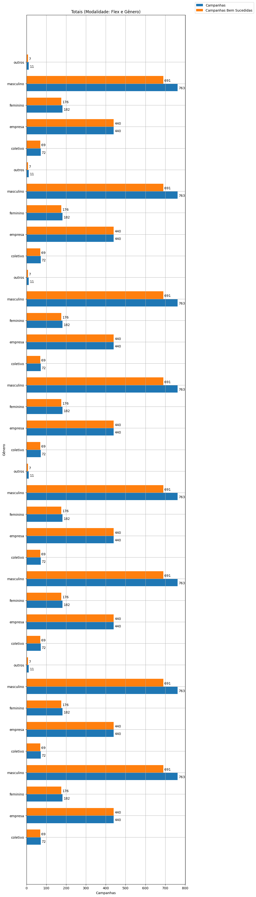
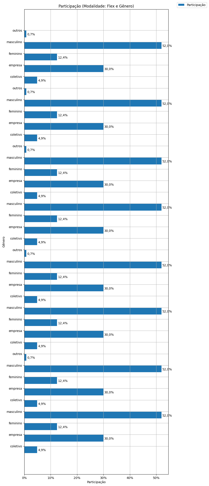
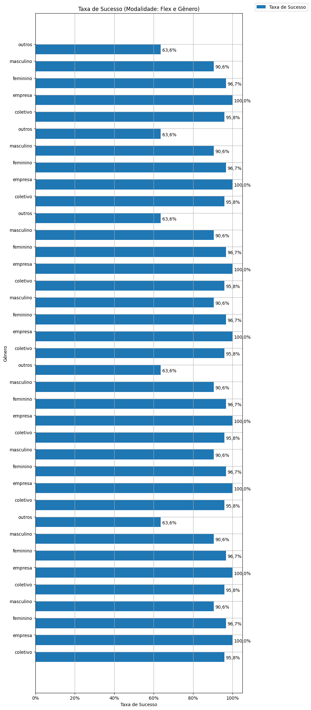
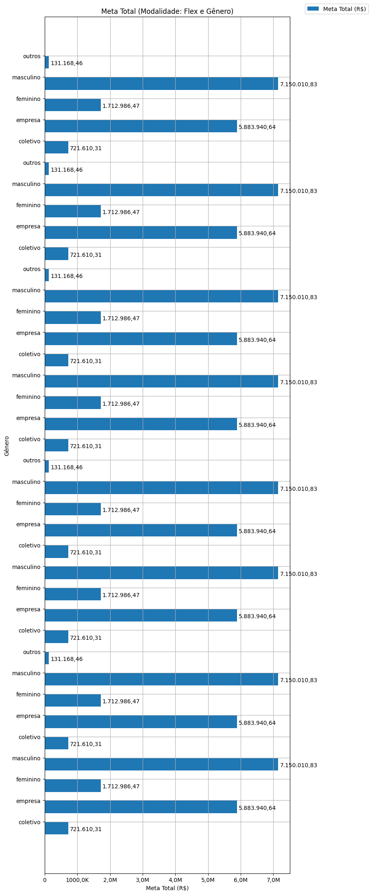
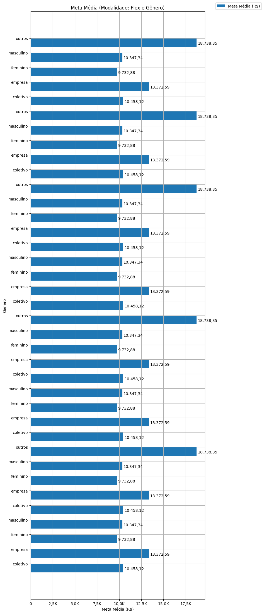
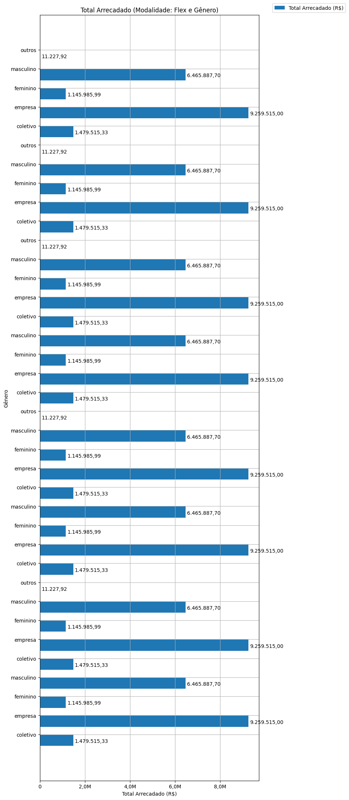
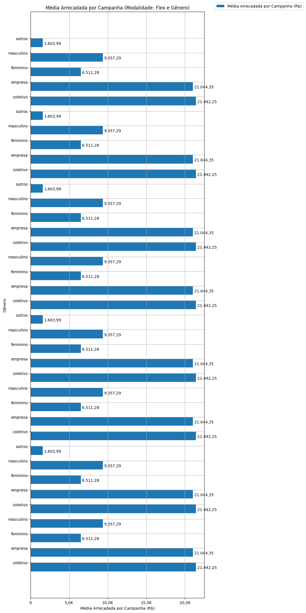
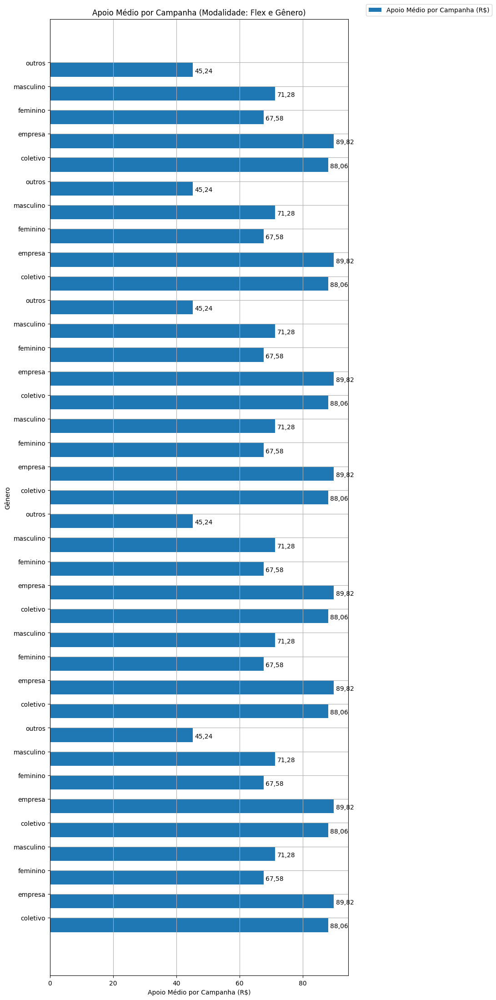
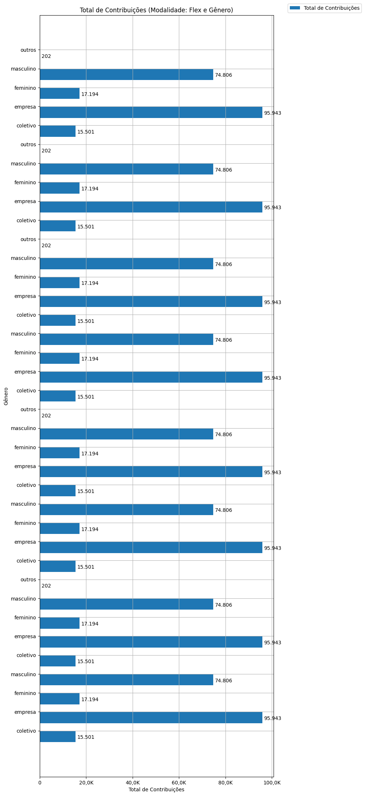
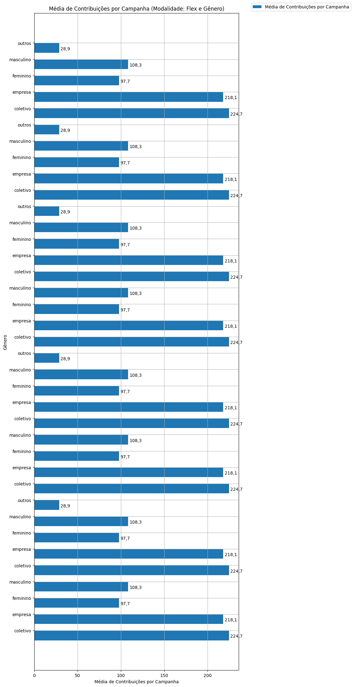

# Análise Descritiva - Recorte - Gênero

A tabela abaixo foi usada nos gráficos a seguir.

| modalidade   |   ano | autoria_classificacao   |   total |   total_sucesso |   particip (%) |   taxa_sucesso (%) |    meta (R$) |   meta_avg (R$) |   meta_std (R$) |   meta_min (R$) |   meta_max (R$) |   arrecadado_sucesso (R$) |   arrecadado_avg (R$) |   arrecadado_std (R$) |   arrecadado_min (R$) |   arrecadado_max (R$) |   apoio_medio (R$) |   apoio_std (R$) |   apoio_min (R$) |   apoio_max (R$) |   contribuicoes |   contribuicoes_med |   contribuicoes_std |   contribuicoes_min |   contribuicoes_max |
|:-------------|------:|:------------------------|--------:|----------------:|---------------:|-------------------:|-------------:|----------------:|----------------:|----------------:|----------------:|--------------------------:|----------------------:|----------------------:|----------------------:|----------------------:|-------------------:|-----------------:|-----------------:|-----------------:|----------------:|--------------------:|--------------------:|--------------------:|--------------------:|
| flex         |  2016 | coletivo                |      72 |              69 |           4,9% |              95,8% |   721.610,31 |       10.458,12 |       11.144,23 |           44,33 |       50.590,20 |              1.479.515,33 |             21.442,25 |             34.235,40 |                 29,81 |            169.836,91 |              88,06 |            47,97 |            14,91 |           254,24 |          15.501 |               224,7 |               325,0 |                 1,0 |             2.015,0 |
| flex         |  2016 | empresa                 |     440 |             440 |          30,0% |             100,0% | 5.883.940,64 |       13.372,59 |       19.267,96 |           23,99 |      147.790,83 |              9.259.515,00 |             21.044,35 |             46.143,04 |                 34,74 |            708.972,78 |              89,82 |            37,90 |            16,18 |           233,40 |          95.943 |               218,1 |               486,2 |                 1,0 |             7.954,0 |
| flex         |  2016 | feminino                |     182 |             176 |          12,4% |              96,7% | 1.712.986,47 |        9.732,88 |       10.102,89 |           46,56 |       83.151,82 |              1.145.985,99 |              6.511,28 |              6.521,40 |                 35,53 |             29.736,69 |              67,58 |            23,29 |            18,48 |           154,85 |          17.194 |                97,7 |                95,8 |                 1,0 |               453,0 |
| flex         |  2016 | masculino               |     763 |             691 |          52,0% |              90,6% | 7.150.010,83 |       10.347,34 |       16.064,05 |           12,04 |      198.811,94 |              6.465.887,70 |              9.357,29 |             27.421,05 |                 10,77 |            442.290,11 |              71,28 |            40,79 |            10,77 |           461,52 |          74.806 |               108,3 |               214,1 |                 1,0 |             3.474,0 |
| flex         |  2017 | coletivo                |      72 |              69 |           4,9% |              95,8% |   721.610,31 |       10.458,12 |       11.144,23 |           44,33 |       50.590,20 |              1.479.515,33 |             21.442,25 |             34.235,40 |                 29,81 |            169.836,91 |              88,06 |            47,97 |            14,91 |           254,24 |          15.501 |               224,7 |               325,0 |                 1,0 |             2.015,0 |
| flex         |  2017 | empresa                 |     440 |             440 |          30,0% |             100,0% | 5.883.940,64 |       13.372,59 |       19.267,96 |           23,99 |      147.790,83 |              9.259.515,00 |             21.044,35 |             46.143,04 |                 34,74 |            708.972,78 |              89,82 |            37,90 |            16,18 |           233,40 |          95.943 |               218,1 |               486,2 |                 1,0 |             7.954,0 |
| flex         |  2017 | feminino                |     182 |             176 |          12,4% |              96,7% | 1.712.986,47 |        9.732,88 |       10.102,89 |           46,56 |       83.151,82 |              1.145.985,99 |              6.511,28 |              6.521,40 |                 35,53 |             29.736,69 |              67,58 |            23,29 |            18,48 |           154,85 |          17.194 |                97,7 |                95,8 |                 1,0 |               453,0 |
| flex         |  2017 | masculino               |     763 |             691 |          52,0% |              90,6% | 7.150.010,83 |       10.347,34 |       16.064,05 |           12,04 |      198.811,94 |              6.465.887,70 |              9.357,29 |             27.421,05 |                 10,77 |            442.290,11 |              71,28 |            40,79 |            10,77 |           461,52 |          74.806 |               108,3 |               214,1 |                 1,0 |             3.474,0 |
| flex         |  2017 | outros                  |      11 |               7 |           0,7% |              63,6% |   131.168,46 |       18.738,35 |       19.781,31 |        2.420,45 |       54.319,48 |                 11.227,92 |              1.603,99 |              2.112,50 |                 42,36 |              5.515,84 |              45,24 |            14,93 |            21,18 |            63,40 |             202 |                28,9 |                34,7 |                 2,0 |                87,0 |
| flex         |  2018 | coletivo                |      72 |              69 |           4,9% |              95,8% |   721.610,31 |       10.458,12 |       11.144,23 |           44,33 |       50.590,20 |              1.479.515,33 |             21.442,25 |             34.235,40 |                 29,81 |            169.836,91 |              88,06 |            47,97 |            14,91 |           254,24 |          15.501 |               224,7 |               325,0 |                 1,0 |             2.015,0 |
| flex         |  2018 | empresa                 |     440 |             440 |          30,0% |             100,0% | 5.883.940,64 |       13.372,59 |       19.267,96 |           23,99 |      147.790,83 |              9.259.515,00 |             21.044,35 |             46.143,04 |                 34,74 |            708.972,78 |              89,82 |            37,90 |            16,18 |           233,40 |          95.943 |               218,1 |               486,2 |                 1,0 |             7.954,0 |
| flex         |  2018 | feminino                |     182 |             176 |          12,4% |              96,7% | 1.712.986,47 |        9.732,88 |       10.102,89 |           46,56 |       83.151,82 |              1.145.985,99 |              6.511,28 |              6.521,40 |                 35,53 |             29.736,69 |              67,58 |            23,29 |            18,48 |           154,85 |          17.194 |                97,7 |                95,8 |                 1,0 |               453,0 |
| flex         |  2018 | masculino               |     763 |             691 |          52,0% |              90,6% | 7.150.010,83 |       10.347,34 |       16.064,05 |           12,04 |      198.811,94 |              6.465.887,70 |              9.357,29 |             27.421,05 |                 10,77 |            442.290,11 |              71,28 |            40,79 |            10,77 |           461,52 |          74.806 |               108,3 |               214,1 |                 1,0 |             3.474,0 |
| flex         |  2019 | coletivo                |      72 |              69 |           4,9% |              95,8% |   721.610,31 |       10.458,12 |       11.144,23 |           44,33 |       50.590,20 |              1.479.515,33 |             21.442,25 |             34.235,40 |                 29,81 |            169.836,91 |              88,06 |            47,97 |            14,91 |           254,24 |          15.501 |               224,7 |               325,0 |                 1,0 |             2.015,0 |
| flex         |  2019 | empresa                 |     440 |             440 |          30,0% |             100,0% | 5.883.940,64 |       13.372,59 |       19.267,96 |           23,99 |      147.790,83 |              9.259.515,00 |             21.044,35 |             46.143,04 |                 34,74 |            708.972,78 |              89,82 |            37,90 |            16,18 |           233,40 |          95.943 |               218,1 |               486,2 |                 1,0 |             7.954,0 |
| flex         |  2019 | feminino                |     182 |             176 |          12,4% |              96,7% | 1.712.986,47 |        9.732,88 |       10.102,89 |           46,56 |       83.151,82 |              1.145.985,99 |              6.511,28 |              6.521,40 |                 35,53 |             29.736,69 |              67,58 |            23,29 |            18,48 |           154,85 |          17.194 |                97,7 |                95,8 |                 1,0 |               453,0 |
| flex         |  2019 | masculino               |     763 |             691 |          52,0% |              90,6% | 7.150.010,83 |       10.347,34 |       16.064,05 |           12,04 |      198.811,94 |              6.465.887,70 |              9.357,29 |             27.421,05 |                 10,77 |            442.290,11 |              71,28 |            40,79 |            10,77 |           461,52 |          74.806 |               108,3 |               214,1 |                 1,0 |             3.474,0 |
| flex         |  2019 | outros                  |      11 |               7 |           0,7% |              63,6% |   131.168,46 |       18.738,35 |       19.781,31 |        2.420,45 |       54.319,48 |                 11.227,92 |              1.603,99 |              2.112,50 |                 42,36 |              5.515,84 |              45,24 |            14,93 |            21,18 |            63,40 |             202 |                28,9 |                34,7 |                 2,0 |                87,0 |
| flex         |  2020 | coletivo                |      72 |              69 |           4,9% |              95,8% |   721.610,31 |       10.458,12 |       11.144,23 |           44,33 |       50.590,20 |              1.479.515,33 |             21.442,25 |             34.235,40 |                 29,81 |            169.836,91 |              88,06 |            47,97 |            14,91 |           254,24 |          15.501 |               224,7 |               325,0 |                 1,0 |             2.015,0 |
| flex         |  2020 | empresa                 |     440 |             440 |          30,0% |             100,0% | 5.883.940,64 |       13.372,59 |       19.267,96 |           23,99 |      147.790,83 |              9.259.515,00 |             21.044,35 |             46.143,04 |                 34,74 |            708.972,78 |              89,82 |            37,90 |            16,18 |           233,40 |          95.943 |               218,1 |               486,2 |                 1,0 |             7.954,0 |
| flex         |  2020 | feminino                |     182 |             176 |          12,4% |              96,7% | 1.712.986,47 |        9.732,88 |       10.102,89 |           46,56 |       83.151,82 |              1.145.985,99 |              6.511,28 |              6.521,40 |                 35,53 |             29.736,69 |              67,58 |            23,29 |            18,48 |           154,85 |          17.194 |                97,7 |                95,8 |                 1,0 |               453,0 |
| flex         |  2020 | masculino               |     763 |             691 |          52,0% |              90,6% | 7.150.010,83 |       10.347,34 |       16.064,05 |           12,04 |      198.811,94 |              6.465.887,70 |              9.357,29 |             27.421,05 |                 10,77 |            442.290,11 |              71,28 |            40,79 |            10,77 |           461,52 |          74.806 |               108,3 |               214,1 |                 1,0 |             3.474,0 |
| flex         |  2021 | coletivo                |      72 |              69 |           4,9% |              95,8% |   721.610,31 |       10.458,12 |       11.144,23 |           44,33 |       50.590,20 |              1.479.515,33 |             21.442,25 |             34.235,40 |                 29,81 |            169.836,91 |              88,06 |            47,97 |            14,91 |           254,24 |          15.501 |               224,7 |               325,0 |                 1,0 |             2.015,0 |
| flex         |  2021 | empresa                 |     440 |             440 |          30,0% |             100,0% | 5.883.940,64 |       13.372,59 |       19.267,96 |           23,99 |      147.790,83 |              9.259.515,00 |             21.044,35 |             46.143,04 |                 34,74 |            708.972,78 |              89,82 |            37,90 |            16,18 |           233,40 |          95.943 |               218,1 |               486,2 |                 1,0 |             7.954,0 |
| flex         |  2021 | feminino                |     182 |             176 |          12,4% |              96,7% | 1.712.986,47 |        9.732,88 |       10.102,89 |           46,56 |       83.151,82 |              1.145.985,99 |              6.511,28 |              6.521,40 |                 35,53 |             29.736,69 |              67,58 |            23,29 |            18,48 |           154,85 |          17.194 |                97,7 |                95,8 |                 1,0 |               453,0 |
| flex         |  2021 | masculino               |     763 |             691 |          52,0% |              90,6% | 7.150.010,83 |       10.347,34 |       16.064,05 |           12,04 |      198.811,94 |              6.465.887,70 |              9.357,29 |             27.421,05 |                 10,77 |            442.290,11 |              71,28 |            40,79 |            10,77 |           461,52 |          74.806 |               108,3 |               214,1 |                 1,0 |             3.474,0 |
| flex         |  2021 | outros                  |      11 |               7 |           0,7% |              63,6% |   131.168,46 |       18.738,35 |       19.781,31 |        2.420,45 |       54.319,48 |                 11.227,92 |              1.603,99 |              2.112,50 |                 42,36 |              5.515,84 |              45,24 |            14,93 |            21,18 |            63,40 |             202 |                28,9 |                34,7 |                 2,0 |                87,0 |
| flex         |  2022 | coletivo                |      72 |              69 |           4,9% |              95,8% |   721.610,31 |       10.458,12 |       11.144,23 |           44,33 |       50.590,20 |              1.479.515,33 |             21.442,25 |             34.235,40 |                 29,81 |            169.836,91 |              88,06 |            47,97 |            14,91 |           254,24 |          15.501 |               224,7 |               325,0 |                 1,0 |             2.015,0 |
| flex         |  2022 | empresa                 |     440 |             440 |          30,0% |             100,0% | 5.883.940,64 |       13.372,59 |       19.267,96 |           23,99 |      147.790,83 |              9.259.515,00 |             21.044,35 |             46.143,04 |                 34,74 |            708.972,78 |              89,82 |            37,90 |            16,18 |           233,40 |          95.943 |               218,1 |               486,2 |                 1,0 |             7.954,0 |
| flex         |  2022 | feminino                |     182 |             176 |          12,4% |              96,7% | 1.712.986,47 |        9.732,88 |       10.102,89 |           46,56 |       83.151,82 |              1.145.985,99 |              6.511,28 |              6.521,40 |                 35,53 |             29.736,69 |              67,58 |            23,29 |            18,48 |           154,85 |          17.194 |                97,7 |                95,8 |                 1,0 |               453,0 |
| flex         |  2022 | masculino               |     763 |             691 |          52,0% |              90,6% | 7.150.010,83 |       10.347,34 |       16.064,05 |           12,04 |      198.811,94 |              6.465.887,70 |              9.357,29 |             27.421,05 |                 10,77 |            442.290,11 |              71,28 |            40,79 |            10,77 |           461,52 |          74.806 |               108,3 |               214,1 |                 1,0 |             3.474,0 |
| flex         |  2022 | outros                  |      11 |               7 |           0,7% |              63,6% |   131.168,46 |       18.738,35 |       19.781,31 |        2.420,45 |       54.319,48 |                 11.227,92 |              1.603,99 |              2.112,50 |                 42,36 |              5.515,84 |              45,24 |            14,93 |            21,18 |            63,40 |             202 |                28,9 |                34,7 |                 2,0 |                87,0 |
| flex         |  2023 | coletivo                |      72 |              69 |           4,9% |              95,8% |   721.610,31 |       10.458,12 |       11.144,23 |           44,33 |       50.590,20 |              1.479.515,33 |             21.442,25 |             34.235,40 |                 29,81 |            169.836,91 |              88,06 |            47,97 |            14,91 |           254,24 |          15.501 |               224,7 |               325,0 |                 1,0 |             2.015,0 |
| flex         |  2023 | empresa                 |     440 |             440 |          30,0% |             100,0% | 5.883.940,64 |       13.372,59 |       19.267,96 |           23,99 |      147.790,83 |              9.259.515,00 |             21.044,35 |             46.143,04 |                 34,74 |            708.972,78 |              89,82 |            37,90 |            16,18 |           233,40 |          95.943 |               218,1 |               486,2 |                 1,0 |             7.954,0 |
| flex         |  2023 | feminino                |     182 |             176 |          12,4% |              96,7% | 1.712.986,47 |        9.732,88 |       10.102,89 |           46,56 |       83.151,82 |              1.145.985,99 |              6.511,28 |              6.521,40 |                 35,53 |             29.736,69 |              67,58 |            23,29 |            18,48 |           154,85 |          17.194 |                97,7 |                95,8 |                 1,0 |               453,0 |
| flex         |  2023 | masculino               |     763 |             691 |          52,0% |              90,6% | 7.150.010,83 |       10.347,34 |       16.064,05 |           12,04 |      198.811,94 |              6.465.887,70 |              9.357,29 |             27.421,05 |                 10,77 |            442.290,11 |              71,28 |            40,79 |            10,77 |           461,52 |          74.806 |               108,3 |               214,1 |                 1,0 |             3.474,0 |
| flex         |  2023 | outros                  |      11 |               7 |           0,7% |              63,6% |   131.168,46 |       18.738,35 |       19.781,31 |        2.420,45 |       54.319,48 |                 11.227,92 |              1.603,99 |              2.112,50 |                 42,36 |              5.515,84 |              45,24 |            14,93 |            21,18 |            63,40 |             202 |                28,9 |                34,7 |                 2,0 |                87,0 |

Dados em [planilha eletrônica](./dados/flex-genero.xlsx).

## Totais

O gráfico a seguir relaciona a modalidade com o total de campanhas e o total de campanhas bem sucedidas.

## Participação

O gráfico a seguir relaciona a modalidade com a participação de cada uma no conjunto de campanhas.

## Taxa de Sucesso

O gráfico a seguir relaciona a modalidade com a taxa de sucesso das campanhas.

## Meta Total

O gráfico a seguir relaciona a modalidade com a meta de arrecadação das campanhas bem sucedidas.

## Meta Média

O gráfico a seguir relaciona a modalidade com a meta média de arrecadação das campanhas bem sucedidas.

## Total Arrecadado

O gráfico a seguir relaciona a modalidade com o total arrecadado pelas campanhas bem sucedidas.

## Média Arrecadada por Campanha

O gráfico a seguir relaciona a modalidade com a média arrecadada por campanha bem sucedida.

## Apoio Médio por Campanha

O gráfico a seguir relaciona a modalidade com o apoio médio por campanha bem sucedida.

## Total de Contribuições

O gráfico a seguir relaciona a modalidade com o total de contribuições das campanhas bem sucedidas.

## Média de Contribuições

O gráfico a seguir relaciona a modalidade com a média de contribuições de campanhas bem sucedidas.

