# Comparações entre modalidades

A tabela abaixo foi usada nos gráficos a seguir.

| modalidade   |   ano |   total |   total_sucesso |   particip (%) |   taxa_sucesso (%) |     meta (R$) |   meta_avg (R$) |   meta_std (R$) |   meta_min (R$) |   meta_max (R$) |   arrecadado_sucesso (R$) |   arrecadado_avg (R$) |   arrecadado_std (R$) |   arrecadado_min (R$) |   arrecadado_max (R$) |   apoio_medio (R$) |   apoio_std (R$) |   apoio_min (R$) |   apoio_max (R$) |   contribuicoes |   contribuicoes_med |   contribuicoes_std |   contribuicoes_min |   contribuicoes_max |
|:-------------|------:|--------:|----------------:|---------------:|-------------------:|--------------:|----------------:|----------------:|----------------:|----------------:|--------------------------:|----------------------:|----------------------:|----------------------:|----------------------:|-------------------:|-----------------:|-----------------:|-----------------:|----------------:|--------------------:|--------------------:|--------------------:|--------------------:|
| aon          |  2011 |       2 |             830 |           0,1% |           41500,0% | 13.973.042,60 |       16.834,99 |       17.015,70 |           31,90 |      189.313,70 |             24.063.279,83 |             28.991,90 |             44.961,94 |                 41,82 |            679.297,66 |              91,86 |            49,09 |            13,94 |           792,04 |         263.553 |               317,5 |               423,0 |                 1,0 |             6.494,0 |
| aon          |  2012 |      22 |             830 |           0,6% |            3772,7% | 13.973.042,60 |       16.834,99 |       17.015,70 |           31,90 |      189.313,70 |             24.063.279,83 |             28.991,90 |             44.961,94 |                 41,82 |            679.297,66 |              91,86 |            49,09 |            13,94 |           792,04 |         263.553 |               317,5 |               423,0 |                 1,0 |             6.494,0 |
| aon          |  2013 |      53 |             830 |           1,5% |            1566,0% | 13.973.042,60 |       16.834,99 |       17.015,70 |           31,90 |      189.313,70 |             24.063.279,83 |             28.991,90 |             44.961,94 |                 41,82 |            679.297,66 |              91,86 |            49,09 |            13,94 |           792,04 |         263.553 |               317,5 |               423,0 |                 1,0 |             6.494,0 |
| aon          |  2014 |      62 |             830 |           1,8% |            1338,7% | 13.973.042,60 |       16.834,99 |       17.015,70 |           31,90 |      189.313,70 |             24.063.279,83 |             28.991,90 |             44.961,94 |                 41,82 |            679.297,66 |              91,86 |            49,09 |            13,94 |           792,04 |         263.553 |               317,5 |               423,0 |                 1,0 |             6.494,0 |
| aon          |  2015 |     133 |             830 |           3,8% |             624,1% | 13.973.042,60 |       16.834,99 |       17.015,70 |           31,90 |      189.313,70 |             24.063.279,83 |             28.991,90 |             44.961,94 |                 41,82 |            679.297,66 |              91,86 |            49,09 |            13,94 |           792,04 |         263.553 |               317,5 |               423,0 |                 1,0 |             6.494,0 |
| aon          |  2016 |     125 |             830 |           3,6% |             664,0% | 13.973.042,60 |       16.834,99 |       17.015,70 |           31,90 |      189.313,70 |             24.063.279,83 |             28.991,90 |             44.961,94 |                 41,82 |            679.297,66 |              91,86 |            49,09 |            13,94 |           792,04 |         263.553 |               317,5 |               423,0 |                 1,0 |             6.494,0 |
| aon          |  2017 |     139 |             830 |           4,0% |             597,1% | 13.973.042,60 |       16.834,99 |       17.015,70 |           31,90 |      189.313,70 |             24.063.279,83 |             28.991,90 |             44.961,94 |                 41,82 |            679.297,66 |              91,86 |            49,09 |            13,94 |           792,04 |         263.553 |               317,5 |               423,0 |                 1,0 |             6.494,0 |
| aon          |  2018 |     162 |             830 |           4,6% |             512,3% | 13.973.042,60 |       16.834,99 |       17.015,70 |           31,90 |      189.313,70 |             24.063.279,83 |             28.991,90 |             44.961,94 |                 41,82 |            679.297,66 |              91,86 |            49,09 |            13,94 |           792,04 |         263.553 |               317,5 |               423,0 |                 1,0 |             6.494,0 |
| aon          |  2019 |     163 |             830 |           4,7% |             509,2% | 13.973.042,60 |       16.834,99 |       17.015,70 |           31,90 |      189.313,70 |             24.063.279,83 |             28.991,90 |             44.961,94 |                 41,82 |            679.297,66 |              91,86 |            49,09 |            13,94 |           792,04 |         263.553 |               317,5 |               423,0 |                 1,0 |             6.494,0 |
| aon          |  2020 |     103 |             830 |           3,0% |             805,8% | 13.973.042,60 |       16.834,99 |       17.015,70 |           31,90 |      189.313,70 |             24.063.279,83 |             28.991,90 |             44.961,94 |                 41,82 |            679.297,66 |              91,86 |            49,09 |            13,94 |           792,04 |         263.553 |               317,5 |               423,0 |                 1,0 |             6.494,0 |
| aon          |  2021 |     104 |             830 |           3,0% |             798,1% | 13.973.042,60 |       16.834,99 |       17.015,70 |           31,90 |      189.313,70 |             24.063.279,83 |             28.991,90 |             44.961,94 |                 41,82 |            679.297,66 |              91,86 |            49,09 |            13,94 |           792,04 |         263.553 |               317,5 |               423,0 |                 1,0 |             6.494,0 |
| aon          |  2022 |     133 |             830 |           3,8% |             624,1% | 13.973.042,60 |       16.834,99 |       17.015,70 |           31,90 |      189.313,70 |             24.063.279,83 |             28.991,90 |             44.961,94 |                 41,82 |            679.297,66 |              91,86 |            49,09 |            13,94 |           792,04 |         263.553 |               317,5 |               423,0 |                 1,0 |             6.494,0 |
| aon          |  2023 |     134 |             830 |           3,8% |             619,4% | 13.973.042,60 |       16.834,99 |       17.015,70 |           31,90 |      189.313,70 |             24.063.279,83 |             28.991,90 |             44.961,94 |                 41,82 |            679.297,66 |              91,86 |            49,09 |            13,94 |           792,04 |         263.553 |               317,5 |               423,0 |                 1,0 |             6.494,0 |
| flex         |  2016 |      35 |           1.383 |           1,0% |            3951,4% | 15.599.716,70 |       11.279,62 |       16.430,31 |           12,04 |      198.811,94 |             18.362.131,94 |             13.277,03 |             33.934,83 |                 10,77 |            708.972,78 |              77,41 |            39,51 |            10,77 |           461,52 |         203.646 |               147,2 |               327,7 |                 1,0 |             7.954,0 |
| flex         |  2017 |      85 |           1.383 |           2,4% |            1627,1% | 15.599.716,70 |       11.279,62 |       16.430,31 |           12,04 |      198.811,94 |             18.362.131,94 |             13.277,03 |             33.934,83 |                 10,77 |            708.972,78 |              77,41 |            39,51 |            10,77 |           461,52 |         203.646 |               147,2 |               327,7 |                 1,0 |             7.954,0 |
| flex         |  2018 |     140 |           1.383 |           4,0% |             987,9% | 15.599.716,70 |       11.279,62 |       16.430,31 |           12,04 |      198.811,94 |             18.362.131,94 |             13.277,03 |             33.934,83 |                 10,77 |            708.972,78 |              77,41 |            39,51 |            10,77 |           461,52 |         203.646 |               147,2 |               327,7 |                 1,0 |             7.954,0 |
| flex         |  2019 |     159 |           1.383 |           4,6% |             869,8% | 15.599.716,70 |       11.279,62 |       16.430,31 |           12,04 |      198.811,94 |             18.362.131,94 |             13.277,03 |             33.934,83 |                 10,77 |            708.972,78 |              77,41 |            39,51 |            10,77 |           461,52 |         203.646 |               147,2 |               327,7 |                 1,0 |             7.954,0 |
| flex         |  2020 |     186 |           1.383 |           5,3% |             743,5% | 15.599.716,70 |       11.279,62 |       16.430,31 |           12,04 |      198.811,94 |             18.362.131,94 |             13.277,03 |             33.934,83 |                 10,77 |            708.972,78 |              77,41 |            39,51 |            10,77 |           461,52 |         203.646 |               147,2 |               327,7 |                 1,0 |             7.954,0 |
| flex         |  2021 |     286 |           1.383 |           8,2% |             483,6% | 15.599.716,70 |       11.279,62 |       16.430,31 |           12,04 |      198.811,94 |             18.362.131,94 |             13.277,03 |             33.934,83 |                 10,77 |            708.972,78 |              77,41 |            39,51 |            10,77 |           461,52 |         203.646 |               147,2 |               327,7 |                 1,0 |             7.954,0 |
| flex         |  2022 |     308 |           1.383 |           8,8% |             449,0% | 15.599.716,70 |       11.279,62 |       16.430,31 |           12,04 |      198.811,94 |             18.362.131,94 |             13.277,03 |             33.934,83 |                 10,77 |            708.972,78 |              77,41 |            39,51 |            10,77 |           461,52 |         203.646 |               147,2 |               327,7 |                 1,0 |             7.954,0 |
| flex         |  2023 |     269 |           1.383 |           7,7% |             514,1% | 15.599.716,70 |       11.279,62 |       16.430,31 |           12,04 |      198.811,94 |             18.362.131,94 |             13.277,03 |             33.934,83 |                 10,77 |            708.972,78 |              77,41 |            39,51 |            10,77 |           461,52 |         203.646 |               147,2 |               327,7 |                 1,0 |             7.954,0 |
| sub          |  2016 |      33 |             152 |           0,9% |             460,6% |    165.199,06 |        1.086,84 |        2.084,50 |            0,00 |       21.176,92 |                 43.186,96 |                284,12 |                650,58 |                  1,09 |              5.087,08 |              21,28 |            15,02 |             1,01 |            84,08 |           2.208 |                14,5 |                31,9 |                 1,0 |               208,0 |
| sub          |  2017 |     141 |             152 |           4,0% |             107,8% |    165.199,06 |        1.086,84 |        2.084,50 |            0,00 |       21.176,92 |                 43.186,96 |                284,12 |                650,58 |                  1,09 |              5.087,08 |              21,28 |            15,02 |             1,01 |            84,08 |           2.208 |                14,5 |                31,9 |                 1,0 |               208,0 |
| sub          |  2018 |      75 |             152 |           2,2% |             202,7% |    165.199,06 |        1.086,84 |        2.084,50 |            0,00 |       21.176,92 |                 43.186,96 |                284,12 |                650,58 |                  1,09 |              5.087,08 |              21,28 |            15,02 |             1,01 |            84,08 |           2.208 |                14,5 |                31,9 |                 1,0 |               208,0 |
| sub          |  2019 |      85 |             152 |           2,4% |             178,8% |    165.199,06 |        1.086,84 |        2.084,50 |            0,00 |       21.176,92 |                 43.186,96 |                284,12 |                650,58 |                  1,09 |              5.087,08 |              21,28 |            15,02 |             1,01 |            84,08 |           2.208 |                14,5 |                31,9 |                 1,0 |               208,0 |
| sub          |  2020 |     107 |             152 |           3,1% |             142,1% |    165.199,06 |        1.086,84 |        2.084,50 |            0,00 |       21.176,92 |                 43.186,96 |                284,12 |                650,58 |                  1,09 |              5.087,08 |              21,28 |            15,02 |             1,01 |            84,08 |           2.208 |                14,5 |                31,9 |                 1,0 |               208,0 |
| sub          |  2021 |      98 |             152 |           2,8% |             155,1% |    165.199,06 |        1.086,84 |        2.084,50 |            0,00 |       21.176,92 |                 43.186,96 |                284,12 |                650,58 |                  1,09 |              5.087,08 |              21,28 |            15,02 |             1,01 |            84,08 |           2.208 |                14,5 |                31,9 |                 1,0 |               208,0 |
| sub          |  2022 |      69 |             152 |           2,0% |             220,3% |    165.199,06 |        1.086,84 |        2.084,50 |            0,00 |       21.176,92 |                 43.186,96 |                284,12 |                650,58 |                  1,09 |              5.087,08 |              21,28 |            15,02 |             1,01 |            84,08 |           2.208 |                14,5 |                31,9 |                 1,0 |               208,0 |
| sub          |  2023 |      76 |             152 |           2,2% |             200,0% |    165.199,06 |        1.086,84 |        2.084,50 |            0,00 |       21.176,92 |                 43.186,96 |                284,12 |                650,58 |                  1,09 |              5.087,08 |              21,28 |            15,02 |             1,01 |            84,08 |           2.208 |                14,5 |                31,9 |                 1,0 |               208,0 |

Dados em [planilha eletrônica](./dados/panorama.xlsx).

## Totais

O gráfico a seguir relaciona a modalidade com o total de campanhas e o total de campanhas bem sucedidas.

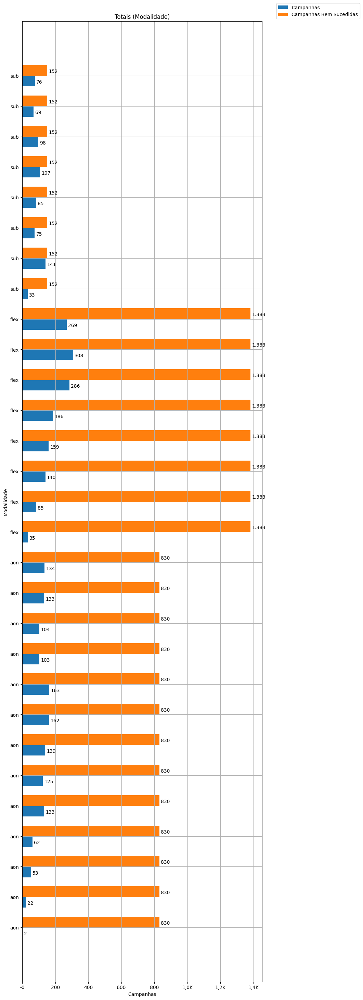

## Participação

O gráfico a seguir relaciona a modalidade com a participação de cada uma no conjunto de campanhas.

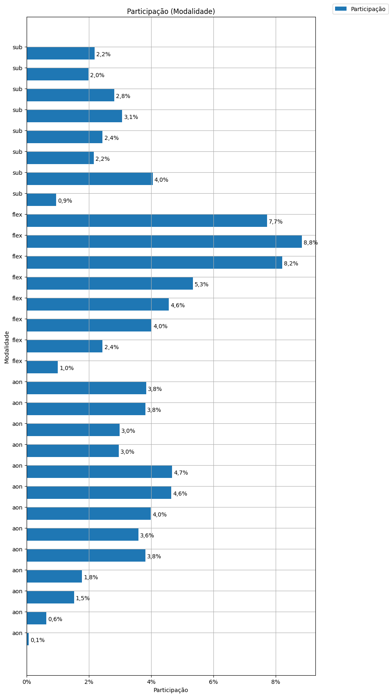

## Taxa de Sucesso

O gráfico a seguir relaciona a modalidade com a taxa de sucesso das campanhas.

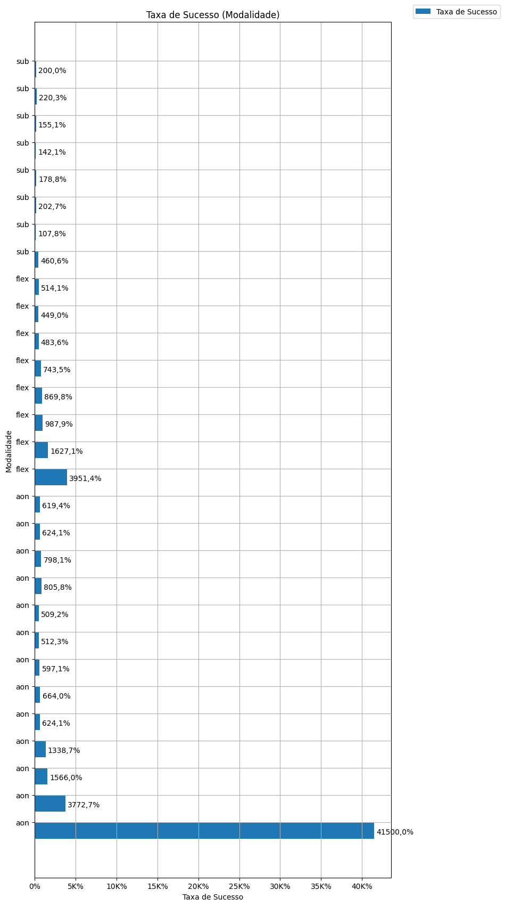

## Meta Total

O gráfico a seguir relaciona a modalidade com a meta de arrecadação das campanhas.

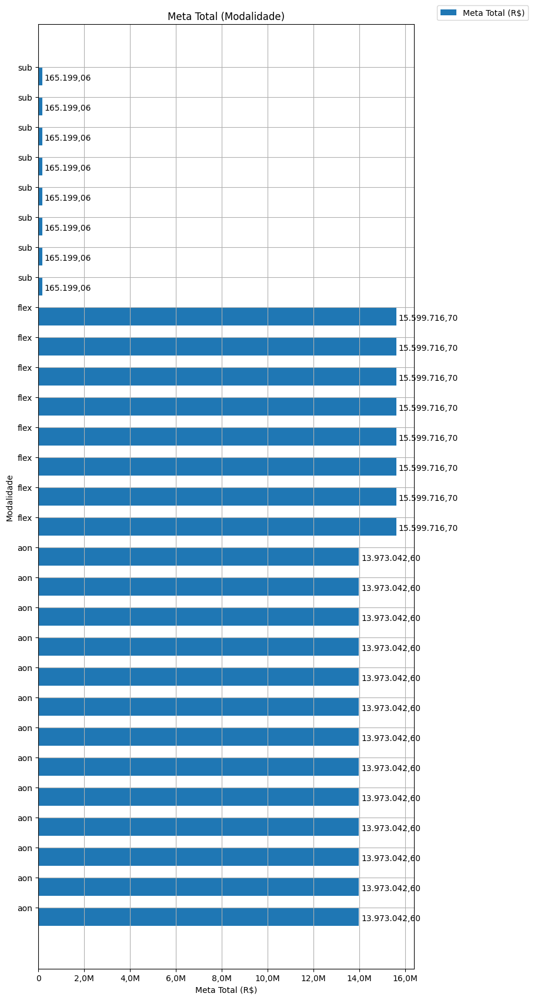

A seguir, os histogramas da 'Meta Corrigida' para as campanhas bem sucedidas em cada modalidade:
Tudo ou Nada, Flex e Recorente.

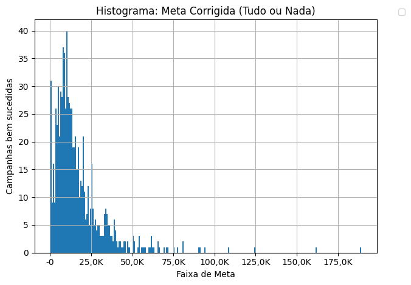

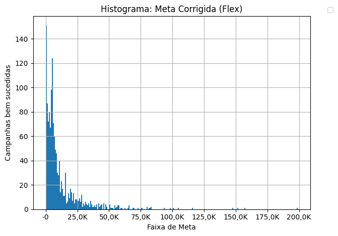

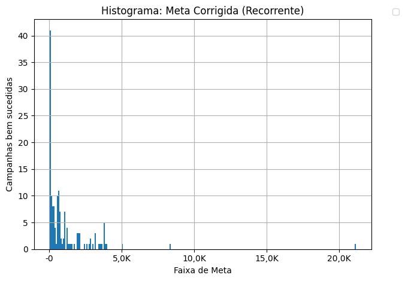

## Meta Média

O gráfico a seguir relaciona a modalidade com a meta média de arrecadação das campanhas.

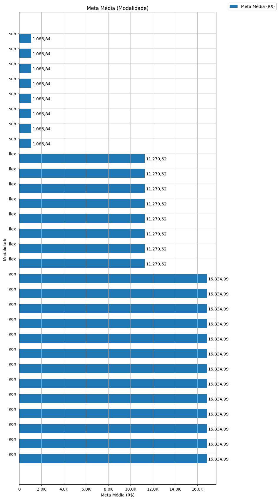

## Total Arrecadado

O gráfico a seguir relaciona a modalidade com o total arrecadado pelas campanhas bem sucedidas.

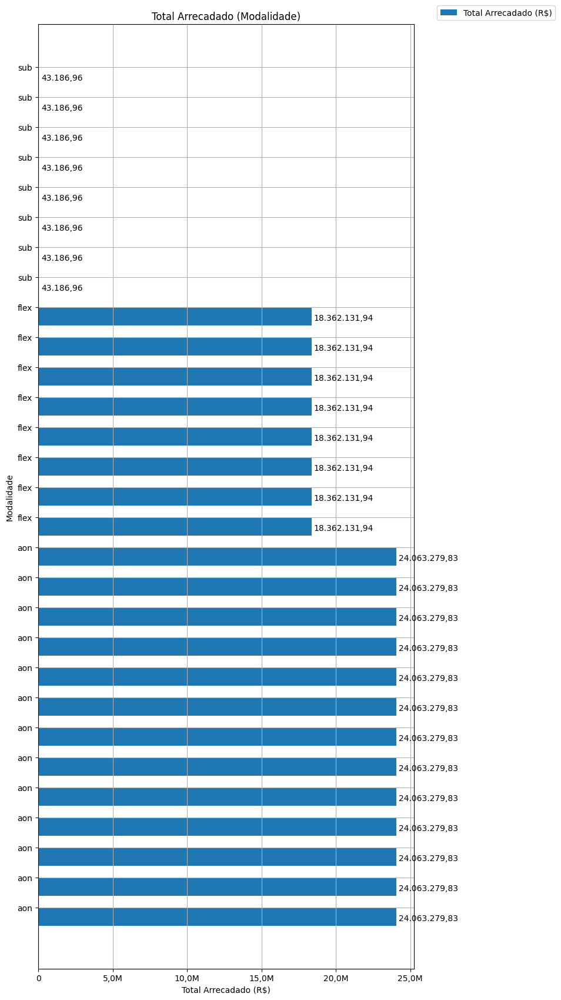

A seguir, os histogramas do 'Valor Arrecadado Corrigido' para as campanhas bem sucedidas em cada modalidade:
Tudo ou Nada, Flex e Recorente.

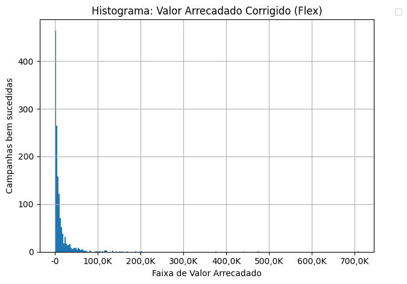

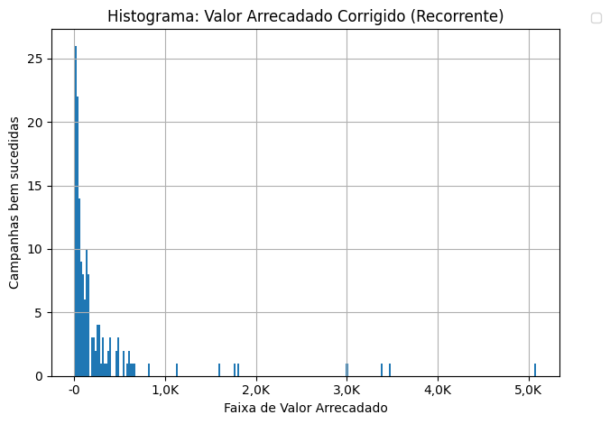

## Média Arrecadada por Campanha

O gráfico a seguir relaciona a modalidade com a média arrecadada por campanha bem sucedida.

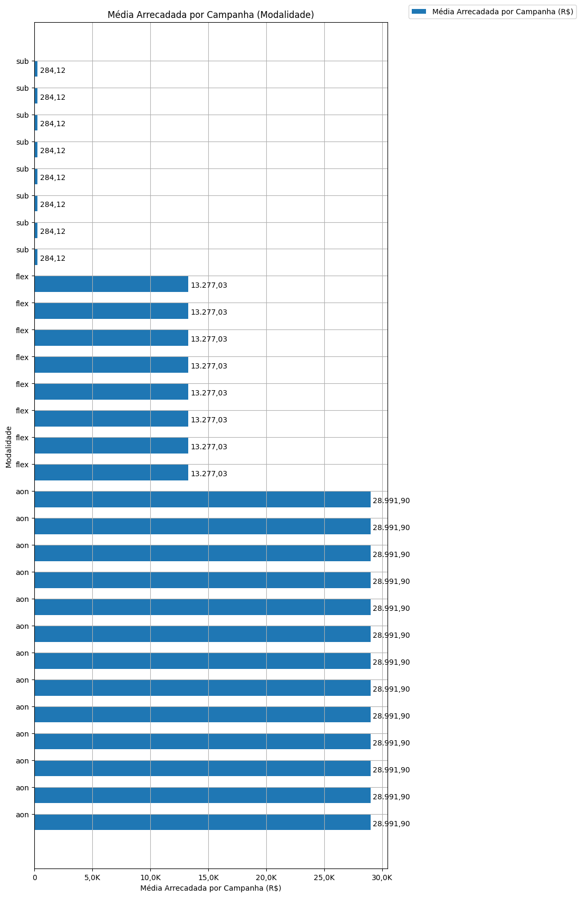

## Apoio Médio por Campanha

O gráfico a seguir relaciona a modalidade com o apoio médio por campanha bem sucedida.

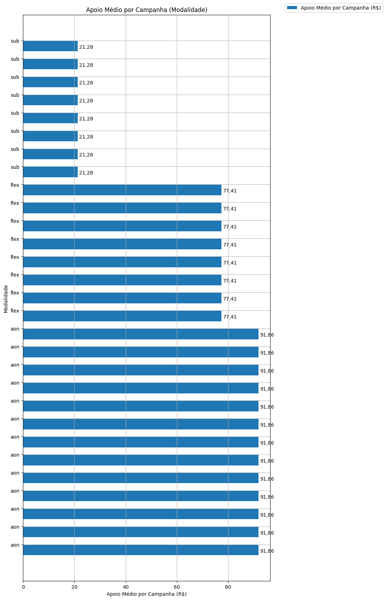

## Total de Contribuições

O gráfico a seguir relaciona a modalidade com o total de contribuições das campanhas bem sucedidas.

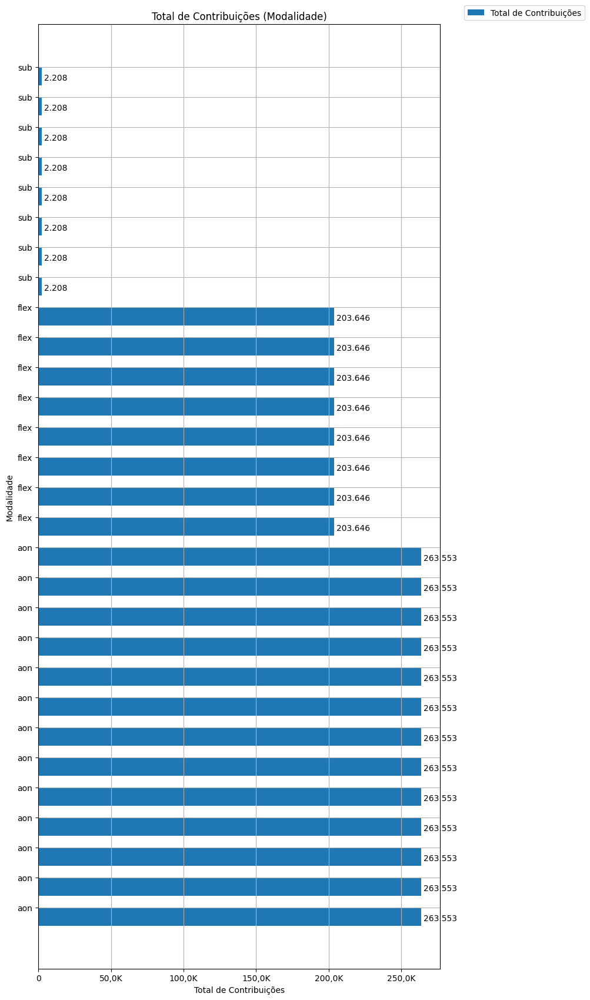

A seguir, os histogramas do 'Número de Contribuições' para as campanhas bem sucedidas em cada modalidade:
Tudo ou Nada, Flex e Recorente.

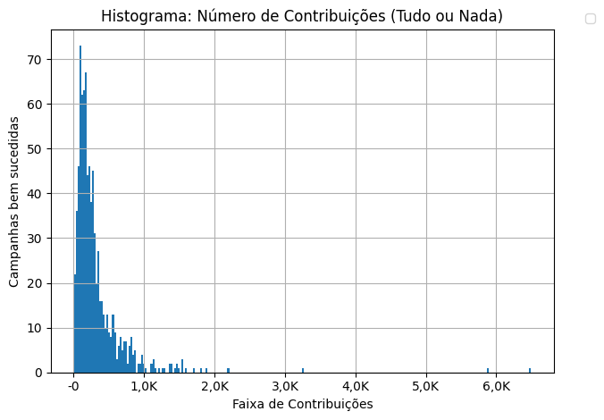

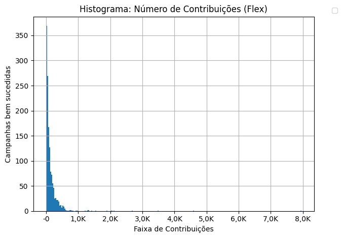

## Média de Contribuições

O gráfico a seguir relaciona a modalidade com a média de contribuições de campanhas bem sucedidas.

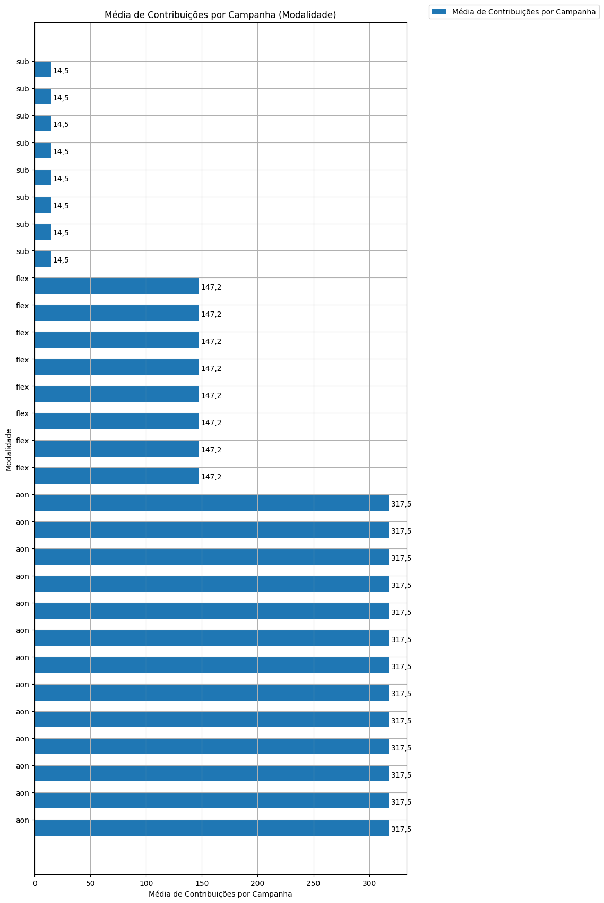

