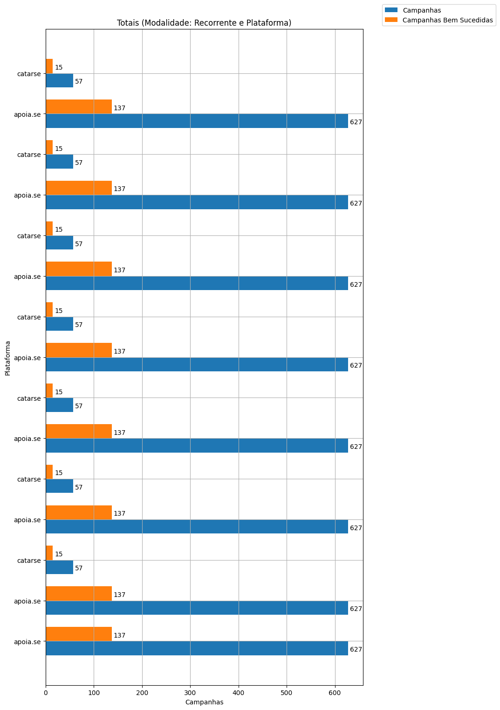
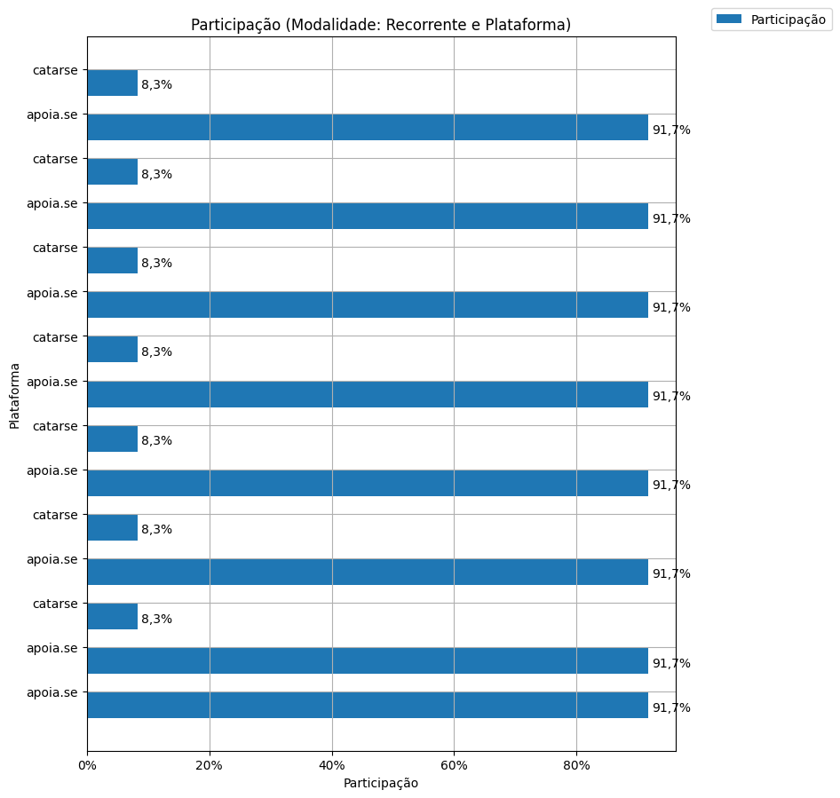
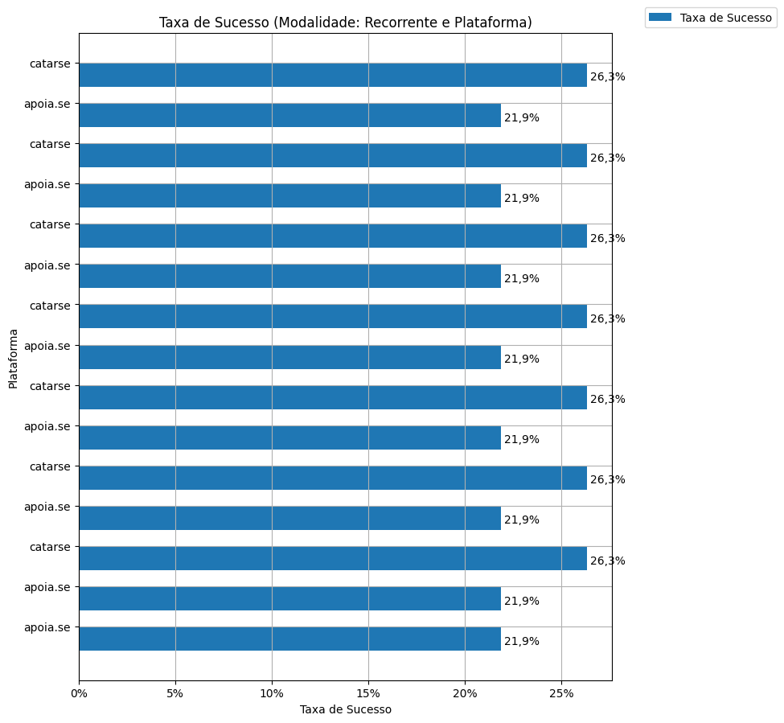
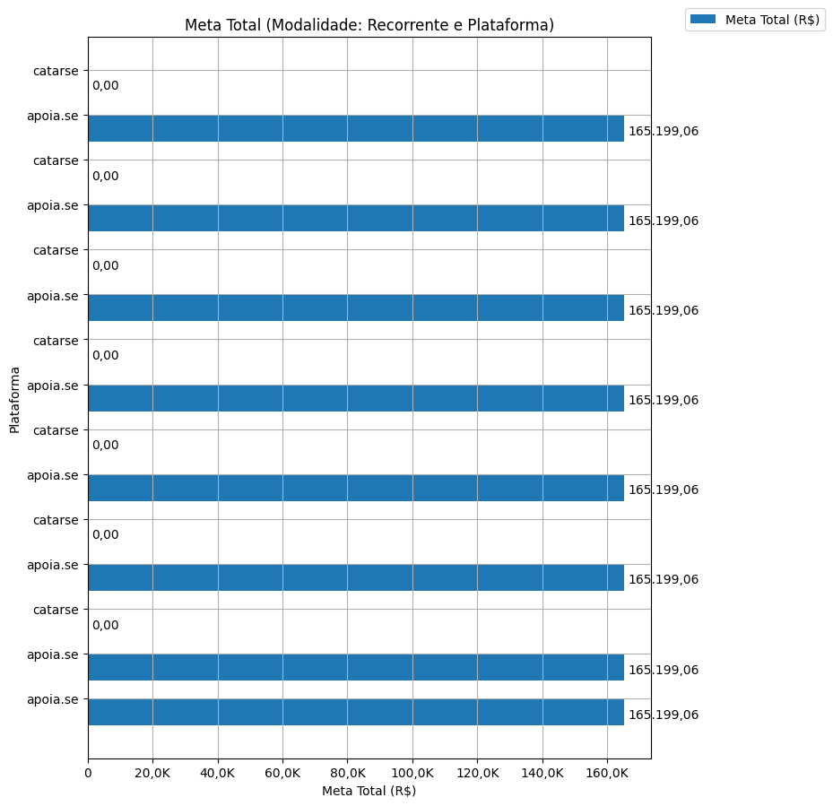
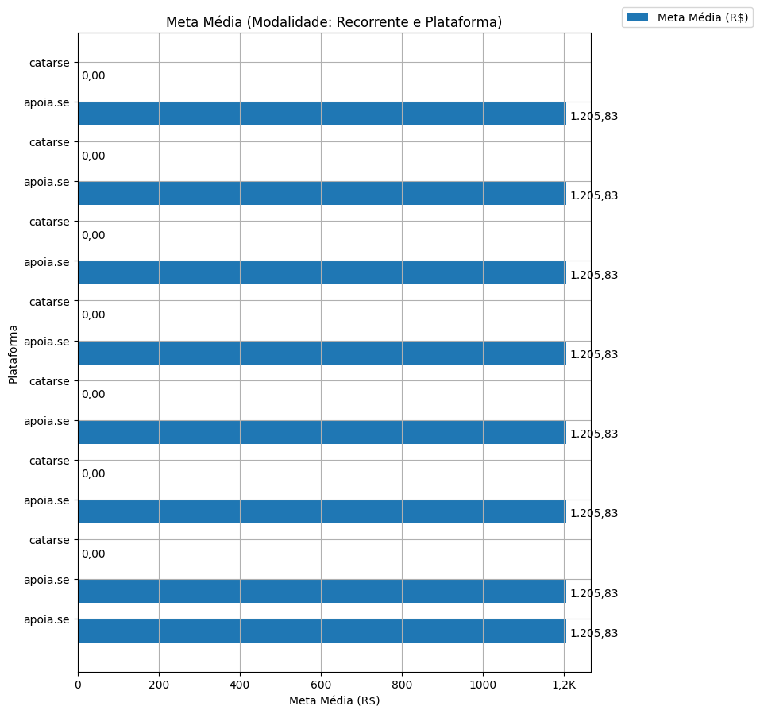
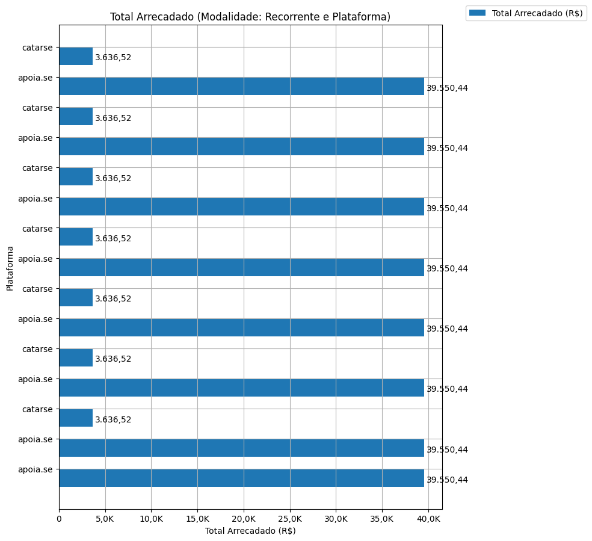
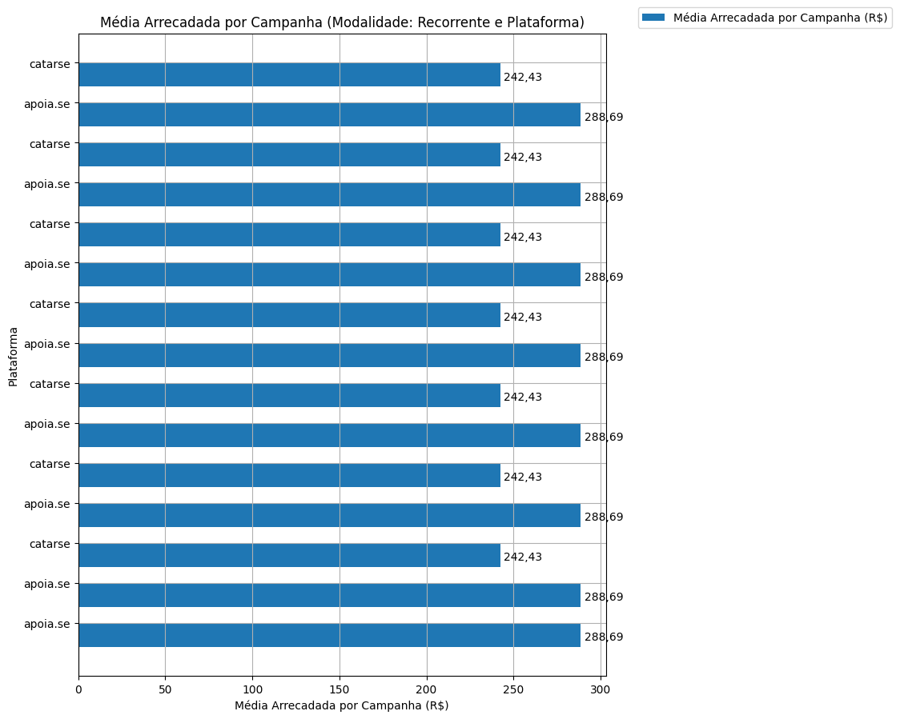
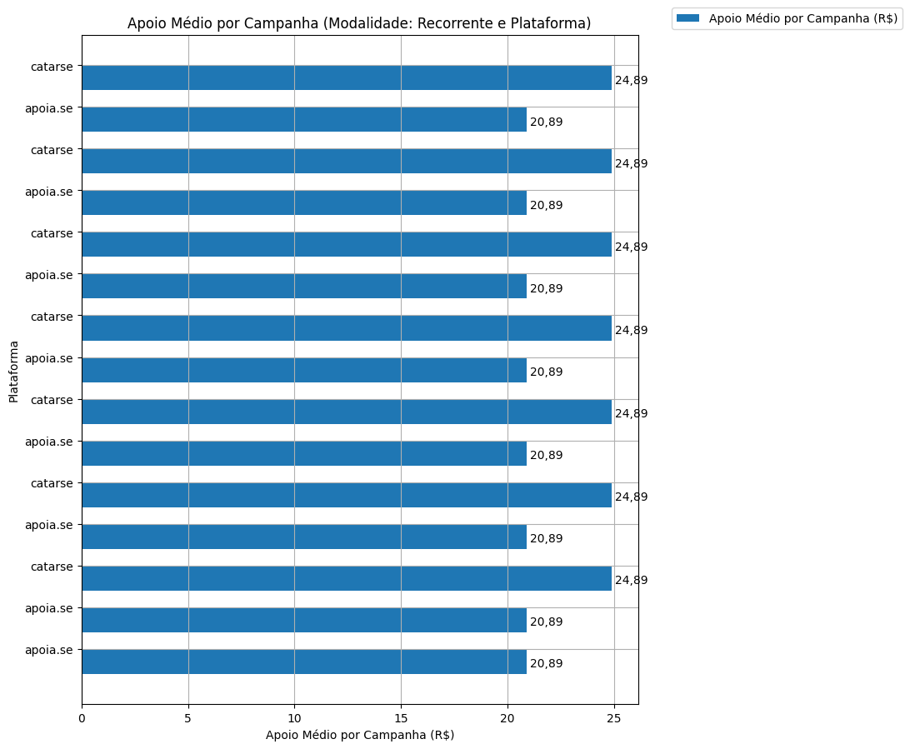
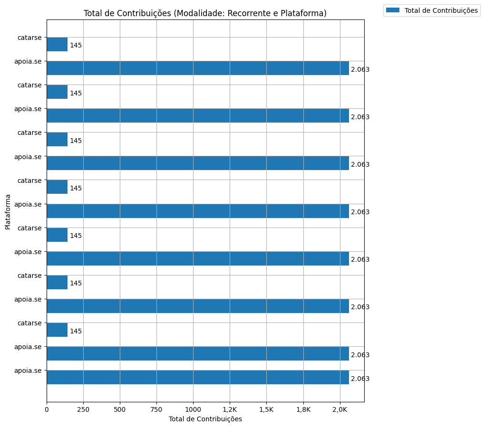
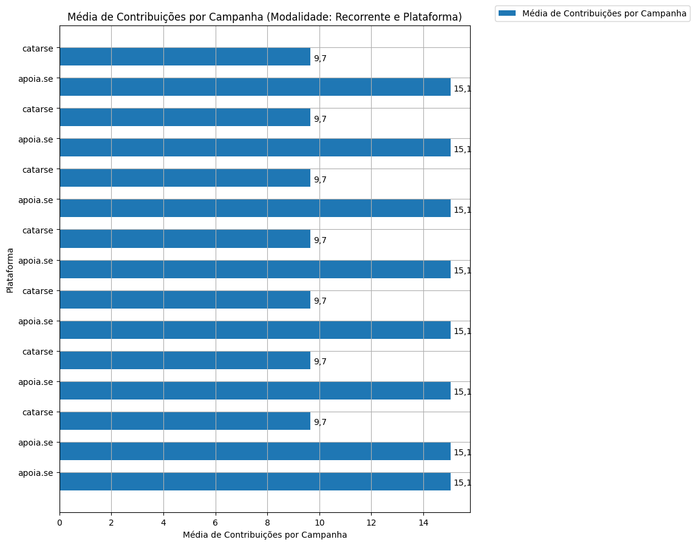

# Análise Descritiva - Recorte - Plataforma

A tabela abaixo foi usada nos gráficos a seguir.

| modalidade   |   ano | origem   |   total |   total_sucesso |   particip (%) |   taxa_sucesso (%) |   meta (R$) |   meta_avg (R$) |   meta_std (R$) |   meta_min (R$) |   meta_max (R$) |   arrecadado_sucesso (R$) |   arrecadado_avg (R$) |   arrecadado_std (R$) |   arrecadado_min (R$) |   arrecadado_max (R$) |   apoio_medio (R$) |   apoio_std (R$) |   apoio_min (R$) |   apoio_max (R$) |   contribuicoes |   contribuicoes_med |   contribuicoes_std |   contribuicoes_min |   contribuicoes_max |
|:-------------|------:|:---------|--------:|----------------:|---------------:|-------------------:|------------:|----------------:|----------------:|----------------:|----------------:|--------------------------:|----------------------:|----------------------:|----------------------:|----------------------:|-------------------:|-----------------:|-----------------:|-----------------:|----------------:|--------------------:|--------------------:|--------------------:|--------------------:|
| sub          |  2016 | apoia.se |     627 |             137 |          91,7% |              21,9% |  165.199,06 |        1.205,83 |        2.163,29 |            0,00 |       21.176,92 |                 39.550,44 |                288,69 |                682,40 |                  1,09 |              5.087,08 |              20,89 |            15,28 |             1,01 |            84,08 |           2.063 |                15,1 |                33,4 |                 1,0 |               208,0 |
| sub          |  2017 | apoia.se |     627 |             137 |          91,7% |              21,9% |  165.199,06 |        1.205,83 |        2.163,29 |            0,00 |       21.176,92 |                 39.550,44 |                288,69 |                682,40 |                  1,09 |              5.087,08 |              20,89 |            15,28 |             1,01 |            84,08 |           2.063 |                15,1 |                33,4 |                 1,0 |               208,0 |
| sub          |  2017 | catarse  |      57 |              15 |           8,3% |              26,3% |        0,00 |            0,00 |            0,00 |            0,00 |            0,00 |                  3.636,52 |                242,43 |                198,40 |                 10,98 |                538,44 |              24,89 |            12,20 |            10,98 |            48,38 |             145 |                 9,7 |                 8,3 |                 1,0 |                30,0 |
| sub          |  2018 | apoia.se |     627 |             137 |          91,7% |              21,9% |  165.199,06 |        1.205,83 |        2.163,29 |            0,00 |       21.176,92 |                 39.550,44 |                288,69 |                682,40 |                  1,09 |              5.087,08 |              20,89 |            15,28 |             1,01 |            84,08 |           2.063 |                15,1 |                33,4 |                 1,0 |               208,0 |
| sub          |  2018 | catarse  |      57 |              15 |           8,3% |              26,3% |        0,00 |            0,00 |            0,00 |            0,00 |            0,00 |                  3.636,52 |                242,43 |                198,40 |                 10,98 |                538,44 |              24,89 |            12,20 |            10,98 |            48,38 |             145 |                 9,7 |                 8,3 |                 1,0 |                30,0 |
| sub          |  2019 | apoia.se |     627 |             137 |          91,7% |              21,9% |  165.199,06 |        1.205,83 |        2.163,29 |            0,00 |       21.176,92 |                 39.550,44 |                288,69 |                682,40 |                  1,09 |              5.087,08 |              20,89 |            15,28 |             1,01 |            84,08 |           2.063 |                15,1 |                33,4 |                 1,0 |               208,0 |
| sub          |  2019 | catarse  |      57 |              15 |           8,3% |              26,3% |        0,00 |            0,00 |            0,00 |            0,00 |            0,00 |                  3.636,52 |                242,43 |                198,40 |                 10,98 |                538,44 |              24,89 |            12,20 |            10,98 |            48,38 |             145 |                 9,7 |                 8,3 |                 1,0 |                30,0 |
| sub          |  2020 | apoia.se |     627 |             137 |          91,7% |              21,9% |  165.199,06 |        1.205,83 |        2.163,29 |            0,00 |       21.176,92 |                 39.550,44 |                288,69 |                682,40 |                  1,09 |              5.087,08 |              20,89 |            15,28 |             1,01 |            84,08 |           2.063 |                15,1 |                33,4 |                 1,0 |               208,0 |
| sub          |  2020 | catarse  |      57 |              15 |           8,3% |              26,3% |        0,00 |            0,00 |            0,00 |            0,00 |            0,00 |                  3.636,52 |                242,43 |                198,40 |                 10,98 |                538,44 |              24,89 |            12,20 |            10,98 |            48,38 |             145 |                 9,7 |                 8,3 |                 1,0 |                30,0 |
| sub          |  2021 | apoia.se |     627 |             137 |          91,7% |              21,9% |  165.199,06 |        1.205,83 |        2.163,29 |            0,00 |       21.176,92 |                 39.550,44 |                288,69 |                682,40 |                  1,09 |              5.087,08 |              20,89 |            15,28 |             1,01 |            84,08 |           2.063 |                15,1 |                33,4 |                 1,0 |               208,0 |
| sub          |  2021 | catarse  |      57 |              15 |           8,3% |              26,3% |        0,00 |            0,00 |            0,00 |            0,00 |            0,00 |                  3.636,52 |                242,43 |                198,40 |                 10,98 |                538,44 |              24,89 |            12,20 |            10,98 |            48,38 |             145 |                 9,7 |                 8,3 |                 1,0 |                30,0 |
| sub          |  2022 | apoia.se |     627 |             137 |          91,7% |              21,9% |  165.199,06 |        1.205,83 |        2.163,29 |            0,00 |       21.176,92 |                 39.550,44 |                288,69 |                682,40 |                  1,09 |              5.087,08 |              20,89 |            15,28 |             1,01 |            84,08 |           2.063 |                15,1 |                33,4 |                 1,0 |               208,0 |
| sub          |  2022 | catarse  |      57 |              15 |           8,3% |              26,3% |        0,00 |            0,00 |            0,00 |            0,00 |            0,00 |                  3.636,52 |                242,43 |                198,40 |                 10,98 |                538,44 |              24,89 |            12,20 |            10,98 |            48,38 |             145 |                 9,7 |                 8,3 |                 1,0 |                30,0 |
| sub          |  2023 | apoia.se |     627 |             137 |          91,7% |              21,9% |  165.199,06 |        1.205,83 |        2.163,29 |            0,00 |       21.176,92 |                 39.550,44 |                288,69 |                682,40 |                  1,09 |              5.087,08 |              20,89 |            15,28 |             1,01 |            84,08 |           2.063 |                15,1 |                33,4 |                 1,0 |               208,0 |
| sub          |  2023 | catarse  |      57 |              15 |           8,3% |              26,3% |        0,00 |            0,00 |            0,00 |            0,00 |            0,00 |                  3.636,52 |                242,43 |                198,40 |                 10,98 |                538,44 |              24,89 |            12,20 |            10,98 |            48,38 |             145 |                 9,7 |                 8,3 |                 1,0 |                30,0 |

Dados em [planilha eletrônica](./dados/sub-plataforma.xlsx).

## Totais

O gráfico a seguir relaciona a modalidade com o total de campanhas e o total de campanhas bem sucedidas.

## Participação

O gráfico a seguir relaciona a modalidade com a participação de cada uma no conjunto de campanhas.

## Taxa de Sucesso

O gráfico a seguir relaciona a modalidade com a taxa de sucesso das campanhas.

## Meta Total

O gráfico a seguir relaciona a modalidade com a meta de arrecadação das campanhas bem sucedidas.

## Meta Média

O gráfico a seguir relaciona a modalidade com a meta média de arrecadação das campanhas bem sucedidas.

## Total Arrecadado

O gráfico a seguir relaciona a modalidade com o total arrecadado pelas campanhas bem sucedidas.

## Média Arrecadada por Campanha

O gráfico a seguir relaciona a modalidade com a média arrecadada por campanha bem sucedida.

## Apoio Médio por Campanha

O gráfico a seguir relaciona a modalidade com o apoio médio por campanha bem sucedida.

## Total de Contribuições

O gráfico a seguir relaciona a modalidade com o total de contribuições das campanhas bem sucedidas.

## Média de Contribuições

O gráfico a seguir relaciona a modalidade com a média de contribuições de campanhas bem sucedidas.

