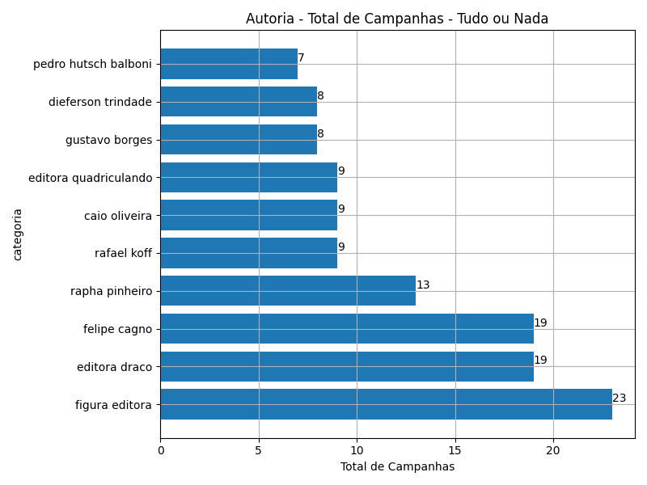
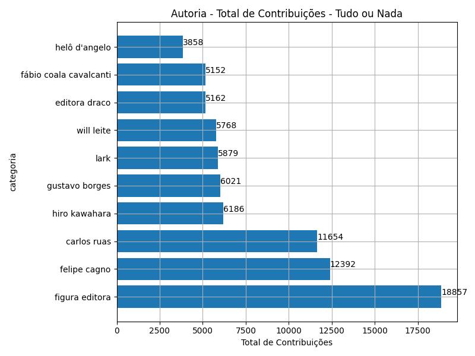
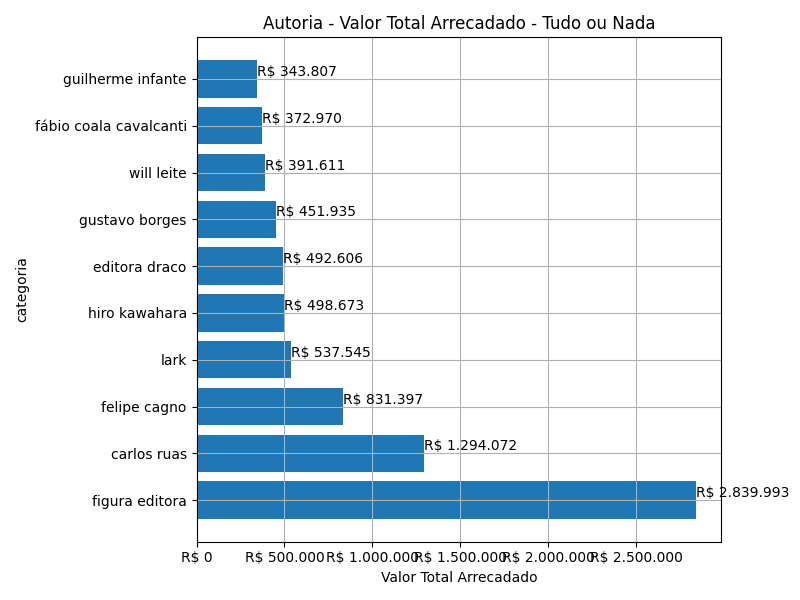
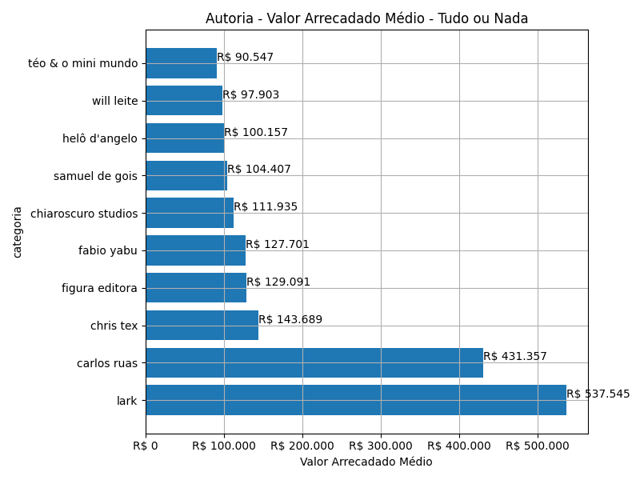
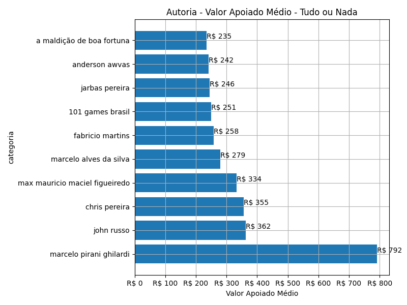
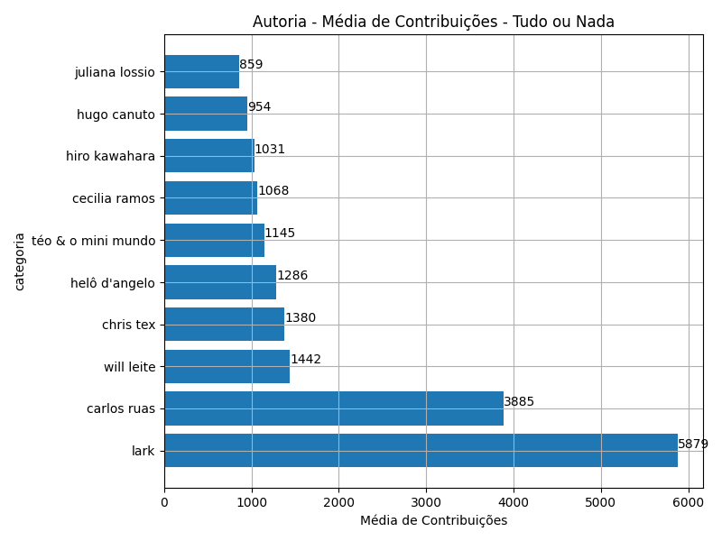

# Rankings: Autoria, Modalidade: Tudo ou Nada

Rankings por _total_ (quantidade de campanhas realizadas), _contribuicoes_
(total de contribuições), _taxa_sucesso_ (taxa de sucesso das campanhas),
_arrecadado_sucesso_ (valor total arrecadado com campanhas bem sucedidas),
_media_sucesso_ (valor arrecadado médio com campanhas bem sucedidas),
_apoio_medio_ (apoio médio das campanhas bem sucedidas)
e _media_contribuicoes_ (média de contribuições).

As análises serão realizadas por Modalidade e Autoria. Colunas:

- modalidade: tudo ou nada, flex ou recorrente;
- autoria_classificacao: dimensão de agrupamento;
- total: total de campanhas;
- arrecadado: valor total arrecadado pelas campanhas (bem sucedidas ou não);
- total_sucesso: total de campanhas bem sucedidas;
- arrecadado_sucesso: valor total arrecadado pelas campanhas bem sucedidas;
- taxa_sucesso: relação entre o total de campanhas bem sucedidas e o total de campanhas;
- media_sucesso: valor arrecadado médio pelas campanhas bem sucedidas;
- std_sucesso: desvio padrão médio (ref: valor arrecadado) pelas campanhas bem sucedidas;
- min_sucesso: menor valor arrecadado médio entre as campanhas bem sucedidas;
- max_sucesso: maior valor arrecadado médio entre as campanhas bem sucedidas;
- apoio_medio: apoio médio entre as campanhas bem sucedidas;
- contribuicoes: total de contribuições entre as campanhas bem sucedidas;
- media_contribuicoes: média de contribuições entre as campanhas bem sucedidas.

## Total de Campanhas

<!-- ### Modalidade: Tudo ou Nada -->

<!--Total de Campanhas-->
Top 10 _Autoria_, por _total_, em _Tudo ou Nada_.

| geral_modalidade   | autoria_nome_publico   |   total |   total_sucesso |   particip |   taxa_sucesso |   arrecadado_sucesso |   media_sucesso |   std_sucesso |   min_sucesso |   max_sucesso |   apoio_medio |   contribuicoes |   media_contribuicoes |
|:-------------------|:-----------------------|--------:|----------------:|-----------:|---------------:|---------------------:|----------------:|--------------:|--------------:|--------------:|--------------:|----------------:|----------------------:|
| aon                | figura editora         |      23 |              22 |       1,72 |          95,65 |           2.839.992,82 |       129.090,58 |      84.991,88 |      22.984,29 |     264.585,91 |        150,61 |           18.857 |                857,14 |
| aon                | editora draco          |      19 |              19 |       1,42 |         100,00 |            492.606,35 |        25.926,65 |      14.189,58 |       7.716,33 |      53.271,79 |         95,43 |            5.162 |                271,68 |
| aon                | felipe cagno           |      19 |              18 |       1,42 |          94,74 |            831.396,52 |        46.188,70 |      20.390,29 |      12.234,57 |      82.270,87 |         67,09 |           12.392 |                688,44 |
| aon                | rapha pinheiro         |      13 |              12 |       0,97 |          92,31 |            190.094,30 |        15.841,19 |      11.845,55 |       2.401,23 |      34.695,91 |         85,28 |            2.229 |                185,75 |
| aon                | rafael koff            |       9 |               9 |       0,67 |         100,00 |            197.213,50 |        21.912,61 |      13.280,17 |       9.166,02 |      47.762,94 |         66,45 |            2.968 |                329,78 |
| aon                | caio oliveira          |       9 |               8 |       0,67 |          88,89 |            180.197,39 |        22.524,67 |       8.137,23 |      13.997,91 |      39.440,42 |         75,30 |            2.393 |                299,12 |
| aon                | editora quadriculando  |       9 |               5 |       0,67 |          55,56 |             28.465,71 |         5.693,14 |       6.086,61 |         54,54 |      12.814,96 |         68,92 |             413 |                 82,60 |
| aon                | gustavo borges         |       8 |               8 |       0,60 |         100,00 |            451.934,82 |        56.491,85 |      17.452,79 |      27.288,62 |      85.108,68 |         75,06 |            6.021 |                752,62 |
| aon                | dieferson trindade     |       8 |               7 |       0,60 |          87,50 |             40.755,22 |         5.822,17 |       3.439,07 |       1.682,05 |      10.155,00 |         48,58 |             839 |                119,86 |
| aon                | pedro hutsch balboni   |       7 |               7 |       0,52 |         100,00 |             87.902,88 |        12.557,55 |       7.422,61 |       2.167,66 |      23.111,07 |         88,43 |             994 |                142,00 |

## Total de Contribuições

<!-- ### Modalidade: Tudo ou Nada -->

<!--Total de Contribuições-->
Top 10 _Autoria_, por _contribuicoes_, em _Tudo ou Nada_.

| geral_modalidade   | autoria_nome_publico   |   total |   total_sucesso |   particip |   taxa_sucesso |   arrecadado_sucesso |   media_sucesso |   std_sucesso |   min_sucesso |   max_sucesso |   apoio_medio |   contribuicoes |   media_contribuicoes |
|:-------------------|:-----------------------|--------:|----------------:|-----------:|---------------:|---------------------:|----------------:|--------------:|--------------:|--------------:|--------------:|----------------:|----------------------:|
| aon                | figura editora         |      23 |              22 |       1,72 |          95,65 |           2.839.992,82 |       129.090,58 |      84.991,88 |      22.984,29 |     264.585,91 |        150,61 |           18.857 |                857,14 |
| aon                | felipe cagno           |      19 |              18 |       1,42 |          94,74 |            831.396,52 |        46.188,70 |      20.390,29 |      12.234,57 |      82.270,87 |         67,09 |           12.392 |                688,44 |
| aon                | carlos ruas            |       3 |               3 |       0,22 |         100,00 |           1.294.072,39 |       431.357,46 |     232.501,76 |     218.217,23 |     679.297,66 |        111,04 |           11.654 |               3.884,67 |
| aon                | hiro kawahara          |       7 |               6 |       0,52 |          85,71 |            498.673,32 |        83.112,22 |      17.948,06 |      59.328,44 |     104.662,96 |         80,61 |            6.186 |               1.031,00 |
| aon                | gustavo borges         |       8 |               8 |       0,60 |         100,00 |            451.934,82 |        56.491,85 |      17.452,79 |      27.288,62 |      85.108,68 |         75,06 |            6.021 |                752,62 |
| aon                | lark                   |       1 |               1 |       0,07 |         100,00 |            537.544,55 |       537.544,55 |          0,00 |     537.544,55 |     537.544,55 |         91,43 |            5.879 |               5.879,00 |
| aon                | will leite             |       4 |               4 |       0,30 |         100,00 |            391.611,35 |        97.902,84 |      39.110,18 |      52.769,15 |     148.192,26 |         67,89 |            5.768 |               1.442,00 |
| aon                | editora draco          |      19 |              19 |       1,42 |         100,00 |            492.606,35 |        25.926,65 |      14.189,58 |       7.716,33 |      53.271,79 |         95,43 |            5.162 |                271,68 |
| aon                | fábio coala cavalcanti |       6 |               6 |       0,45 |         100,00 |            372.969,57 |        62.161,60 |      17.689,93 |      29.354,59 |      81.237,55 |         72,39 |            5.152 |                858,67 |
| aon                | helô d'angelo          |       3 |               3 |       0,22 |         100,00 |            300.471,62 |       100.157,21 |      26.581,34 |      71.034,30 |     123.112,70 |         77,88 |            3.858 |               1.286,00 |

## Valor Total Arrecadado

<!-- ### Modalidade: Tudo ou Nada -->

<!--Valor Total Arrecadado-->
Top 10 _Autoria_, por _arrecadado_sucesso_, em _Tudo ou Nada_.

| geral_modalidade   | autoria_nome_publico   |   total |   total_sucesso |   particip |   taxa_sucesso |   arrecadado_sucesso |   media_sucesso |   std_sucesso |   min_sucesso |   max_sucesso |   apoio_medio |   contribuicoes |   media_contribuicoes |
|:-------------------|:-----------------------|--------:|----------------:|-----------:|---------------:|---------------------:|----------------:|--------------:|--------------:|--------------:|--------------:|----------------:|----------------------:|
| aon                | figura editora         |      23 |              22 |       1,72 |          95,65 |           2.839.992,82 |       129.090,58 |      84.991,88 |      22.984,29 |     264.585,91 |        150,61 |           18.857 |                857,14 |
| aon                | carlos ruas            |       3 |               3 |       0,22 |         100,00 |           1.294.072,39 |       431.357,46 |     232.501,76 |     218.217,23 |     679.297,66 |        111,04 |           11.654 |               3.884,67 |
| aon                | felipe cagno           |      19 |              18 |       1,42 |          94,74 |            831.396,52 |        46.188,70 |      20.390,29 |      12.234,57 |      82.270,87 |         67,09 |           12.392 |                688,44 |
| aon                | lark                   |       1 |               1 |       0,07 |         100,00 |            537.544,55 |       537.544,55 |          0,00 |     537.544,55 |     537.544,55 |         91,43 |            5.879 |               5.879,00 |
| aon                | hiro kawahara          |       7 |               6 |       0,52 |          85,71 |            498.673,32 |        83.112,22 |      17.948,06 |      59.328,44 |     104.662,96 |         80,61 |            6.186 |               1.031,00 |
| aon                | editora draco          |      19 |              19 |       1,42 |         100,00 |            492.606,35 |        25.926,65 |      14.189,58 |       7.716,33 |      53.271,79 |         95,43 |            5.162 |                271,68 |
| aon                | gustavo borges         |       8 |               8 |       0,60 |         100,00 |            451.934,82 |        56.491,85 |      17.452,79 |      27.288,62 |      85.108,68 |         75,06 |            6.021 |                752,62 |
| aon                | will leite             |       4 |               4 |       0,30 |         100,00 |            391.611,35 |        97.902,84 |      39.110,18 |      52.769,15 |     148.192,26 |         67,89 |            5.768 |               1.442,00 |
| aon                | fábio coala cavalcanti |       6 |               6 |       0,45 |         100,00 |            372.969,57 |        62.161,60 |      17.689,93 |      29.354,59 |      81.237,55 |         72,39 |            5.152 |                858,67 |
| aon                | guilherme infante      |       4 |               4 |       0,30 |         100,00 |            343.806,89 |        85.951,72 |      21.644,83 |      53.732,34 |      98.936,89 |        117,18 |            2.934 |                733,50 |

## Valor Arrecadado Médio

<!-- ### Modalidade: Tudo ou Nada -->

<!--Valor Médio Arrecadado-->
Top 10 _Autoria_, por _media_sucesso_, em _Tudo ou Nada_.

| geral_modalidade   | autoria_nome_publico   |   total |   total_sucesso |   particip |   taxa_sucesso |   arrecadado_sucesso |   media_sucesso |   std_sucesso |   min_sucesso |   max_sucesso |   apoio_medio |   contribuicoes |   media_contribuicoes |
|:-------------------|:-----------------------|--------:|----------------:|-----------:|---------------:|---------------------:|----------------:|--------------:|--------------:|--------------:|--------------:|----------------:|----------------------:|
| aon                | lark                   |       1 |               1 |       0,07 |         100,00 |            537.544,55 |       537.544,55 |          0,00 |     537.544,55 |     537.544,55 |         91,43 |            5.879 |               5.879,00 |
| aon                | carlos ruas            |       3 |               3 |       0,22 |         100,00 |           1.294.072,39 |       431.357,46 |     232.501,76 |     218.217,23 |     679.297,66 |        111,04 |           11.654 |               3.884,67 |
| aon                | chris tex              |       1 |               1 |       0,07 |         100,00 |            143.689,03 |       143.689,03 |          0,00 |     143.689,03 |     143.689,03 |        104,12 |            1.380 |               1.380,00 |
| aon                | figura editora         |      23 |              22 |       1,72 |          95,65 |           2.839.992,82 |       129.090,58 |      84.991,88 |      22.984,29 |     264.585,91 |        150,61 |           18.857 |                857,14 |
| aon                | fabio yabu             |       2 |               1 |       0,15 |          50,00 |            127.701,07 |       127.701,07 |          0,00 |     127.701,07 |     127.701,07 |        174,93 |             730 |                730,00 |
| aon                | chiaroscuro studios    |       1 |               1 |       0,07 |         100,00 |            111.934,90 |       111.934,90 |          0,00 |     111.934,90 |     111.934,90 |        147,87 |             757 |                757,00 |
| aon                | samuel de gois         |       1 |               1 |       0,07 |         100,00 |            104.406,74 |       104.406,74 |          0,00 |     104.406,74 |     104.406,74 |        128,11 |             815 |                815,00 |
| aon                | helô d'angelo          |       3 |               3 |       0,22 |         100,00 |            300.471,62 |       100.157,21 |      26.581,34 |      71.034,30 |     123.112,70 |         77,88 |            3.858 |               1.286,00 |
| aon                | will leite             |       4 |               4 |       0,30 |         100,00 |            391.611,35 |        97.902,84 |      39.110,18 |      52.769,15 |     148.192,26 |         67,89 |            5.768 |               1.442,00 |
| aon                | téo & o mini mundo     |       3 |               3 |       0,22 |         100,00 |            271.641,20 |        90.547,07 |      43.718,08 |      49.828,53 |     136.747,60 |         79,10 |            3.434 |               1.144,67 |

## Valor Apoiado Médio

<!-- ### Modalidade: Tudo ou Nada -->

<!--Valor Médio Apoiado-->
Top 10 _Autoria_, por _apoio_medio_, em _Tudo ou Nada_.

| geral_modalidade   | autoria_nome_publico           |   total |   total_sucesso |   particip |   taxa_sucesso |   arrecadado_sucesso |   media_sucesso |   std_sucesso |   min_sucesso |   max_sucesso |   apoio_medio |   contribuicoes |   media_contribuicoes |
|:-------------------|:-------------------------------|--------:|----------------:|-----------:|---------------:|---------------------:|----------------:|--------------:|--------------:|--------------:|--------------:|----------------:|----------------------:|
| aon                | marcelo pirani ghilardi        |       1 |               1 |       0,07 |         100,00 |             70.491,21 |        70.491,21 |          0,00 |      70.491,21 |      70.491,21 |        792,04 |              89 |                 89,00 |
| aon                | john russo                     |       1 |               1 |       0,07 |         100,00 |             10.137,16 |        10.137,16 |          0,00 |      10.137,16 |      10.137,16 |        362,04 |              28 |                 28,00 |
| aon                | chris pereira                  |       1 |               1 |       0,07 |         100,00 |             26.656,43 |        26.656,43 |          0,00 |      26.656,43 |      26.656,43 |        355,42 |              75 |                 75,00 |
| aon                | max mauricio maciel figueiredo |       1 |               1 |       0,07 |         100,00 |             17.349,81 |        17.349,81 |          0,00 |      17.349,81 |      17.349,81 |        333,65 |              52 |                 52,00 |
| aon                | marcelo alves da silva         |       3 |               1 |       0,22 |          33,33 |             31.298,04 |        31.298,04 |          0,00 |      31.298,04 |      31.298,04 |        279,45 |             112 |                112,00 |
| aon                | fabricio martins               |       1 |               1 |       0,07 |         100,00 |             26.356,69 |        26.356,69 |          0,00 |      26.356,69 |      26.356,69 |        258,40 |             102 |                102,00 |
| aon                | 101 games brasil               |       1 |               1 |       0,07 |         100,00 |             23.808,60 |        23.808,60 |          0,00 |      23.808,60 |      23.808,60 |        250,62 |              95 |                 95,00 |
| aon                | jarbas pereira                 |       1 |               1 |       0,07 |         100,00 |             20.877,32 |        20.877,32 |          0,00 |      20.877,32 |      20.877,32 |        245,62 |              85 |                 85,00 |
| aon                | anderson awvas                 |       1 |               1 |       0,07 |         100,00 |             21.038,38 |        21.038,38 |          0,00 |      21.038,38 |      21.038,38 |        241,82 |              87 |                 87,00 |
| aon                | a maldição de boa fortuna      |       1 |               1 |       0,07 |         100,00 |             44.390,62 |        44.390,62 |          0,00 |      44.390,62 |      44.390,62 |        234,87 |             189 |                189,00 |

## Média de Contribuições

<!-- ### Modalidade: Tudo ou Nada -->

<!--Média de Contribuições-->
Top 10 _Autoria_, por _media_contribuicoes_, em _Tudo ou Nada_.

| geral_modalidade   | autoria_nome_publico   |   total |   total_sucesso |   particip |   taxa_sucesso |   arrecadado_sucesso |   media_sucesso |   std_sucesso |   min_sucesso |   max_sucesso |   apoio_medio |   contribuicoes |   media_contribuicoes |
|:-------------------|:-----------------------|--------:|----------------:|-----------:|---------------:|---------------------:|----------------:|--------------:|--------------:|--------------:|--------------:|----------------:|----------------------:|
| aon                | lark                   |       1 |               1 |       0,07 |         100,00 |            537.544,55 |       537.544,55 |          0,00 |     537.544,55 |     537.544,55 |         91,43 |            5.879 |               5.879,00 |
| aon                | carlos ruas            |       3 |               3 |       0,22 |         100,00 |           1.294.072,39 |       431.357,46 |     232.501,76 |     218.217,23 |     679.297,66 |        111,04 |           11.654 |               3.884,67 |
| aon                | will leite             |       4 |               4 |       0,30 |         100,00 |            391.611,35 |        97.902,84 |      39.110,18 |      52.769,15 |     148.192,26 |         67,89 |            5.768 |               1.442,00 |
| aon                | chris tex              |       1 |               1 |       0,07 |         100,00 |            143.689,03 |       143.689,03 |          0,00 |     143.689,03 |     143.689,03 |        104,12 |            1.380 |               1.380,00 |
| aon                | helô d'angelo          |       3 |               3 |       0,22 |         100,00 |            300.471,62 |       100.157,21 |      26.581,34 |      71.034,30 |     123.112,70 |         77,88 |            3.858 |               1.286,00 |
| aon                | téo & o mini mundo     |       3 |               3 |       0,22 |         100,00 |            271.641,20 |        90.547,07 |      43.718,08 |      49.828,53 |     136.747,60 |         79,10 |            3.434 |               1.144,67 |
| aon                | cecilia ramos          |       2 |               2 |       0,15 |         100,00 |            180.149,01 |        90.074,50 |      90.921,88 |      25.783,02 |     154.365,98 |         84,30 |            2.137 |               1.068,50 |
| aon                | hiro kawahara          |       7 |               6 |       0,52 |          85,71 |            498.673,32 |        83.112,22 |      17.948,06 |      59.328,44 |     104.662,96 |         80,61 |            6.186 |               1.031,00 |
| aon                | hugo canuto            |       3 |               3 |       0,22 |         100,00 |            260.725,35 |        86.908,45 |      64.758,05 |      42.082,29 |     161.153,63 |         91,10 |            2.862 |                954,00 |
| aon                | juliana lossio         |       1 |               1 |       0,07 |         100,00 |             84.595,59 |        84.595,59 |          0,00 |      84.595,59 |      84.595,59 |         98,48 |             859 |                859,00 |

