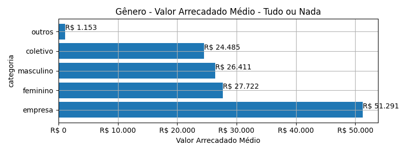

# Rankings: Gênero, Modalidade: Tudo ou Nada

Rankings por _total_ (quantidade de campanhas realizadas), _contribuicoes_
(total de contribuições), _taxa_sucesso_ (taxa de sucesso das campanhas),
_arrecadado_sucesso_ (valor total arrecadado com campanhas bem sucedidas),
_media_sucesso_ (valor arrecadado médio com campanhas bem sucedidas),
_apoio_medio_ (apoio médio das campanhas bem sucedidas)
e _media_contribuicoes_ (média de contribuições).

As análises serão realizadas por Modalidade e Gênero. Colunas:

- modalidade: tudo ou nada, flex ou recorrente;
- autoria_classificacao: dimensão de agrupamento;
- total: total de campanhas;
- arrecadado: valor total arrecadado pelas campanhas (bem sucedidas ou não);
- total_sucesso: total de campanhas bem sucedidas;
- arrecadado_sucesso: valor total arrecadado pelas campanhas bem sucedidas;
- taxa_sucesso: relação entre o total de campanhas bem sucedidas e o total de campanhas;
- media_sucesso: valor arrecadado médio pelas campanhas bem sucedidas;
- std_sucesso: desvio padrão médio (ref: valor arrecadado) pelas campanhas bem sucedidas;
- min_sucesso: menor valor arrecadado médio entre as campanhas bem sucedidas;
- max_sucesso: maior valor arrecadado médio entre as campanhas bem sucedidas;
- apoio_medio: apoio médio entre as campanhas bem sucedidas;
- contribuicoes: total de contribuições entre as campanhas bem sucedidas;
- media_contribuicoes: média de contribuições entre as campanhas bem sucedidas.

## Total de Campanhas

<!-- ### Modalidade: Tudo ou Nada -->

<!--Total de Campanhas-->
Top 5 _Gênero_, por _total_, em _Tudo ou Nada_.

| geral_modalidade   | autoria_classificacao   |   total |   total_sucesso |   particip |   taxa_sucesso |   arrecadado_sucesso |   media_sucesso |   std_sucesso |   min_sucesso |   max_sucesso |   apoio_medio |   contribuicoes |   media_contribuicoes |
|:-------------------|:------------------------|--------:|----------------:|-----------:|---------------:|---------------------:|----------------:|--------------:|--------------:|--------------:|--------------:|----------------:|----------------------:|
| aon                | masculino               |     959 |             576 |      71,84 |          60,06 |          15.212.724,00 |        26.410,98 |      40.119,88 |         94,90 |     679.297,66 |         87,19 |          174.471 |                302,90 |
| aon                | feminino                |     209 |             140 |      15,66 |          66,99 |           3.881.052,70 |        27.721,81 |      48.958,87 |         41,82 |     537.544,55 |         79,81 |           48.629 |                347,35 |
| aon                | empresa                 |     117 |              83 |       8,76 |          70,94 |           4.257.136,76 |        51.290,80 |      65.495,08 |         54,54 |     264.585,91 |        129,55 |           32.860 |                395,90 |
| aon                | coletivo                |      44 |              29 |       3,30 |          65,91 |            710.060,78 |        24.484,85 |      25.328,68 |       4.520,87 |     111.934,90 |         94,09 |            7.547 |                260,24 |
| aon                | outros                  |       6 |               2 |       0,45 |          33,33 |              2.305,58 |         1.152,79 |        803,09 |        584,92 |       1.720,66 |         50,12 |              46 |                 23,00 |

## Total de Contribuições

<!-- ### Modalidade: Tudo ou Nada -->

<!--Total de Contribuições-->
Top 5 _Gênero_, por _contribuicoes_, em _Tudo ou Nada_.

| geral_modalidade   | autoria_classificacao   |   total |   total_sucesso |   particip |   taxa_sucesso |   arrecadado_sucesso |   media_sucesso |   std_sucesso |   min_sucesso |   max_sucesso |   apoio_medio |   contribuicoes |   media_contribuicoes |
|:-------------------|:------------------------|--------:|----------------:|-----------:|---------------:|---------------------:|----------------:|--------------:|--------------:|--------------:|--------------:|----------------:|----------------------:|
| aon                | masculino               |     959 |             576 |      71,84 |          60,06 |          15.212.724,00 |        26.410,98 |      40.119,88 |         94,90 |     679.297,66 |         87,19 |          174.471 |                302,90 |
| aon                | feminino                |     209 |             140 |      15,66 |          66,99 |           3.881.052,70 |        27.721,81 |      48.958,87 |         41,82 |     537.544,55 |         79,81 |           48.629 |                347,35 |
| aon                | empresa                 |     117 |              83 |       8,76 |          70,94 |           4.257.136,76 |        51.290,80 |      65.495,08 |         54,54 |     264.585,91 |        129,55 |           32.860 |                395,90 |
| aon                | coletivo                |      44 |              29 |       3,30 |          65,91 |            710.060,78 |        24.484,85 |      25.328,68 |       4.520,87 |     111.934,90 |         94,09 |            7.547 |                260,24 |
| aon                | outros                  |       6 |               2 |       0,45 |          33,33 |              2.305,58 |         1.152,79 |        803,09 |        584,92 |       1.720,66 |         50,12 |              46 |                 23,00 |

## Taxa de Sucesso

<!-- ### Modalidade: Tudo ou Nada -->

<!--Taxa de Sucesso-->
Top 5 _Gênero_, por _taxa_sucesso_, em _Tudo ou Nada_.

| geral_modalidade   | autoria_classificacao   |   total |   total_sucesso |   particip |   taxa_sucesso |   arrecadado_sucesso |   media_sucesso |   std_sucesso |   min_sucesso |   max_sucesso |   apoio_medio |   contribuicoes |   media_contribuicoes |
|:-------------------|:------------------------|--------:|----------------:|-----------:|---------------:|---------------------:|----------------:|--------------:|--------------:|--------------:|--------------:|----------------:|----------------------:|
| aon                | empresa                 |     117 |              83 |       8,76 |          70,94 |           4.257.136,76 |        51.290,80 |      65.495,08 |         54,54 |     264.585,91 |        129,55 |           32.860 |                395,90 |
| aon                | feminino                |     209 |             140 |      15,66 |          66,99 |           3.881.052,70 |        27.721,81 |      48.958,87 |         41,82 |     537.544,55 |         79,81 |           48.629 |                347,35 |
| aon                | coletivo                |      44 |              29 |       3,30 |          65,91 |            710.060,78 |        24.484,85 |      25.328,68 |       4.520,87 |     111.934,90 |         94,09 |            7.547 |                260,24 |
| aon                | masculino               |     959 |             576 |      71,84 |          60,06 |          15.212.724,00 |        26.410,98 |      40.119,88 |         94,90 |     679.297,66 |         87,19 |          174.471 |                302,90 |
| aon                | outros                  |       6 |               2 |       0,45 |          33,33 |              2.305,58 |         1.152,79 |        803,09 |        584,92 |       1.720,66 |         50,12 |              46 |                 23,00 |

## Valor Total Arrecadado

<!-- ### Modalidade: Tudo ou Nada -->

<!--Valor Total Arrecadado-->
Top 5 _Gênero_, por _arrecadado_sucesso_, em _Tudo ou Nada_.

| geral_modalidade   | autoria_classificacao   |   total |   total_sucesso |   particip |   taxa_sucesso |   arrecadado_sucesso |   media_sucesso |   std_sucesso |   min_sucesso |   max_sucesso |   apoio_medio |   contribuicoes |   media_contribuicoes |
|:-------------------|:------------------------|--------:|----------------:|-----------:|---------------:|---------------------:|----------------:|--------------:|--------------:|--------------:|--------------:|----------------:|----------------------:|
| aon                | masculino               |     959 |             576 |      71,84 |          60,06 |          15.212.724,00 |        26.410,98 |      40.119,88 |         94,90 |     679.297,66 |         87,19 |          174.471 |                302,90 |
| aon                | empresa                 |     117 |              83 |       8,76 |          70,94 |           4.257.136,76 |        51.290,80 |      65.495,08 |         54,54 |     264.585,91 |        129,55 |           32.860 |                395,90 |
| aon                | feminino                |     209 |             140 |      15,66 |          66,99 |           3.881.052,70 |        27.721,81 |      48.958,87 |         41,82 |     537.544,55 |         79,81 |           48.629 |                347,35 |
| aon                | coletivo                |      44 |              29 |       3,30 |          65,91 |            710.060,78 |        24.484,85 |      25.328,68 |       4.520,87 |     111.934,90 |         94,09 |            7.547 |                260,24 |
| aon                | outros                  |       6 |               2 |       0,45 |          33,33 |              2.305,58 |         1.152,79 |        803,09 |        584,92 |       1.720,66 |         50,12 |              46 |                 23,00 |

## Valor Arrecadado Médio

<!-- ### Modalidade: Tudo ou Nada -->

<!--Valor Médio Arrecadado-->
Top 5 _Gênero_, por _media_sucesso_, em _Tudo ou Nada_.

| geral_modalidade   | autoria_classificacao   |   total |   total_sucesso |   particip |   taxa_sucesso |   arrecadado_sucesso |   media_sucesso |   std_sucesso |   min_sucesso |   max_sucesso |   apoio_medio |   contribuicoes |   media_contribuicoes |
|:-------------------|:------------------------|--------:|----------------:|-----------:|---------------:|---------------------:|----------------:|--------------:|--------------:|--------------:|--------------:|----------------:|----------------------:|
| aon                | empresa                 |     117 |              83 |       8,76 |          70,94 |           4.257.136,76 |        51.290,80 |      65.495,08 |         54,54 |     264.585,91 |        129,55 |           32.860 |                395,90 |
| aon                | feminino                |     209 |             140 |      15,66 |          66,99 |           3.881.052,70 |        27.721,81 |      48.958,87 |         41,82 |     537.544,55 |         79,81 |           48.629 |                347,35 |
| aon                | masculino               |     959 |             576 |      71,84 |          60,06 |          15.212.724,00 |        26.410,98 |      40.119,88 |         94,90 |     679.297,66 |         87,19 |          174.471 |                302,90 |
| aon                | coletivo                |      44 |              29 |       3,30 |          65,91 |            710.060,78 |        24.484,85 |      25.328,68 |       4.520,87 |     111.934,90 |         94,09 |            7.547 |                260,24 |
| aon                | outros                  |       6 |               2 |       0,45 |          33,33 |              2.305,58 |         1.152,79 |        803,09 |        584,92 |       1.720,66 |         50,12 |              46 |                 23,00 |

## Valor Apoiado Médio

<!-- ### Modalidade: Tudo ou Nada -->

<!--Valor Médio Apoiado-->
Top 5 _Gênero_, por _apoio_medio_, em _Tudo ou Nada_.

| geral_modalidade   | autoria_classificacao   |   total |   total_sucesso |   particip |   taxa_sucesso |   arrecadado_sucesso |   media_sucesso |   std_sucesso |   min_sucesso |   max_sucesso |   apoio_medio |   contribuicoes |   media_contribuicoes |
|:-------------------|:------------------------|--------:|----------------:|-----------:|---------------:|---------------------:|----------------:|--------------:|--------------:|--------------:|--------------:|----------------:|----------------------:|
| aon                | empresa                 |     117 |              83 |       8,76 |          70,94 |           4.257.136,76 |        51.290,80 |      65.495,08 |         54,54 |     264.585,91 |        129,55 |           32.860 |                395,90 |
| aon                | coletivo                |      44 |              29 |       3,30 |          65,91 |            710.060,78 |        24.484,85 |      25.328,68 |       4.520,87 |     111.934,90 |         94,09 |            7.547 |                260,24 |
| aon                | masculino               |     959 |             576 |      71,84 |          60,06 |          15.212.724,00 |        26.410,98 |      40.119,88 |         94,90 |     679.297,66 |         87,19 |          174.471 |                302,90 |
| aon                | feminino                |     209 |             140 |      15,66 |          66,99 |           3.881.052,70 |        27.721,81 |      48.958,87 |         41,82 |     537.544,55 |         79,81 |           48.629 |                347,35 |
| aon                | outros                  |       6 |               2 |       0,45 |          33,33 |              2.305,58 |         1.152,79 |        803,09 |        584,92 |       1.720,66 |         50,12 |              46 |                 23,00 |

## Média de Contribuições

<!-- ### Modalidade: Tudo ou Nada -->

<!--Média de Contribuições-->
Top 5 _Gênero_, por _media_contribuicoes_, em _Tudo ou Nada_.

| geral_modalidade   | autoria_classificacao   |   total |   total_sucesso |   particip |   taxa_sucesso |   arrecadado_sucesso |   media_sucesso |   std_sucesso |   min_sucesso |   max_sucesso |   apoio_medio |   contribuicoes |   media_contribuicoes |
|:-------------------|:------------------------|--------:|----------------:|-----------:|---------------:|---------------------:|----------------:|--------------:|--------------:|--------------:|--------------:|----------------:|----------------------:|
| aon                | empresa                 |     117 |              83 |       8,76 |          70,94 |           4.257.136,76 |        51.290,80 |      65.495,08 |         54,54 |     264.585,91 |        129,55 |           32.860 |                395,90 |
| aon                | feminino                |     209 |             140 |      15,66 |          66,99 |           3.881.052,70 |        27.721,81 |      48.958,87 |         41,82 |     537.544,55 |         79,81 |           48.629 |                347,35 |
| aon                | masculino               |     959 |             576 |      71,84 |          60,06 |          15.212.724,00 |        26.410,98 |      40.119,88 |         94,90 |     679.297,66 |         87,19 |          174.471 |                302,90 |
| aon                | coletivo                |      44 |              29 |       3,30 |          65,91 |            710.060,78 |        24.484,85 |      25.328,68 |       4.520,87 |     111.934,90 |         94,09 |            7.547 |                260,24 |
| aon                | outros                  |       6 |               2 |       0,45 |          33,33 |              2.305,58 |         1.152,79 |        803,09 |        584,92 |       1.720,66 |         50,12 |              46 |                 23,00 |

