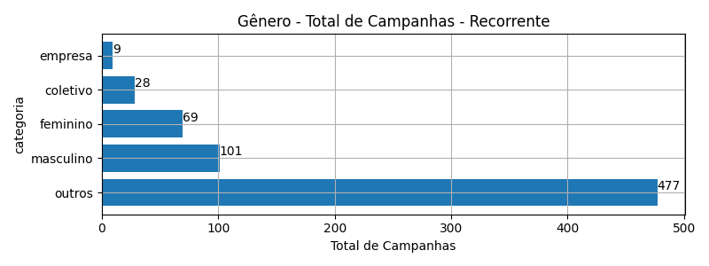
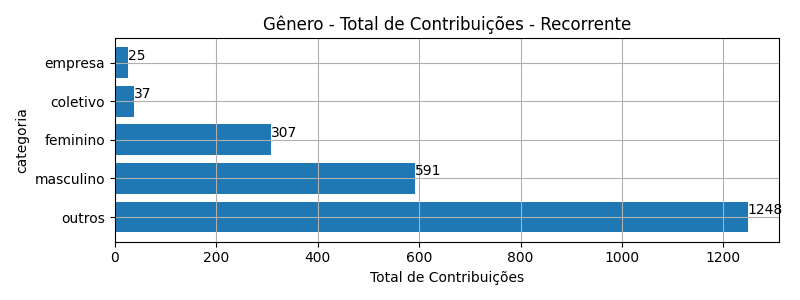
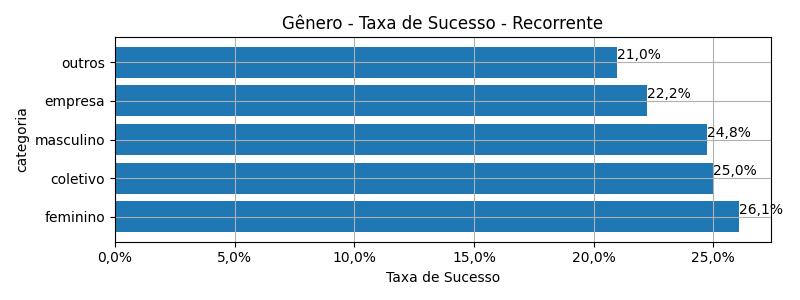
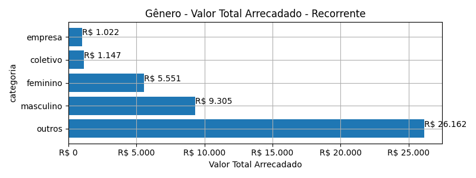
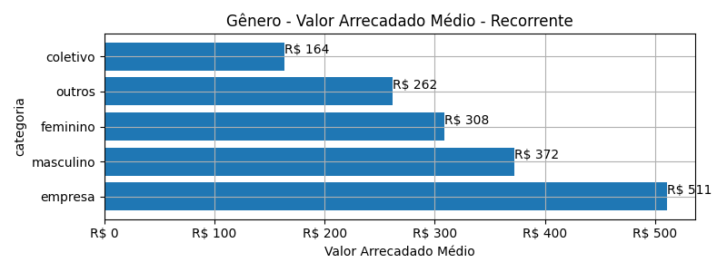
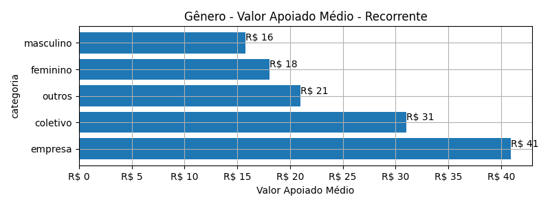
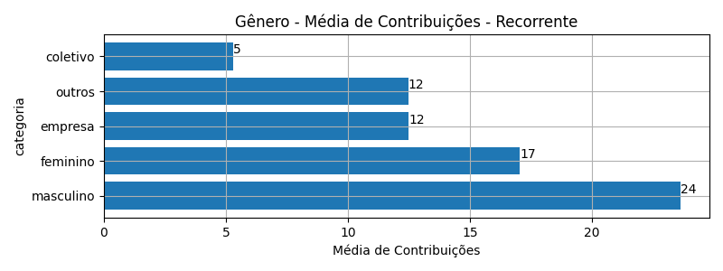

# Rankings: Gênero, Modalidade: Recorrente

Rankings por _total_ (quantidade de campanhas realizadas), _contribuicoes_
(total de contribuições), _taxa_sucesso_ (taxa de sucesso das campanhas),
_arrecadado_sucesso_ (valor total arrecadado com campanhas bem sucedidas),
_media_sucesso_ (valor arrecadado médio com campanhas bem sucedidas),
_apoio_medio_ (apoio médio das campanhas bem sucedidas)
e _media_contribuicoes_ (média de contribuições).

As análises serão realizadas por Modalidade e Gênero. Colunas:

- modalidade: tudo ou nada, flex ou recorrente;
- autoria_classificacao: dimensão de agrupamento;
- total: total de campanhas;
- arrecadado: valor total arrecadado pelas campanhas (bem sucedidas ou não);
- total_sucesso: total de campanhas bem sucedidas;
- arrecadado_sucesso: valor total arrecadado pelas campanhas bem sucedidas;
- taxa_sucesso: relação entre o total de campanhas bem sucedidas e o total de campanhas;
- media_sucesso: valor arrecadado médio pelas campanhas bem sucedidas;
- std_sucesso: desvio padrão médio (ref: valor arrecadado) pelas campanhas bem sucedidas;
- min_sucesso: menor valor arrecadado médio entre as campanhas bem sucedidas;
- max_sucesso: maior valor arrecadado médio entre as campanhas bem sucedidas;
- apoio_medio: apoio médio entre as campanhas bem sucedidas;
- contribuicoes: total de contribuições entre as campanhas bem sucedidas;
- media_contribuicoes: média de contribuições entre as campanhas bem sucedidas.

## Total de Campanhas

<!-- ### Modalidade: Recorrente -->

<!--Total de Campanhas-->
> [!WARNING] 
> Nesta modalidade de financiamento, os cálculos representam
> uma fotografia das campanhas em dezembro/2023.

Top 5 _Gênero_, por _total_, em _Recorrente_.

| geral_modalidade   | autoria_classificacao   |   total |   total_sucesso |   particip |   taxa_sucesso |   arrecadado_sucesso |   media_sucesso |   std_sucesso |   min_sucesso |   max_sucesso |   apoio_medio |   contribuicoes |   media_contribuicoes |
|:-------------------|:------------------------|--------:|----------------:|-----------:|---------------:|---------------------:|----------------:|--------------:|--------------:|--------------:|--------------:|----------------:|----------------------:|
| sub                | outros                  |     477 |             100 |      69,74 |          20,96 |             26.161,60 |          261,62 |        711,52 |          1,09 |       5.087,08 |         20,96 |            1.248 |                 12,48 |
| sub                | masculino               |     101 |              25 |      14,77 |          24,75 |              9.304,80 |          372,19 |        661,58 |          6,10 |       2.998,54 |         15,74 |             591 |                 23,64 |
| sub                | feminino                |      69 |              18 |      10,09 |          26,09 |              5.551,37 |          308,41 |        399,36 |          7,15 |       1.753,37 |         18,08 |             307 |                 17,06 |
| sub                | coletivo                |      28 |               7 |       4,09 |          25,00 |              1.146,91 |          163,84 |        138,02 |         32,56 |        353,58 |         31,00 |              37 |                  5,29 |
| sub                | empresa                 |       9 |               2 |       1,32 |          22,22 |              1.022,28 |          511,14 |         38,60 |        483,84 |        538,44 |         40,89 |              25 |                 12,50 |

## Total de Contribuições

<!-- ### Modalidade: Recorrente -->

<!--Total de Contribuições-->
> [!WARNING] 
> Nesta modalidade de financiamento, os cálculos representam
> uma fotografia das campanhas em dezembro/2023.

Top 5 _Gênero_, por _contribuicoes_, em _Recorrente_.

| geral_modalidade   | autoria_classificacao   |   total |   total_sucesso |   particip |   taxa_sucesso |   arrecadado_sucesso |   media_sucesso |   std_sucesso |   min_sucesso |   max_sucesso |   apoio_medio |   contribuicoes |   media_contribuicoes |
|:-------------------|:------------------------|--------:|----------------:|-----------:|---------------:|---------------------:|----------------:|--------------:|--------------:|--------------:|--------------:|----------------:|----------------------:|
| sub                | outros                  |     477 |             100 |      69,74 |          20,96 |             26.161,60 |          261,62 |        711,52 |          1,09 |       5.087,08 |         20,96 |            1.248 |                 12,48 |
| sub                | masculino               |     101 |              25 |      14,77 |          24,75 |              9.304,80 |          372,19 |        661,58 |          6,10 |       2.998,54 |         15,74 |             591 |                 23,64 |
| sub                | feminino                |      69 |              18 |      10,09 |          26,09 |              5.551,37 |          308,41 |        399,36 |          7,15 |       1.753,37 |         18,08 |             307 |                 17,06 |
| sub                | coletivo                |      28 |               7 |       4,09 |          25,00 |              1.146,91 |          163,84 |        138,02 |         32,56 |        353,58 |         31,00 |              37 |                  5,29 |
| sub                | empresa                 |       9 |               2 |       1,32 |          22,22 |              1.022,28 |          511,14 |         38,60 |        483,84 |        538,44 |         40,89 |              25 |                 12,50 |

## Taxa de Sucesso

<!-- ### Modalidade: Recorrente -->

<!--Taxa de Sucesso-->
> [!WARNING] 
> Nesta modalidade de financiamento, os cálculos representam
> uma fotografia das campanhas em dezembro/2023.

Top 5 _Gênero_, por _taxa_sucesso_, em _Recorrente_.

| geral_modalidade   | autoria_classificacao   |   total |   total_sucesso |   particip |   taxa_sucesso |   arrecadado_sucesso |   media_sucesso |   std_sucesso |   min_sucesso |   max_sucesso |   apoio_medio |   contribuicoes |   media_contribuicoes |
|:-------------------|:------------------------|--------:|----------------:|-----------:|---------------:|---------------------:|----------------:|--------------:|--------------:|--------------:|--------------:|----------------:|----------------------:|
| sub                | feminino                |      69 |              18 |      10,09 |          26,09 |              5.551,37 |          308,41 |        399,36 |          7,15 |       1.753,37 |         18,08 |             307 |                 17,06 |
| sub                | coletivo                |      28 |               7 |       4,09 |          25,00 |              1.146,91 |          163,84 |        138,02 |         32,56 |        353,58 |         31,00 |              37 |                  5,29 |
| sub                | masculino               |     101 |              25 |      14,77 |          24,75 |              9.304,80 |          372,19 |        661,58 |          6,10 |       2.998,54 |         15,74 |             591 |                 23,64 |
| sub                | empresa                 |       9 |               2 |       1,32 |          22,22 |              1.022,28 |          511,14 |         38,60 |        483,84 |        538,44 |         40,89 |              25 |                 12,50 |
| sub                | outros                  |     477 |             100 |      69,74 |          20,96 |             26.161,60 |          261,62 |        711,52 |          1,09 |       5.087,08 |         20,96 |            1.248 |                 12,48 |

## Valor Total Arrecadado

<!-- ### Modalidade: Recorrente -->

<!--Valor Total Arrecadado-->
> [!WARNING] 
> Nesta modalidade de financiamento, os cálculos representam
> uma fotografia das campanhas em dezembro/2023.

Top 5 _Gênero_, por _arrecadado_sucesso_, em _Recorrente_.

| geral_modalidade   | autoria_classificacao   |   total |   total_sucesso |   particip |   taxa_sucesso |   arrecadado_sucesso |   media_sucesso |   std_sucesso |   min_sucesso |   max_sucesso |   apoio_medio |   contribuicoes |   media_contribuicoes |
|:-------------------|:------------------------|--------:|----------------:|-----------:|---------------:|---------------------:|----------------:|--------------:|--------------:|--------------:|--------------:|----------------:|----------------------:|
| sub                | outros                  |     477 |             100 |      69,74 |          20,96 |             26.161,60 |          261,62 |        711,52 |          1,09 |       5.087,08 |         20,96 |            1.248 |                 12,48 |
| sub                | masculino               |     101 |              25 |      14,77 |          24,75 |              9.304,80 |          372,19 |        661,58 |          6,10 |       2.998,54 |         15,74 |             591 |                 23,64 |
| sub                | feminino                |      69 |              18 |      10,09 |          26,09 |              5.551,37 |          308,41 |        399,36 |          7,15 |       1.753,37 |         18,08 |             307 |                 17,06 |
| sub                | coletivo                |      28 |               7 |       4,09 |          25,00 |              1.146,91 |          163,84 |        138,02 |         32,56 |        353,58 |         31,00 |              37 |                  5,29 |
| sub                | empresa                 |       9 |               2 |       1,32 |          22,22 |              1.022,28 |          511,14 |         38,60 |        483,84 |        538,44 |         40,89 |              25 |                 12,50 |

## Valor Arrecadado Médio

<!-- ### Modalidade: Recorrente -->

<!--Valor Médio Arrecadado-->
> [!WARNING] 
> Nesta modalidade de financiamento, os cálculos representam
> uma fotografia das campanhas em dezembro/2023.

Top 5 _Gênero_, por _media_sucesso_, em _Recorrente_.

| geral_modalidade   | autoria_classificacao   |   total |   total_sucesso |   particip |   taxa_sucesso |   arrecadado_sucesso |   media_sucesso |   std_sucesso |   min_sucesso |   max_sucesso |   apoio_medio |   contribuicoes |   media_contribuicoes |
|:-------------------|:------------------------|--------:|----------------:|-----------:|---------------:|---------------------:|----------------:|--------------:|--------------:|--------------:|--------------:|----------------:|----------------------:|
| sub                | empresa                 |       9 |               2 |       1,32 |          22,22 |              1.022,28 |          511,14 |         38,60 |        483,84 |        538,44 |         40,89 |              25 |                 12,50 |
| sub                | masculino               |     101 |              25 |      14,77 |          24,75 |              9.304,80 |          372,19 |        661,58 |          6,10 |       2.998,54 |         15,74 |             591 |                 23,64 |
| sub                | feminino                |      69 |              18 |      10,09 |          26,09 |              5.551,37 |          308,41 |        399,36 |          7,15 |       1.753,37 |         18,08 |             307 |                 17,06 |
| sub                | outros                  |     477 |             100 |      69,74 |          20,96 |             26.161,60 |          261,62 |        711,52 |          1,09 |       5.087,08 |         20,96 |            1.248 |                 12,48 |
| sub                | coletivo                |      28 |               7 |       4,09 |          25,00 |              1.146,91 |          163,84 |        138,02 |         32,56 |        353,58 |         31,00 |              37 |                  5,29 |

## Valor Apoiado Médio

<!-- ### Modalidade: Recorrente -->

<!--Valor Médio Apoiado-->
> [!WARNING] 
> Nesta modalidade de financiamento, os cálculos representam
> uma fotografia das campanhas em dezembro/2023.

Top 5 _Gênero_, por _apoio_medio_, em _Recorrente_.

| geral_modalidade   | autoria_classificacao   |   total |   total_sucesso |   particip |   taxa_sucesso |   arrecadado_sucesso |   media_sucesso |   std_sucesso |   min_sucesso |   max_sucesso |   apoio_medio |   contribuicoes |   media_contribuicoes |
|:-------------------|:------------------------|--------:|----------------:|-----------:|---------------:|---------------------:|----------------:|--------------:|--------------:|--------------:|--------------:|----------------:|----------------------:|
| sub                | empresa                 |       9 |               2 |       1,32 |          22,22 |              1.022,28 |          511,14 |         38,60 |        483,84 |        538,44 |         40,89 |              25 |                 12,50 |
| sub                | coletivo                |      28 |               7 |       4,09 |          25,00 |              1.146,91 |          163,84 |        138,02 |         32,56 |        353,58 |         31,00 |              37 |                  5,29 |
| sub                | outros                  |     477 |             100 |      69,74 |          20,96 |             26.161,60 |          261,62 |        711,52 |          1,09 |       5.087,08 |         20,96 |            1.248 |                 12,48 |
| sub                | feminino                |      69 |              18 |      10,09 |          26,09 |              5.551,37 |          308,41 |        399,36 |          7,15 |       1.753,37 |         18,08 |             307 |                 17,06 |
| sub                | masculino               |     101 |              25 |      14,77 |          24,75 |              9.304,80 |          372,19 |        661,58 |          6,10 |       2.998,54 |         15,74 |             591 |                 23,64 |

## Média de Contribuições

<!-- ### Modalidade: Recorrente -->

<!--Média de Contribuições-->
> [!WARNING] 
> Nesta modalidade de financiamento, os cálculos representam
> uma fotografia das campanhas em dezembro/2023.

Top 5 _Gênero_, por _media_contribuicoes_, em _Recorrente_.

| geral_modalidade   | autoria_classificacao   |   total |   total_sucesso |   particip |   taxa_sucesso |   arrecadado_sucesso |   media_sucesso |   std_sucesso |   min_sucesso |   max_sucesso |   apoio_medio |   contribuicoes |   media_contribuicoes |
|:-------------------|:------------------------|--------:|----------------:|-----------:|---------------:|---------------------:|----------------:|--------------:|--------------:|--------------:|--------------:|----------------:|----------------------:|
| sub                | masculino               |     101 |              25 |      14,77 |          24,75 |              9.304,80 |          372,19 |        661,58 |          6,10 |       2.998,54 |         15,74 |             591 |                 23,64 |
| sub                | feminino                |      69 |              18 |      10,09 |          26,09 |              5.551,37 |          308,41 |        399,36 |          7,15 |       1.753,37 |         18,08 |             307 |                 17,06 |
| sub                | empresa                 |       9 |               2 |       1,32 |          22,22 |              1.022,28 |          511,14 |         38,60 |        483,84 |        538,44 |         40,89 |              25 |                 12,50 |
| sub                | outros                  |     477 |             100 |      69,74 |          20,96 |             26.161,60 |          261,62 |        711,52 |          1,09 |       5.087,08 |         20,96 |            1.248 |                 12,48 |
| sub                | coletivo                |      28 |               7 |       4,09 |          25,00 |              1.146,91 |          163,84 |        138,02 |         32,56 |        353,58 |         31,00 |              37 |                  5,29 |

