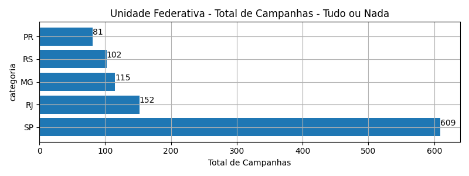
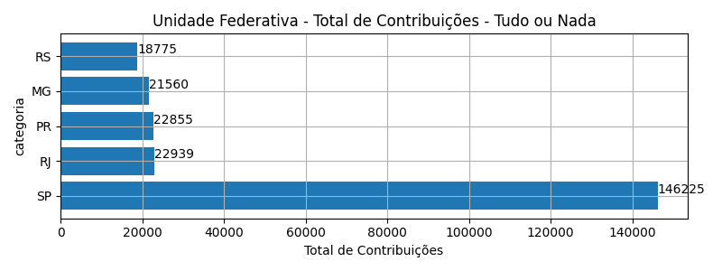
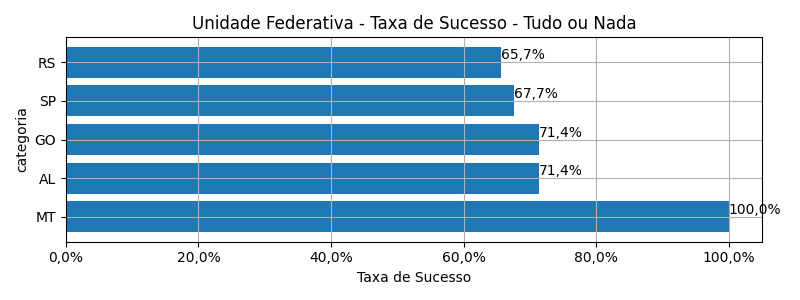
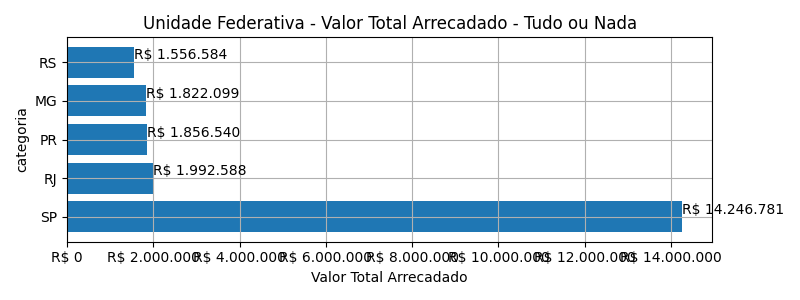
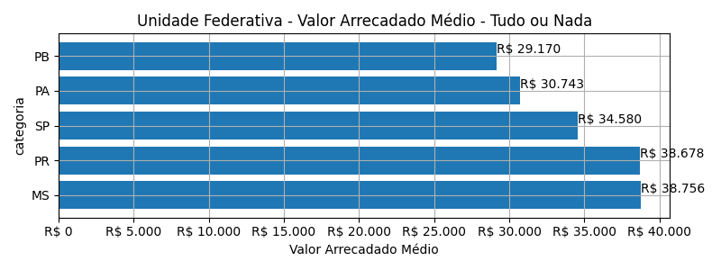
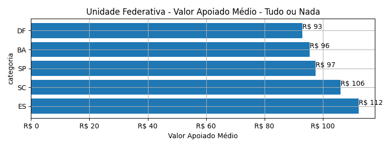
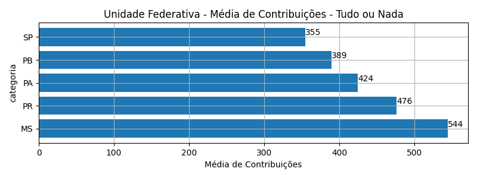

# Rankings: Unidade Federativa, Modalidade: Tudo ou Nada

Rankings por _total_ (quantidade de campanhas realizadas), _contribuicoes_
(total de contribuições), _taxa_sucesso_ (taxa de sucesso das campanhas),
_arrecadado_sucesso_ (valor total arrecadado com campanhas bem sucedidas),
_media_sucesso_ (valor arrecadado médio com campanhas bem sucedidas),
_apoio_medio_ (apoio médio das campanhas bem sucedidas)
e _media_contribuicoes_ (média de contribuições).

As análises serão realizadas por Modalidade e Unidade Federativa. Colunas:

- modalidade: tudo ou nada, flex ou recorrente;
- autoria_classificacao: dimensão de agrupamento;
- total: total de campanhas;
- arrecadado: valor total arrecadado pelas campanhas (bem sucedidas ou não);
- total_sucesso: total de campanhas bem sucedidas;
- arrecadado_sucesso: valor total arrecadado pelas campanhas bem sucedidas;
- taxa_sucesso: relação entre o total de campanhas bem sucedidas e o total de campanhas;
- media_sucesso: valor arrecadado médio pelas campanhas bem sucedidas;
- std_sucesso: desvio padrão médio (ref: valor arrecadado) pelas campanhas bem sucedidas;
- min_sucesso: menor valor arrecadado médio entre as campanhas bem sucedidas;
- max_sucesso: maior valor arrecadado médio entre as campanhas bem sucedidas;
- apoio_medio: apoio médio entre as campanhas bem sucedidas;
- contribuicoes: total de contribuições entre as campanhas bem sucedidas;
- media_contribuicoes: média de contribuições entre as campanhas bem sucedidas.

## Total de Campanhas

<!-- ### Modalidade: Tudo ou Nada -->

<!--Total de Campanhas-->
Top 5 _Unidade Federativa_, por _total_, em _Tudo ou Nada_.

| geral_modalidade   | geral_uf_br   |   total |   total_sucesso |   particip |   taxa_sucesso |   arrecadado_sucesso |   media_sucesso |   std_sucesso |   min_sucesso |   max_sucesso |   apoio_medio |   contribuicoes |   media_contribuicoes |
|:-------------------|:--------------|--------:|----------------:|-----------:|---------------:|---------------------:|----------------:|--------------:|--------------:|--------------:|--------------:|----------------:|----------------------:|
| aon                | SP            |     609 |             412 |      45,62 |          67,65 |          14.246.781,43 |        34.579,57 |      53.785,60 |         94,90 |     679.297,66 |         97,43 |          146.225 |                354,92 |
| aon                | RJ            |     152 |              94 |      11,39 |          61,84 |           1.992.588,12 |        21.197,75 |      24.242,49 |        143,20 |     154.365,98 |         86,86 |           22.939 |                244,03 |
| aon                | MG            |     115 |              67 |       8,61 |          58,26 |           1.822.099,42 |        27.195,51 |      26.573,25 |       1.204,08 |     136.747,60 |         84,51 |           21.560 |                321,79 |
| aon                | RS            |     102 |              67 |       7,64 |          65,69 |           1.556.583,95 |        23.232,60 |      18.896,23 |       1.496,11 |      85.108,68 |         82,91 |           18.775 |                280,22 |
| aon                | PR            |      81 |              48 |       6,07 |          59,26 |           1.856.539,79 |        38.677,91 |      78.534,96 |        792,14 |     537.544,55 |         81,23 |           22.855 |                476,15 |

## Total de Contribuições

<!-- ### Modalidade: Tudo ou Nada -->

<!--Total de Contribuições-->
Top 5 _Unidade Federativa_, por _contribuicoes_, em _Tudo ou Nada_.

| geral_modalidade   | geral_uf_br   |   total |   total_sucesso |   particip |   taxa_sucesso |   arrecadado_sucesso |   media_sucesso |   std_sucesso |   min_sucesso |   max_sucesso |   apoio_medio |   contribuicoes |   media_contribuicoes |
|:-------------------|:--------------|--------:|----------------:|-----------:|---------------:|---------------------:|----------------:|--------------:|--------------:|--------------:|--------------:|----------------:|----------------------:|
| aon                | SP            |     609 |             412 |      45,62 |          67,65 |          14.246.781,43 |        34.579,57 |      53.785,60 |         94,90 |     679.297,66 |         97,43 |          146.225 |                354,92 |
| aon                | RJ            |     152 |              94 |      11,39 |          61,84 |           1.992.588,12 |        21.197,75 |      24.242,49 |        143,20 |     154.365,98 |         86,86 |           22.939 |                244,03 |
| aon                | PR            |      81 |              48 |       6,07 |          59,26 |           1.856.539,79 |        38.677,91 |      78.534,96 |        792,14 |     537.544,55 |         81,23 |           22.855 |                476,15 |
| aon                | MG            |     115 |              67 |       8,61 |          58,26 |           1.822.099,42 |        27.195,51 |      26.573,25 |       1.204,08 |     136.747,60 |         84,51 |           21.560 |                321,79 |
| aon                | RS            |     102 |              67 |       7,64 |          65,69 |           1.556.583,95 |        23.232,60 |      18.896,23 |       1.496,11 |      85.108,68 |         82,91 |           18.775 |                280,22 |

## Taxa de Sucesso

<!-- ### Modalidade: Tudo ou Nada -->

<!--Taxa de Sucesso-->
Top 5 _Unidade Federativa_, por _taxa_sucesso_, em _Tudo ou Nada_.

| geral_modalidade   | geral_uf_br   |   total |   total_sucesso |   particip |   taxa_sucesso |   arrecadado_sucesso |   media_sucesso |   std_sucesso |   min_sucesso |   max_sucesso |   apoio_medio |   contribuicoes |   media_contribuicoes |
|:-------------------|:--------------|--------:|----------------:|-----------:|---------------:|---------------------:|----------------:|--------------:|--------------:|--------------:|--------------:|----------------:|----------------------:|
| aon                | MT            |       2 |               2 |       0,15 |         100,00 |             16.235,65 |         8.117,82 |       3.144,46 |       5.894,35 |      10.341,30 |         67,93 |             239 |                119,50 |
| aon                | AL            |       7 |               5 |       0,52 |          71,43 |             55.859,26 |        11.171,85 |       3.760,92 |       6.855,80 |      15.562,69 |         72,64 |             769 |                153,80 |
| aon                | GO            |      14 |              10 |       1,05 |          71,43 |            107.857,97 |        10.785,80 |       7.069,02 |        787,10 |      25.867,99 |         55,86 |            1.931 |                193,10 |
| aon                | SP            |     609 |             412 |      45,62 |          67,65 |          14.246.781,43 |        34.579,57 |      53.785,60 |         94,90 |     679.297,66 |         97,43 |          146.225 |                354,92 |
| aon                | RS            |     102 |              67 |       7,64 |          65,69 |           1.556.583,95 |        23.232,60 |      18.896,23 |       1.496,11 |      85.108,68 |         82,91 |           18.775 |                280,22 |

## Valor Total Arrecadado

<!-- ### Modalidade: Tudo ou Nada -->

<!--Valor Total Arrecadado-->
Top 5 _Unidade Federativa_, por _arrecadado_sucesso_, em _Tudo ou Nada_.

| geral_modalidade   | geral_uf_br   |   total |   total_sucesso |   particip |   taxa_sucesso |   arrecadado_sucesso |   media_sucesso |   std_sucesso |   min_sucesso |   max_sucesso |   apoio_medio |   contribuicoes |   media_contribuicoes |
|:-------------------|:--------------|--------:|----------------:|-----------:|---------------:|---------------------:|----------------:|--------------:|--------------:|--------------:|--------------:|----------------:|----------------------:|
| aon                | SP            |     609 |             412 |      45,62 |          67,65 |          14.246.781,43 |        34.579,57 |      53.785,60 |         94,90 |     679.297,66 |         97,43 |          146.225 |                354,92 |
| aon                | RJ            |     152 |              94 |      11,39 |          61,84 |           1.992.588,12 |        21.197,75 |      24.242,49 |        143,20 |     154.365,98 |         86,86 |           22.939 |                244,03 |
| aon                | PR            |      81 |              48 |       6,07 |          59,26 |           1.856.539,79 |        38.677,91 |      78.534,96 |        792,14 |     537.544,55 |         81,23 |           22.855 |                476,15 |
| aon                | MG            |     115 |              67 |       8,61 |          58,26 |           1.822.099,42 |        27.195,51 |      26.573,25 |       1.204,08 |     136.747,60 |         84,51 |           21.560 |                321,79 |
| aon                | RS            |     102 |              67 |       7,64 |          65,69 |           1.556.583,95 |        23.232,60 |      18.896,23 |       1.496,11 |      85.108,68 |         82,91 |           18.775 |                280,22 |

## Valor Arrecadado Médio

<!-- ### Modalidade: Tudo ou Nada -->

<!--Valor Médio Arrecadado-->
Top 5 _Unidade Federativa_, por _media_sucesso_, em _Tudo ou Nada_.

| geral_modalidade   | geral_uf_br   |   total |   total_sucesso |   particip |   taxa_sucesso |   arrecadado_sucesso |   media_sucesso |   std_sucesso |   min_sucesso |   max_sucesso |   apoio_medio |   contribuicoes |   media_contribuicoes |
|:-------------------|:--------------|--------:|----------------:|-----------:|---------------:|---------------------:|----------------:|--------------:|--------------:|--------------:|--------------:|----------------:|----------------------:|
| aon                | MS            |       2 |               1 |       0,15 |          50,00 |             38.756,00 |        38.756,00 |          0,00 |      38.756,00 |      38.756,00 |         71,24 |             544 |                544,00 |
| aon                | PR            |      81 |              48 |       6,07 |          59,26 |           1.856.539,79 |        38.677,91 |      78.534,96 |        792,14 |     537.544,55 |         81,23 |           22.855 |                476,15 |
| aon                | SP            |     609 |             412 |      45,62 |          67,65 |          14.246.781,43 |        34.579,57 |      53.785,60 |         94,90 |     679.297,66 |         97,43 |          146.225 |                354,92 |
| aon                | PA            |      12 |               4 |       0,90 |          33,33 |            122.971,38 |        30.742,85 |       3.871,10 |      25.693,41 |      34.218,60 |         72,42 |            1.698 |                424,50 |
| aon                | PB            |      20 |              10 |       1,50 |          50,00 |            291.702,89 |        29.170,29 |      16.041,93 |       9.446,95 |      56.551,80 |         74,91 |            3.894 |                389,40 |

## Valor Apoiado Médio

<!-- ### Modalidade: Tudo ou Nada -->

<!--Valor Médio Apoiado-->
Top 5 _Unidade Federativa_, por _apoio_medio_, em _Tudo ou Nada_.

| geral_modalidade   | geral_uf_br   |   total |   total_sucesso |   particip |   taxa_sucesso |   arrecadado_sucesso |   media_sucesso |   std_sucesso |   min_sucesso |   max_sucesso |   apoio_medio |   contribuicoes |   media_contribuicoes |
|:-------------------|:--------------|--------:|----------------:|-----------:|---------------:|---------------------:|----------------:|--------------:|--------------:|--------------:|--------------:|----------------:|----------------------:|
| aon                | ES            |      11 |               4 |       0,82 |          36,36 |             72.846,55 |        18.211,64 |      17.231,56 |       1.411,86 |      39.851,60 |        112,24 |             649 |                162,25 |
| aon                | SC            |      26 |              14 |       1,95 |          53,85 |            380.975,10 |        27.212,51 |      24.288,71 |       5.156,31 |      82.775,70 |        106,12 |            3.590 |                256,43 |
| aon                | SP            |     609 |             412 |      45,62 |          67,65 |          14.246.781,43 |        34.579,57 |      53.785,60 |         94,90 |     679.297,66 |         97,43 |          146.225 |                354,92 |
| aon                | BA            |      19 |               7 |       1,42 |          36,84 |            102.481,83 |        14.640,26 |       8.108,09 |       4.203,66 |      28.456,51 |         95,51 |            1.073 |                153,29 |
| aon                | DF            |      40 |              23 |       3,00 |          57,50 |            511.121,61 |        22.222,68 |      16.473,47 |         41,82 |      75.796,33 |         92,98 |            5.497 |                239,00 |

## Média de Contribuições

<!-- ### Modalidade: Tudo ou Nada -->

<!--Média de Contribuições-->
Top 5 _Unidade Federativa_, por _media_contribuicoes_, em _Tudo ou Nada_.

| geral_modalidade   | geral_uf_br   |   total |   total_sucesso |   particip |   taxa_sucesso |   arrecadado_sucesso |   media_sucesso |   std_sucesso |   min_sucesso |   max_sucesso |   apoio_medio |   contribuicoes |   media_contribuicoes |
|:-------------------|:--------------|--------:|----------------:|-----------:|---------------:|---------------------:|----------------:|--------------:|--------------:|--------------:|--------------:|----------------:|----------------------:|
| aon                | MS            |       2 |               1 |       0,15 |          50,00 |             38.756,00 |        38.756,00 |          0,00 |      38.756,00 |      38.756,00 |         71,24 |             544 |                544,00 |
| aon                | PR            |      81 |              48 |       6,07 |          59,26 |           1.856.539,79 |        38.677,91 |      78.534,96 |        792,14 |     537.544,55 |         81,23 |           22.855 |                476,15 |
| aon                | PA            |      12 |               4 |       0,90 |          33,33 |            122.971,38 |        30.742,85 |       3.871,10 |      25.693,41 |      34.218,60 |         72,42 |            1.698 |                424,50 |
| aon                | PB            |      20 |              10 |       1,50 |          50,00 |            291.702,89 |        29.170,29 |      16.041,93 |       9.446,95 |      56.551,80 |         74,91 |            3.894 |                389,40 |
| aon                | SP            |     609 |             412 |      45,62 |          67,65 |          14.246.781,43 |        34.579,57 |      53.785,60 |         94,90 |     679.297,66 |         97,43 |          146.225 |                354,92 |

