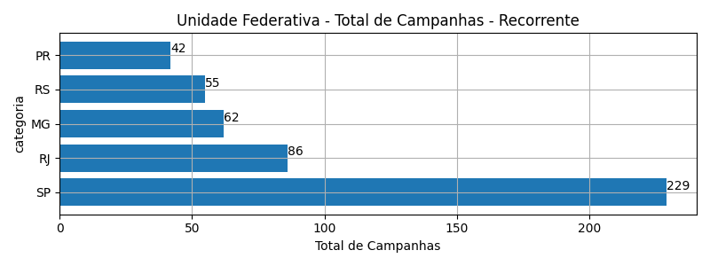
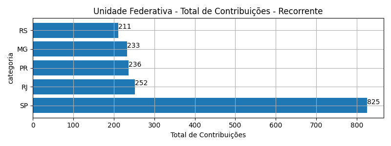
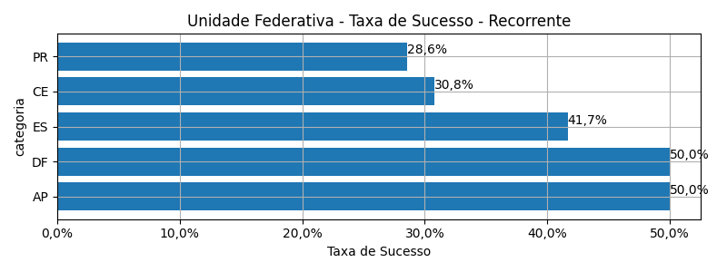
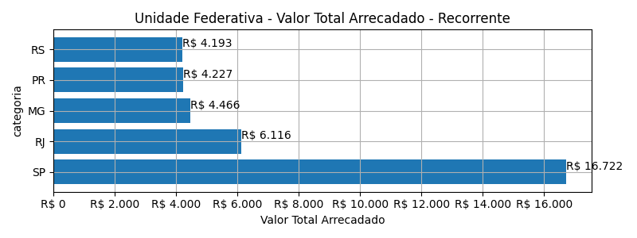
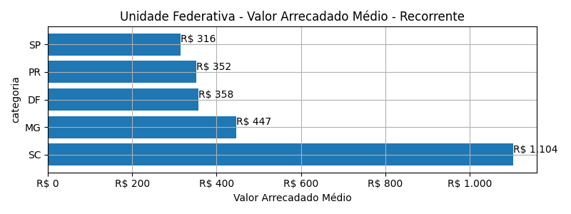
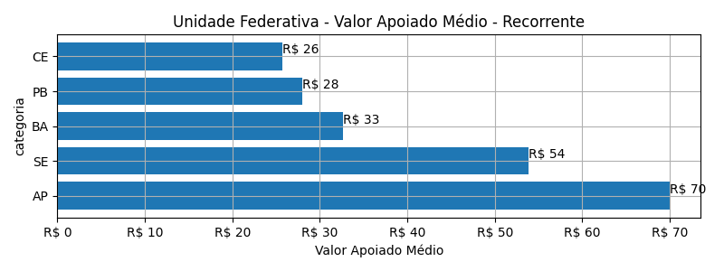
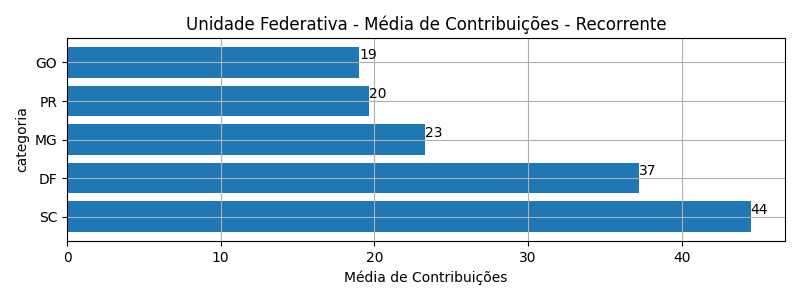

# Rankings: Unidade Federativa, Modalidade: Recorrente

Rankings por _total_ (quantidade de campanhas realizadas), _contribuicoes_
(total de contribuições), _taxa_sucesso_ (taxa de sucesso das campanhas),
_arrecadado_sucesso_ (valor total arrecadado com campanhas bem sucedidas),
_media_sucesso_ (valor arrecadado médio com campanhas bem sucedidas),
_apoio_medio_ (apoio médio das campanhas bem sucedidas)
e _media_contribuicoes_ (média de contribuições).

As análises serão realizadas por Modalidade e Unidade Federativa. Colunas:

- modalidade: tudo ou nada, flex ou recorrente;
- autoria_classificacao: dimensão de agrupamento;
- total: total de campanhas;
- arrecadado: valor total arrecadado pelas campanhas (bem sucedidas ou não);
- total_sucesso: total de campanhas bem sucedidas;
- arrecadado_sucesso: valor total arrecadado pelas campanhas bem sucedidas;
- taxa_sucesso: relação entre o total de campanhas bem sucedidas e o total de campanhas;
- media_sucesso: valor arrecadado médio pelas campanhas bem sucedidas;
- std_sucesso: desvio padrão médio (ref: valor arrecadado) pelas campanhas bem sucedidas;
- min_sucesso: menor valor arrecadado médio entre as campanhas bem sucedidas;
- max_sucesso: maior valor arrecadado médio entre as campanhas bem sucedidas;
- apoio_medio: apoio médio entre as campanhas bem sucedidas;
- contribuicoes: total de contribuições entre as campanhas bem sucedidas;
- media_contribuicoes: média de contribuições entre as campanhas bem sucedidas.

## Total de Campanhas

<!-- ### Modalidade: Recorrente -->

<!--Total de Campanhas-->
> [!WARNING] 
> Nesta modalidade de financiamento, os cálculos representam
> uma fotografia das campanhas em dezembro/2023.

Top 5 _Unidade Federativa_, por _total_, em _Recorrente_.

| geral_modalidade   | geral_uf_br   |   total |   total_sucesso |   particip |   taxa_sucesso |   arrecadado_sucesso |   media_sucesso |   std_sucesso |   min_sucesso |   max_sucesso |   apoio_medio |   contribuicoes |   media_contribuicoes |
|:-------------------|:--------------|--------:|----------------:|-----------:|---------------:|---------------------:|----------------:|--------------:|--------------:|--------------:|--------------:|----------------:|----------------------:|
| sub                | SP            |     229 |              53 |      33,48 |          23,14 |             16.721,53 |          315,50 |        902,69 |          3,80 |       5.087,08 |         20,27 |             825 |                 15,57 |
| sub                | RJ            |      86 |              22 |      12,57 |          25,58 |              6.116,28 |          278,01 |        408,56 |          3,80 |       1.594,03 |         24,27 |             252 |                 11,45 |
| sub                | MG            |      62 |              10 |       9,06 |          16,13 |              4.465,64 |          446,56 |       1.066,78 |          7,15 |       3.475,05 |         19,17 |             233 |                 23,30 |
| sub                | RS            |      55 |              14 |       8,04 |          25,45 |              4.193,00 |          299,50 |        239,17 |          1,09 |        657,08 |         19,87 |             211 |                 15,07 |
| sub                | PR            |      42 |              12 |       6,14 |          28,57 |              4.227,20 |          352,27 |        491,75 |          6,33 |       1.809,10 |         17,91 |             236 |                 19,67 |

## Total de Contribuições

<!-- ### Modalidade: Recorrente -->

<!--Total de Contribuições-->
> [!WARNING] 
> Nesta modalidade de financiamento, os cálculos representam
> uma fotografia das campanhas em dezembro/2023.

Top 5 _Unidade Federativa_, por _contribuicoes_, em _Recorrente_.

| geral_modalidade   | geral_uf_br   |   total |   total_sucesso |   particip |   taxa_sucesso |   arrecadado_sucesso |   media_sucesso |   std_sucesso |   min_sucesso |   max_sucesso |   apoio_medio |   contribuicoes |   media_contribuicoes |
|:-------------------|:--------------|--------:|----------------:|-----------:|---------------:|---------------------:|----------------:|--------------:|--------------:|--------------:|--------------:|----------------:|----------------------:|
| sub                | SP            |     229 |              53 |      33,48 |          23,14 |             16.721,53 |          315,50 |        902,69 |          3,80 |       5.087,08 |         20,27 |             825 |                 15,57 |
| sub                | RJ            |      86 |              22 |      12,57 |          25,58 |              6.116,28 |          278,01 |        408,56 |          3,80 |       1.594,03 |         24,27 |             252 |                 11,45 |
| sub                | PR            |      42 |              12 |       6,14 |          28,57 |              4.227,20 |          352,27 |        491,75 |          6,33 |       1.809,10 |         17,91 |             236 |                 19,67 |
| sub                | MG            |      62 |              10 |       9,06 |          16,13 |              4.465,64 |          446,56 |       1.066,78 |          7,15 |       3.475,05 |         19,17 |             233 |                 23,30 |
| sub                | RS            |      55 |              14 |       8,04 |          25,45 |              4.193,00 |          299,50 |        239,17 |          1,09 |        657,08 |         19,87 |             211 |                 15,07 |

## Taxa de Sucesso

<!-- ### Modalidade: Recorrente -->

<!--Taxa de Sucesso-->
> [!WARNING] 
> Nesta modalidade de financiamento, os cálculos representam
> uma fotografia das campanhas em dezembro/2023.

Top 5 _Unidade Federativa_, por _taxa_sucesso_, em _Recorrente_.

| geral_modalidade   | geral_uf_br   |   total |   total_sucesso |   particip |   taxa_sucesso |   arrecadado_sucesso |   media_sucesso |   std_sucesso |   min_sucesso |   max_sucesso |   apoio_medio |   contribuicoes |   media_contribuicoes |
|:-------------------|:--------------|--------:|----------------:|-----------:|---------------:|---------------------:|----------------:|--------------:|--------------:|--------------:|--------------:|----------------:|----------------------:|
| sub                | AP            |       2 |               1 |       0,29 |          50,00 |                70,02 |           70,02 |          0,00 |         70,02 |         70,02 |         70,02 |               1 |                  1,00 |
| sub                | DF            |      10 |               5 |       1,46 |          50,00 |              1.789,00 |          357,80 |        222,39 |        102,01 |        606,04 |          9,62 |             186 |                 37,20 |
| sub                | ES            |      12 |               5 |       1,75 |          41,67 |               476,39 |           95,28 |        141,24 |         10,54 |        344,69 |         17,64 |              27 |                  5,40 |
| sub                | CE            |      26 |               8 |       3,80 |          30,77 |               615,96 |           76,99 |         87,20 |          3,16 |        252,23 |         25,66 |              24 |                  3,00 |
| sub                | PR            |      42 |              12 |       6,14 |          28,57 |              4.227,20 |          352,27 |        491,75 |          6,33 |       1.809,10 |         17,91 |             236 |                 19,67 |

## Valor Total Arrecadado

<!-- ### Modalidade: Recorrente -->

<!--Valor Total Arrecadado-->
> [!WARNING] 
> Nesta modalidade de financiamento, os cálculos representam
> uma fotografia das campanhas em dezembro/2023.

Top 5 _Unidade Federativa_, por _arrecadado_sucesso_, em _Recorrente_.

| geral_modalidade   | geral_uf_br   |   total |   total_sucesso |   particip |   taxa_sucesso |   arrecadado_sucesso |   media_sucesso |   std_sucesso |   min_sucesso |   max_sucesso |   apoio_medio |   contribuicoes |   media_contribuicoes |
|:-------------------|:--------------|--------:|----------------:|-----------:|---------------:|---------------------:|----------------:|--------------:|--------------:|--------------:|--------------:|----------------:|----------------------:|
| sub                | SP            |     229 |              53 |      33,48 |          23,14 |             16.721,53 |          315,50 |        902,69 |          3,80 |       5.087,08 |         20,27 |             825 |                 15,57 |
| sub                | RJ            |      86 |              22 |      12,57 |          25,58 |              6.116,28 |          278,01 |        408,56 |          3,80 |       1.594,03 |         24,27 |             252 |                 11,45 |
| sub                | MG            |      62 |              10 |       9,06 |          16,13 |              4.465,64 |          446,56 |       1.066,78 |          7,15 |       3.475,05 |         19,17 |             233 |                 23,30 |
| sub                | PR            |      42 |              12 |       6,14 |          28,57 |              4.227,20 |          352,27 |        491,75 |          6,33 |       1.809,10 |         17,91 |             236 |                 19,67 |
| sub                | RS            |      55 |              14 |       8,04 |          25,45 |              4.193,00 |          299,50 |        239,17 |          1,09 |        657,08 |         19,87 |             211 |                 15,07 |

## Valor Arrecadado Médio

<!-- ### Modalidade: Recorrente -->

<!--Valor Médio Arrecadado-->
> [!WARNING] 
> Nesta modalidade de financiamento, os cálculos representam
> uma fotografia das campanhas em dezembro/2023.

Top 5 _Unidade Federativa_, por _media_sucesso_, em _Recorrente_.

| geral_modalidade   | geral_uf_br   |   total |   total_sucesso |   particip |   taxa_sucesso |   arrecadado_sucesso |   media_sucesso |   std_sucesso |   min_sucesso |   max_sucesso |   apoio_medio |   contribuicoes |   media_contribuicoes |
|:-------------------|:--------------|--------:|----------------:|-----------:|---------------:|---------------------:|----------------:|--------------:|--------------:|--------------:|--------------:|----------------:|----------------------:|
| sub                | SC            |      14 |               2 |       2,05 |          14,29 |              2.207,97 |         1.103,99 |        918,36 |        454,61 |       1.753,37 |         24,81 |              89 |                 44,50 |
| sub                | MG            |      62 |              10 |       9,06 |          16,13 |              4.465,64 |          446,56 |       1.066,78 |          7,15 |       3.475,05 |         19,17 |             233 |                 23,30 |
| sub                | DF            |      10 |               5 |       1,46 |          50,00 |              1.789,00 |          357,80 |        222,39 |        102,01 |        606,04 |          9,62 |             186 |                 37,20 |
| sub                | PR            |      42 |              12 |       6,14 |          28,57 |              4.227,20 |          352,27 |        491,75 |          6,33 |       1.809,10 |         17,91 |             236 |                 19,67 |
| sub                | SP            |     229 |              53 |      33,48 |          23,14 |             16.721,53 |          315,50 |        902,69 |          3,80 |       5.087,08 |         20,27 |             825 |                 15,57 |

## Valor Apoiado Médio

<!-- ### Modalidade: Recorrente -->

<!--Valor Médio Apoiado-->
> [!WARNING] 
> Nesta modalidade de financiamento, os cálculos representam
> uma fotografia das campanhas em dezembro/2023.

Top 5 _Unidade Federativa_, por _apoio_medio_, em _Recorrente_.

| geral_modalidade   | geral_uf_br   |   total |   total_sucesso |   particip |   taxa_sucesso |   arrecadado_sucesso |   media_sucesso |   std_sucesso |   min_sucesso |   max_sucesso |   apoio_medio |   contribuicoes |   media_contribuicoes |
|:-------------------|:--------------|--------:|----------------:|-----------:|---------------:|---------------------:|----------------:|--------------:|--------------:|--------------:|--------------:|----------------:|----------------------:|
| sub                | AP            |       2 |               1 |       0,29 |          50,00 |                70,02 |           70,02 |          0,00 |         70,02 |         70,02 |         70,02 |               1 |                  1,00 |
| sub                | SE            |      10 |               1 |       1,46 |          10,00 |                53,86 |           53,86 |          0,00 |         53,86 |         53,86 |         53,86 |               1 |                  1,00 |
| sub                | BA            |      25 |               4 |       3,65 |          16,00 |               392,12 |           98,03 |         24,95 |         76,68 |        127,07 |         32,68 |              12 |                  3,00 |
| sub                | PB            |      11 |               1 |       1,61 |           9,09 |               140,18 |          140,18 |          0,00 |        140,18 |        140,18 |         28,04 |               5 |                  5,00 |
| sub                | CE            |      26 |               8 |       3,80 |          30,77 |               615,96 |           76,99 |         87,20 |          3,16 |        252,23 |         25,66 |              24 |                  3,00 |

## Média de Contribuições

<!-- ### Modalidade: Recorrente -->

<!--Média de Contribuições-->
> [!WARNING] 
> Nesta modalidade de financiamento, os cálculos representam
> uma fotografia das campanhas em dezembro/2023.

Top 5 _Unidade Federativa_, por _media_contribuicoes_, em _Recorrente_.

| geral_modalidade   | geral_uf_br   |   total |   total_sucesso |   particip |   taxa_sucesso |   arrecadado_sucesso |   media_sucesso |   std_sucesso |   min_sucesso |   max_sucesso |   apoio_medio |   contribuicoes |   media_contribuicoes |
|:-------------------|:--------------|--------:|----------------:|-----------:|---------------:|---------------------:|----------------:|--------------:|--------------:|--------------:|--------------:|----------------:|----------------------:|
| sub                | SC            |      14 |               2 |       2,05 |          14,29 |              2.207,97 |         1.103,99 |        918,36 |        454,61 |       1.753,37 |         24,81 |              89 |                 44,50 |
| sub                | DF            |      10 |               5 |       1,46 |          50,00 |              1.789,00 |          357,80 |        222,39 |        102,01 |        606,04 |          9,62 |             186 |                 37,20 |
| sub                | MG            |      62 |              10 |       9,06 |          16,13 |              4.465,64 |          446,56 |       1.066,78 |          7,15 |       3.475,05 |         19,17 |             233 |                 23,30 |
| sub                | PR            |      42 |              12 |       6,14 |          28,57 |              4.227,20 |          352,27 |        491,75 |          6,33 |       1.809,10 |         17,91 |             236 |                 19,67 |
| sub                | GO            |       6 |               1 |       0,88 |          16,67 |               277,47 |          277,47 |          0,00 |        277,47 |        277,47 |         14,60 |              19 |                 19,00 |

