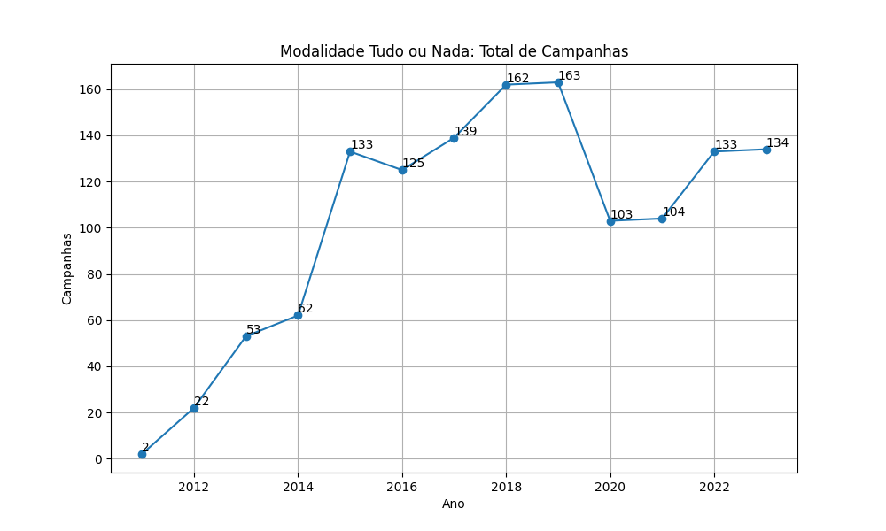
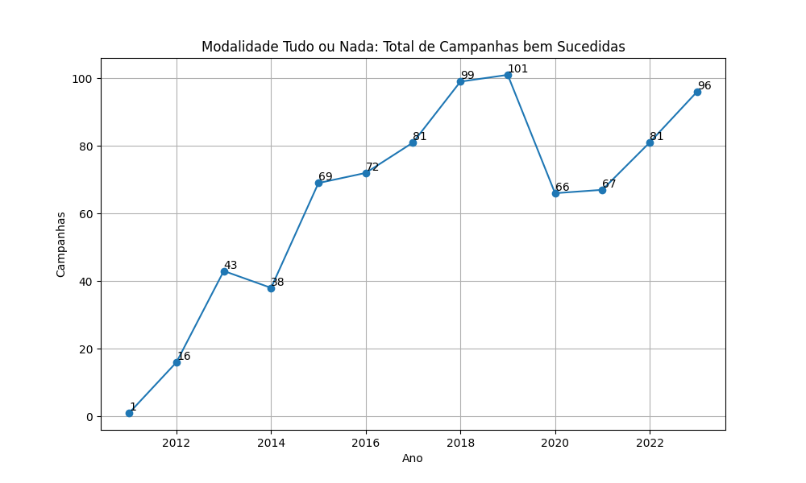
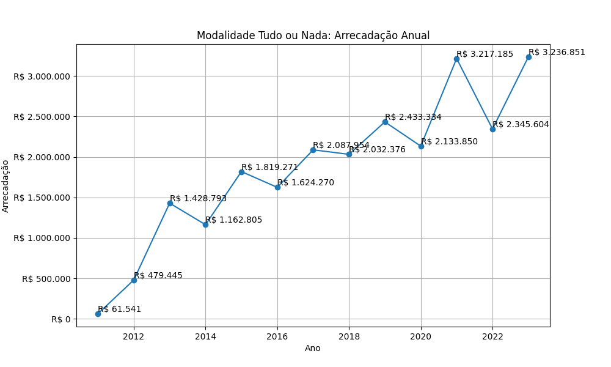
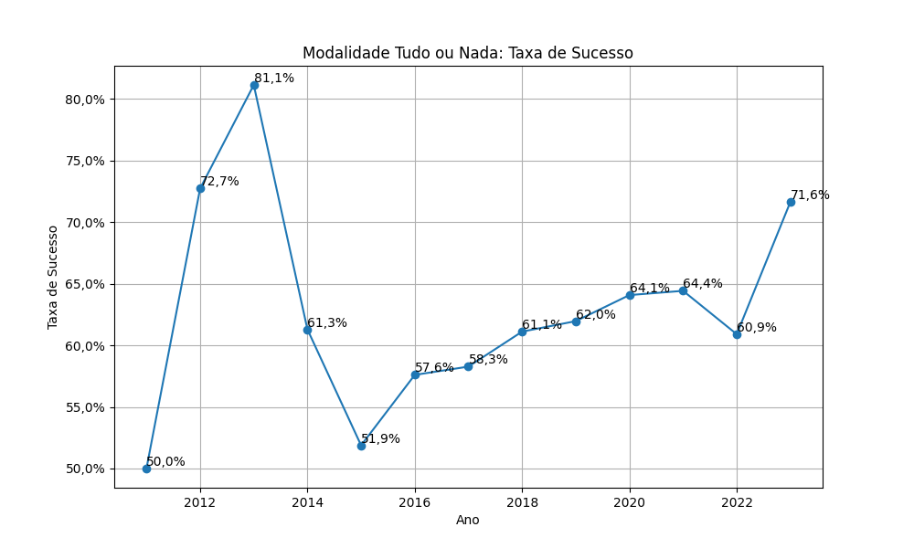
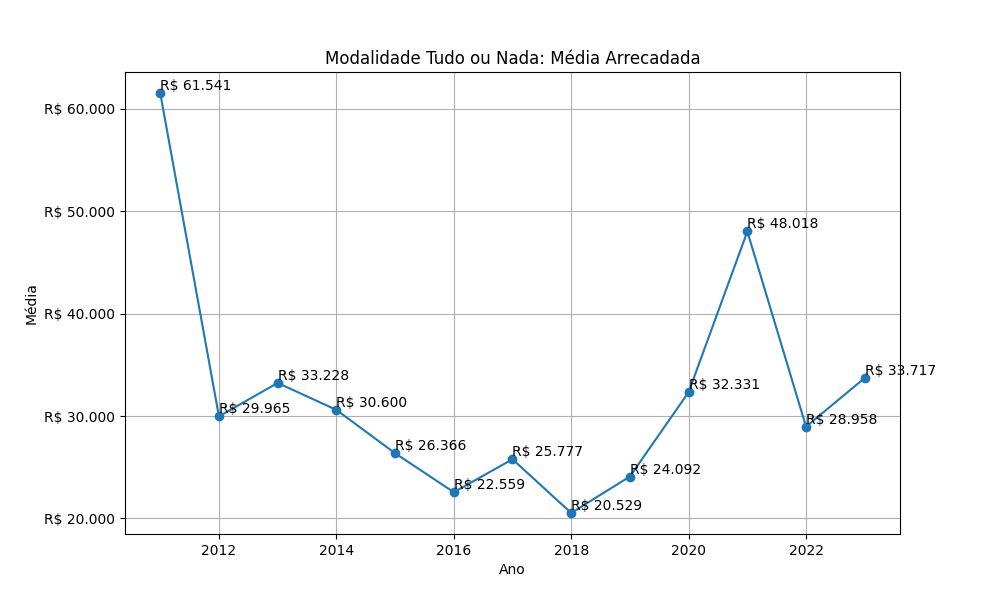

# Modalidade: Tudo ou Nada - Série Anual

A tabela a seguir representa a série anual das campanhas na modalidade
Tudo ou Nada.

|    ano |   total |   total_sucesso |   arrecadado_sucesso |   taxa_sucesso |   media_sucesso |
|-------:|--------:|----------------:|---------------------:|---------------:|----------------:|
|  2011  |       2 |               1 |             61.541,40 |           50,0 |        61.541,40 |
|  2012  |      22 |              16 |            479.445,04 |           72,7 |        29.965,31 |
|  2013  |      53 |              43 |           1.428.792,74 |           81,1 |        33.227,74 |
|  2014  |      62 |              38 |           1.162.805,48 |           61,3 |        30.600,14 |
|  2015  |     133 |              69 |           1.819.271,37 |           51,9 |        26.366,25 |
|  2016  |     125 |              72 |           1.624.270,03 |           57,6 |        22.559,31 |
|  2017  |     139 |              81 |           2.087.954,29 |           58,3 |        25.777,21 |
|  2018  |     162 |              99 |           2.032.376,43 |           61,1 |        20.529,05 |
|  2019  |     163 |             101 |           2.433.333,57 |           62,0 |        24.092,41 |
|  2020  |     103 |              66 |           2.133.850,11 |           64,1 |        32.331,06 |
|  2021  |     104 |              67 |           3.217.184,86 |           64,4 |        48.017,68 |
|  2022  |     133 |              81 |           2.345.603,52 |           60,9 |        28.958,07 |
|  2023  |     134 |              96 |           3.236.850,99 |           71,6 |        33.717,20 |

## Gráficos

Modalidade Tudo ou Nada: Total de Campanhas

Modalidade Tudo ou Nada: Total de Campanhas bem Sucedidas

Modalidade Tudo ou Nada: Arrecadação Anual

Modalidade Tudo ou Nada: Taxa de Sucesso

