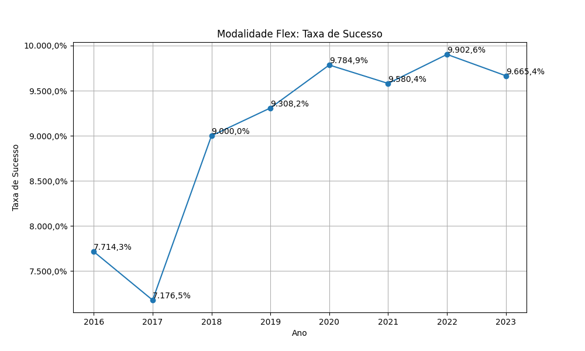

# Modalidade: Flex - Série Anual

A tabela a seguir representa a série anual das campanhas na modalidade
Flex. Colunas:
- ano: ano de início da campanha;
- total: total de campanhas;
- total_sucesso: total de campanhas bem sucedidas;
- arrecadado_sucesso: valor total arrecadado pelas campanhas bem sucedidas;
- taxa_sucesso: relação entre o total de campanhas bem sucedidas e o total de campanhas;
- media_sucesso: valor arrecadado médio pelas campanhas bem sucedidas.

|    ano |   total |   total_sucesso |   arrecadado_sucesso |   taxa_sucesso |   media_sucesso |
|-------:|--------:|----------------:|---------------------:|---------------:|----------------:|
|  2016  |      35 |              27 |            282.854,06 |           77,1 |        10.476,08 |
|  2017  |      85 |              61 |            547.034,14 |           71,8 |         8.967,77 |
|  2018  |     140 |             126 |           1.220.999,72 |           90,0 |         9.690,47 |
|  2019  |     159 |             148 |           1.286.117,23 |           93,1 |         8.689,98 |
|  2020  |     186 |             182 |           3.201.820,21 |           97,8 |        17.592,42 |
|  2021  |     286 |             274 |           5.011.848,10 |           95,8 |        18.291,42 |
|  2022  |     308 |             305 |           4.130.315,02 |           99,0 |        13.542,02 |
|  2023  |     269 |             260 |           2.681.143,46 |           96,7 |        10.312,09 |

## Gráficos

Série anual. Modalidade Flex: Total de Campanhas.

Série anual. Modalidade Flex: Total de Campanhas bem Sucedidas.

Série anual. Modalidade Flex: Arrecadação Anual.

Série anual. Modalidade Flex: Taxa de Sucesso.

Série anual. Modalidade Flex: Média Arrecadada.

