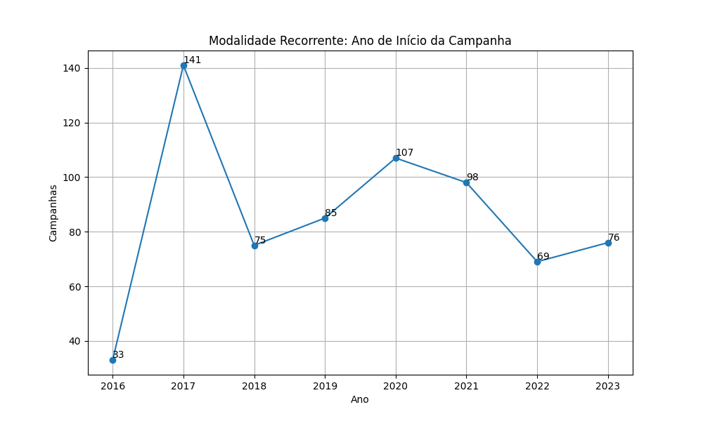
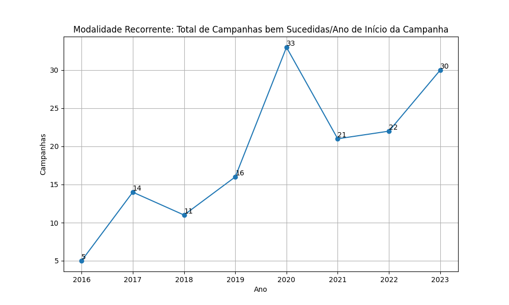
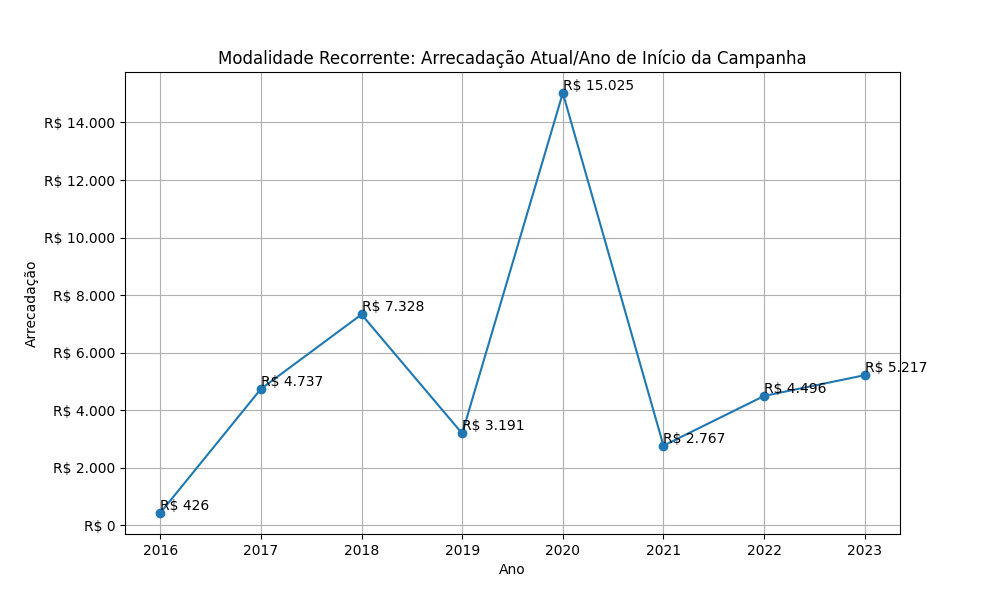
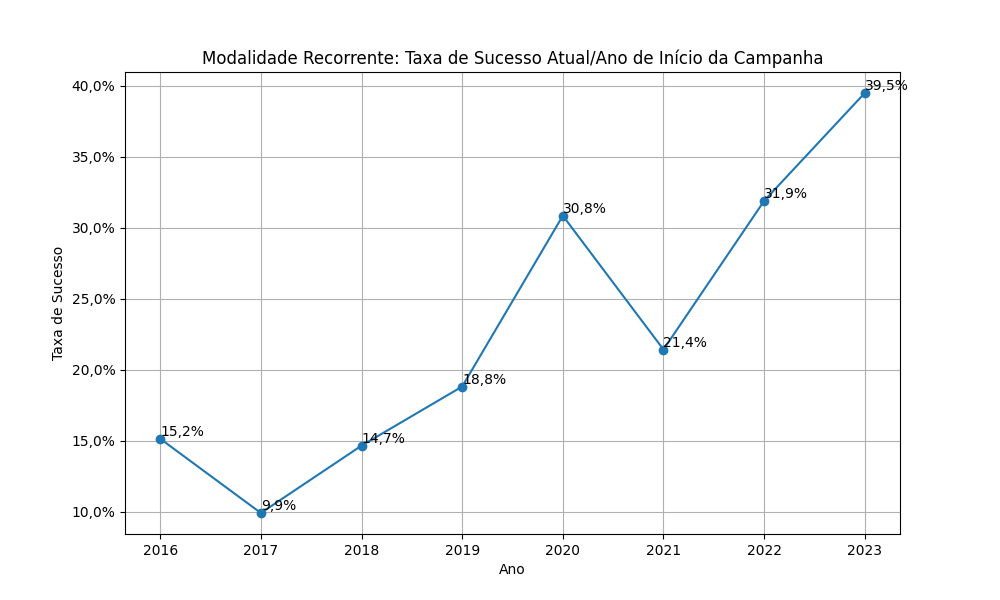
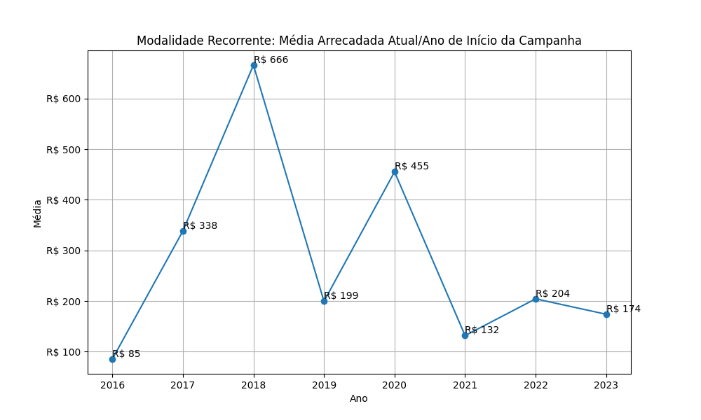

# Modalidade: Recorrente - Série Anual

A tabela a seguir representa a série anual das campanhas na modalidade
Recorrente. Colunas:
- ano: ano de início da campanha;
- total: total de campanhas;
- total_sucesso: total de campanhas bem sucedidas;
- arrecadado_sucesso: valor total arrecadado pelas campanhas bem sucedidas;
- taxa_sucesso: relação entre o total de campanhas bem sucedidas e o total de campanhas;
- media_sucesso: valor arrecadado médio pelas campanhas bem sucedidas.

|    ano |   total |   total_sucesso |   arrecadado_sucesso |   taxa_sucesso |   media_sucesso |
|-------:|--------:|----------------:|---------------------:|---------------:|----------------:|
|  2016  |      33 |               5 |               426,46 |           15,2 |           85,29 |
|  2017  |     141 |              14 |              4.736,52 |            9,9 |          338,32 |
|  2018  |      75 |              11 |              7.327,99 |           14,7 |          666,18 |
|  2019  |      85 |              16 |              3.191,26 |           18,8 |          199,45 |
|  2020  |     107 |              33 |             15.024,86 |           30,8 |          455,30 |
|  2021  |      98 |              21 |              2.767,44 |           21,4 |          131,78 |
|  2022  |      69 |              22 |              4.495,63 |           31,9 |          204,35 |
|  2023  |      76 |              30 |              5.216,80 |           39,5 |          173,89 |

## Gráficos

Série anual. Modalidade Recorrente: Total de Campanhas.

Série anual. Modalidade Recorrente: Total de Campanhas bem Sucedidas.

Série anual. Modalidade Recorrente: Arrecadação Anual.

Série anual. Modalidade Recorrente: Taxa de Sucesso.

Série anual. Modalidade Recorrente: Média Arrecadada.

